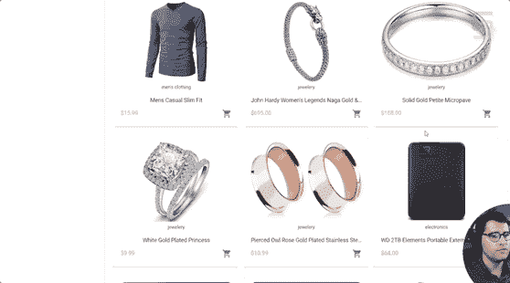

# 用 Angular、Node.js、TypeScript 和 Stripe 创建一个网上商店

> 原文：<https://www.freecodecamp.org/news/build-a-webshop-with-angular-node-js-typescript-stripe/>

了解如何从头开始建立一个网店！

我们刚刚在 freeCodeCamp.org YouTube 频道上发布了一门课程，将教你如何使用 Angular/TypeScript、Express.js 和 Stripe 建立一个网络商店或电子商务商店。

您将学习如何使用 Angular material 和 Tailwind 来构建 UI，以及如何将商店 API 集成到应用程序中。最后，您将构建一个收银台，并学习如何集成 Stripe，以便应用程序可以处理支付。

斯洛博丹·加伊奇创建了这门课程。Slobodan 是一名高级前端开发人员和经验丰富的课程创建者。

You will build this.

本课程包括以下几个部分:

*   安装依赖项和项目设置
*   构建主页
*   构建购物车页面
*   实现购物车逻辑
*   实现商店 API
*   条带支付实施

观看 freeCodeCamp.org YouTube 频道的全部课程(4 小时观看)。

[https://www.youtube.com/embed/Kbauf9IgsC4?feature=oembed](https://www.youtube.com/embed/Kbauf9IgsC4?feature=oembed)