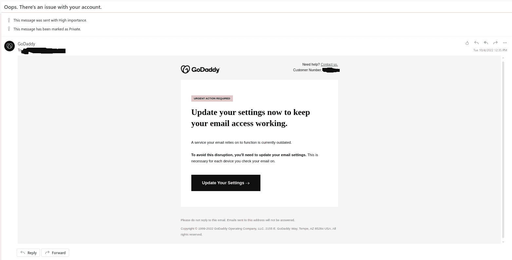
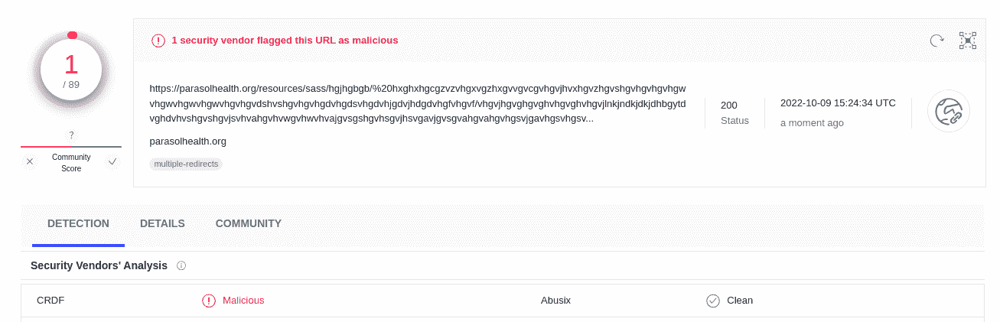
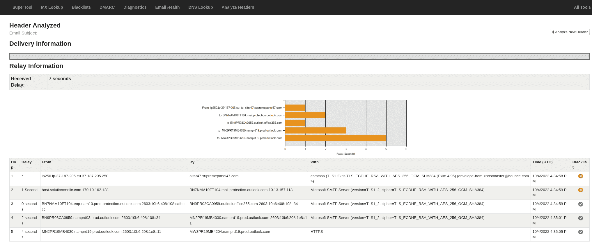

# 如何识别网络钓鱼邮件，以及收到邮件时该如何应对

> 原文：<https://www.freecodecamp.org/news/how-to-recognize-phishing-email/>

你知道程序:你打开你的电子邮件客户端，有一封电子邮件说，如果你在短时间内不遵循某些指示，你将有麻烦，没有问任何问题。

只需轻轻一点，你就有麻烦了。

这种邮件有非常[明确的定义](https://www.phishing.org/what-is-phishing):

> [网络钓鱼](https://www.knowbe4.com/phishing?hsLang=en)是一种[网络犯罪](https://www.merriam-webster.com/dictionary/cybercrime)，其中有人冒充合法机构，通过电子邮件、电话或短信联系一个或多个目标，引诱个人提供敏感数据，如个人身份信息、银行和信用卡信息以及密码。

在本文中，我将解释什么是网络钓鱼，以及如何识别电子邮件可能不合法的迹象。为此，我们将学习以下内容:

*   识别网络钓鱼电子邮件的一些明显标志
*   使用 Linux 上的一些命令工具仔细检查可疑链接
*   用几个免费的在线工具分析可疑的电子邮件

这一切都是为了找乐子。

## 网络钓鱼电子邮件示例

让我分享一个相当聪明的例子电子邮件(一些细节已被改变，以保护无辜):



Phishing email pretending to be GoDaddy

让我向您展示如何快速识别骗子，而无需使用一行代码

您将需要以下内容来完成本教程的一些步骤:

*   一个 Linux 安装，安装了 [curl](https://curl.se/) 。
*   网络浏览器(Brave 或 Firefox 是不错的选择)
*   **好奇心**

现在让我们继续，看看我们的邮箱里有什么...

## 常识性网络钓鱼危险信号

开箱即用，这封邮件违反了两个简单的规则，尽管有适当的语法和漂亮的演示:

首先，它**迫使你立即采取行动解决问题**(需要紧急行动)**不问任何问题**(点击 nice 按钮)。

更糟糕的是，没有办法验证与你联系的人是否真的为公司工作。声誉好的公司会要求你登录他们的网站并提供一个案例，这样你就可以跟踪这个问题。这两样都不在这里。

第二，尽管他们尽了最大努力，骗子还是会犯一些定性错误。你看到截图右上方的*客户#* 了吗？我把它和我在真实网站上的做了比较，你猜怎么着？这是一个不同的数字。

但是，如果我们连一点点的探索都做不到，分析这个又有什么意思呢？嗯，当我将鼠标移到按钮图像上时，我可以看到链接，它指向微小的 URL(URL 缩短服务):

```
https://tinyurl.com/xszszasxdxdxdxdxdxdxdzs?a=xxx@xxxx.com 
```

所以不管是谁做的，都是想隐藏真实的网址。没问题，复制 URL 地址(**千万不要点击**)，把 GET 请求的 email 部分改成一些垃圾(?a=xxx@xxx.com))然后通过 curl 运行。我得到了这个:

```
<table width="75%" bgcolor="#FFFFFF" align="center" cellpadding="10">
        <tr>
            <td>
                <h2>URL Terminated</h2>
                <p>
                    The TinyURL (xszszasxdxdxdxdxdxdxdzs) you visited was used by its creator in violation of our terms of use.
                    TinyURL has a strict no abuse policy and we apologize for the intrusion this user has caused you.
                    Such violations of our terms of use include:
                </p>
                <ul>
                    <li>Spam - Unsolicited Bulk E-mail</li>
                    <li>Fraud or Money Making scams</li>
                    <li>Malware</li>
                    <li>or any other use that is illegal.</li>
                </ul>
                <p> 
```

所以来自 Tiny URL 的好人也注意到了这一点，并终止了该 URL。干得好！

[](https://asciinema.org/a/526911)

让我们用其他工具来证实我们已经知道的东西。

## 可以用来分析可疑 URL 的在线工具

微小的网址足以告诉我们原来的网址:

```
https://parasolhealth.org/resources/sass/hgjhgbgb/%20hxghxhgcgzvzvhgxvgzhxgvvgvcgvhgvjhvxhgvzhgvshgvhgvhgvhgwvhgwvhgwvhgwvhgvhgvdshvshgvhgvhgdvhgdsvhgdvhjgdvjhdgdvhgfvhgvf/vhgvjhgvghgvghvhgvghvhgvjlnkjndkjdkjdhbgytdvghdvhvshgvshgvjsvhvahgvhvwgvhwvhvajgvsgshgvhsgvjhsvgavjgvsgvahgvahgvhgsvjgavhgsvhgsvhjvshgvahgvsjvshgvajvshvhgwvhgvehgvehgvehjvegvejhgvhgavhavhs/dhbjhjfhjfkbkjfhbjkbfjbjdbkjbsjhbdjbjkdbhbdjkbjdbjdbjhbdkjbsjbjkdbjkdhbjdbjbsjhbsjbjdkbjhdbkjhbdkjbsbdjbjdbkjhbjhbsjkhbdjbjdbjdbjhsbjhbejhbejhbjwhbjhwbjkwhbjbhbs/jdbhdhdbkjbsjbsjbwjbjwbjkbwhbehbjhbejbebebjebjbejbjhbsjhbshbahbjhsbshbjkhdbjhbjhbdbdjkbdhbjhsbjhbajhbsjbkjshbhbdjhbjdhbjkbshbsjhbsjbdbdhbdhbjehbjhebjhbrrhbjbjekhbjhbjsbjhsbjhbdjhd/jbdjhbdkjbdjhbkjabjhbsjbdjbksjbhsbjhdbjhbjkbdjhbjhbkjbejhbwkhbjkwhbjhwbjkwhbjhwbjhbwhbwkjhbwjhbjhbajhbajhbsjhbsjhbdjkhbdjhbdjhbjdhbjshbjhsbjhbjhsbkjhbdjhbsjbjabjhabjkbs/redirect.php 
```

如果您访问 Virus Total 网站并搜索 URL，您会看到此处也报告了此:



有趣的是，只有一个供应商报告该网址是恶意的。那对我来说就够了:-)

还有[滥用 IP DB](https://www.abuseipdb.com/report?ip=66.85.143.2) 对违规网站一无所知。但是，请保留这个工具，因为它可以报告多个其他参与者。

从原始信息中我们还能了解到什么？大多数邮件阅读器允许你复制并粘贴邮件标题。我在这里分享我的(有一些变化):

```
Received: from MN2PR19MB4030.namprd19.prod.outlook.com (2603:10b6:208:1e8::11)
 by MW3PR19MB4204.namprd19.prod.outlook.com with HTTPS; Tue, 4 Oct 2022
 16:35:05 +0000
Received: from BN9PR03CA0959.namprd03.prod.outlook.com (2603:10b6:408:108::34)
 by MN2PR19MB4030.namprd19.prod.outlook.com (2603:10b6:208:1e8::11) with
 Microsoft SMTP Server (version=TLS1_2,
 cipher=TLS_ECDHE_RSA_WITH_AES_256_GCM_SHA384) id 15.20.5676.31; Tue, 4 Oct
 2022 16:35:01 +0000
Received: from BN7NAM10FT104.eop-nam10.prod.protection.outlook.com
 (2603:10b6:408:108:cafe::cc) by BN9PR03CA0959.outlook.office365.com
 (2603:10b6:408:108::34) with Microsoft SMTP Server (version=TLS1_2,
 cipher=TLS_ECDHE_RSA_WITH_AES_256_GCM_SHA384) id 15.20.5676.24 via Frontend
 Transport; Tue, 4 Oct 2022 16:34:59 +0000
Authentication-Results: spf=softfail (sender IP is 170.10.162.128)
 smtp.mailfrom=bounce.com; dkim=none (message not signed)
 header.d=none;dmarc=fail action=oreject header.from=godaddy.com;compauth=fail
 reason=000
Received-SPF: SoftFail (protection.outlook.com: domain of transitioning
 bounce.com discourages use of 170.10.162.128 as permitted sender)
Received: from host.solutiononellc.com (170.10.162.128) by
 BN7NAM10FT104.mail.protection.outlook.com (10.13.157.118) with Microsoft SMTP
 Server (version=TLS1_2, cipher=TLS_ECDHE_RSA_WITH_AES_256_GCM_SHA384) id
 15.20.5676.17 via Frontend Transport; Tue, 4 Oct 2022 16:34:59 +0000
Received: from ip250.ip-37-187-205.eu ([37.187.205.250]:38823)
	by altar47.supremepanel47.com with esmtpsa  (TLS1.2) tls TLS_ECDHE_RSA_WITH_AES_256_GCM_SHA384
	(Exim 4.95)
	(envelope-from <postmaster@bounce.com>)
	id 1ofksk-0005Zd-LV
	for xxx@xxxx.com;
	Tue, 04 Oct 2022 16:34:58 +0000
```

使用 [MXToolbox](https://mxtoolbox.com/Public/Tools/EmailHeaders.aspx?huid=4205dc8f-5147-4da5-a448-d633f2bbca61) 显示链中使用的 2 个电子邮件地址**被列入黑名单**，另一个危险信号。



2 blocked emails from this list. Another read flag

我认为那已经足够好了。删除这封邮件，继续你的生活，并确保有新的邮件发送给你(希望自动进入垃圾邮件文件夹)。

## 下一步是什么？

互联网上有许多工具可以用来识别网络钓鱼邮件，但没有什么可以替代常识。如果它看起来好得不像真的，那么它可能就是真的。

像往常一样，不要马上点击链接！为了安全起见，先做一点调查。