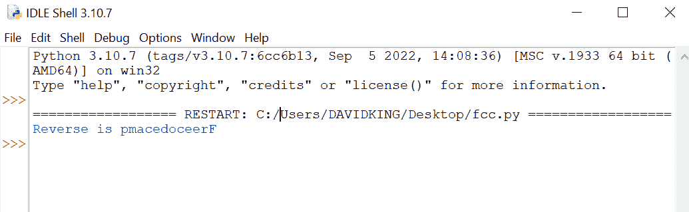
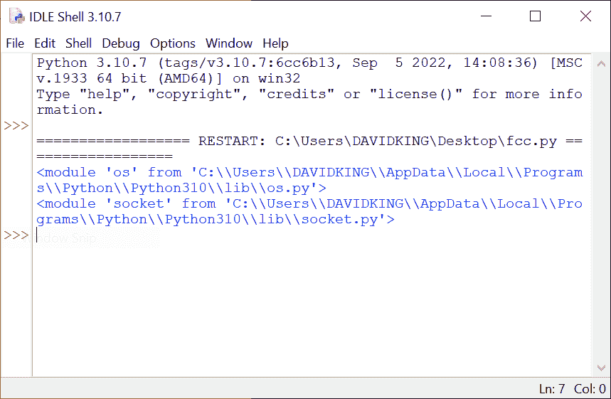
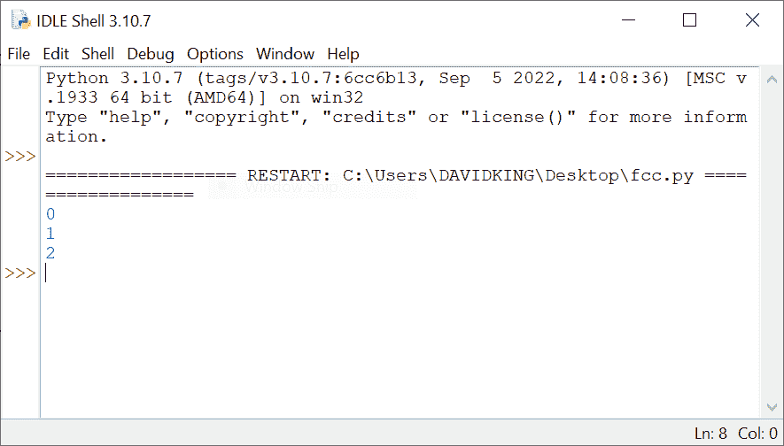
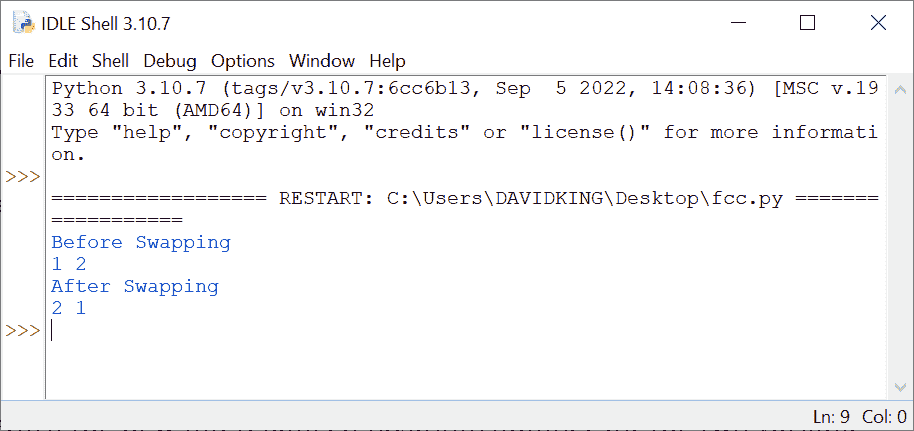

# 帮助您提高代码水平的 Python 编程技巧

> 原文：<https://www.freecodecamp.org/news/python-programming-tips/>

Python 是当今最流行的编程语言之一。它的简单性和可读性使它成为许多程序员的最爱。

因此，在本教程中，我将分享一些帮助您提高 Python 编程技能的要点和策略。

## 如何在 Python 中反转字符串

在 Python 中，没有用于反转字符串的内置方法。最快的(也许也是最容易的？)方法是使用向后移动的切片，-1。

例如，假设我们有一个字符串“Freecodecamp ”,我们希望撤销它。制作一个从字符串末尾向后的切片。

在这种情况下，切片表达式[::-1]指示从字符串的末尾开始，在位置 0 处终止，然后以步骤-1 移动，负一，这意味着向后移动一步。

```
 # Create a variable name "a"
a = "Freecodecamp"
# Then you assign freecodecamp to variable 'a'
print("Reverse is", a[::-1])
```

Reversing a string in Python

下面的输出显示了字符串“freecodecamp”的反向版本:



Reversing a string in Python

## 如何打印导入模块的文件路径

Python 提供了一种非常简单的方法来获取导入模块的文件路径。如果您需要在处理具有多个子目录的项目时快速识别文件路径，或者如果您正在使用通常可通过命令行访问的脚本或应用程序，这将非常有用。

如果您处于类似的场景中，您可以使用以下方法来获取模块的精确文件路径:

```
import os
import socket

print(os)
print(socket)
```

仅此而已。使用这种方法可以确定代码中模块文件的精确位置。然后应该会为您打印出该模块的确切文件位置。它很可能是这样的:



output for printing file path

## 如何在 Python 中使用枚举

枚举是链接到不同值的符号名称的集合。它们类似于全局变量，但是它们有额外的有用功能，比如 repr()、分组、类型安全等等。如您所见，创建一个 Enum 就像构建一个从 Enum 继承的类一样简单。

枚举属性:

*   枚举可以显示为字符串或表示形式。
*   可以使用 type 来确定枚举的类型()。
*   使用“name”关键字显示枚举成员的名称。

```
class MyName:
	Python, By, Davidking = range(3)

print(MyName.Python)
print(MyName.By)
print(MyName.Davidking) 
```

输出将根据列表中排列的编号打印出结果:



Enum in Python

## 如何在 Python 中交换变量值

交换两个变量意味着交换变量的值。在大多数情况下，您可以使用内存中的数据来做到这一点。

交换再简单不过了。您可以使用此步骤在 Python 中交换两个对象:

```
a = 1
b = 2

print('Before Swapping')
print(a, b)

a, b = b, a
print('After Swapping')
print(a, b) 
```

结果将返回两个变量“a，b”的新的互换位置/编号:



swapping in Python Fcc

## 如何在 Python 中找到列表中最频繁出现的值

您可以使用此过程从列表中挑选出重复次数最多的值。想象一下，在一个游戏中，数字被随机分配给不同的人，拥有最多数字的一组赢得游戏。你可以用这种方法找出游戏的赢家，而不需要手动计数。

现在让我们看看它是如何进行的:

```
test = [1, 2, 3, 4, 2, 2, 3, 1, 4, 4, 4, 3, 1, 2, 2, 2]
print(max(set(test), key = test.count)) 
```

现在，这里的输出将告诉我们游戏的获胜者，而不必手动计数。当您运行上面的代码时，这里的输出是“2”。

## 如何在 Python 中检查对象的内存使用情况

使用这个简单而强大的 Python 方法，您可以计算 Python 对象消耗了多少内存。

下面是一个例子:

```
import sys
x = 1
print(sys.getsizeof(x)) 
```

这里变量 X 的结果是“28”。

## 如何用 Python 创建文件服务器

服务器是处理请求并通过网络向客户端提供数据的计算机软件或硬件。有几种服务器，其中最流行的是 web 服务器、数据库服务器、应用服务器和事务服务器。

Python 的 SimpleHTTPServer 模块是一个方便简单的实用程序，开发人员可以将它用于各种目的，其中最常见的是从目录中提供文件。

它消除了安装和配置可用的跨平台 web 服务器的耗时过程。

你想用 Python 构建一个文件服务器吗？您可以通过使用下面简单的代码行来实现这一点:

```
python -m SimpleHTTPServer 
# The default port is 8080 
```

## 如何从空闲状态检查您的 Python 版本

您可能对您正在使用的 Python 版本感到好奇。嗯，您可以通过编写几行代码来检查您的 PC 上安装的 Python 版本:

```
import sys
print("My Python version Number: {}".format(sys.version)) 
```

输出:

```
My Python version Number: 3.10.7 (tags/v3.10.7:6cc6b13, Sep  5 2022, 14:08:36) [MSC v.1933 64 bit (AMD64)]
```

给你，它会打印出你正在使用的版本。

## 结论

希望在阅读完这组 python 技巧和窍门后，您会发现它有用而且有趣，感谢您的阅读，并祝您在编码生涯中好运。