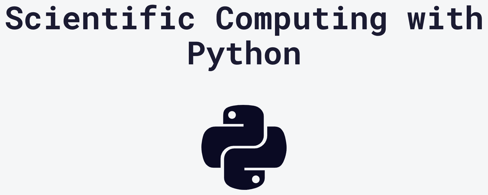
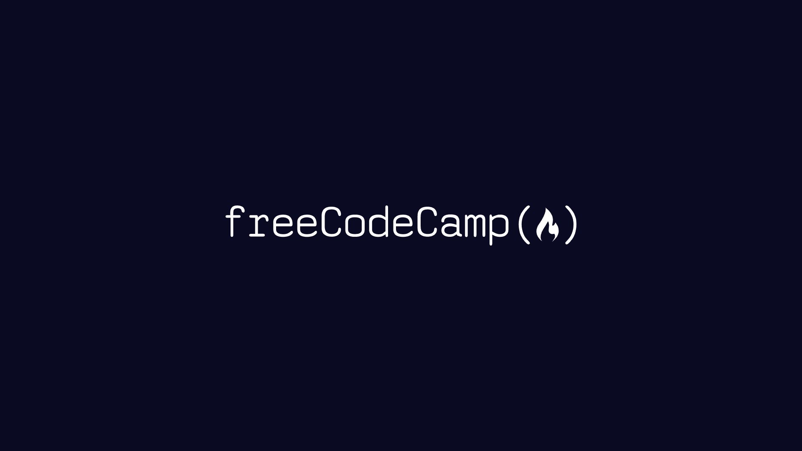

# Python 初学者课程排名从最好到最差——freeCodeCamp 版

> 原文：<https://www.freecodecamp.org/news/freecodecamp-python-courses-ranked-from-best-to-worst/>

freeCodeCamp 真的需要另一门 Python 课程吗？

在课程和 YouTube 频道之间，freeCodeCamp 有相当多的 Python 编程课程。但是应该选哪门 Python 课程呢？

在本文中，我将从最好到最差对每一门 freeCodeCamp 初级 Python 课程进行排名。那么哪个最好呢？

他们都是最棒的！没有一个是最差的！

真正的问题是哪个 Python 课程最适合你**。不同的人有不同的学习风格和不同的需求。**

**因此，freeCodeCamp Python 的每一门课程都是最适合某些人的。对于许多人来说，通过多门 Python 课程来巩固他们的理解是很有帮助的。**

**这里是来自 freeCodeCamp 的每一个 Python 初学者的课程，排名不分先后。**

**(我们还有大量其他的 Python 课程，本文中没有介绍，在你开始学习这些课程后，它们可以帮助你提高你的 Python 技能。)**

## **向迈克·戴恩学习 Python**

 **[https://www.youtube.com/embed/rfscVS0vtbw?feature=oembed](https://www.youtube.com/embed/rfscVS0vtbw?feature=oembed)** 

**这很可能是宇宙历史上观看次数最多的完整 Python 课程。很多人喜欢迈克·戴恩的教学风格。他使用 PyCharm IDE 并频繁提及流行文化。**

**这门课程最适合那些热爱 NASA 和喜欢有同情心的老师的人。**

## **向博·卡恩斯学习 Python**

 **[https://www.youtube.com/embed/eWRfhZUzrAc?feature=oembed](https://www.youtube.com/embed/eWRfhZUzrAc?feature=oembed)** 

**我特别偏爱这门课。事实上，它可能是这个列表中我最喜欢的一个。也是唯一一个我创造的。😉**

**您将学习 Python 的基础知识，并逐行编写两个 Python 程序。你将学会如何在不安装任何软件的情况下，在你的网络浏览器中做好每一件事。**

**本课程最适合想要更具互动性的学习体验的人。**

## **向查克博士学习 Python**

 **[https://www.youtube.com/embed/8DvywoWv6fI?feature=oembed](https://www.youtube.com/embed/8DvywoWv6fI?feature=oembed)** 

**这个课程被许多人认为是最好的 Python 课程之一。它是由查尔斯博士(又名查克博士)教授。他是密歇根大学的教授，也是 Coursera 上最受欢迎的导师之一。**

**Chuck 博士比这个列表中的其他课程深入了更多的 Python 背景和编程理论。**

**这门课程最适合喜欢向大学教授学习的人。**

## **向 jabrill 学习 python**

 **[https://www.youtube.com/embed/__izua1kKeI?feature=oembed](https://www.youtube.com/embed/__izua1kKeI?feature=oembed)** 

**Jabrils 在 YouTube 上运营着一个更具创造性的技术频道。在本课程中，他使用 Python 和 C#讲授编程基础。这门课程是 YouTube(该公司)委托开设的。Jabrils 做得很好，使课程对初学者来说很有意义。**

**这门课程最适合那些既想学习 Python，又想了解它与 C#有何不同的人。**

## **用西班牙语学习 Python**

 **[https://www.youtube.com/embed/DLikpfc64cA?feature=oembed](https://www.youtube.com/embed/DLikpfc64cA?feature=oembed)** 

**freeCodeCamp 有多种语言的 YouTube 频道，包括西班牙语。Estefania Cassingena Navone 开发了这个课程。她运营着 freeCodeCamp espaol 频道，她擅长分解技术概念，让初学者更容易理解。**

**这门课程最适合说西班牙语的人。**

## **用日语学习 Python**

 **[https://www.youtube.com/embed/nnjCkgX_ZPQ?feature=oembed](https://www.youtube.com/embed/nnjCkgX_ZPQ?feature=oembed)** 

**这个课程来自我们的日语频道。Toshiki Yasuda 教授这门课程。他是一名经验丰富的开发人员，也是一名优秀的教师。**

**这门课程最适合说日语的人。**

## **向鲍比·斯特曼学习 Python**

 **[https://www.youtube.com/embed/8124kv-632k?feature=oembed](https://www.youtube.com/embed/8124kv-632k?feature=oembed)** 

**鲍比·斯特曼险胜查克博士，成为纹身最多的蟒蛇老师。Bobby 将本课程建立在官方 Python 文档的基础上。**

**这个课程最适合想学习使用官方文档和喜欢紫色的人。**

## **从八进制学习 Python**

 **[https://www.youtube.com/embed/jH85McHenvw?feature=oembed](https://www.youtube.com/embed/jH85McHenvw?feature=oembed)** 

**来自 Octallium 频道的 Anil Kulkarni 开发了这个课程。该课程侧重于基本的编程概念，而不仅仅是教授语言语法。**

**人们经常混淆学习语言语法和学习编程。本课程将指导您以高效的方式学习 Python 所需的基本原则。**

**本课程最适合想理解语法背后概念的人。**

## **互动学习 Python**

******[freeCodeCamp.orgLearn to Code — For Free](https://www.freecodecamp.org/learn/scientific-computing-with-python/)**

**核心 freecodecamp.org 网站上的 Python 课程使用查克博士的 Python for Everybody 视频来教授 Python。而且学完内容之后，还要完成五个认证项目。**

**在您成功完成每个项目后，您将获得 Python 科学计算认证。**

**这门课程最适合想获得认证的人。**

## **结论**

**freeCodeCamp 有很多很棒的 Python 课程。我们将继续发布更多精彩的内容，帮助人们更多地了解 Python 编程语言(以及其他编程语言)。**

**如果一个教练不为你工作，你总是可以尝试不同的教练。向多人学习通常是巩固你的理解的最好方法。**