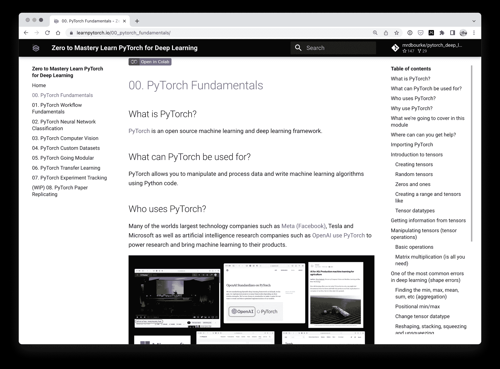
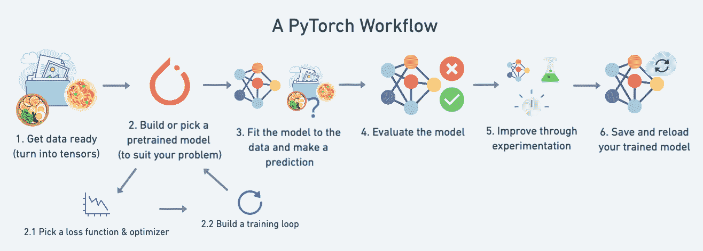

# 学习 PyTorch 进行深度学习——26 小时免费课程

> 原文：<https://www.freecodecamp.org/news/learn-pytorch-for-deep-learning-in-day/>

我的 PyTorch 综合课程现在在 freeCodeCamp.org YouTube 频道上直播。

*   您可以[在这里](https://youtu.be/V_xro1bcAuA)查看完整的 26 小时课程。
*   在 [learnpytorch.io](https://learnpytorch.io/) 免费在线阅读课程资料。
*   查看 GitHub 上的所有[课程资料。](https://github.com/mrdbourke/pytorch-deep-learning)

### 您可以在嵌入式视频下方了解更多课程信息。

[https://www.youtube.com/embed/V_xro1bcAuA?feature=oembed](https://www.youtube.com/embed/V_xro1bcAuA?feature=oembed)

最好的学习方法是边做边学。

这正是我们在深度学习的 Learn PyTorch:零到精通课程中要做的。

我们将在实践中学习。

在整个课程中，我们将通过编写 PyTorch 代码来了解机器学习和深度学习中许多最重要的概念。

如果你是数据科学和机器学习的新手，可以把这门课程看作是一个动力生成器。

最终，您将能够轻松浏览 PyTorch 文档，阅读 PyTorch 代码，编写 PyTorch 代码，搜索您不理解的内容，并构建您自己的机器学习项目。

## PyTorch 是什么？

PyTorch 是一个用 Python 编程语言编写的机器学习框架。

它允许您编写能够将数据转化为模型并转化为智能的机器学习算法。

## 为什么要学 PyTorch？

截至 2022 年 7 月， [58%包含代码](https://paperswithcode.com/trends)的机器学习研究论文使用 PyTorch。自从 PyTorch 发布以来，这个数字一直在增长。

本质上，机器学习研究人员热爱 PyTorch。

通常情况下，工业会跟随研究。

因此，如果所有最好的机器学习研究都来自 PyTorch，那么了解 PyTorch 是开始机器学习工作的一个极好的方式。

### 前提条件是什么？

**坏:**“学不会”(那是公牛***)。

好:有三到六个月编写 Python 代码的经验，并且愿意学习(你已经准备好了)。

这门课程尽可能对初学者友好。

因此，如果你有超过一年的机器学习经验，你可能会学到一些东西，但这些材料是为初学者设计的。

## 课程教的怎么样？

课程重点是代码，代码，代码，实验，实验，实验。

有两个球场格言是有原因的:

> 如果有疑问，运行代码！

> 实验，实验，实验！

我们一起写代码，学徒式的。

也就是说，在课程的视频版本中，我会写 PyTorch 代码并解释它，然后你会跟着写同样的代码。

如果我们被困在某件事情上，我们会寻找答案。

你会注意到我在视频中留下了很多错误，这是故意的。

因为错误(经常)发生，并且能够排除错误是很重要的。

我非常喜欢学习没有速度限制。

这就是我们将要做的。

通过编码学习。

通过实验学习。

很快。

## 这门课程包括什么？

您可以在 [learnpytorch.io](https://learnpytorch.io/) 免费在线查看和阅读所有材料。

不过还是具体一点吧。

本课程由 5 个模块(或笔记本)组成，最好按顺序进行(但可以随意跳跃)。

### [00–py torch 基础知识](https://www.learnpytorch.io/00_pytorch_fundamentals/)

我们将从头开始。

回答什么是 PyTorch(一个开源的机器学习框架)和 PyTorch 能用来做什么(操纵数据和编写机器学习算法)之类的问题。

然后我们会熟悉深度学习的基本构建模块，张量。

张量是数据的数字表示(数据几乎可以是任何东西，图像、文本、数字表格)。

机器学习的全部目标是在数据中寻找模式。

因此，知道如何创建、交互和操纵张量是至关重要的。

All of the course materials are available to read in an interactive online book at [learnpytorch.io](https://www.learnpytorch.io/)

### [01–pytorch 工作流程](https://www.learnpytorch.io/01_pytorch_workflow/)

机器学习的思想是把数据变成智能。

能够做到最好的机器学习模型就是赢家。

那么如何用 PyTorch 从数据到模型再到智能呢？

这就是 PyTorch 工作流程的重点:

1.  准备数据(将其转换为张量)。
2.  构建或选择一个预训练模型(以适应您的问题)。
3.  使模型符合数据(或让模型在数据中找到模式)。
4.  评估训练好的模型(在它学习了数据中的模式之后)。
5.  通过实验改进模型。
6.  保存并重新加载已训练的模型(以便您可以导出它并在应用程序中使用它)。

我们将在整个课程中使用并建立这个工作流程。

The PyTorch WorkFlow we'll cover and build upon throughout the Learn PyTorch for Deep Learning course.

### [02–py torch 神经网络分类](https://www.learnpytorch.io/02_pytorch_classification/)

神经网络是最强大的机器学习算法之一。

它们是当今许多最先进的人工智能(AI)系统的动力，如搜索和自动驾驶汽车。

但是你能让一个神经网络做一些简单的事情吗，比如分类一个点是红色还是蓝色？

一个简单的问题，是的，但是用玩具问题做实验是学习机器学习的最好方法之一。

在这样做的时候，我们将经历一个最常见的机器学习问题的所有主要步骤，**分类**:建立一个神经网络来预测某样东西是这样还是那样。

### [03–py torch 计算机视觉](https://www.learnpytorch.io/03_pytorch_computer_vision/)

神经网络永远改变了计算机视觉的游戏。

现在 PyTorch 推动了计算机视觉算法的许多最新进展。

特斯拉使用 PyTorch 为他们的自动驾驶软件构建计算机视觉算法。

苹果公司使用 PyTorch 建立模型，在计算上增强用 iPhone 拍摄的照片。

在 PyTorch 计算机视觉中，我们将编写 PyTorch 代码来创建一个能够看到图像中的模式并将它们分类的神经网络。

### [04–py torch 自定义数据集](https://www.learnpytorch.io/04_pytorch_custom_datasets/)

机器学习的神奇之处在于构建算法，在你自己的定制数据中寻找模式。

现有的数据集有很多，但是如何将您自己的自定义数据集加载到 PyTorch 中来构建模型以发现其中的模式呢？

也许你想为你的家建立一个安全系统，你想教它你的家人长什么样，这样它就能认出他们。

或者，您可能希望构建一个能够对您拍摄的不同狗狗照片进行分类的应用程序。

这正是 PyTorch 自定义数据集所涵盖的内容，我们将使用披萨、牛排和寿司的食物图像创建自己的自定义数据集，以启动课程的主要项目:FoodVision。

## 这些我都不能自己学吗？

是的。

你可以。

我之所以称这个课程为互联网上学习 PyTorch 的第二个最好的地方是有原因的。

因为最好的地方是 [PyTorch 文档](https://pytorch.org/docs/stable/index.html)。

虽然第一次遇到文档时，它可能会有点吓人。

所以这门课在深入文档之前，以一种有趣的热身方式来组织事情。

### 还有问题吗？

欢迎或者在 GitHub 资源库的课程上留下[的讨论。](https://github.com/mrdbourke/pytorch-deep-learning/discussions)

否则，祝机器学习愉快，我们在课程上见。

*我们来编码吧！*