# Excel 中的 VLOOKUP–公式和示例函数

> 原文：<https://www.freecodecamp.org/news/vlookup-in-excel-formula-and-example-function/>

在 Excel 中，`VLOOKUP()`表示垂直查找。这是一个强大的内置函数，可以用来快速搜索电子表格中的值。

`VLOOKUP()`在整个工作表中以垂直方式搜索一个值——不像`HLOOKUP()`函数那样水平搜索。

在使用`VLOOKUP()`之前，确保工作表中的每一行都有一个 ID。id 也必须按升序排列。这可以确保 Excel 在搜索返回值的过程中不会混淆。

在本文中，我将通过解释应该放入函数中的值，向您展示如何使用`VLOOKUP()`函数。我们还会看两个不同的例子。

## `VLOOKUP()`公式及其值

在 Excel 中，你几乎可以用公式做任何事情——`VLOOKUP()`也不例外。

以下是`VLOOKUP()`函数所取的值:

`VLOOKUP(lookup_value, table_array, column_index_num, [range_lookup])`

*   lookup_value:包含要搜索的值的单元格。它总是在左边。比如 A5。
*   table_array:您认为该值所在的位置，以及您希望 Excel 搜索该值的位置。例如，A1:D10
*   列索引号:值所在的列。例如，4
*   [range_lookup]:您只能为此指定 TRUE 或 FALSE。TRUE 表示近似匹配，FALSE 表示精确匹配。

## 如何在 Excel 中使用`VLOOKUP()`

要使用`VLOOKUP()`在 Excel 中搜索某个值，您需要使用公式并输入前一节中讨论的单个值。

为了向您展示如何使用`VLOOKUP`，我将使用下表。这个表格显示了一些虚构的足球运动员，他们的年龄，俱乐部和职业目标。

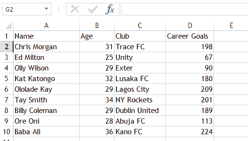

### `VLOOKUP()`例 1

表格里想看一下 Kat Katongo ( `A5`)的职业生涯进球数。在这种情况下，我们可以使用 VLOOKUP()。本例不要求所有条目都有 ID。

**第一步**:在空白单元格中输入代表姓名:
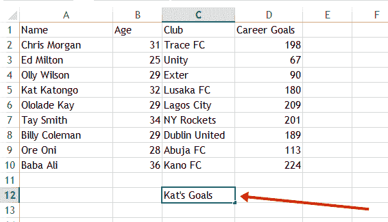

**步骤 2** :将职业目标放在销售代表单元格的正前方是有意义的，所以我将突出显示单元格:
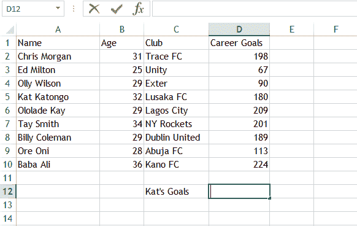

**第三步**:在公式栏输入公式:

我用的公式是`=VLOOKUP(A5, A1:D10, 4, FALSE)` :
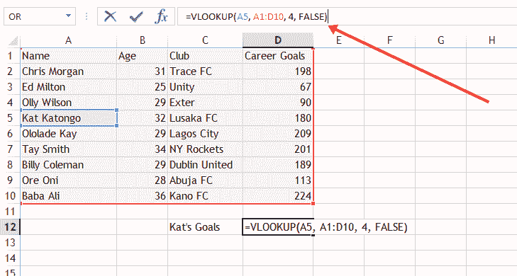

*   A5 是查找值
*   A1:D10 是表格数组
*   4 是 column _ index _ num——因为这是职业目标的列
*   FALSE 是[range_lookup],因为我想要完全匹配。

然后嘣！180 出现在单元格:
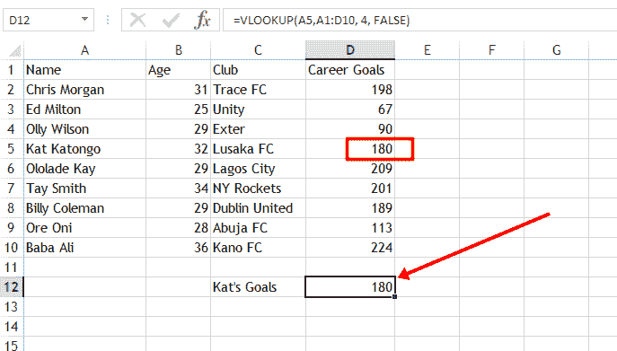

为了让你更清楚，下面的 GIF 展示了我是如何输入公式的:
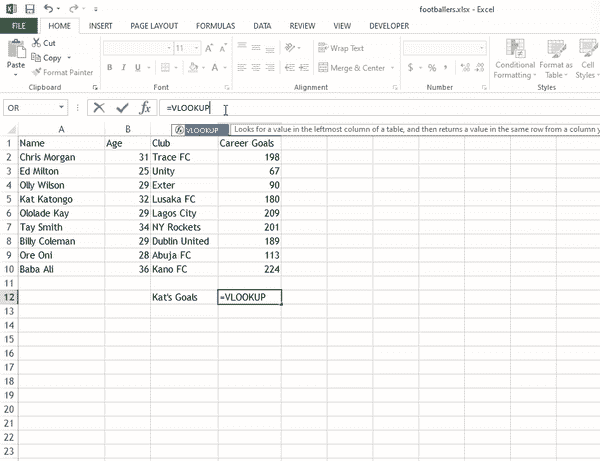

### `VLOOKUP()`例 2

在这个例子中，我只想输入一个 ID，然后查看玩家的职业目标。这意味着我需要给每个球员分配一个 ID。
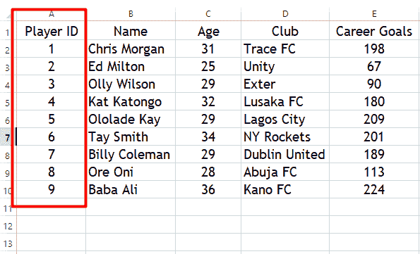

**步骤 1** :现在，我想从查找 ID 为 9 的玩家的职业目标开始。所以，我在右边准备了更多的条目。

**步骤 2** :要查找 ID 为 9 的玩家(巴巴阿里)的职业目标，我将选择我希望它显示的单元格，然后单击公式选项卡。一旦我这样做了，就会出现一个提示。

**第三步**:选择`VLOOKUP`，点击确定。如果您在那里没有看到`VLOOKUP()`，请搜索并选择它。
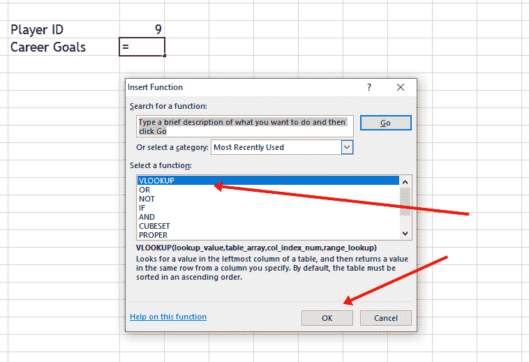

**第四步**:另一个弹出窗口显示输入公式值的输入，弹出窗口:
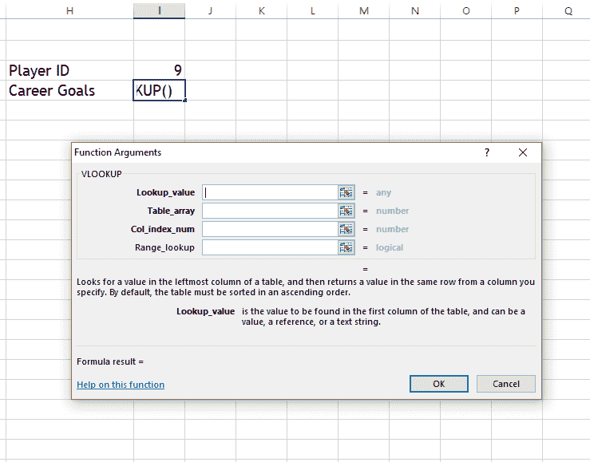

**第五步**:逐个输入数值:

*   我已经为查找值输入了`I3`,因为我在那里放了 ID 9
*   因为那是我要查找的区域
*   因为这一栏包含了球员的职业目标
*   和`FALSE`作为 range_lookup，因为我想要一个精确的匹配

当我按下`OK`时，巴巴阿里(ID 为 9 的球员)的职业目标显示出来:
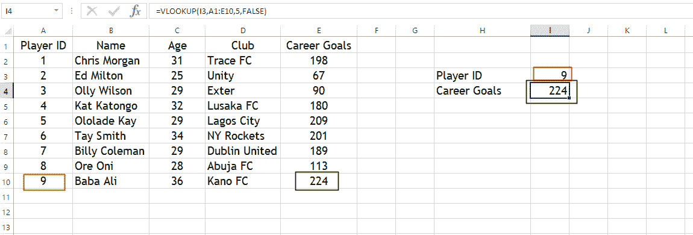

为了让你更清楚，我是这样输入公式的:
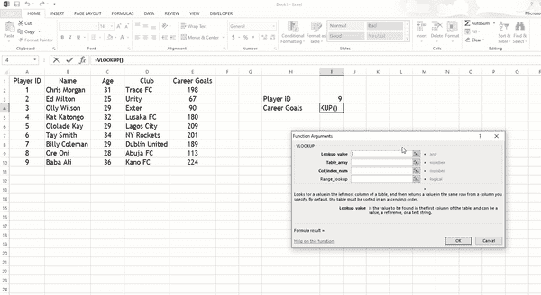

任何时候我改变 ID 并按下`ENTER`，那个 ID 的球员的职业目标就会显示出来:

## 结论

`VLOOKUP()`是一个强大的 Excel 函数，可以帮助您搜索工作表中的任何值——无论大小。这也是我写这篇文章帮助你入门的原因。

如果你觉得这篇文章有帮助，请分享给其他人。

感谢您的阅读。