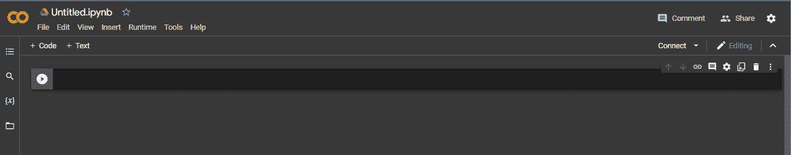
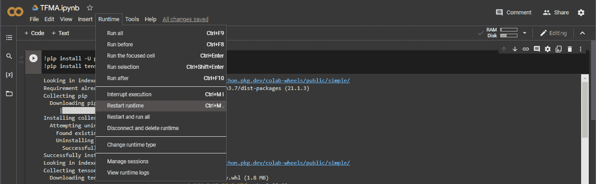
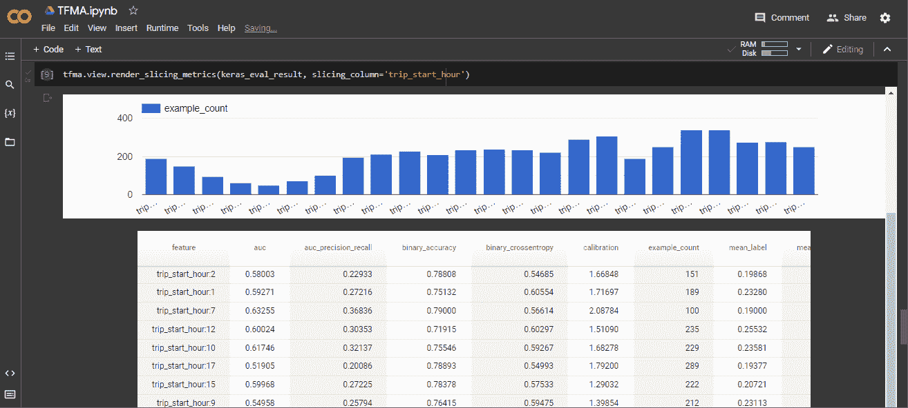
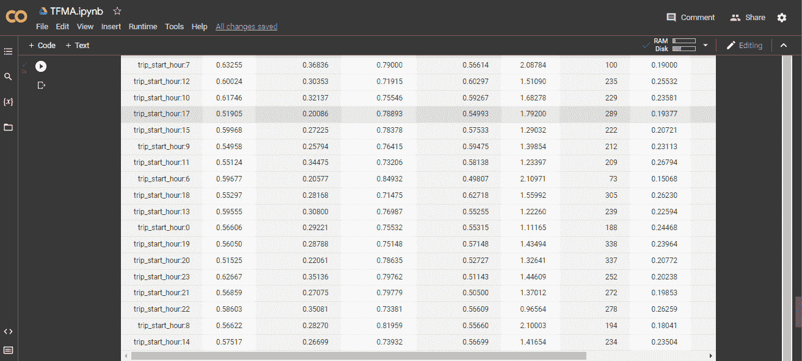
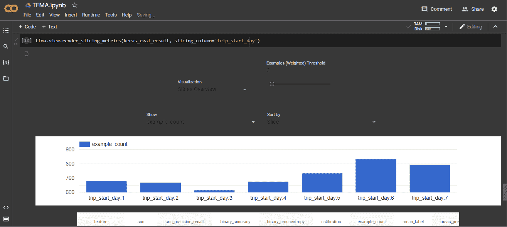
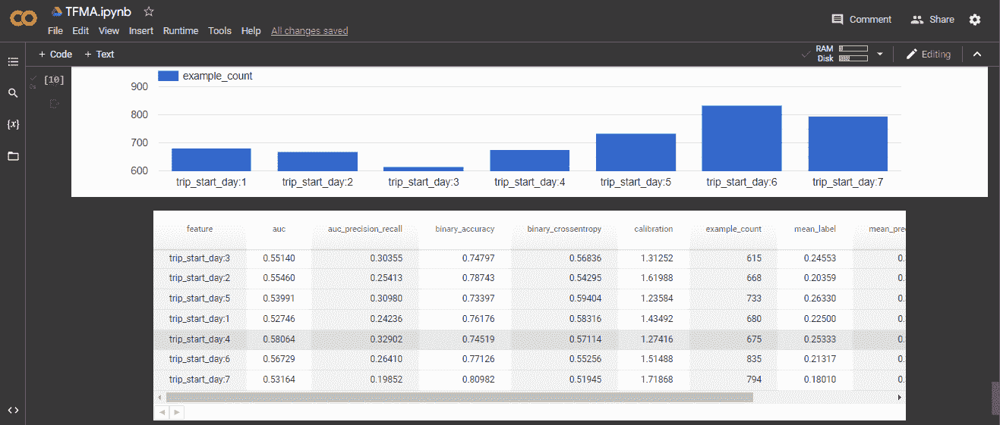
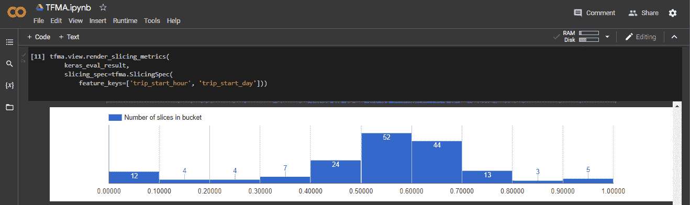
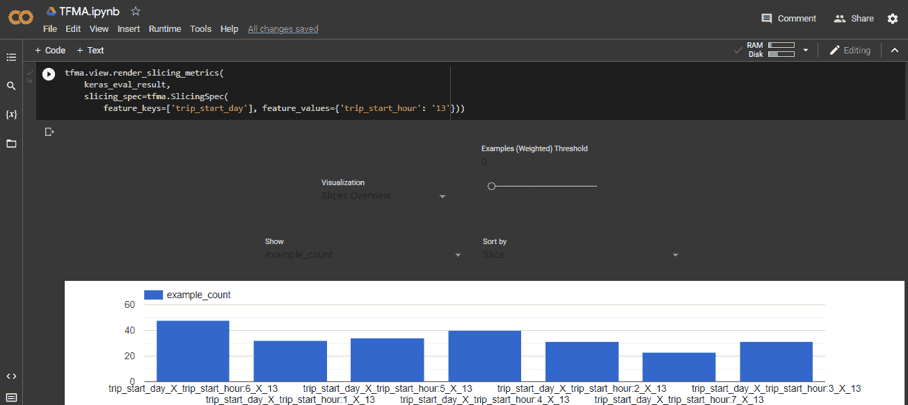
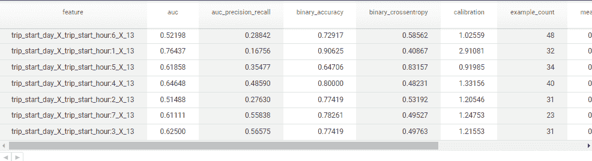
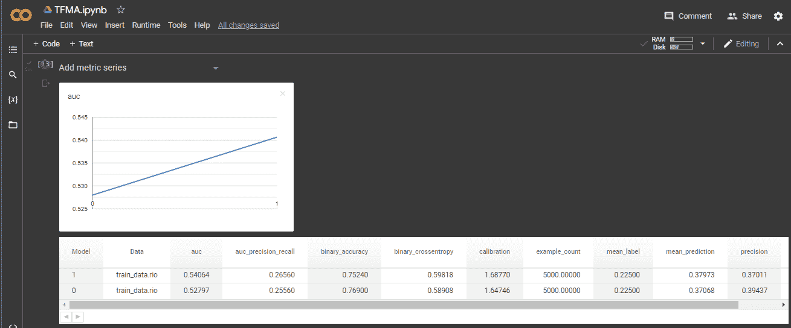

# 如何使用 TensorFlow 模型分析来验证您的机器学习模型

> 原文：<https://www.freecodecamp.org/news/how-to-validate-machine-learning-models-with-tensorflow-model-analysis/>

我的第一个部署的机器学习模型是失败的。对于潜在的糖尿病患者来说，这是一个简单的糖尿病诊断模型——坦率地说，我对部署感到兴奋不已。

但当我收到用户的反馈时，这种兴奋很快就消失了。简单地说，用户觉得这个模型不好。

我对此感到难过，但回过头来看，他们是正确的。该模型可能在顶级指标方面表现良好。但从消费者的角度来看，如果一个机器学习模型提供了一个糟糕的预测，那么这个人对该模型的体验将是糟糕的。

问题是特定的模型特征或数据切片导致模型性能不佳。

简而言之，在部署任何机器学习模型之前，机器学习工程师有责任评估它，确保它满足严格的质量标准，并按照所有相关数据片段的预测行事。

## 什么是张量流模型分析？

为了让机器学习工程师能够在更深层次上查看他们模型的性能，谷歌创建了 [TensorFlow 模型分析(TFMA)](https://www.tensorflow.org/tfx/guide/tfma) 。根据这些文件，“TFMA 使用 Apache Beam 以分布式方式对大量数据进行计算。”

作为一种工具，TFMA 使你能够真正挖掘模型的性能，并了解它如何在不同的数据切片上变化。它支持计算训练时使用的指标(即内置指标)以及在模型保存为 TFMA 配置设置的一部分后定义的指标。

在本教程中，您将分析和评估先前训练的机器学习模型的结果。您将使用的模型是为一个[芝加哥出租车示例](https://github.com/tensorflow/tfx/tree/master/tfx/examples/chicago_taxi_pipeline)训练的，该示例使用由芝加哥市发布的[出租车出行数据集](https://data.cityofchicago.org/Transportation/Taxi-Trips/wrvz-psew)。你可以在这里查看完整的数据集。

完成本教程后，您将能够使用 Apache Beam 对指定的评估数据集进行全面检查。此外，您不仅可以更精确地计算指标，还可以扩展到大规模评估数据集，因为射束管道可以使用分布式处理后端运行。

## 先决条件

*   阿帕奇波束基础知识。[光束编程指南](https://beam.apache.org/documentation/programming-guide/)是一个很好的起点。
*   对机器学习模型工作的基本理解。
*   一个新的 Google Colab 笔记本可以在你的 Google Drive 中运行 Python 代码。你可以按照这个[教程](https://www.freecodecamp.org/news/google-colaboratory-python-code-in-your-google-drive/)来设置。

## 步骤 1–如何安装 TensorFlow 模型分析(TFMA)

准备好 Google Colab 笔记本后，第一件要做的事情是获取所有的依赖项。这需要一段时间。



A blank (new) notebook in dark mode

将文件从`Untitled.ipynb`重命名为`TFMA.ipynb`。

```
!pip install -U pip
!pip install tensorflow-model-analysis`
```

第一行升级`pip`到最新版本。`pip`是用来安装和管理用 Python 写的软件包的包管理系统。它代表“首选安装程序”。第二条线将安装 TensorFlow 模型分析。

现在，完成之后，在运行下面的单元格之前重启运行时。在运行单元之前重启运行时非常重要。



```
import sys
assert sys.version_info.major==3 
import tensorflow as tf
import apache_beam as beam
import tensorflow_model_analysis as tfma 
```

这段代码导入所需的库—`sys`、`tensorflow`、`apache_beam`和`tensorflow_model_analysis`。您使用`assert sys.version_info.major==3`命令来验证笔记本正在使用 Python 3 运行。

## 步骤 2–如何加载数据集

您将下载`tar`文件并将其解压缩。

```
import io, os, tempfile
TAR_NAME = 'saved_models-2.2'
BASE_DIR = tempfile.mkdtemp()
DATA_DIR = os.path.join(BASE_DIR, TAR_NAME, 'data')
MODELS_DIR = os.path.join(BASE_DIR, TAR_NAME, 'models')
SCHEMA = os.path.join(BASE_DIR, TAR_NAME, 'schema.pbtxt')
OUTPUT_DIR = os.path.join(BASE_DIR, 'output')

!curl -O https://storage.googleapis.com/artifacts.tfx-oss-public.appspot.com/datasets/{TAR_NAME}.tar
!tar xf {TAR_NAME}.tar
!mv {TAR_NAME} {BASE_DIR}
!rm {TAR_NAME}.tar 
```

下载的数据集是`tar`文件格式。它包括训练数据集、评估数据集、数据模式、训练和服务保存模型以及评估保存模型。在本教程中，您将需要所有这些。

## 步骤 3–如何解析模式

您需要解析下载的模式，以便可以在 TFMA 中使用它。

```
import tensorflow as tf
from google.protobuf import text_format
from tensorflow.python.lib.io import file_io
from tensorflow_metadata.proto.v0 import schema_pb2
from tensorflow.core.example import example_pb2

schema = schema_pb2.Schema()
contents = file_io.read_file_to_string(SCHEMA)
schema = text_format.Parse(contents, schema) 
```

您将使用`google.protobuf`库的`text_format`方法解析模式，将 protobuf 消息转换为文本格式和 TensorFlow 的`schema_pb2`。

## 步骤 4–如何使用模式创建 TFRecords

下一步行动是让 TFMA 访问我们的数据集。为此，我们需要创建一个`TFRecords`文件。我们使用我们的模式来创建它，因为它为我们提供了每个特性的正确类型。

```
import csv
datafile = os.path.join(DATA_DIR, 'eval', 'data.csv')
reader = csv.DictReader(open(datafile, 'r'))
examples = []
for line in reader:
  example = example_pb2.Example()
  for feature in schema.feature:
    key = feature.name
    if feature.type == schema_pb2.FLOAT:
      example.features.feature[key].float_list.value[:] = (
          [float(line[key])] if len(line[key]) > 0 else [])
    elif feature.type == schema_pb2.INT:
      example.features.feature[key].int64_list.value[:] = (
          [int(line[key])] if len(line[key]) > 0 else [])
    elif feature.type == schema_pb2.BYTES:
      example.features.feature[key].bytes_list.value[:] = (
          [line[key].encode('utf8')] if len(line[key]) > 0 else [])
  # Add a new column 'big_tipper' that indicates if the tip was > 20% of the fare. 
  # TODO(b/157064428): Remove after label transformation is supported for Keras.
  big_tipper = float(line['tips']) > float(line['fare']) * 0.2
  example.features.feature['big_tipper'].float_list.value[:] = [big_tipper]
  examples.append(example)
tfrecord_file = os.path.join(BASE_DIR, 'train_data.rio')
with tf.io.TFRecordWriter(tfrecord_file) as writer:
  for example in examples:
    writer.write(example.SerializeToString())
!ls {tfrecord_file} 
```

值得注意的是，TFMA 支持许多不同的模型类型，包括 TF Keras 模型、基于通用 TF2 签名 API 的模型，以及基于 TF 估算器的模型。但是，对于本教程，您将配置一个基于 Keras 的模型。

在您的 Keras [设置](https://www.tensorflow.org/tfx/model_analysis/setup)中，您将手动添加您的指标和图作为配置的一部分(有关支持的指标和图的信息，请参见[指标](https://www.tensorflow.org/tfx/model_analysis/metrics)指南)。

## 步骤 5–如何使用 Keras 设置和运行 TFMA

```
import tensorflow_model_analysis as tfma 
```

最后，您将调用并使用之前导入的实例`tfma`。

```
# You will setup tfma.EvalConfig settings
keras_eval_config = text_format.Parse("""
  ## Model information
  model_specs {
    # For keras (and serving models) we need to add a `label_key`.
    label_key: "big_tipper"
  }

  ## You will post training metric information. These will be merged with any built-in
  ## metrics from training.
  metrics_specs {
    metrics { class_name: "ExampleCount" }
    metrics { class_name: "BinaryAccuracy" }
    metrics { class_name: "BinaryCrossentropy" }
    metrics { class_name: "AUC" }
    metrics { class_name: "AUCPrecisionRecall" }
    metrics { class_name: "Precision" }
    metrics { class_name: "Recall" }
    metrics { class_name: "MeanLabel" }
    metrics { class_name: "MeanPrediction" }
    metrics { class_name: "Calibration" }
    metrics { class_name: "CalibrationPlot" }
    metrics { class_name: "ConfusionMatrixPlot" }
    # ... add additional metrics and plots ...
  }

  ## You will slice the information
  slicing_specs {}  # overall slice
  slicing_specs {
    feature_keys: ["trip_start_hour"]
  }
  slicing_specs {
    feature_keys: ["trip_start_day"]
  }
  slicing_specs {
    feature_values: {
      key: "trip_start_month"
      value: "1"
    }
  }
  slicing_specs {
    feature_keys: ["trip_start_hour", "trip_start_day"]
  }
""", tfma.EvalConfig()) 
```

创建一个指向 Keras 模型的`tfma.EvalSharedModel`也很重要。

```
keras_model_path = os.path.join(MODELS_DIR, 'keras', '2')
keras_eval_shared_model = tfma.default_eval_shared_model(
    eval_saved_model_path=keras_model_path,
    eval_config=keras_eval_config)

keras_output_path = os.path.join(OUTPUT_DIR, 'keras') 
```

然后你终于跑了 TFMA，结束了这一步。

```
keras_eval_result = tfma.run_model_analysis(
    eval_shared_model=keras_eval_shared_model,
    eval_config=keras_eval_config,
    data_location=tfrecord_file,
    output_path=keras_output_path) 
```

现在你已经运行了评估，看看可视化使用 TFMA。对于以下示例，您可以可视化对 Keras 模型运行评估的结果。

要查看指标，您将使用`[tfma.view.render_slicing_metrics](https://www.tensorflow.org/tfx/model_analysis/api_docs/python/tfma/view/render_slicing_metrics)`。默认情况下，视图将显示`Overall`切片。要查看特定的切片，您可以使用列的名称(通过设置`slicing_column`)或提供一个 [`tfma.SlicingSpec`](https://www.tensorflow.org/tfx/model_analysis/api_docs/python/tfma/SlicingSpec) 。

## 步骤 6–如何可视化指标和图表

此时，请务必注意数据集中使用的列如下:

*   `pickup_community_area`
*   `fare`
*   `trip_start_month`
*   `trip_start_hour`
*   `trip_start_day`
*   `trip_start_timestamp`
*   `pickup_latitude`
*   `pickup_longitude`
*   `dropoff_latitude`
*   `dropoff_longitude`
*   `trip_miles`
*   `pickup_census_tract`
*   `dropoff_census_tract`
*   `payment_type`
*   `company`
*   `trip_seconds`
*   `dropoff_community_area`，以及
*   `tips`

作为第一次尝试的例子，你可以设置`slicing_column`查看我们之前的`slicing_specs`中的`trip_start_hour`特性。然后，您就可以可视化该柱了。

```
tfma.view.render_slicing_metrics(keras_eval_result, slicing_column='trip_start_hour')
```



在运行时，您将看到指标可视化支持以下交互:

*   单击并拖动以平移
*   滚动以缩放
*   右键单击以重置视图
*   将鼠标悬停在所需的数据点上以查看更多详细信息。
*   使用底部的选项从四种不同类型的视图中进行选择。

注意，您的初始`tfma.EvalConfig`已经创建了一个完整的`slicing_specs`列表，您可以通过更新传递给`tfma.view.render_slicing_metrics`的切片信息来可视化它。在这里您可以选择`trip_start_day`切片(一周中的几天)。

```
tfma.view.render_slicing_metrics(keras_eval_result, slicing_column='trip_start_day') 
```



TFMA 还支持创建要素交叉来分析要素组合。为了测试这一点，您将在`trip_start_hour`和`trip_start_day`之间创建一个交叉点。

```
tfma.view.render_slicing_metrics(
    keras_eval_result,
    slicing_spec=tfma.SlicingSpec(
        feature_keys=['trip_start_hour', 'trip_start_day'])) 
```



现在，将两列交叉起来，就产生了很多组合！但是你会缩小范围，只查看下午 1 点开始的*趟*。然后，您将从可视化中选择`binary_accuracy`，如下所示。

```
tfma.view.render_slicing_metrics(
    keras_eval_result,
    slicing_spec=tfma.SlicingSpec(
        feature_keys=['trip_start_day'], feature_values={'trip_start_hour': '13'})) 
```



## 第 7 步–如何跟踪您的模型随时间推移的表现

您将使用训练数据集来训练您的模型。它有望代表您的测试数据集以及将被发送到您的生产模型中的数据。

但是，虽然推理请求中的数据可能与您的训练数据保持相同，但在许多情况下，它会开始发生足够的变化，从而您的模型的性能会发生变化。

这意味着您需要持续地监控和测量您的模型的性能，以便您能够意识到变化并做出反应。

让我们看看 TFMA 能提供什么帮助。

```
output_paths = []
for i in range(3):
  # Create a tfma.EvalSharedModel that points to our saved model.
  eval_shared_model = tfma.default_eval_shared_model(
      eval_saved_model_path=os.path.join(MODELS_DIR, 'keras', str(i)),
      eval_config=keras_eval_config)

  output_path = os.path.join(OUTPUT_DIR, 'time_series', str(i))
  output_paths.append(output_path)

  # Run TFMA
  tfma.run_model_analysis(eval_shared_model=eval_shared_model,
                          eval_config=keras_eval_config,
                          data_location=tfrecord_file,
                          output_path=output_path)

  eval_results_from_disk = tfma.load_eval_results(output_paths[:2])

tfma.view.render_time_series(eval_results_from_disk) 
```



使用`tfma`，你可以在不同的数据切片上验证和评估你的机器学习模型。

从上图可以看出，你可以评价机器学习模型的`auc`(曲线下面积)`auc_precision_recall``binary_accuracy``binary_crossentropy``calibration``example_count``mean_label``mean_prediction``precision``recall`度量。

## 结论

最后，TFMA 可以配置为同时评估多个模型，这一点很重要。通常，您这样做是为了将新模型与基线(如当前服务的模型)进行比较，以确定与基线相关的度量(如 AUC)的性能差异。

配置阈值后，TFMA 将生成一个 [`tfma.ValidationResult`](https://www.tensorflow.org/tfx/model_analysis/api_docs/python/tfma/ValidationResult) 记录，指示性能是否符合预期。

如果在这一点上，你对使用 [TensorBoard](https://www.freecodecamp.org/news/how-to-evaluate-machine-learning-models-using-tensorboard/) 和 TensorFlow Metrics Analysis (TFMA)评估机器学习模型之间的差异有疑问，这是一个有效的关注。两者都是在机器学习工作流程中提供测量和可视化所需的工具。

但是需要注意的是，您在开发过程的不同阶段使用它们。在高层次上，你使用 TensorBoard 来分析训练过程本身，而 TFMA 关心的是对“完成的”训练模型的深度分析。

感谢您的阅读！