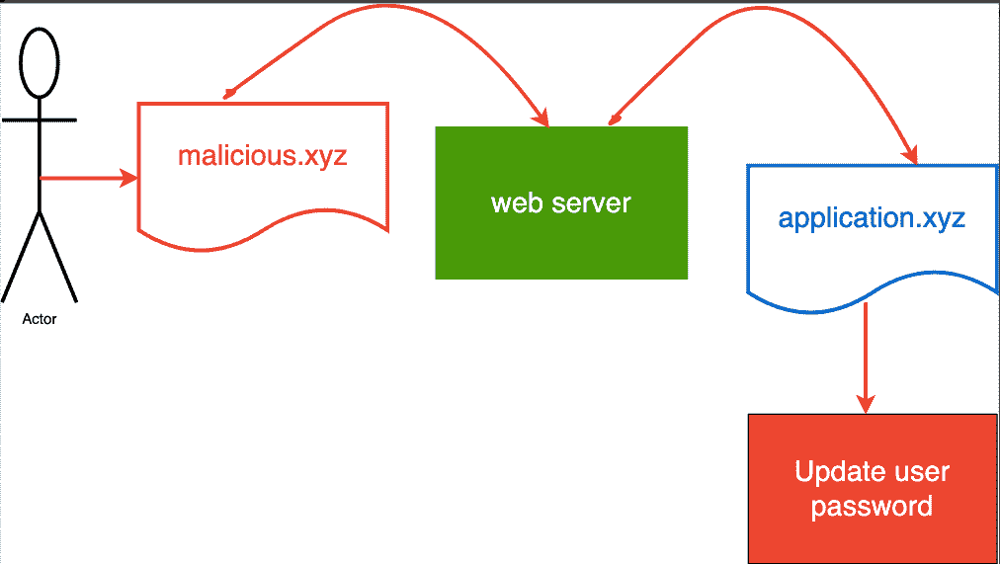
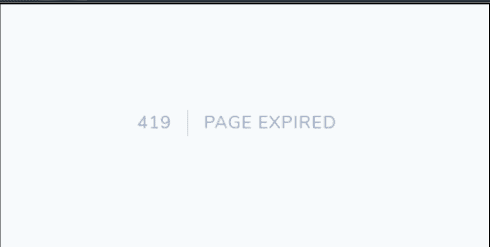

# 什么是跨站点请求伪造(CSRF)？Laravel Web 安全教程

> 原文：<https://www.freecodecamp.org/news/laravel-web-security-csrf/>

在本教程中，您将了解 Laravel web security，以及如何保护您的 web 应用程序，防止跨站点请求伪造或 CSRF 攻击。

CSRF 是一种恶意活动，涉及攻击者代表经过身份验证的用户执行操作。幸运的是，Laravel 提供了现成的措施来防止这种类型的漏洞。

在本教程中，您将学习:

*   什么是 CSRF？
*   如何阻止 CSRF 请求
*   CSRF 验证如何进行以及在哪里进行

## 什么是 CSRF？

CSRF 攻击劫持用户会话。他们通过欺骗用户，在用户不知情的情况下，通过隐藏的表单标签或恶意 URL(图片或链接)发送请求。

这种攻击会导致用户会话状态的改变、数据泄漏，并且攻击者有时可以操纵应用程序中的最终用户数据。



CSRF Explainer

上图展示了这样一个场景，演员(用户)通过****web 服务器**** 向****application . XYZ****发送来自**的请求。然后他们意识到他们的信息已经被 ****更新**他们的**密码**** 所操纵。**

## **如何阻止 CSRF 请求**

**对于每个用户会话，Laravel 都会生成安全令牌，用来确保经过身份验证的用户就是请求应用程序的用户。**

**由于该令牌在每次重新生成用户会话时都会更改，因此恶意攻击者无法访问它。**

**每次在服务器端(后端)请求修改用户信息时，比如`POST`、`PUT`、`PATCH`和`DELETE`，您需要在 HTML 表单请求中包含一个`@csrf`。因此，`@csrf`是一个刀片指令，用于生成由应用程序验证的隐藏令牌。**

****刀片指令**是在称为**刀片**的 Laravel 模板引擎中使用的语法。要创建一个刀片文件，您需要给它一个名称(在我们的案例中是这样的),后跟刀片扩展名。这意味着该文件将被命名为`form.blade.php`。**

**您使用刀片文件向网页上的用户呈现视图。您可以使用几个默认指令或刀片速记语法。例如，`@if`检查是否满足条件，`@empty`检查记录是否不为空，`@auth`检查用户是否通过身份验证，等等。**

**但是这里我们对`@csrf`指令更感兴趣。你可以这样使用它:**

```
`<form method="POST" action="{{route('pay')}}">

    @csrf

</form>`
```

**@csrf**

**早期的 Laravel 版本看起来有点像这样——两者都在幕后工作并做同样的事情。**

```
`<form method="POST" action="{{route('pay')}}">

    <input type="hidden" name="_token" value="{{ csrf_token() }}" />

</form>`
```

**hidden csrf_token() in earlier Laravel releases**

**当 CSRF 令牌没有出现在发送的表单请求中或者看起来无效时，Laravel 抛出一条错误消息“Page Expired ”,状态代码为 419。**

**

Laravel 419 Page Expired** 

## **CSRF 验证如何进行以及在哪里进行**

**`VerifyCsrfToken`中间件处理 Laravel 应用程序中的 CSRF 验证。中间件在 Kernel.php 中注册，并在应用程序的 web route 中间件组中找到。这意味着中间件是为 Web 内的请求而触发的，与 API 无关。**

```
`protected $middlewareGroups = [
        'web' => [
           .
           .
           .
           .
           .
            \App\Http\Middleware\VerifyCsrfToken::class,
        ],
    ];`
```

**VerifyCsrfToken 中间件扩展了`Illuminate\Foundation\Http\Middleware\VerifyCsrfToken`类。这意味着 CSRF 验证被包含在类中。**

**让我们深入了解一下 Laravel 是如何处理 CSRF 验证的。**

**在类中，我们有`tokensMatch`函数。**

```
`protected function tokensMatch($request)
    {
        $token = $this->getTokenFromRequest($request);

        return is_string($request->session()->token()) &&
               is_string($token) &&
               hash_equals($request->session()->token(), $token);
    }`
```

**Determine if the session and input CSRF tokens match.**

**该函数做两件事:**

1.  **`$this->getTokenFromRequest`从通过隐藏字段或请求头附加的传入请求中获取令牌。令牌被解密，然后返回给令牌变量。**

```
`protected function getTokenFromRequest($request)
    {
        $token = $request->input('_token') ?: $request->header('X-CSRF-TOKEN');

        if (! $token && $header = $request->header('X-XSRF-TOKEN')) {
            try {
                $token = CookieValuePrefix::remove($this->encrypter->decrypt($header, static::serialized()));
            } catch (DecryptException $e) {
                $token = '';
            }
        }

        return $token;
    }`
```

**Get token from header**

**2.将请求令牌和会话转换为一个字符串，然后使用 PHP 内置的 hash_equals 来比较两个字符串在相同的时间内是否相等。这个操作的结果总是一个**布尔值(真)或(假)**。**

## **包扎**

**在本文中，您了解了 CSRF，如何处理和防范它，以及 Laravel 如何进行验证的幕后工作。**

**您可以在 [Laravel 文档](https://laravel.com/docs/9.x/csrf)中了解更多相关信息。你可以在这里阅读更多关于 [PHP hash equals 的文档](https://www.php.net/manual/en/function.hash-equals.php)。**

**编码快乐！**