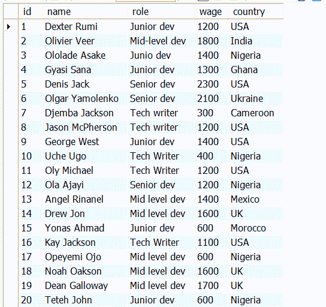
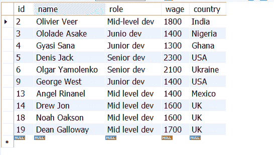
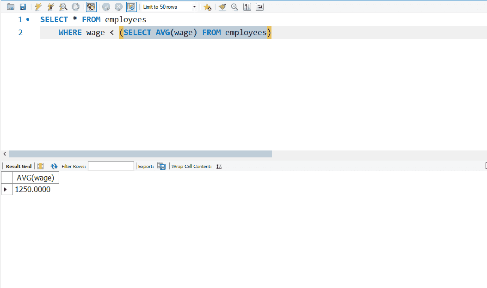
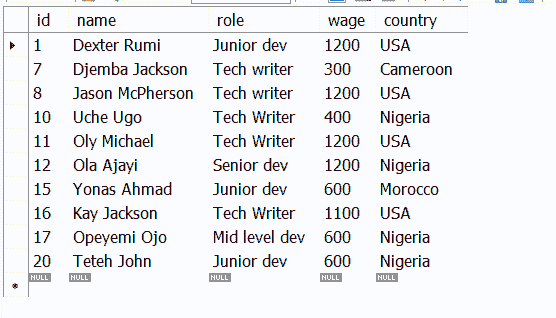
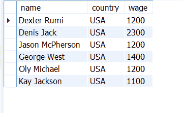
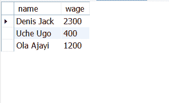

# SQL 子查询–如何在 SELECT 语句中进行子查询

> 原文：<https://www.freecodecamp.org/news/sql-subquery-how-to-sub-query-in-select-statement/>

SQL 子查询是查询中的查询。因此，在 SQL 中，子查询也称为嵌套查询或内部查询。插入内部查询的外部查询是主查询。

SQL 管理员通常在 WHERE 子句中使用子查询来缩小主查询(或外部查询)的结果范围。

您通常将子查询放在括号内，并且可以将它们与比较运算符一起使用，例如=、、<=, and > =。

当您不知道数据库中的确切值时，子查询的一个有效用例是在 SELECT 语句中使用它。即使您知道该值，您仍然可以使用子查询来获取有关该值的更多数据。

在本文中，您将了解如何在 SELECT 语句中使用子查询。

## 如何在 Select 语句中使用 SQL 子查询

我将在一个`employees_data`数据库中使用一个`employees`表。运行`SELECT * FROM employees`给我下表:



### 子查询的示例 1

为了获得收入高于平均工资的人的数据，我运行了以下查询和子查询:

```
SELECT * FROM employees
WHERE wage > (SELECT AVG(wage) FROM employees) 
```

在上面的查询中:

*   主查询选择了 employees 表中的所有内容
*   子查询(`SELECT AVG(wage) FROM employees`)得到了员工的平均工资
*   我指定的 WHERE 子句(`WHERE wage >`)负责获得每个工资低于平均工资的雇员。

该查询返回以下数据:


特别是为了显示平均工资，我可以只运行子查询:


你可以看到平均工资是 1250.0000。因此，该查询和子查询帮助我们获得了平均工资高于 1250.0000 的所有雇员。

为了调整查询，以便我可以获得收入低于平均工资的雇员的数据，我们只需将大于号(>)改为小于号(

```
SELECT * FROM employees
WHERE wage < (SELECT AVG(wage) FROM employees) 
```



### SQL 子查询的示例

为了获得美国雇员的工资，包括他们的姓名和国家，我将 WHERE 子句与 IN 语句结合起来。IN 语句允许您在 WHERE 子句中使用多个值。

```
SELECT name, country, wage FROM employees 
WHERE country IN (SELECT country 
         FROM employees 
         WHERE country = 'USA') ; 
```



为了向您展示在 IN 语句的帮助下，您确实可以在 WHERE 子句中使用多个值，我通过运行以下查询获得了一些已知姓名的雇员的工资:

```
SELECT name, wage FROM employees
WHERE name IN ('Denis Jack', 'Ola Ajayi', 'Uche Ugo'); 
```

结果如下:



## 结论

本文向您展示了关于 SQL 子查询您需要了解的内容，以及如何在 SELECT 语句中使用它们。

但是，子查询不仅限于 SELECT 语句。您可以在 SQL 的所有 CRUD 操作(插入、选择、更新和删除)中使用子查询。

如果你觉得这篇文章有帮助，不要犹豫，与你的朋友和家人分享。