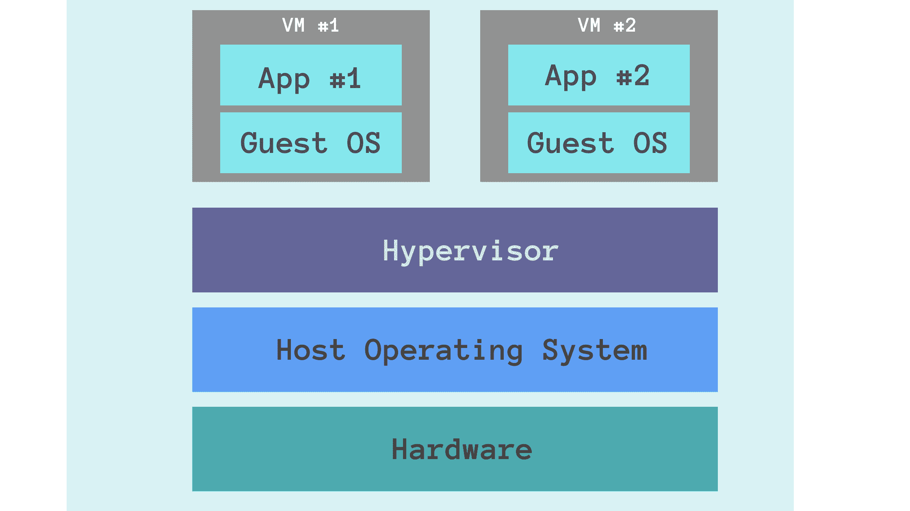
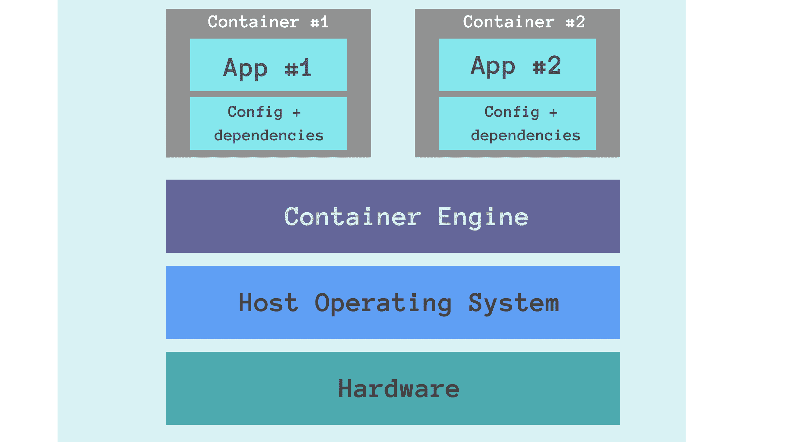
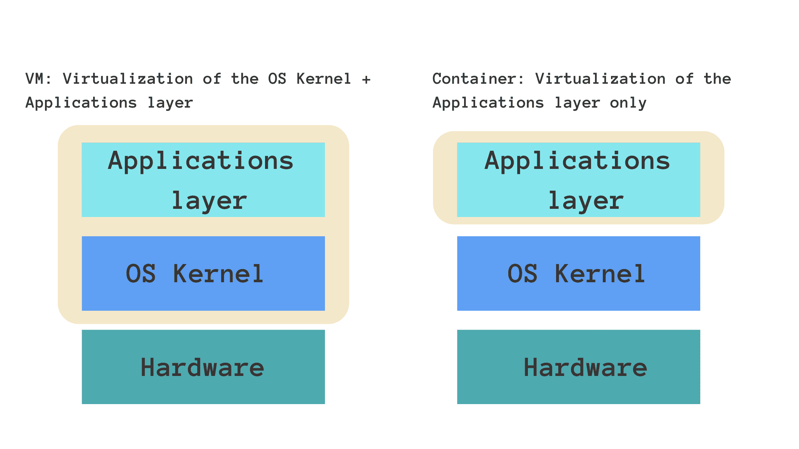

# Docker 与虚拟机(VM)–您应该知道的主要区别

> 原文：<https://www.freecodecamp.org/news/docker-vs-vm-key-differences-you-should-know/>

在本指南中，您将了解到**虚拟机**和 **Docker** 容器之间的区别。

虚拟机和容器都有助于复制开发环境，并更好地管理依赖性和配置。但是您应该知道一些不同之处，这将帮助您根据应用程序选择 VM 或 Docker 容器。

在接下来的几分钟里，我们将回顾虚拟机和 Docker 容器是如何工作的，然后总结两者之间的主要区别。

我们开始吧！

## 应用程序开发和部署中的挑战

当您作为开发团队的一员时，每个应用程序都需要安装多个第三方软件和软件包。为了协作和一起工作，团队中的每个开发人员都应该配置他们的本地开发环境。

然而，设置开发环境是一个繁琐的过程。根据操作系统和系统配置的不同，安装步骤可能会有所不同。即使在部署期间，您也必须在服务器上配置相同的环境。

不同的应用程序还需要特定软件的多个版本，比如 PostgreSQL。在这种情况下，管理跨应用程序的依赖关系变得很困难。

为了应对上述挑战，如果应用程序运行在您可以轻松复制的隔离环境中(独立于系统配置),将会非常有帮助。虚拟机(VM)和 Docker 容器都可以帮助您实现这一点。让我们学习如何！

## 虚拟机是如何工作的？

**虚拟机**或 **VM** 是主机内部物理计算机的模拟。

How a VM works (image by the author)

运行在主机操作系统之上的是一个名为管理程序的软件，它控制着虚拟机实例。每个虚拟机实例都有自己的客户操作系统。应用程序在这个隔离的环境中运行。

您可以拥有多个虚拟机，每个虚拟机在不同的操作系统上运行不同的应用程序。

## Docker 容器是如何工作的？

最近，容器技术彻底改变了软件开发过程以及开发和运营团队的合作方式。随着时间的推移，Docker 已经成为容器化应用程序的首选。

码头集装箱类似于物理集装箱，可以用来存储、包装和运输货物。但它们不是有形的商品，而是软件应用程序的容器。🙂

docker 容器是一个可移植的软件单元，它包含应用程序以及相关的依赖项和配置。

How containers work (image by the author)

与虚拟机不同，Docker 容器*不会*启动自己的客户操作系统。相反，它们运行在主机操作系统之上。这是由容器引擎促成的。

## Docker 与 VM–全面比较

### 1️⃣虚拟化

从我们目前的理解来看，虚拟机和 Docker 容器都提供了运行应用程序的隔离环境。两者之间的关键区别在于*它们如何促进这种隔离。*

回想一下，虚拟机启动自己的来宾操作系统。因此，它虚拟化了操作系统内核和应用层。

Docker 容器只虚拟化了应用层，并运行在主机操作系统之上。

Container vs VM (image by the author)

### 2️⃣兼容性

虚拟机使用自己的操作系统，并且独立于运行它的主机操作系统。因此，虚拟机与所有操作系统兼容。

另一方面，Docker 容器与任何 Linux 发行版兼容。在 Windows 机器或较旧的 Mac 上运行 Docker 可能会遇到一些问题。

### 3 给您

Docker 图像是轻量级的，通常在千字节的数量级。

**💡注意**:Docker 映像表示包含应用程序、其相关依赖项和配置的工件。Docker 映像的运行实例称为容器。

一个 VM 实例可以大到几千兆字节，甚至几兆兆字节。

### 4️⃣表演

在性能方面，Docker 容器提供了接近本机的性能。因为它们是轻量级的，所以您可以在几毫秒内启动它们。

启动一个虚拟机相当于在你的计算机中设置一个独立的机器。启动一个虚拟机实例可能需要几分钟的时间。

### 5️⃣安全

Docker 容器运行在主机操作系统之上。因此，如果主机操作系统易受安全漏洞的影响，Docker 容器也是如此。

另一方面，虚拟机启动自己的操作系统，更加安全。回想一下:每个虚拟机都是在另一个虚拟机内部运行的完全成熟的机器。如果敏感应用程序需要满足严格的安全约束，您应该考虑使用虚拟机。

### 6️⃣可复制性

我们要考虑的下一个因素是复制由虚拟机和容器提供的隔离环境的容易程度。我们可以从之前对**大小**和**性能**的讨论中推断出复制的容易程度。

当有多个应用程序时，每个应用程序都应该在一个虚拟机实例上运行，使用虚拟机可能会**低效**和**资源密集型**。Docker 容器由于轻量级和高性能的优点，是您需要运行多个应用程序时的首选。✅

## 总结

我希望这篇教程能帮助你理解 Docker 容器和 VMs 是如何工作的，以及两者之间的主要区别。

以下是你所学内容的总结:

| 特征 | 码头工人 | 虚拟机器 |
| --- | --- | --- |
| 和睦相处 | 最适合 Linux 发行版 | 所有操作系统 |
| 大小 | 重量轻 | 大得多——大约几十亿字节或更多 |
| 虚拟化 | 只有应用层 | 操作系统内核和应用层 |
| 表演 | 易于启动的容器(通常需要几毫秒) | 启动虚拟机实例需要更长时间 |
| 安全性 | 不太安全 | 相对更安全 |
| 可复制性 | 易于复制。您可以提取与各种应用程序相对应的 Docker 图像 | 难以复制，尤其是随着虚拟机实例数量的增加 |

谢谢你读到这里。下节课再见！😄