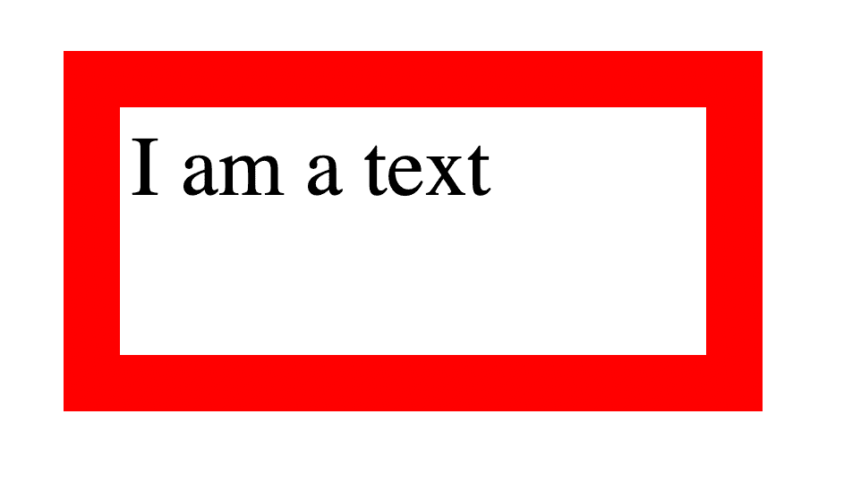

# CSS 中的 rem 是什么？rem 单位字体大小、填充、高度等

> 原文：<https://www.freecodecamp.org/news/what-is-rem-in-css-rem-unit-font-size-padding-height-and-more/>

`rem`测量单位是一个相对单位，可以用于 CSS 中的长度值。我将在本文中解释这个单元是什么，以及它与其他单元有何不同。

在我之前的文章中，我解释了 CSS 中的两类单位: [**绝对**和**相对**单位](https://www.freecodecamp.org/news/absolute-and-relative-css-units/)。我建议查看一下，这样你就能理解什么是相对单位，以及为什么`rem`属于这个类别。

简单解释一下，相对单位用于依赖于(相对于)其他值的值。

## 什么是雷姆单位？

`rem`代表**根 em** ，是一个度量单位，指的是文档的`root`元素的`font-size`。

它是一个相对单位，这意味着当根的`font-size`改变时，使用它的所有值也改变。本例中的`root`元素指的是`html`元素。

**1 根**表示 **1 倍于根字号**。

所以，如果你声明根的`font-size`为 16px(默认的字体大小),如下所示:

```
html {
  font-size: 16px;
} 
```

那么你使用`1rem`的任何地方都会将其解释为`16px`。`2rem`将其解释为`32px`。`0.5rem`会将其解释为`8px`，以此类推。

## 快速眼动和快速眼动的区别

`rem`指的是`html`元素的`font-size`，而`em`指的是使用它的元素的`font-size`(在某些情况下，是父元素的`font-size`)。

让我们来看一些`em`的例子:

```
<div>
    <p>I am a text</p>
</div> 
```

CSS:

```
div {
  font-size: 20px;
}

p {
  font-size: 1.5em;
  width: 2em;
} 
```

对于`p`标签的`font-size`，`em`指的是其父元素的`font-size`，在本例中是`div`。所以`p`标签上的`font-size: 1.5em`会被解释为 **1.5 乘以 20px** 也就是 **30px** 。

对于`p`标签的`width`，`em`是指`p`标签本身的`font-size`。所以`p`标签上的`width: 2em`会被解释为 **2 乘以 30px** 也就是 **60px** 。

对于显示`rem`的示例:

```
<div>
    <p>I am a text</p>
</div> 
```

这是 CSS:

```
html {
  font-size: 18px;
}

div {
  font-size: 20px;
}

p {
  font-size: 1.5rem;
  width: 10rem;
  padding: 0.2rem;
  height: 4rem;
  border: 1rem solid red;
} 
```

结果如下:



对于`p`标签的`font-size`，`rem`是指根(`html`)元素的`font-size`。所以`p`标签上的`font-size: 1.5rem`会被解释为 **1.5 乘以 18px** 也就是 **27px** 。

对于`p`标签的`width`，`rem`也指根元素的`font-size`。所以`p`标签上的`width: 10rem`会被解释为 **10 乘以 18px** 也就是 **180px** 。

对于`p`标签的`padding`，`rem`是指根元素的`font-size`。所以`p`标签上的`padding: 0.2rem`会被解释为 **0.2 乘以 18px** 也就是 **3.6px** 。

对于`p`标签的`height`，`rem`是指根元素的`font-size`。所以`p`标签上的`height: 4rem`会被解释为 **4 乘以 18px** 也就是 **72px** 。

最后，对于`p`标签的`border-width`，`rem`仍然引用根元素的`font-size`。所以`p`标签上的`border: 1rem...`会被解释为 **1 乘以 18px** 也就是 **18px** 。

你可以在 CSS 中使用其他长度值的`rem`。

## 包扎

与固定单位不同，相对单位在大多数情况下更容易创建响应性设计。当您更改单位所依赖的值时，所有具有相对单位的值都会相应缩放。

`rem`是一个允许你定义一个全局`font-size`的相对单位，其他每一个带有`rem`单位的值都取决于全局大小。如果浏览器用户改变他们的默认根字体大小，`rem`单位值也将相应地缩放。在固定值的情况下，用户的偏好将被忽略。

`em`是指元素本身(或其父元素)的`font-size`，`rem`是指根`font-size`。