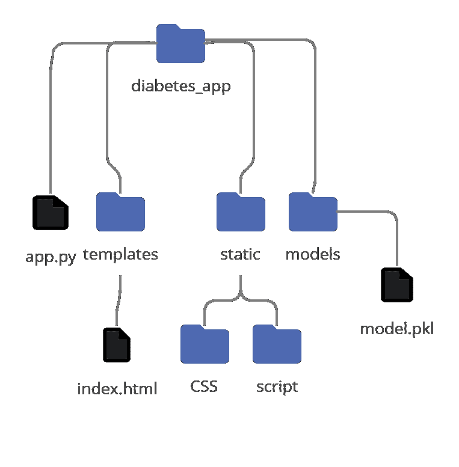
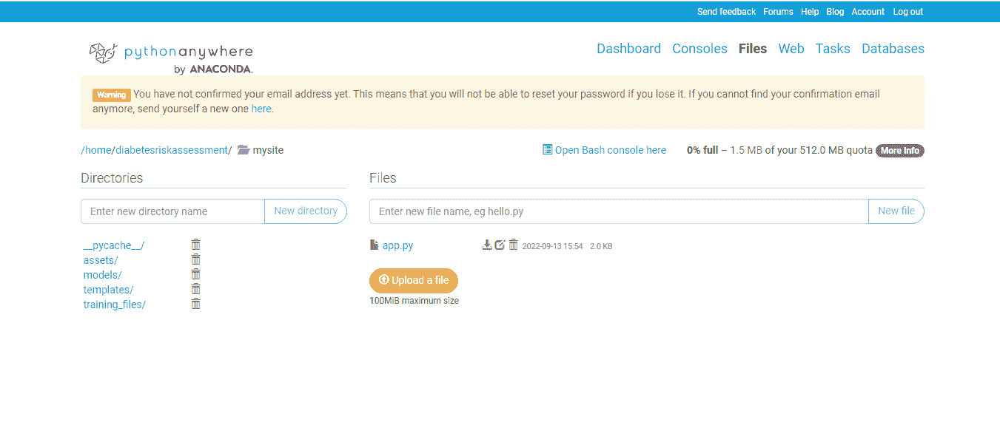
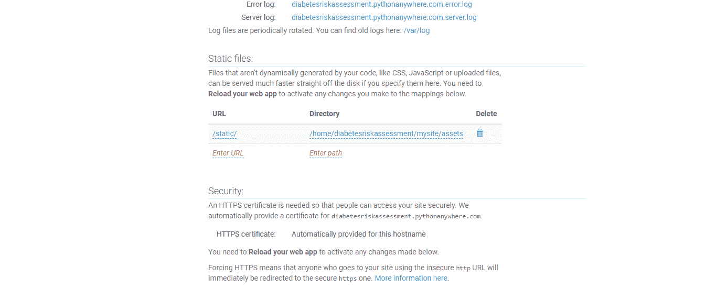

# 如何将你的 Jupyter 笔记本变成一个用户友好的网络应用程序

> 原文：<https://www.freecodecamp.org/news/machine-learning-web-app-with-flask/>

能够建立预测模型是一种超能力——但如果用户不能使用这些模型，你就无法利用它们。

在本文中，我们将介绍使用 Flask 和 PythonAnywhere 构建和部署机器学习 web 应用程序的过程。

Flask 是一个易于使用的 Python web 框架，而 PythonAnyWhere 是由 Anaconda 提供的 web 托管服务。

## 如何构建机器学习 Web 应用程序

将你的预测模型转化为一个网络应用的想法可能会让人感觉势不可挡。但是我向你保证，这是相对容易和简单的。

为此，我们需要采取以下步骤:

1.  保存机器学习模型
2.  使用 HTML 建立网页
3.  使用 Flask 构建后端
4.  按照你想要的方式来设计
5.  将其部署到 web 上

我想建立一个糖尿病预测网络应用程序，所以我使用了这个数据集。您可以使用任何您喜欢的数据集，因为过程将保持不变。

在开始之前，让我们了解一下我们将要遵循的目录结构。这将有助于保持我们的文件有组织，并使部署容易。

### 目录结构



Directory structure we are going to follow

我将我的根目录命名为 diabetes_app，但是你可以随意命名你的根目录。

我们在 diabetes_app(根目录)中还有三个目录和一个 Python 文件。模型目录将包含我们训练好的模型。静态目录有两个以上的目录，CSS 将保存所有的样式表，脚本将有 JavaScript 文件，如果有的话。最后，Templates 文件夹将保存 HTML 文件，app.py 是我们的 Python 文件，其中包含后端(Flask)代码。

现在我们有了一个有组织的文件结构，让我们开始吧。

## 如何保存机器学习模型

保存模型是所有任务中最简单的。我们将使用 Python pickle 库来完成这项工作。

完成训练、测试和超参数调整后，将性能最佳的模型保存在变量中。对我来说，最好的模型是 RandomForestsClassifier，我是这样保存的:

```
clf = RandomForestClassifier()
clf.fit(X_train.values, y_train)
```

现在`clf`有了我训练好的 RandomForestClassifier 模型，可以保存在一个文件中。为此，我必须导入 pickle 库并保存 clf，如下所示:

```
import pickle
pickle.dump(clf, open('model.pkl', 'wb'))
```

pickle.dump()是用于保存模型的函数。第一个参数是模型名(在我们的例子中是 clf ),第二个参数是另一个将模型保存在磁盘中的函数。' model.pkl '是我希望保存我的模型的文件名，而' wb '是指将模型数据写入' model.pkl '文件的*写二进制文件*。

在这一步之后，您将把您的模型文件保存在您正在工作的同一目录中。不要忘记将 model.pkl 文件复制到我们项目目录的 models 文件夹中。现在我们已经保存了我们的模型，我们准备继续前进。

## 如何使用 HTML 构建网页

任何机器学习 web app 的主要功能都是进行预测。为此，如果您没有使用过非结构化数据或在其他情况下上传过一些文档，用户很可能需要回答几个问题。

早期糖尿病风险预测数据集。具有 17 个特征的 csv 表单(其中 16 个用作输入)。我们将使用 HTML 表单来创建一个表单，用户可以填写该表单来获得他们的预测。例如:

```
<form action="{{ url_for('predict')}}" method="post">
    <p>What is your age?</p>
     <input type="number" name="Age" placeholder="Enter your age" 			  		required="required" /><br> 
    <p>What is your gender?</p>
     <label><input type="radio" name="Sex" value="1" required="required" 		/>Male</label>
        <label><input type="radio" name="Sex" value="0" required="required" 		/>Female</label><br>
     <button type="submit">Predict</button>
</form>
<p> {{ prediction }} </p> 
```

上面，我们创建了一个包含两个问题的表单。表单上的 action 属性被设置为`{{ url_for('predict') }}`，它将在表单提交时呈现我们的预测。对于年龄，我们为用户提供一个数字输入字段，对于性别，我们有单选按钮。

value 属性包含每个单选按钮的值。男性的值为 1，女性的值为 0，这将用作我们预测的输入。确保每个输入字段都具有与最终(已处理/可用于预测)数据集相匹配的值属性。我有一个二进制编码的性别特征，所以我用值 1 和 0 来表示性别。

段落标签将显示预测结果。Prediction 是一个变量，它将我们的预测保存在 Python 文件中，我们将在下一步中看到该文件。
您可以添加任意数量的问题以及任何适合您的输入类型，功能将保持不变。

## 如何使用 Flask 构建后端

我们现在正处于最有趣的一步，即构建后端。首先看一下代码，然后我们将深入研究它。

```
import numpy as np
from flask import Flask, request, render_template
import pickle

app = Flask(__name__)

model = pickle.load(open('models/model.pkl', 'rb'))

@app.route('/')
def home():
    return render_template('index.html')

@app.route('/predict',methods=['POST'])
def predict():
    int_features = [int(x) for x in request.form.values()]
    features = [np.array(int_features)]  
    prediction = model.predict(features) 
    result = prediction[0]

    return render_template('index.html', prediction=result)

if __name__ == "__main__":
    app.run(debug=True)
```

从导入我们将需要的库开始。我们需要 NumPy 来处理输入值，Flask 来进行预测，pickel 来加载我们在第一步中保存的模型。

首先，我们创建我们的应用程序对象，我们将使用它来构建我们的后端。其次，我们使用 pickel.load()函数加载我们的模型。这一次，我们将“wb”替换为“rb”，意思是*“read binary”*，它告诉 pickel 读取数据。

@app.route('/')的意思是当我们在我们 app 的首页，想在这里做点什么的时候。为此，我们定义了一个函数`home`,它将我们在上一步中创建的 HTML 文件呈现为我们的主页。

@app.route('/predict '，methods=['POST'])做的主要工作是允许我们进行预测。/predict 表示我们已经进入应用程序的预测页面。

我们在这里定义了一个预测函数，在这个函数中，我们首先使用 request.form.values()将所有输入值存储在一个名为 int_features 的数组中。一旦我们有了输入值，我们就把它转换成一个用于预测的 2D 数组，并像平常一样进行预测。最后，我们将预测存储在预测变量中，我们将使用该变量在 web 应用程序上呈现结果。

render_template('index.html '，prediction=result)告诉 Flask 将结果赋给预测变量，并将其呈现在我们的 index.html 文件中。

还记得在我们的 HTML 中设置为 predict 的 action 属性吗？这就是我们在这里定义的预测函数。当用户提交表单时，predict 函数被调用。

最后，我们在最后两行运行我们的应用程序。debug=True 是可选参数(默认值为 False ),当您对代码进行更改时，它会自动重新加载网页。这将有助于你设计你的应用程序。

## 如何按照你想要的方式设计应用程序

为了简单起见，我向您展示了构建机器学习 web 应用程序的最简单方法。但是你可以用它做很多事情。

我将我的应用分为三个独立的网页，分别是主页、表格/问题和结果。我还添加了一点 JavaScript 来将来自全球各地的随机健康相关新闻呈现到主页上，并添加了一点样式来使事情看起来更漂亮。

使用 Flask 时，链接 CSS 和 JavaScript 文件的方式如下:

```
 <link rel="stylesheet" href="{{ url_for('static',filename='css/style.css') }}">
 <script type="text/javascript" 
  src="{{ url_for('static',filename='script/script.js') }}"></script>
```

static is the folder name in which files are saved

要添加多个网页，您只需像我们在上一步中所做的那样向 Python 文件添加更多的路径。假设我们想要添加一个单独的结果页面来显示预测。/predict 路由将如下所示:

```
@app.route('/predict',methods=['POST'])
def predict():
    int_features = [int(x) for x in request.form.values()]
    features = [np.array(int_features)]  
    prediction = model.predict(features)  
    result = prediction[0]

    return render_template('results.html', prediction=result)
```

我们没有渲染 index.html，而是用我们的预测渲染 results.html。您可以按照自己的方式构建和设计 results.html 文件，并向其中添加预测。

## 如何将应用程序部署到 Web

既然我们已经完成了造型，应用程序就可以被推送到云端了。PythonAnywhere 易于使用，并有免费的计划来部署 Python 应用程序。您必须先创建一个帐户，然后选择免费计划。

接下来，您需要为您的应用程序命名，然后转到“文件”选项卡并删除那里的现有站点。将你所有的文件上传到上面讨论的同一个目录结构中。然后转到 web 选项卡，单击蓝色的重新加载按钮。



Uploaded files

如果您的项目中有 CSS 和 JavaScript 文件，您需要在 web 选项卡的静态文件部分定义它们的 URL 和目录路径。

URL 将是/static/



Static files section 

再次点击蓝色的重新加载按钮来重新加载网站，恭喜您——您已经将您的机器学习 web 应用程序部署到了云中。

## 结论

部署机器学习 web 应用并不像看起来那么困难——至少不像学习机器学习理论那么困难。如果您做到了这一点，部署将变得轻而易举，让您更上一层楼。

我希望这篇文章能帮助您理解如何部署您的模型，并使它们看起来更漂亮。我构建的糖尿病风险评估 web 应用程序的代码可以在我的 [GitHub](https://github.com/ToobaJamal/diabetes_risk_assessment) 上找到。

部署您的模型，向世界展示您的超能力！

> 有兴趣在 LinkedIn 上联系吗？在 [Tooba Jamal](https://www.linkedin.com/in/tooba-jamal/) 给我打电话