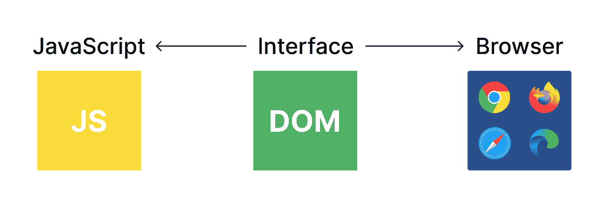
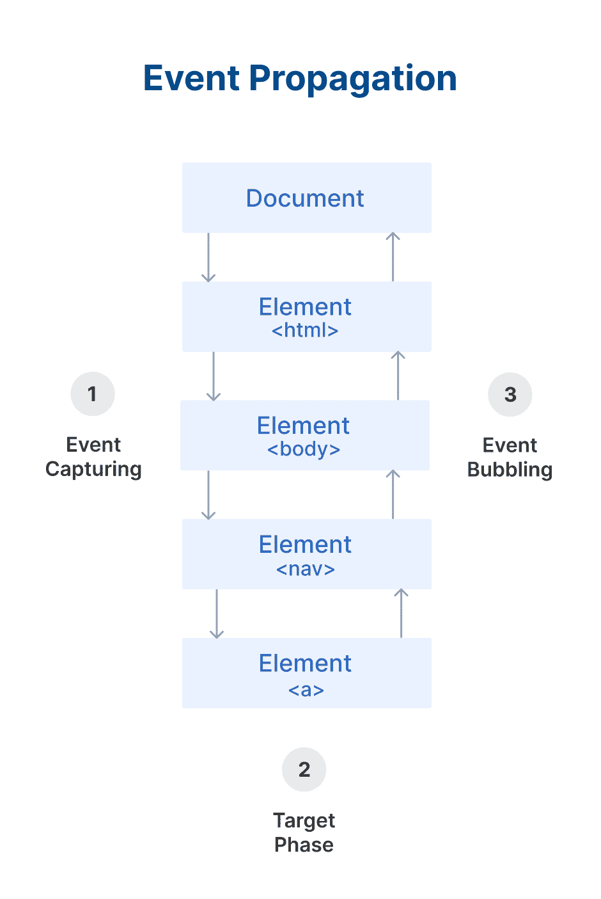
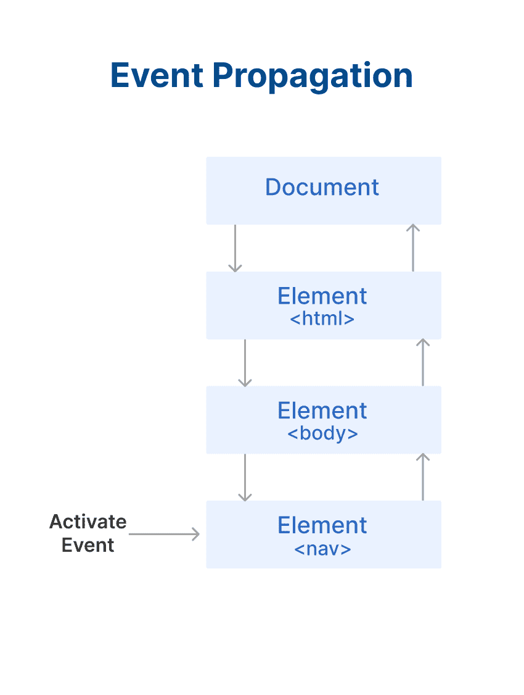
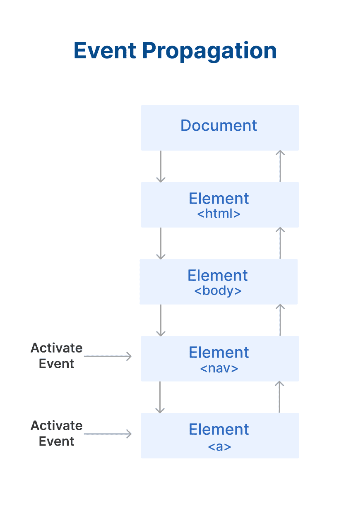

# 什么是 DOM？幕后指南

> 原文：<https://www.freecodecamp.org/news/what-is-dom-in-javascript/>

如果想成为一名高效的前端开发人员，理解 DOM 和事件在 JavaScript 中的工作方式是关键。

在本文中，您将了解什么是 DOM 以及它是如何工作的。

## 什么是 DOM？

DOM 代表文档对象模型。它是 JavaScript 和网络浏览器之间的接口。

在 DOM 的帮助下，您可以编写 JavaScript 来创建、修改和删除 HTML 元素，设置样式、类和属性，以及侦听和响应事件。

DOM 树是从一个 HTML 文档生成的，然后您可以与它进行交互。DOM 是一个非常复杂的 API，它具有与 DOM 树交互的方法和属性。



Illustration of the DOM

你可以在这里看到 DOM 树[。](https://fritscher.ch/dom-css/)

## DOM 如何工作——在幕后

DOM 的组织方式非常巧妙。父元素称为 EventTarget。借助下图，您可以更好地理解它的工作原理:


EventTarget 接口由对象实现，这些对象可以接收事件，并且可能有针对它们的侦听器。换句话说，任何事件的目标都实现了与这个接口相关的三个方法。**元素**及其子元素**文档**和**窗口**是最常见的事件目标，但是其他对象也可以是事件目标。

窗口表示浏览器的窗口。所有全局 JavaScript 对象、函数和变量都自动成为 window 对象的成员。全局变量是窗口对象的属性。全局函数是窗口对象的方法。甚至(HTML DOM 的)文档对象也是窗口对象的属性。

```
window.document.getElementById("header");

// Both are same

document.getElementById("header");
```

节点在 DOM aka 文档对象模型中。在 DOM 中，文档的所有部分，比如元素、属性、文本等等，都组织在一个由父元素和子元素组成的树状结构中。文档的这些独立部分称为节点。

上图中的节点由一个 JavaScript 对象表示。我们主要处理具有最常用方法的文档，如 document.queryselector()、document.getElementBy Id()等。

现在我们来看一下文档。

## 如何使用 DOM 选择、创建和删除元素

在 DOM 的帮助下，我们可以在 JavaScript 中选择、删除和创建元素。

### 如何选择元素

在 JavaScript 中有多种方法可以选择 HTML 元素。这些是我们将在这里看到的方法:

*   document.getElementById()：
*   document . getelementbyclass name()；
*   document . getelementbytagname()；
*   document.querySelector()：
*   document . query selectorall()；

#### 如何使用`document.getElementById()`方法

`getElementById()`方法返回 id 与传递的字符串匹配的元素。因为 HTML 元素的 id 应该是惟一的，所以这是选择带有 id 的元素的一种更快的方法。

示例:

```
const ele = document.getElementById("IDName");
console.log(ele); // This will log the whole HTML element
```

#### 如何使用`document.getElementByClassName()`方法

`document.getElementByClassName()`方法返回一个与传递的类名匹配的`HTMLCollection`元素。我们可以通过传递由空格分隔的类名来搜索多个类名。它将返回一个活动的 HTMLCollection。

那么 HTMLCollection 是“活的”是什么意思呢？这意味着，一旦我们获得了一个类名的 HTMLCollection，如果我们添加了一个具有相同类名的元素，那么 HTMLCollection 就会自动更新。

示例:

```
const ele = document.getElementByClassName("ClassName");
console.log(ele); // Logs Live HTMLCollection
```

#### 如何使用`document.getElementByTagName();`方法

`document.getElementByTagName()`方法返回与传递的标记名匹配的元素的 HTMLCollection。它可以在任何 HTML 元素上调用。它返回一个 HTMLCollection，这是一个活动集合。

示例:

```
const paragraph = document.getElementByTagName("p");
const heading = document.getElementByTagName("h1");

console.log(paragraph); // p element HTMLCollection
console.log(heading); // h1 element HTMLCollection
```

#### 如何使用 document.querySelector()方法

`document.querySelector()`方法返回匹配传递的选择器的第一个元素。现在，我们可以传递类名、id 和标记名。看看下面的例子:

```
const id = document.querySelector("#idname"); // using id
const classname = document.querySelector(".classname"); // using class
const tag = document.querySelector("p"); // using tagname
```

选择规则:

*   选择使用类时，请使用(。)开头。比如(“。类名”)
*   选择使用 id 时，在开头使用(#)。例如(" #id ")
*   使用标签选择时，只需直接选择。例如(“p”)

#### 如何使用 document.querySelectorAll()方法

`document.querySelectorAll()`方法是`querySelector`方法的扩展。这个方法返回**所有**与传递的选择器匹配的元素。它返回非活动的节点列表集合。

```
const ele = document.querySelectorAll("p");
console.log(ele); // return nodelist collection of p tag
```

**注意** : HTMLCollection 是动态集合，Nodelist 集合是静态集合。

### 如何创建元素

您可以在 JavaScript 中创建 HTML 元素，并将其动态添加到 HTML 中。您可以通过传递括号中的标签名称来创建任何带有`document.createElement()`的 HTML 元素。

创建元素后，可以向该元素添加类名、属性和 textcontent。

**这里有一个例子:**

```
const ele = document.createElement("a");
ele.innerText = "Click Me";
ele.classList.add("text-left");
ele.setAttribute("href", "www.google.com");

// update to existing element in HTML
document.querySelector(".links").prepend(ele);
document.querySelector(".links").append(ele);
document.querySelector(".links").befor(ele);
document.querySelector(".links").after(ele);

// Simalar to below anchor tag
// <a href="www.google.com">Click Me</a>
```

在上面的例子中，我们用 JavaScript 创建了一个 anchor 标记，并向该 anchor 标记添加了属性和类名。在上面的例子中，我们有四个方法来更新 HTML 中创建的元素。

*   prepend():在第一个子元素的顶部插入数据。
*   append():在最后一个索引处的元素内插入数据或内容。
*   before():在选定元素之前插入数据。
*   after():将元素放在指定元素之后。或者可以说，它在匹配的元素集合中的一个元素之外插入数据(使内容成为它的兄弟)。

### 如何删除元素

我们知道如何在 JavaScript 中创建元素，并将它们推送到 HTML 中。但是如果我们想删除 HTML 中的现有元素呢？这很简单——我们只需要在那个元素上使用`remove()`方法。

**这里有一个例子:**

```
const ele = document.querySelector("p");

// This will remove ele when clicked on
ele.addEventListner('click', function(){
	ele.remove();
})
```

## 如何从 JavaScript 操纵 CSS

我们知道如何从 JavaScript 操纵 HTML。现在我们将学习如何从 JavaScript 操作 CSS。这可以帮助您动态地更改网页的样式。

例如，如果你点击一个元素，它的背景颜色应该改变。这可以通过从 JavaScript 操纵 CSS 来实现。

下面是一些语法示例:

```
const ele = document.querySelector("desired element");

ele.style.propertyName = value;

// E.g -
ele.style.color = red;
```

当使用 JavaScript 更改 CSS 属性时，您需要确保每当 CSS 中有`-`时，您都要大写下一个字母。例如，在 CSS 中你应该写`background-color`，但是在 JavaScript 中是`backgroundColor`(大写的 C)。

**这里有一个例子:**

```
const ele = document.querySelector("div");
ele.style.backgroundColor = "red";
```

现在假设您已经为您的项目编写了 CSS，并且想要使用 JavaScript 添加类。我们可以在 JavaScript 中使用`classList`来做到这一点。

**这里有一个例子:**

```
const ele = document.querySelector(".link");
ele.classList.add("bg-red"); // add class bg-red to existing class list
ele.classList.remove("pb-4");// remove class bg-red from existing class list
ele.classList.toggle("bg-green"); // toggle class bg-red to existing class list which means if it already exists then it will be removed, if it doesn't exist it will be added.
```

当我们使用 classList 时，它直接向元素添加、删除或切换类。这就像用现有的类进行更新一样。

与 element.className 不同，它删除所有现有的类并添加给定的类。

**这里有一个例子:**

```
const ele = document.querySelector(".link");
ele.classList.add("bg-red"); // add class bg-red to existing class list
ele.classList.remove("pb-4");// remove class bg-red from existing class list

ele.className = "p-10"; // Now this will remove all existing classes and add only "p-10 class to element."
```

## 如何使用事件处理程序

物体状态的变化被称为 ****事件**。**对事件做出反应的过程称为 ****事件处理**。**

当用户执行诸如单击、悬停在元素上、按键等操作时，事件就会发生。所以当一个事件发生时，你想做某件事或操纵任何事，你使用事件处理程序来触发这个事件。

当特定事件发生时，我们使用事件处理程序来执行特定的代码。JavaScript 中有多个事件处理程序(这里有一个快速的[列表，其中有](https://way2tutorial.com/html/html5_events_handler_list.php)，但是您可以使用相同的过程向任何元素添加事件处理程序。

语法如下:

```
const ele = document.querySelector("a");

ele.addEventListner("event", function(){
	// callback function
});
```

您可以使用的一些事件:

*   点击
*   鼠标悬停
*   鼠标移出
*   键击器
*   按键

**这里有一个使用“点击”事件的例子:**

```
const ele = document.querySelector("a");

ele.addEventListner("click", function(){
	ele.style.backgroundColor = "pink";
});
```

## 事件传播:冒泡和捕获

事件传播决定了元素接收事件的顺序。在 DOM 中有两种方法来处理这种事件传播顺序:事件冒泡和事件捕获。



### 什么是事件冒泡？

当一个事件发生在一个组件上时，它首先在这个组件上运行事件处理程序，然后在它的父组件上运行，最后在其他祖先的组件上运行。

默认情况下，所有事件处理程序都按照从中心组件事件到最外层组件事件的顺序移动。

### 什么是事件捕获？

这是冒泡的反义词。事件处理程序首先作用于它的父组件，然后作用于它实际要触发的组件。

简而言之，这意味着事件首先被最外面的元素捕获，然后传播到内部元素。它也被称为涓滴效应。

让我们试试下面的例子:

```
<!DOCTYPE html>
<html lang="en">
<head>
    <meta charset="UTF-8">
    <meta http-equiv="X-UA-Compatible" content="IE=edge">
    <meta name="viewport" content="width=device-width, initial-scale=1.0">
    <title>Example</title>
    <style>
        nav{
            display: flex;
            justify-content: center;
            padding: 30px;
        }

        nav li{
            list-style: none;
            padding: 5px;
        }

        nav li a{
            text-decoration: none;
            padding: 20px;
        }
    </style>
</head>
<body>

    <div>
        <nav>
            <li><a href="#">Home</a></li>
            <li><a href="#">About</a></li>
            <li><a href="#">Contact</a></li>
        </nav>
    </div>

    <script>
        const navbar = document.querySelector("nav");
        navbar.addEventListener('click', function(){
            navbar.style.backgroundColor="green"
        });

        const anchor = document.querySelector("a");
        anchor.addEventListener("click", function(){
            anchor.style.backgroundColor="pink";
        })
    </script>
</body>
</html>
```

该代码为我们提供了以下内容:


现在仔细研究上面的例子。我已经向`nav`标签和`anchor`标签添加了一个事件监听器。当你点击导航，背景颜色变成绿色。当您单击锚定标签时，背景颜色会变成粉红色。

但是当你点击锚标签时，锚和导航的背景颜色都会改变。这是因为**事件冒泡。**

**这是当你只点击导航元素时发生的事情:**



**This is what happens when you only click on the nav element.**

**这是当你只点击锚元素时发生的事情:**



**This is what happens when you only click on the anchor element**

为了停止事件传播，我们可以在事件监听器上使用`stoppropagation()`,因为事件传播正在发生。在上面的例子中，它将阻止 nav 元素事件监听器被激活。

```
<!DOCTYPE html>
<html lang="en">
<head>
    <meta charset="UTF-8">
    <meta http-equiv="X-UA-Compatible" content="IE=edge">
    <meta name="viewport" content="width=device-width, initial-scale=1.0">
    <title>Example</title>
    <style>
        nav{
            display: flex;
            justify-content: center;
            padding: 30px;
        }

        nav li{
            list-style: none;
            padding: 5px;
        }

        nav li a{
            text-decoration: none;
            padding: 20px;
        }
    </style>
</head>
<body>

    <div>
        <nav>
            <li><a href="#">Home</a></li>
            <li><a href="#">About</a></li>
            <li><a href="#">Contact</a></li>
        </nav>
    </div>

    <script>
        const navbar = document.querySelector("nav");
        navbar.addEventListener('click', function(){
            navbar.style.backgroundColor="green"
        });

        const anchor = document.querySelector("a");
        anchor.addEventListener("click", function(e){
            e.stopPropagation();
            anchor.style.backgroundColor="pink";
        })
    </script>
</body>
</html>
```

## 如何遍历 DOM

“一个优秀的 JavaScript 开发人员需要知道如何遍历 DOM——从另一个元素中选择一个元素的行为。"–[刘哲](https://zellwk.com/blog/dom-traversals/)

现在我们将了解为什么遍历 DOM 比使用`document.querySelector()`方法更好，以及如何像专业人员一样遍历。

有 3 种方法可以遍历 DOM:

*   上升的
*   向下的
*   向侧面的

### 如何向上遍历 DOM

有两种方法可以帮助您向上遍历 DOM:

*   parentElement
*   最靠近的

`parentElement`是选择父元素的属性，如下所示:

```
const ele = document.querySelector("a");
console.log(ele.parentElement); // <div>
```

parentElement 非常适合向上选择一个级别。但是`closest`可以让你找到一个比当前元素高几级的元素。`closest`让您选择与选择器匹配的最近的祖先元素。

这里有一个使用`closest`的例子:

```
<div>
    <h3 class="demo">This is sample</h3>
    <h1 class="demo">This is heading</h1>
    <h2 class="heading"> This heading 2</h2>
</div>
```

```
const ele = document.querySelector(".heading");
console.log(ele.closest(".demo")); // This is heading
```

在上面的代码中，我们试图得到最接近`.heading`的元素，它有一个类`.demo`。

### 如何向下遍历 DOM

我们可以在选择器上使用`children`方法向下遍历。对于子元素，您可以选择所选元素的直接子元素。

**这里有一个例子:**

```
<div>
    <a href="#">Link-1</a>
    <a href="#">Link-2</a>
    <a href="#">Link-3</a>
    <a href="#">Link-4</a>
</div>
```

```
const ele = document.querySelector("div");
const child = ele.children;

console.log(child); // gives HTMLCollection
// 4 element inside div
```

### 如何横向遍历 DOM

横向穿越大教堂非常有趣。我们可以使用的方法主要有两种:

*   前一个月兄弟姐妹
*   nextElementSibling

在`previousElementSibling`方法的帮助下，我们可以像这样选择 HTML 中以前的元素:

```
<div>
    <a href="#">Link-1</a>
    <h1>Heading</h1>
</div>
```

```
const ele = document.querySelector("h1");
console.log(ele.previousElementSibling); // <a href="#">Link-1</a>
```

在`nextElementSibling`的帮助下，我们可以像这样选择 HTML 中的下一个元素:

```
<div>
    <a href="#">Link-1</a>
    <h1>Heading</h1>
</div>
```

```
const ele = document.querySelector("a");
console.log(ele.nextElementSibling); // <h1>Heading</h1>
```

## **结束**

我希望您现在理解了 DOM 在 JavaScript 中是如何工作的。感谢您的阅读！

您可以关注我:

*   [推特](https://twitter.com/Kedar__98)
*   [LinkedIn](https://www.linkedin.com/in/kedar-makode-9833321ab/?originalSubdomain=in)
*   [Instagram](https://www.instagram.com/kedar_98/)