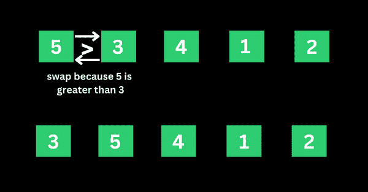
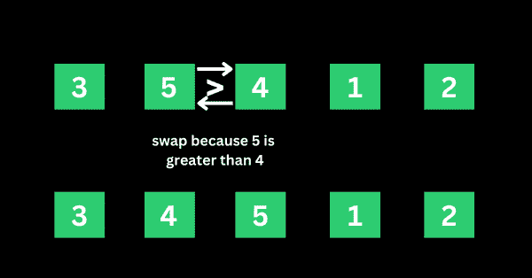
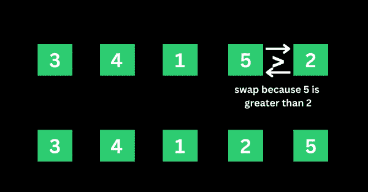
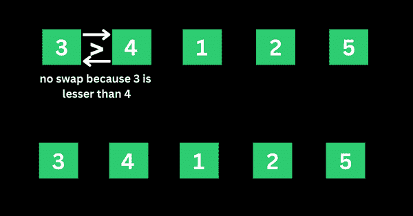
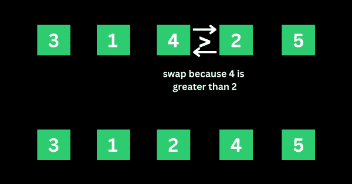
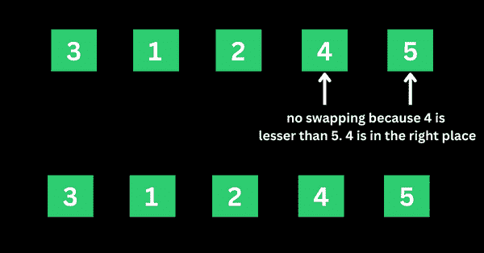
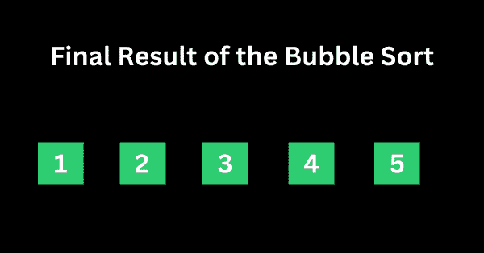

# 冒泡排序 Java、C++、Python 中的算法及示例代码

> 原文：<https://www.freecodecamp.org/news/bubble-sort-algorithm-in-java-cpp-python-with-example-code/>

冒泡排序是一种排序算法，可用于按升序排列一组值。如果您愿意，还可以实现冒泡排序，以降序对值进行排序。

冒泡排序算法的一个真实例子是手机上的联系人列表如何按字母顺序排序。或者根据添加时间对手机上的文件进行分类。

在这篇文章中，我将用我准备的一些信息图来解释你需要知道的关于冒泡排序算法的一切。然后，我将用 Python、Java 和 C++向您展示冒泡排序算法的示例代码。

## 目录

*   [冒泡排序算法如何工作](#howthebubblesortalgorithmworks)
    *   [排序的第一次迭代](#firstiterationofthesorting)
    *   [排序的第二次迭代，其余的](#seconditerationofthesortingandtherest)
*   [冒泡排序算法的 Python 代码示例](#pythoncodeexampleofbubblesortalgorithm)
*   [冒泡排序算法的 Java 代码示例](#javacodeexampleofbubblesortalgorithm)
*   [冒泡排序算法的 C++代码示例](#ccodeexampleofbubblesortalgorithm)
*   [最终想法](#finalthoughts)

## 冒泡排序算法的工作原理

为了实现冒泡排序算法，开发人员通常会编写一个函数，然后在一个循环中编写一个循环——内部循环和外部循环。当我向您展示 Python、C++和 Java 的代码时，您将看到它的运行。

假设我们要对一系列数字 5、3、4、1 和 2 进行排序，使它们按升序排列…

排序通过比较前两个值开始第一次迭代。如果第一个值大于第二个值，则该算法将第一个值推送到第二个值的索引处。

### 排序的第一次迭代

**第一步**:在 5，3，4，1，2 的情况下，5 大于 3。所以 5 取代了 3 的位置，数字变成了 3，5，4，1，2。



**步骤 2** :算法现在有 3、5、4、1 和 2 进行比较，这一次，它比较接下来的两个值，即 5 和 4。5 大于 4，所以 5 取 4 的索引，值现在变成 3、4、5、1 和 2。



**步骤 3** :算法现在有 3、4、5、1、2 进行比较。它比较接下来的两个值，即 5 和 1。5 大于 1，所以 5 取 1 的索引，数字变成 3、4、1、5 和 2。


**步骤 4** :算法现在有 3、4、1、5、2 进行比较。它比较接下来的两个值，即 5 和 2。5 大于 2，所以 5 取 2 的索引，数字变成 3、4、1、2 和 5。



这是第一次迭代。数字现在排列为 3、4、1、2 和 5，从最初的 5、3、4、1 和 2 开始。正如你可能意识到的，如果数字按升序排序，5 应该是最后一个数字。这意味着第一次迭代真正完成了。

### 排序的第二次迭代和其他

该算法从最后结果 3、4、1、2 和 5 开始第二次迭代。这一次，3 比 4 小，所以不会发生交换。这意味着这些数字将保持不变。



该算法继续比较 4 和 1。4 大于 1，所以 4 被替换为 1，数字变成 3、1、4、2 和 5。


该算法现在继续比较 4 和 2。4 大于 2，所以 4 被替换为 2，数字变成 3、1、2、4 和 5。



4 现在位于正确的位置，因此 4 和 5 之间不会发生交换，因为 4 小于 5。



这就是算法如何继续比较这些数字，直到它们按 1、2、3、4 和 5 的升序排列。



## 冒泡排序算法的 Python 代码示例

下面是一个代码示例，展示了冒泡排序算法在 Python 中的实现:

```
def bubble_sort(arr):
    arr_len = len(arr)
    for i in range(arr_len-1):
        flag = 0
        for j in range(0, arr_len-i-1):
            if arr[j] > arr[j+1]:
                arr[j+1], arr[j] = arr[j], arr[j+1]
                flag = 1
                if flag == 0:
                    break
    return arr

arr = [5, 3, 4, 1, 2]
print("List sorted with bubble sort in ascending order: ", bubble_sort(arr))

# Output: List sorted with bubble sort in ascending order:  [1, 2, 3, 4, 5] 
```

要使排序以降序显示，只需将大于号(>)替换为小于号(

```
def bubble_sort(arr):
    arr_len = len(arr)
    for i in range(arr_len-1):
        flag = 0
        for j in range(0, arr_len-i-1):
            if arr[j] < arr[j+1]:
                arr[j+1], arr[j] = arr[j], arr[j+1]
                flag = 1
                if flag == 0:
                    break
    return arr

arr = [5, 3, 4, 1, 2]
print("List sorted with bubble sort in descending order: ", bubble_sort(arr))

# Output: List sorted with bubble sort in descending order:  [5, 4, 3, 2, 1] 
```

下面是我添加了注释的代码版本，这样你就可以知道发生了什么:

```
# Define a function to create the sorting and pass in an array as the parameter
def bubble_sort(arr):
    # Get the length of the array
    arr_len = len(arr)
    # Loop through the array to access the elements in it, including the last one - outer loop
    for i in range(arr_len-1):
        # declare a flag variable to check if a swap has occured - for optimization
        flag = 0
        # create a loop to compare each element of the array till the last one
        for j in range(0, arr_len-i-1):
            # compare 2 adjacent elements and sort them in ascending order
            if arr[j] > arr[j+1]:
                # Swap the elements if they are not in the right order
                arr[j+1], arr[j] = arr[j], arr[j+1]
                flag = 1
                # break out of the loop at 0
                if flag == 0:
                    break
    # return value must be in the outer loop block
    return arr

arr = [5, 3, 4, 1, 2]
print("List sorted with bubble sort in ascending order: ", bubble_sort(arr))

# Output: List sorted with bubble sort in ascending order:  [1, 2, 3, 4, 5] 
```

## 冒泡排序算法的 Java 代码示例

要在 Java 中实现冒泡排序算法，您必须编写比使用 Python 更多的代码。

这就是为什么我添加了注释，让您在执行这些步骤时了解它们:

```
import java.util.Arrays;

class Main {
  static void bubbleSort(int array[]) {
    int size = array.length;
    // loop over each element of the array to access them
    for (int i = 0; i < size - 1; i++)
      // compare the elements of the array with a loop
      for (int j = 0; j < size - i - 1; j++)
        // compare two adjacent elements in the array
        if (array[j] > array[j + 1]) {
          // Swap if the elements aren't in the right order
          int temp = array[j];
          array[j] = array[j + 1];
          array[j + 1] = temp;
        }
  }

  public static void main(String args[]) {
    int[] data = { 5, 3, 4, 1, 2 };
    // call the method using class name
    Main.bubbleSort(data);

    System.out.println("Array sorted with bubble sort: ");
    System.out.println(Arrays.toString(data));
  }
}

// Output: Array sorted with bubble sort: [1, 2, 3, 4, 5] 
```

## 冒泡排序算法的 C++代码示例

就像我对 Java 所做的一样，我也在 C++中对冒泡排序算法的实现添加了注释，因为它比 Python 和 Java 中的更冗长:

```
#include <iostream>

using namespace std;

// create a function to execute bubble sort
void bubble_sort(int array[], int size) {
  // loop over each element of the array to access them - outer loop
  for (int step = 0; step < (size-1); ++step) {
    // check if swapping occurs
    int swapped = 0;
    // loop over each element of the array to compare them - inner loop
    for (int i = 0; i < (size-step-1); ++i) {
     // compare 2 adjacent elements and sort them in ascending order
      if (array[i] > array[i + 1]) {

        //Swap the elements if they are not in the right order
        int temp = array[i];
        array[i] = array[i + 1];
        array[i + 1] = temp;

        swapped = 1;
      }
    }

    // break out of the loop if no swapping occurs anymore
    if (swapped == 0)
      break;
  }
}

// print an array
void printArray(int array[], int size) {
  for (int i = 0; i < size; ++i) {
    cout << "  " << array[i];
  }
  cout << "\n";
}

int main() {
  int data[] = {5, 3, 4, 1, 2};
  // find the length of the array
  int size = sizeof(data) / sizeof(data[0]);

  // call the function   
  bubble_sort(data, size);

  cout << "Array sorted with bubble sort: \n";
  printArray(data, size);
}

// Output: Array sorted with bubble sort: 1  2  3  4  5 
```

## 最后的想法

我不会说冒泡排序算法的实现简单或困难。对于一个有经验的程序员来说，这并不难，但是对于一个初学者来说，一开始可能会有点吓人。

然而，要真正理解算法是如何工作的，您需要知道:

*   您需要编写一个函数来传递数据(或数组)
*   您需要编写一个外部循环来访问这些元素
*   您需要编写一个内部循环来比较这些元素
*   您需要调用函数并传入数据(数组)

我希望这篇文章能帮助你理解冒泡排序算法以及如何实现它。

感谢您的阅读。