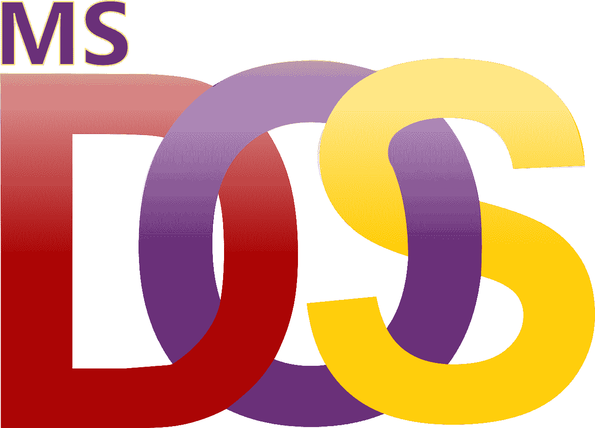
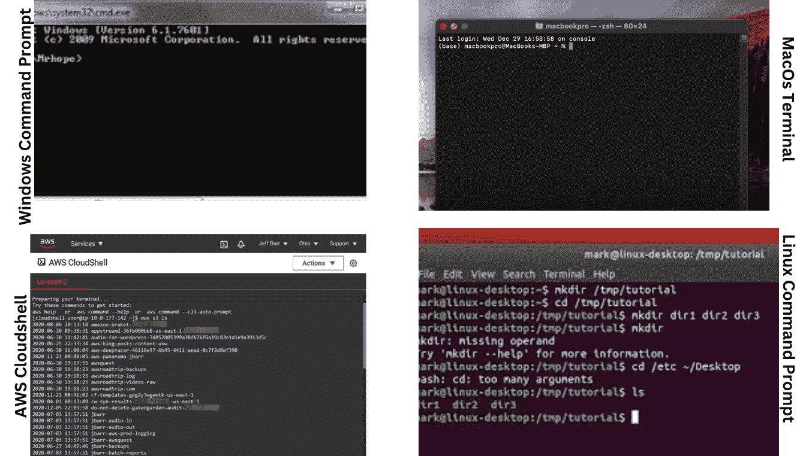
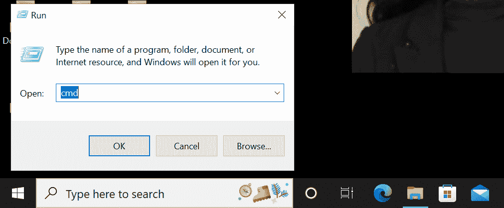
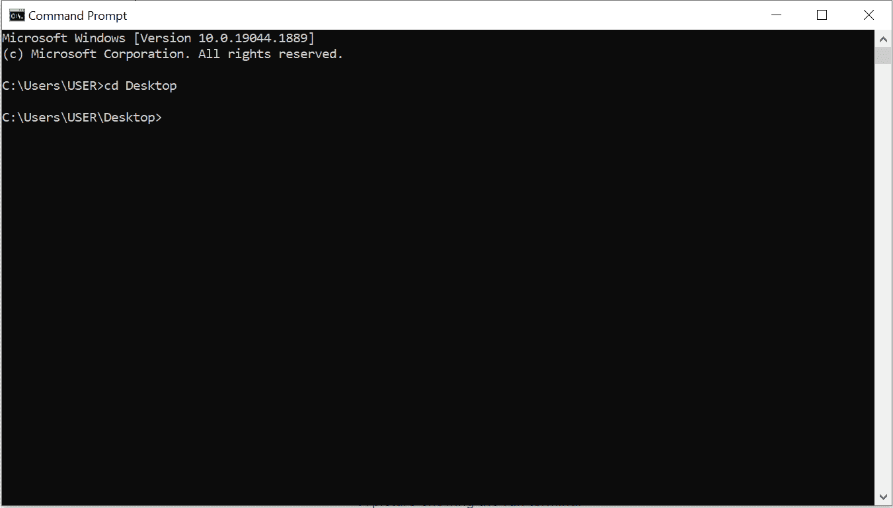
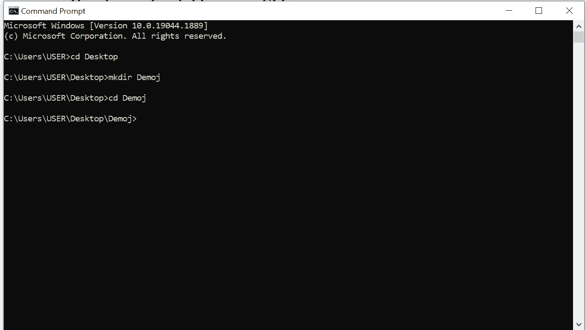
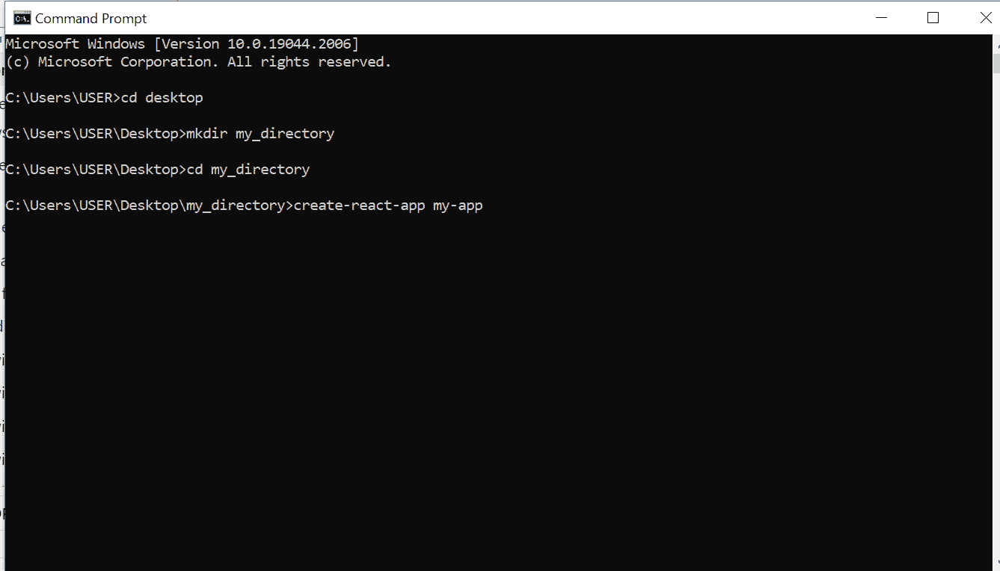
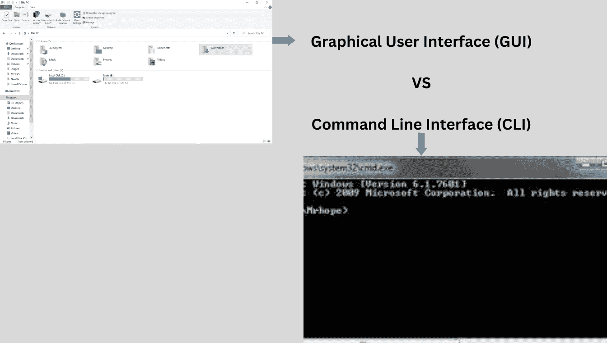

# 如何使用命令行界面–适用于初学者

> 原文：<https://www.freecodecamp.org/news/how-to-use-the-cli-beginner-guide/>

当你进入科技行业时，有很多东西要学。但幸运的是，有一些技能可以跨不同的编程语言、操作系统和工具使用。

知道如何使用命令行界面(也称为命令提示符或终端，取决于您的操作系统)就是这些技能之一。

无论您是从事 Web 开发、游戏开发、应用程序开发、云工程、DevOps，还是从事其他技术领域的工作，您都可能会经常使用命令行。

## 命令行的历史

在计算机的早期，开发人员使用 MS-DOS 在计算机系统中导航。

磁盘操作系统( **DOS** )是一种使用命令(文字)与计算机进行交互的操作系统。

DOS 不使用鼠标指针、图标或任何图形，所以用户只能用文本命令来操作计算机系统。

例如，要转到某个特定的文件夹，您可以键入:

`Cd <name of folder>`

命令行界面(简称 CLI)类似于 DOS，它使用命令来执行各种操作，如创建文件、创建文件夹、安装程序等等。

这些年来的技术进步带来了流行的 GUI(图形用户界面),并使操作系统使用起来不那么紧张。

尽管现在开发人员(和非技术用户)经常使用 GUI，但是不管您的堆栈如何，有时直接从 CLI 工作是有用或必要的。

## 什么是 CLI？是编程语言吗？

Photo by [Angshu Purkait](https://unsplash.com/@angshu_purkait?utm_source=ghost&utm_medium=referral&utm_campaign=api-credit) / [Unsplash](https://unsplash.com/?utm_source=ghost&utm_medium=referral&utm_campaign=api-credit)

如果你是软件开发的新手，很容易被你需要学习的各种术语冲昏头脑。别担心，你不是在参加拼字比赛。相反，你应该学习这些术语指的是什么，它们实际上是如何工作的，以及如何使用它们。

您经常听到的一个术语是命令行界面(也称为命令提示符或终端)。

命令行界面(CLI)是一个基于文本的编辑环境。它使用指定的文本(称为命令)与计算机进行交互，并执行许多操作，包括安装和使用程序。

每个操作系统都有一个内置的命令提示符。一些应用程序包，如 Nodejs、Anaconda、Git 等，也有自己的命令提示符。

AWS、GCP、Azure 等云提供商也是如此。尽管 CLI 在不同的平台或软件包上有不同的名称，但其目的是相同的:让您可以使用基于文本的指令(称为命令)与软件包或计算机系统自由交互。

因此，CLI 是一种工具，而不是编程语言。

CLI 的基础知识将有助于您踏上技术之旅，尤其是如果您从事软件开发的话。事实上，您完全可以构建一个程序，并直接从 CLI 运行它。

本文将:

*   解释 CLI 的工作原理
*   根据您的操作系统帮助您找到您的 CLI
*   向您展示如何使用 CLI 执行基本操作
*   帮助您区分 CLI 和 GUI

## CLI 的工作原理

如前所述，CLI 使用基于文本的指令来执行操作。这些命令有您需要遵循的特定语法，并且某些文本必须写在同一行——否则它会抛出一个错误消息。

对于应用程序包中的 CLI，命令可能与所讨论的包相关。但是所有 CLI 都遵循相同的语义规则，并且在同一行上。

要使用您的 CLI:

*   在您的 PC 中找到 CLI
*   打开它
*   键入您想要的命令
*   按下回车键

在本教程的后面，我们将使用 CLI 执行一些命令，这样您可以更好地理解它是如何工作的。

## 不同操作系统中的命令行

每个操作系统都有默认的命令行界面，不过您可以根据需要选择安装更高级的 CLI。

下面列出了一些操作系统及其各自的 CLI:

*   Windows:命令提示符
*   Linux: Linux Bash Shell
*   MacOs: Mac 终端
*   谷歌云平台:PowerShell、云壳
*   Amazon Web Services: AWS 命令提示符
*   微软 Azure: Azure CLI bash

A picture of Windows command prompt, AWS Cloudshell, MacOs Terminal and Linux Terminal

我目前使用 Windows 操作系统和 Windows 命令提示符，但是我还将向您展示如何基于流行的操作系统找到您自己的终端或命令提示符。

## 如何找到您的 CLI

### 在 Windows 中

您可以使用程序目录或快捷键来访问 Windows 操作系统中的命令提示符。

使用程序目录，转到您的搜索栏(在 Windows 图标旁边)并键入 **cmd。**这将弹出您机器上所有可用命令提示符的列表，包括默认的 windows cmd。你现在可以选择你想要的。

使用键盘快捷键，按键盘上的 **Windows + R** ，在弹出的对话框中输入 **cmd** 。

A picture showing the run terminal

### 在 MacOS 中

与 Windows 的情况一样，您也可以使用程序目录或键盘快捷键在 Mac OS 中打开 CLI。

要使用程序目录，找到发射台并输入**终端**。这会把它带出来。

要使用键盘快捷键，请键入 **cmd** + **空格键**键的组合。

以下是如何找到 MacOs 终端并在目录中创建文件:

[https://player.vimeo.com/video/754058144?h=0ab8fb6b6f&app_id=122963](https://player.vimeo.com/video/754058144?h=0ab8fb6b6f&app_id=122963)

## 如何使用 CLI 执行基本操作

回到数学课，记忆公式并使用这些记忆的公式解方程是非常容易的。但对许多学生来说，知道什么时候在现实生活场景中应用这些方程是很困难的，而且经常会继续如此。

了解 CLI 的位置和工作方式是朝着正确方向迈出的一大步。但是，让我通过在命令提示符下练习简单的操作，向您展示如何开始使用 CLI。

### 如何使用 CLI 浏览您的电脑

在电脑中导航就是从一个文件夹或文件移动到另一个文件夹或文件。如果您不想使用鼠标来定位光标，您可以使用 CLI 在 PC 上移动。

例如在 Windows 中，如果你想打开桌面，采取以下步骤:

1.  按照前面的说明打开 CLI (CMD)
2.  接下来，在命令提示符下键入 **cd Desktop** ,这将带你到你的桌面

请记住，这个命令是针对 Windows 操作系统的(例如，对于 Mac，它会略有不同)。

以下是您将看到的内容:

### 如何使用 CLI 创建文件夹

你可能知道在你的屏幕上点击右键，在下拉菜单中选择“新建文件夹”选项的常用方法。但是有一种使用 CLI 创建新文件夹的方法。

1.  首先，打开您的 CLI
2.  导航到要创建新文件夹的文件夹或位置
3.  输入 **mkdir <新文件夹名称>**
4.  按回车键
5.  您现在可以通过键入**CD<name _ of _ new _ folder>进入文件夹**

### 如何使用 CLI 安装软件包

使用 CLI 安装软件包或应用程序取决于所涉及的软件包。

Node.js 之类的包(一个用于后端开发的开发包)要求您安装节点包管理器(npm)。这个包管理器将用于安装和运行 Node 和其他类似的包。

通过 CLI 安装软件包的一些命令包括:

1.  `Install <name of package>`
2.  `run <name of package`

例如，要安装 React 应用程序的新实例:

*   打开终端

*   通过键入以下命令找到您的本地环境:

`cd Desktop`

*   通过键入以下内容为应用程序创建一个目录:

`cd Desktop mkdir my_directory`

*   使用以下命令在目录中创建 react-app:

`npx create-react-app my-app`

A terminal showing the commands for installing create-react-app using Windows Command Prompt

## CLI 和 GUI 之间的差异

GUI vs CLI image

正如我们所讨论的，CLI 通常使用命令与计算机进行交互。

另一方面，图形用户界面(GUI)是一种使用图标、菜单、鼠标点击和指针与计算机交互的方法。

基于 GUI 的操作系统允许用户通过点击、拖动、放下和其他与计算机交互的可视方法来自由地操作计算机。

与 GUI 不同，CLI 使用较少的 RAM 空间，并直接与操作系统交互。

要使用 GUI，不需要任何编程知识。但是要使用 CLI，您需要具备一定的编程和命令操作知识。

## 结论

当你开始或推进你的技术之旅时，你需要安装许多你本地机器不熟悉的程序。此类程序可能没有 GUI 安装方法，可能需要您在 CLI 上运行一行或更多代码。此时，使用 CLI 的知识就派上用场了。

人们普遍认为 CLI 很难使用，而且确实需要一些时间来适应。但是一旦你熟悉了 CLI 的操作，你会发现它更容易管理。