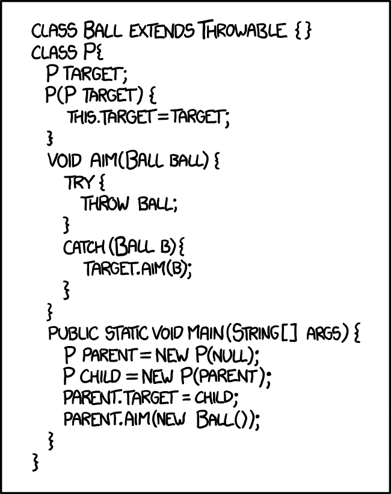

# 学习 Java 编程(版本 17)

> 原文：<https://www.freecodecamp.org/news/learn-java-programming/>

长期以来，Java 一直是最流行的编程语言之一。它被认为是一种通用的、并发的、强类型的、基于类的面向对象语言。

我们刚刚在 freeCodeCamp.org YouTube 频道上发布了一个完整的课程，教你 Java 编程语言。这门课程非常适合初学者。

我们以前发布过 Java 课程，但这是初学者最容易学习的课程之一。您可以在 web 浏览器中完成整个课程。本课程涵盖了比我们之前的课程更新的 Java 版本。

法尔汉·哈辛·乔杜里创立了这门课程。Farhan 是 freeCodeCamp 的一名经验丰富的软件工程师，他擅长为初学者分解编程主题。

After this course you may understand the Java code in this XDCD comic. Or you can just [read an explanation](https://explainxkcd.com/wiki/index.php/1188:_Bonding).

本课程包括以下几个部分:

*   你好世界
*   变量
*   数据类型
*   经营者
*   用线串
*   用户输入
*   条件语句
*   开关盒
*   数组
*   对于循环
*   While 循环
*   做...While 循环
*   数组列表
*   散列表
*   面向对象编程

观看以下全部课程或在 freeCodeCamp.org YouTube 频道观看[(4 小时观看)。](https://youtu.be/A74TOX803D0)

[https://www.youtube.com/embed/A74TOX803D0?feature=oembed](https://www.youtube.com/embed/A74TOX803D0?feature=oembed)