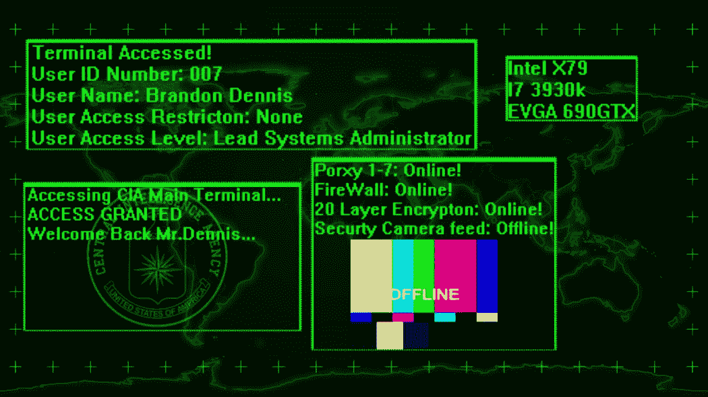

# 什么是黑客？黑客方法论解释道

> 原文：<https://www.freecodecamp.org/news/what-is-hacking/>

是时候学习辉煌的黑客艺术的基础了👨‍💻👩‍💻。

在本文中，您将了解黑客攻击过程的真实情况。希望有一天，你能说出那句名言:“我加入”。

免责声明:这仅用于教育目的。请(顶上有颗樱桃)，不要利用这些知识进行非法活动。有一天我可能会成为把你送进监狱的白帽子之一🙃。谢谢你。

## 黑客是怎么黑的？

Tony Stark attempting to hack S.H.E.I.L.D | Credit: animatedtimes.com

既然您正在阅读这篇文章，我假设您已经了解了什么是黑客的基础知识，那么让我们直接开始吧。

黑客攻击确实没有一个普遍认可的过程，部分原因是有几种不同类型的黑客。但是，我会告诉你大多数黑客(和我自己)遵循的步骤。

它们是:

1.  侦察
2.  列举
3.  剥削
4.  权限提升
5.  后期开发
6.  覆盖轨道
7.  报告写作

我们将详细介绍每一项，以便您对该过程有一个良好的感受。

如果你想更深入地了解白帽(道德)黑客的所作所为，请查看本课程。

## 侦察

A neon themed hollywood hacker | Credit: Wallpaperflare.com

侦察(又名足迹)是第一步，最长，也是最重要的一步。这需要在不与目标直接互动的情况下，尽可能多地获取目标的信息。

在这里，基本的 OSINT(开源智能)技能是黑客最好的朋友。

快速教训:OSINT 是从公共来源收集和分析信息，以获得可操作的情报。国家安全机构、调查记者和黑客合法地收集这些信息，以便分别创建关于目标的措施、故事和档案。

你可以在这里找到 OSINT 框架指南[。](https://osintframework.com/)

recon 最大的资源是互联网，最大的工具是搜索引擎 Google。为了让这变得更容易，Google dorking 是一个很好的起点。在这个意义上，Dorking 意味着使用高级搜索技术来找到更多关于目标的信息，这些信息通常是使用普通方法无法找到的。

其他侦察资源包括:

1.  维基百科(迄今为止最大的百科全书)
2.  社交媒体，如 Instagram、Twitter 和脸书(社交工程师的最佳资源)
3.  who.is(获取网站信息)
4.  sublist3r(列出公开可用的子域)
5.  报纸、广播和电视等媒体

## 列举

Magnifying glass over binary ID fingerprint | Credit: Wallpaperflare.com

这类似于侦察，只不过您通过与目标进行交互来获取有关目标的信息，以便寻找漏洞。

不过，请注意，事情可能会变得更加危险，因为目标可能会发现你试图找出他们的信息，并可能会采取对策来阻止你。

网络枚举涉及端口扫描和网络映射。这有助于您了解目标的操作系统、开放的端口、正在运行的服务及其版本。Nmap(网络映射器)、burp suite 和 exploit-db/searchsploit 是可用于网络枚举的常用工具。

提示:知道服务的版本是发现漏洞的一个很好的方法。旧版本的软件可能有一个已知的漏洞，该漏洞可能位于 exploit-db 站点上。然后，您可以利用这一点来进行攻击。

物理枚举包括通过物理手段获取信息。这可以通过翻垃圾箱(从垃圾中获取凭证和机密信息)和社会工程(T1)来实现。

社会工程是一个相当广泛的话题，稍后会有自己的文章。然而，简单来说，它意味着使用操纵社交技能来黑客攻击人类。

## 剥削

A fake terminal access | Credit: Wallpaperflare.com

攻击包括利用枚举过程中发现的漏洞成功获得对目标的访问权限。

一种常见的利用技术是在利用漏洞后传递有效载荷。简单地说，这就是在目标中找到一个漏洞，然后运行代码或软件来操纵系统，比如 bash shell。

通常被利用的臭名昭著的漏洞是 EternalBlue (Windows)和 Apache log4j (web 服务器)漏洞。

您可以使用的常用工具包括:

1.  Metasploit(大枪🔫)
2.  Burpsuite(用于 web 应用程序)
3.  Sqlmap(用于数据库)
4.  Msfvenom(用于创建自定义有效负载)

快速教训:有效载荷是在漏洞被利用后运行的软件。一旦被利用，目标计算机没有任何东西给你访问。所以你需要一个有效载荷来让你进入并操纵目标。

许多黑客使用的一个非常常见的有效载荷是 meterpreter。它是 metasploit 的一个有效负载，允许您轻松地穿越被入侵的计算机。

## 权限提升

Random Text with “Administrator” | Credit: Wallpaperflare.com

为了理解权限提升，您需要掌握两个概念:

1.  用户帐户
2.  特权

用户帐户是电脑或网络上的描述文件，包含通过用户名和密码访问的信息。

有两种用户帐户:管理员帐户和标准帐户。家庭计算机用户通常只有一个用户帐户，即管理员。相比之下，组织在网络或计算机上有多个帐户，系统管理员有管理员帐户，基本员工有各种标准帐户。

特权是允许您写入、读取和执行文件和应用程序的权限。标准用户对我们需要的关键文件和应用程序没有特权(权限)。但是，管理帐户将拥有所有权限。

升级是指从一个用户帐户转移到另一个用户帐户。这可以是垂直的，也可以是水平的。

垂直升级是指黑客从特权较少的帐户(标准帐户)转移到特权较多的帐户(管理帐户)。

水平升级是指黑客从一个用户帐户转移到一个具有相同权限级别的类似帐户，希望利用新的受威胁帐户执行垂直升级(标准帐户到标准帐户)。

您想要定位的管理用户帐户是 root (Linux)或 Administrator/System (Windows)。这些账户拥有所有的特权，如果你能进入它们，它们实际上是一座金矿，因为你可以绝对控制电脑。

执行权限提升的技术包括:

1.  密码喷射(重复使用密码)
2.  破解密码哈希(查找其他用户的密码)
3.  查找 ssh 密钥(用于水平升级)
4.  滥用 SUID 二进制文件(利用 Linux 中错误配置的特权)
5.  运行工具脚本来寻找升级路径( [enum4linux](https://www.kali.org/tools/enum4linux/) 很好， [PEASS-ng](https://github.com/carlospolop/PEASS-ng) 有一个很棒的套件)

## 后剥削

Code with text “malicious virus” | Credit: Wallpaperflare.com

通常，白帽子会跳到最后一步。但是为了知识的缘故，我将包括这个和下一个。

后期利用是使用工具，目的是获得持久性并从目标计算机获取敏感信息。

这可以通过多种方式实现，包括:

1.  安装永久后门、监听器或 rootkit
2.  安装病毒和特洛伊木马等恶意软件
3.  下载知识产权、敏感信息和个人身份信息(PII)

## 覆盖轨道

An Anonymous themed background | Credit: Wallpaperflare.com

这是再简单不过的事情了，但是如果有一点小小的错误，就有可能成为罪证。恶意黑客必须小心不要留下文件、脚本或任何可以被数字取证专家用来追踪黑客攻击的东西。

在 Linux 中，要做的一些基本事情是删除日志文件和历史文件。meterpreter 有效负载甚至具有删除 Windows 事件管理器上的所有日志的功能。

## 报告

Digital report writing | Credit: Wallpaperflare.com

这是黑客方法的最后一步。它包括写下你所经历的整个过程的基本纲要。

有多种格式，但基本格式包括:

1.  发现的漏洞及其风险级别
2.  漏洞发现方式的简要描述
3.  关于如何补救漏洞的建议

提示:黑客入侵时做笔记非常重要。我在做 CTFs(捕捉旗帜)的时候亲身体会到了这一点。

它不仅使写报告变得更容易，而且还能让你避免重复失败的尝试，轻松地整理信息。他们也让你回头看看你后来做了什么。截图也是一个很棒的主意*。*

## 结论

好了，让我们快速回顾一下黑客方法:

1.  侦察
2.  列举
3.  剥削
4.  权限提升
5.  后剥削
6.  覆盖轨道
7.  报告写作

### 帮助您练习的资源:

1.  [测试您的黑客方法论知识](https://tryhackme.com/room/hackermethodology)
2.  关于如何保护自己免受黑客攻击的提示
3.  [关于 OSINT 的更多信息](https://en.wikipedia.org/wiki/Open-source_intelligence)

### 承认

感谢 [Chinaza Nwukwa](https://www.linkedin.com/in/chinaza-nwukwa-22a256230/) 、 [Holumidey Mercy](https://www.linkedin.com/in/mercy-holumidey-88a542232/) 、 [Georgina Awani](https://www.linkedin.com/in/georgina-awani-254974233/) 以及我的家人，感谢他们的灵感、支持和所使用的知识，使这篇文章得以完成。你们是最棒的。