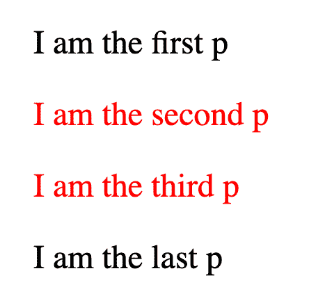
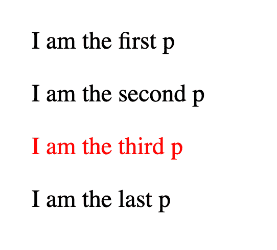
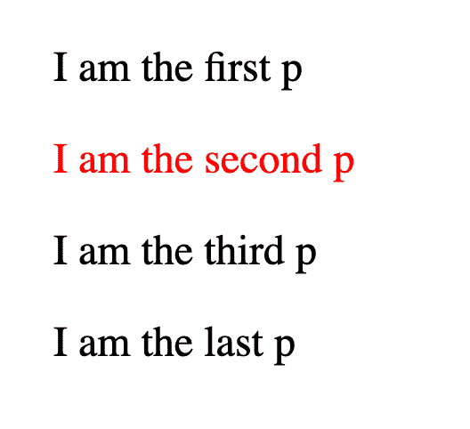
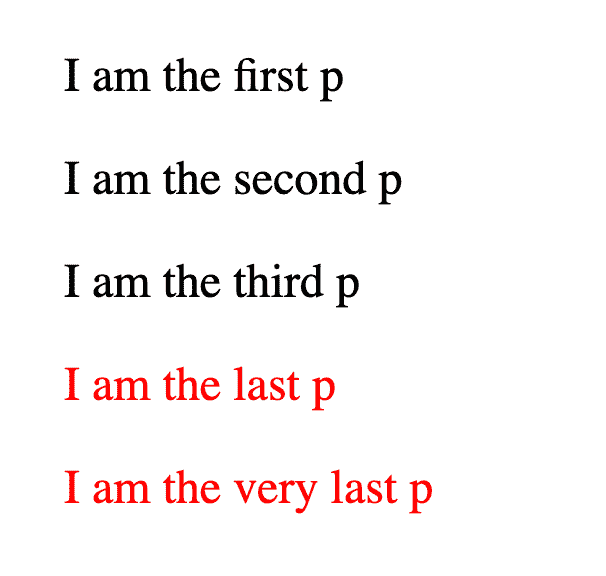
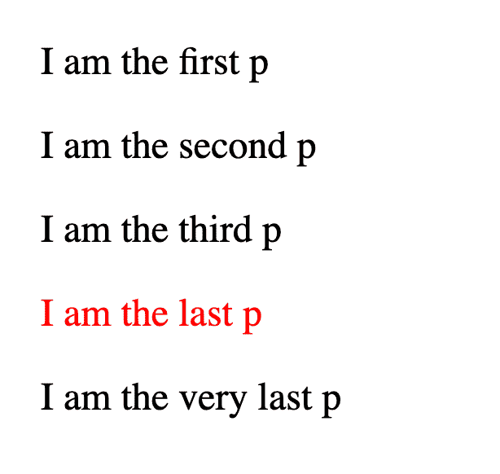

# 如何使用 CSS 组合子来选择和样式元素

> 原文：<https://www.freecodecamp.org/news/css-combinators-to-select-elements/>

组合子允许您组合多个选择器来定位 DOM 中的特定元素。在这篇文章中，我将用例子解释这四个组合子。

在我上一篇关于 [CSS 选择器类型](https://www.freecodecamp.org/news/how-to-select-elements-to-style-in-css/)的文章中，我分享了七种类型的选择器，用于定位你想要样式化的元素。

如果你没有看过那篇文章，我建议你在阅读这篇文章之前先通读一遍。

在本教程中，我将讨论**组合子**，它允许你使用多种选择器类型来选择元素。此选择基于与指定的多个选择器类型相匹配的元素之间的关系。

如果你喜欢的话，这篇文章有一个视频版本。

下面是 CSS 中的四个组合子以及它们是如何工作的。

## 1.如何使用后代组合子

这个组合子允许您选择一个元素，它是另一个元素的后代。这里的“子孙”可以是孩子、孙子、曾孙、玄孙...诸如此类。

要使用这个组合子，您需要在选择器之间输入一个空白的空格，如下所示:

```
.container p {
  color: red;
} 
```

上面的样式声明选择了`p`元素，这些元素是具有 **div** 类的元素的后代。

下面是它如何与下面的 HTML 一起工作:

```
<p>I am the first p</p>

<div class='container'>
    <p>I am the second p</p>

    <div>
        <p>I am the third p</p>
    </div>
</div>

<p>I am the last p</p> 
```

结果是:



从上面的结果，你可以看到第二个和第三个`p`的样式。这是因为它们都是`.container`元素的后代。第二个`p`是直系子女，而第三个`p`是孙辈(`div`的直系子女)，但他们是后代。

您也可以将后代组合子与多个选择器一起使用，如下所示:

```
.container div p {
  color: red;
} 
```

结果是:



如您所见，只有第三个`p`被样式化，因为它是一个`div`元素的后代，而后者又是**容器**类元素的后代。

## 2.如何使用子组合子

后代组合符匹配子代、孙代等等。子组合子选择的元素是另一个元素的直接子元素。

在选择器之间使用大于 T1 的符号( **>** )来指定一个选择器是另一个选择器的直接子代。

这里有一个例子:

```
.container > p {
  color: red;
} 
```

这种样式将选择所有`p`元素，它们是具有**容器**类的元素的直接子元素。让我们看看上面的 HTML 示例是如何工作的:

```
<p>I am the first p</p>

<div class='container'>
    <p>I am the second p</p>

    <div>
        <p>I am the third p</p>
    </div>
</div>

<p>I am the last p</p> 
```

结果是:



如此处所示，只有第二个`p`受到影响。尽管第二个和第三个`p`元素是**容器**类元素的后代，但是只有第二个元素是直接子元素，正如我们在 CSS 中指定的那样。

你也可以像这样使用多个选择器:

```
.container > div > p {
  color: red;
} 
```

这种样式将匹配所有`p`元素，它们是`div`元素的直接子元素，而`div`元素又是**容器**类元素的直接子元素。

## 3.如何使用兄弟组合子

我们已经看了后代，那么兄弟姐妹呢——就像在家庭环境中一样？选择器之间使用的兄弟组合符匹配的元素是另一个元素的兄弟。

要使用这个组合符，您需要输入**波浪号** ( **~** )符号。这里有一个例子:

```
div ~ p {
  color: red;
} 
```

这种样式选择所有与`div`元素同级的`p`元素。假设我们有以下 HTML 代码:

```
<p>I am the first p</p>

<div class='container'>
    <p>I am the second p</p>

    <div>
        <p>I am the third p</p>
    </div>
</div>

<p>I am the last p</p>
<p>I am the very last p</p> 
```

结果是:



最后两个`p`有颜色样式。这是因为`div`(有**容器**类)有这些`p`作为兄弟。

但是，如果您注意到，第一个`p`也是那个`div`的兄弟。那么为什么不定型呢？

这样做的原因是，在我们的 CSS 中，我们像这样使用子组合子:

```
div ~ p 
```

这种选择意味着只选择在 `div`元素之后**的`p`兄弟元素。之前的兄弟姐妹不会受到影响。**

如果选择更改为:

```
p ~ div 
```

然后，它将选择位于 `p`元素之后的**的`div`兄弟元素。**

## 4.如何使用相邻组合子

这个组合子类似于兄弟组合子。不同之处在于，兄弟组合符匹配元素之后的所有兄弟，而相邻组合符只匹配元素之后的直接兄弟。

要使用这个组合子，您可以像这样使用**加** ( **+** )符号:

```
div + p {
  color: red;
} 
```

这种样式会影响`div`元素之后的直接同级`p`元素。假设我们有前面的 HTML 示例:

```
<p>I am the first p</p>

<div class='container'>
    <p>I am the second p</p>

    <div>
        <p>I am the third p</p>
    </div>
</div>

<p>I am the last p</p>
<p>I am the very last p</p> 
```

结果是:



从这个结果可以看出，只有第四个`p`是样式化的。这是因为在我们的 HTML 代码中，`p`元素是`div`元素的直接兄弟。

尽管最后一个`p`也是`div`元素之后的兄弟元素，但它不是`div`的相邻元素。

## 包扎

正如我们在本文中看到的，组合子允许您使用多种选择器类型。基于 DOM 中匹配这些选择器的元素之间的关系，您可以将元素作为样式的目标。

我们看到的组合子是:

*   **后代组合器**:用于选择其他元素的后代元素
*   **子组合符**:用于选择其他元素的直接子元素
*   **兄弟组合符**:用于选择其他元素之后的兄弟元素
*   **相邻组合符**:用于选择其他元素之后的直接兄弟元素

如果你喜欢并从这篇文章中学到了什么，请与他人分享💜。