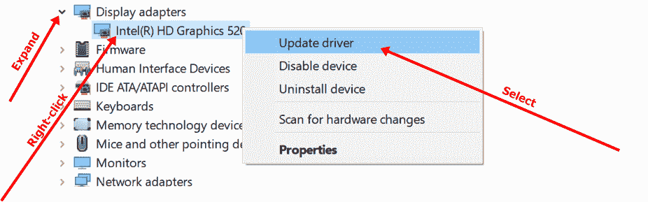
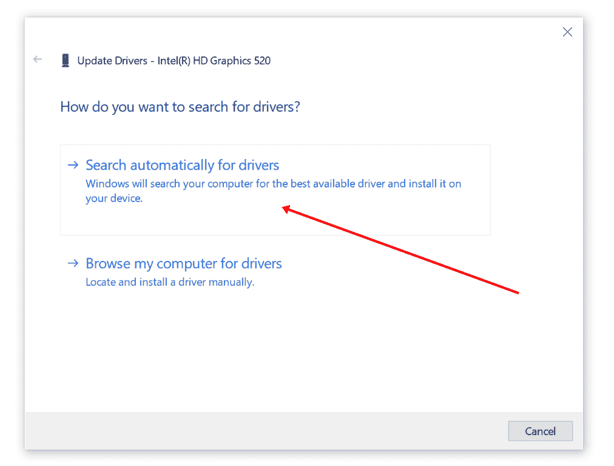
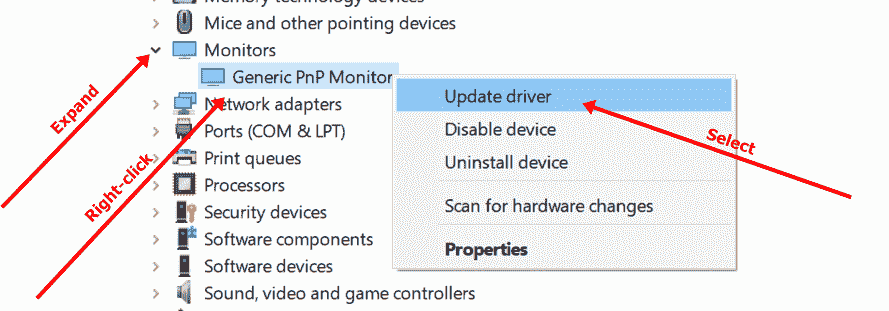

# 通用 PNP 显示器–如何修复 Windows 10 PC 设备驱动程序

> 原文：<https://www.freecodecamp.org/news/generic-pnp-monitor-how-to-fix-windows-10-pc-device-driver/>

您是否购买了一台新显示器，却发现它无法显示您电脑上的任何内容？也可能是显示器突然不工作了？

在许多情况下，此问题是由有故障的通用 PNP 监视器驱动程序引起的。

除了驱动程序问题之外，显示器可能由于电缆连接不当而无法工作。这也可能是因为显示器有故障。

针对此错误，大多数显示器会显示“无信号”或“检查连接电缆”。这给了你一个线索，你应该做的第一件事-检查连接电缆。

## 如何修复 Windows 10 上的通用 PNP 显示器问题

### 确保所有电缆连接正确

首先，确保所有电缆连接正确。如果您使用的是 VGA 或 HDMI 或显示器端口电缆，请查看显示器和电脑上电缆的连接端口，确保它们没有松动。

如果您确定电缆连接正确，但显示器仍然没有显示任何内容，那么您可能需要更换电缆。

如果你一开始用的是 HDMI，换成 VGA 或者显示端口。如果你使用的是显示端口，但显示器仍然没有显示任何东西，那么就切换到 VGA 或 HDMI。

### 如何通过更新驱动程序来修复通用 PNP 监视器

如果您的监视器不工作，那么您应该更新您的显示适配器驱动程序和监视器驱动程序。

#### 如何更新显示适配器驱动程序

要更新显示适配器驱动程序，请右键单击“开始”并选择“设备管理器”,进入设备管理器。

展开显示适配器，右键单击您看到的设备(主要是“英特尔(R)高清显卡……”)，然后选择“更新驱动程序”。

选择“自动搜索驱动程序”,以便您的电脑可以在互联网上查找最新的驱动程序。

如果驱动程序确实不是最新的，您的计算机将下载驱动程序的更新版本，并提示您安装它。

#### 如何更新通用 PnP 显示器驱动程序

再次打开设备驱动程序，展开监视器。右键单击通用 PnP 监视器”并选择更新驱动程序。

PnP 的意思是即插即用。这是您的计算机为它无法识别的显示器安装的驱动程序。

选择“自动搜索驱动程序”。

下载更新的驱动程序后，您的计算机会提示您安装它。

如果您更新了必要的驱动程序，但显示器无法工作，那么这是您的电缆连接问题。这一次，你可能需要一个外部适配器或外部转换器。

### 使用外部适配器或转换器连接电缆

如果您尝试了每一种可能的电缆，但显示器仍然没有显示任何内容，那么这可能意味着您的显示器将无法工作，除非您将**显示适配器**连接到连接到笔记本电脑或系统单元的电缆部分。

在这种情况下，您可以使用几种适配器:

*   VGA 至 HDMI
*   USB 转 HDMI
*   VGA 至显示端口

你可以从你所在地区的任何一家技术商店或者网上买到这些适配器。

大多数情况下，VGA 转 HDMI 或者 VGA 转显示端口都可以。当我遇到同样的问题时，VGA 转 HDMI 适配器对我很有效。

## 最后的想法

我希望这篇文章能帮助你解决显示器的任何问题。

请记住，一旦您更新了必要的驱动程序(显示器驱动程序和显示适配器驱动程序)，显示器仍然无法显示，那么很可能是您的连接电缆有问题。

感谢您的阅读。