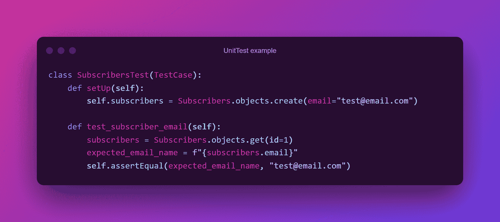
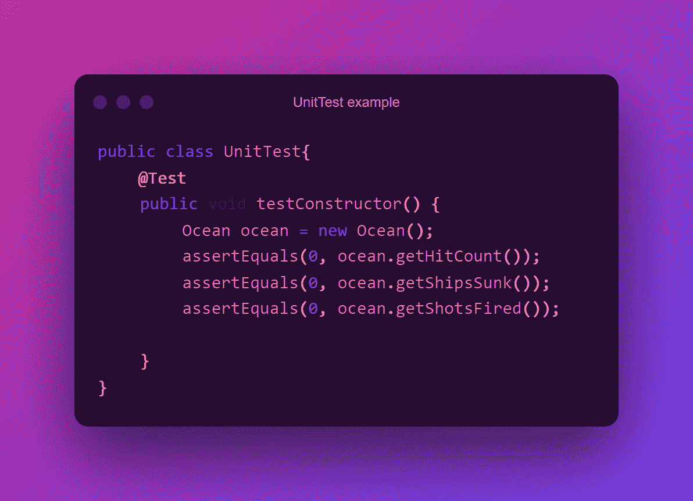

# 什么是软件测试？初学者指南

> 原文：<https://www.freecodecamp.org/news/software-testing-beginners-guide/>

软件测试对开发至关重要。在生产模式下，它可以节省您的时间和金钱。

但是软件测试是一个复杂的话题，可能有点难以理解。

在这篇文章中，我将解释软件测试中的主要话题以及这种实践如何帮助你。

### 目录:

*   [什么是软件测试？](#what-is-software-testing)
*   [软件测试的类型](#types-of-software-testing)
*   [不同类型的功能软件测试](#different-types-of-functional-software-testing)
*   [软件测试原则](#software-testing-principles)
*   为什么需要软件测试？
*   [结论](#conclusion)

## 什么是软件测试？

软件测试是确保你的软件/应用程序正常运行的过程。有多种方法可以用来测试代码，每种测试方法都有不同的要求。

例如，单元测试包括编写测试用例，以确保代码正常工作，测试包括测试软件或应用程序的预览版，以确保用户可以使用该产品。

软件测试是构建良好软件过程中不可或缺的一部分。它还有助于提高生产率和性能。测试是*软件开发生命周期* (SDLC)的重要部分。

测试代码的其他好处包括防止错误、降低成本和减少开发时间。

## 软件测试的类型

有两种通用类型的软件测试:

### 功能测试:

功能测试是一种软件测试方法，它根据客户的要求或规范来验证系统。

这种类型的测试旨在通过提供正确的输入并确保输出正确来测试软件的每个功能。

例如，假设您编写了一个测试用例来测试创建用户。测试用例提供正确的输入(电子邮件、名字、姓氏和密码),并确保输出(成功消息)也是准确的。

功能测试通过模拟基于适用需求的业务场景来检查一切是否正常运行。

### 非功能测试:

非功能测试是一种测试最终用户体验的软件测试方法，比如负载下的性能和可靠性。这可能成就也可能破坏用户体验。

当您的代码在非功能性测试中失败时，它可能不会导致用户注意到的问题，但它可以标记系统中的问题。

非功能性测试只是测试软件，以了解它如何响应系统上的负载。

在本指南中，我们将关注功能软件测试。

## 不同类型的功能软件测试

有不同类型的软件测试，每一种都有特定的目标。我们现在将快速地看一下每一个。

### 单元测试:

单元测试是一种软件测试，它验证每个软件单元是如何执行的，以及特定的代码段是否做了它应该做的事情。单元是应用程序最小的可测试组件。

目的是确认软件代码的每个单元都按预期工作。您在编码(开发)阶段进行单元测试。开发人员边走边写这些测试。

单元测试隔离代码中可能的错误，并帮助您纠正它们。单元可以是单个函数、方法、过程、模块或对象。

Code Snippet of a unit test case in Python

Code Snippet of a unit test case in Java

### 集成测试:

集成测试是帮助确保软件组件或功能正常工作的软件测试。这是单元测试之后的软件测试过程的第二阶段。

在这种类型的测试中，单元或单个软件组件被分组测试。这种测试方法主要集中在暴露集成组件和单元之间交互的缺陷。

### 系统测试:

系统测试包括测试集成软件的过程。目的是评估系统是否符合规定的要求。

在系统测试中，质量保证团队评估应用程序或软件的每个组件如何在一个完整的集成环境中协同工作。

### 验收测试:

验收测试是一种软件测试方法，它测试或检查系统的可接受性。它评估系统与业务需求的兼容性，并评估它是否可以交付。

它也被认为是为适应用户需求、要求和业务流程而执行的正式测试。它决定了一个系统是否满足标准的业务标准，以及用户或客户是否能够接受它。

验收测试是软件测试的最后一个阶段，在系统测试之后，系统可供公众使用之前。

### 回归测试:

回归测试确保在程序中包含附加组件后，组件继续正常工作。当事情发生变化时，比如向程序中添加一个新的模块，就需要执行回归测试。

这种类型的测试代表了对已执行测试用例的完整测试，这些测试用例被重新执行，以确保当前的功能仍然正常工作。

### 阿尔法测试和贝塔测试:

Alpha 测试也称为初始验证测试。这是验收测试的一个方面，在产品交给消费者或用户之前进行。QA(质量保证)测试人员通常会这样做。Alpha 测试由 QA 团队在内部完成。

Beta 测试也称为验证测试的第二阶段。但是这种类型的测试是在外部进行的，也就是说是公众进行的。

这个测试阶段的代码/软件版本被发布给有限数量的用户，以便在实时场景中进行测试。例如，freeCodeCamp 的数学课程可以在这里进行测试。

## 软件测试原则

科技领域的一切都有原则。这些是帮助你构建更好的软件和避免错误的指导方针。

下面是一些在编写代码测试时应该遵循的软件测试原则:

### 测试的目的是显示缺陷的存在，而不是缺失:

软件测试旨在发现软件故障。这减少了故障和错误的出现。

软件测试确保缺陷对开发人员是可见的，但不能保证软件没有缺陷。多种类型的测试甚至不能确保软件没有错误。测试只能减少错误的数量。

### 不可能进行详尽的测试:

详尽测试是针对所有有效和无效的输入和先决条件测试软件的过程。

这种测试方法是不现实的，因为测试用例假设软件是正确的，并且它在每个测试用例中都产生正确的输出。如果你真的试图测试你软件的每个方面和测试用例，那将会花费太多的时间和精力，而且不切实际。

### 执行早期测试:

在早期测试你的软件有助于避免小的错误。当您能够在软件开发生命周期(SDLC)的早期阶段发现错误时，它总是更便宜。最好从项目一开始就开始软件测试。

### 缺陷聚类:

缺陷聚类指的是当你发现的大多数问题只发生在应用程序或软件的少数部分时。如果您能够识别出这些缺陷发生的模块或区域，您就可以将大部分的测试工作集中在它们上面。

在测试你的代码时，记住帕累托原则:80%的软件缺陷往往来自 20%的模块。

### 当心农药悖论:

这一原则基于一个理论——“你在作物上使用的农药越多，作物最终生长的免疫力越强，农药就不会有效。”

当你一遍又一遍地重复特定的测试用例时，你会发现越来越少的新错误。因此，要发现新的 bug，请更新您的测试用例，并在添加新的测试用例后运行它们。

### 测试依赖于上下文:

测试是依赖于上下文的，这意味着你应该根据软件的需求、功能和要求来测试你的软件。

你的测试方法应该取决于你的软件做什么。不是每个软件都需要相同类型/方法的测试，因为每个应用程序都有其独特的功能。

例如，当测试一个电子商务应用程序时，你将关注它显示产品的功能，所以你将测试它如何向最终用户显示产品。在处理 API 时，您将关注 API 在端点被调用时返回的响应。

你不必对两者使用相同的测试用例——这意味着测试是依赖于上下文的。

### 没有错误是一种谬误:

如果你构建了 99%没有错误的软件，但是它没有遵循用户的需求，那么它对于最终用户来说是不可用的。

要知道，你的 99%无错误的软件仍然满足或满足你的用户需求是非常必要的。编写测试用例来发现代码中的错误是很重要的，但是你也需要为你的最终用户测试你的软件(和他们一起，以及他们将如何使用它)。最好的方法是进行 beta 测试。

## 为什么需要软件测试？

除了确保你的软件没有错误并满足用户需求，软件测试还有其他的优势。

### 软件测试提高了安全性:

在构建软件时，安全性是您规划的一个重要部分。这是因为易受攻击的软件可能会危及您的用户及其信息，因为黑客可以使用窃取的信息进行恶意攻击。

当产品经过测试时，最终用户可以相信他们将得到一个可靠的产品，并且他们的详细信息将是安全可靠的。因此，在软件测试的帮助下，用户更有可能获得一个没有漏洞的产品。

### 软件测试提高了产品质量:

您希望您的软件或产品没有 bug，风险低，并且有效地完成它应该做的事情。在构建代码时，您可以通过包含测试用例以及其他测试方法来实现这一点。

此外，你只有在测试之后才会知道你的产品有多好。这有助于您在发布之前提供最佳的产品版本(并在发布过程中发现任何不一致之处或痛点——以便您可以改进它们)。

### 软件测试提高了客户满意度:

例如，假设你下载了一个新的应用程序，并试图使用它的一些功能，但它显示一个错误。这可能会让你感到沮丧，你可能不想再使用这个应用程序，对吗？

这正是软件测试重要的原因。它可以帮助您发现这样的错误，并在您将产品发布给用户之前检测到它们，并给开发人员一个防止错误的机会。

通过在开发阶段的早期投资软件测试，你让用户知道你关心他们的体验。它还能帮助你建立稳固的长期客户关系。

### 软件测试省钱:

软件测试可以帮你节省很多钱——但是怎么节省呢？

开发的每个阶段都涉及许多事情，例如多个团队之间清晰的沟通和协调，并且每个步骤都有可能出错的事情的清单。

在产品上线时发现这些错误是一种可怕的体验，因为您可能不得不处理 PR、重新分配修复任务，并试图实时解决问题。

此外，在您修复应用程序时，您的用户将无法访问该应用程序，这违背了应用程序的目的，同时提供了糟糕的用户体验。软件测试有助于解决这种压力，一旦投入使用，你的用户可以充分享受你的应用/产品。

## 结论

总之，软件测试是开发的关键部分。它可以帮助你的团队省去很多麻烦，而且创建一个用户喜欢并推荐的可用的、无 bug 的产品感觉很棒。

如果你对软件测试感兴趣，可以查看 freeCodeCamp 的 QA 证书课程[这里](https://www.freecodecamp.org/learn/quality-assurance/#quality-assurance-and-testing-with-chai)了解更多关于 QA 测试的知识。QA 测试人员是专注于测试软件和应用程序错误的技术人员。