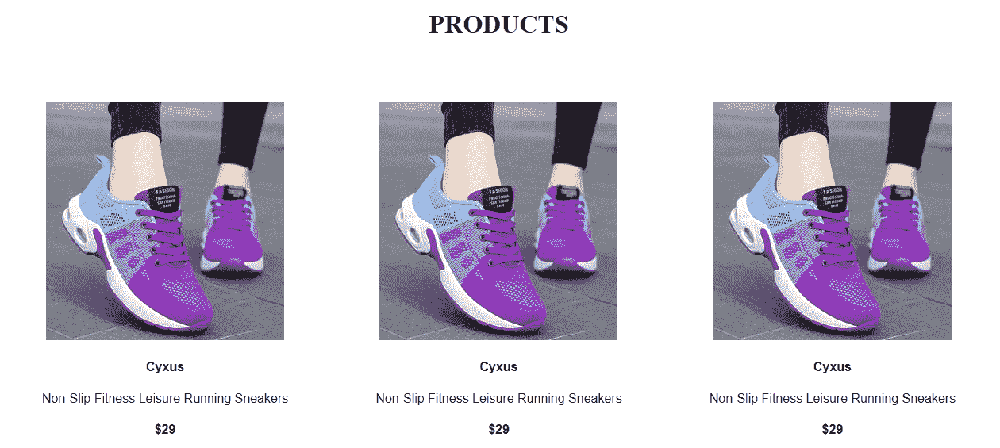

# React.js 中如何使用道具

> 原文：<https://www.freecodecamp.org/news/how-to-use-props-in-reactjs/>

道具是 React 中需要理解的一个重要概念。您使用 props 将数据和值从一个组件传递到另一个组件，以获得动态和唯一的输出。

用 React 构建的网站，如脸书、Twitter 和网飞，在许多部分使用相同的设计模式，只是数据不同。开发人员实现这一功能的主要方式之一是使用 props。

这篇文章将解释什么是道具，我们将看看传递和接收道具的语法。然后，为了进一步加强你对道具的了解，我们将建立一个电子商务网站，向用户展示不同产品的信息。

道具的概念建立在组件的概念之上。因此，为了从这篇文章中获得最大收益，你必须知道如何设置 React 应用程序，并且熟悉 React 组件的工作方式。

## 什么是 React 道具？

React 中的道具是您传递给组件的输入。props 使组件能够访问输入保存的定制数据、值和信息片段。

术语“props”是“properties”的缩写，指的是对象的属性。

正如我在介绍中所说，道具的概念是建立在组件之上的。因此，如果没有组件，我们就无法成功地使用道具。

让我们一起构建和连接我们将在本教程中使用的组件。

下面是父组件的结构:

```
import Product from "./Product"

function App() {
  return (
      <div>
      	<h1>PRODUCTS</h1>
      	<div className="App">
      		<Product />
      	</div>
      </div>
  )
}

export default App
```

App.js

下面是子组件的结构:

```
function Product() {
    return (
      <div>
        
        <h4>Cyxus</h4>
        <p>Non-Slip Fitness Leisure Running Sneakers</p>
        <h4>$29</h4>
      </div>
    );
}

export default Product
```

Product.js

我们的目标是能够向用户展示名称、价格、外观和描述各不相同的所有不同产品。

当然，我们可以通过重新呈现组件来多次重用产品组件。例如:

```
import Product from "./Product"

function App() {
  return (
    <div className="App">
      <Product />
      <Product />
      <Product />
    </div>
  )
}

export default App
```

App.js



Live Output

我们可以看到 React 功能重复一个特定的设计，而不需要编写太多代码。

但是我们还没有达到我们的目标，对吗？虽然我们希望重用该组件，但是我们还希望更新产品的名称、价格、描述和图像，而不必对 Product.js 组件中的任何数据进行硬编码。

这是我们可以在 React 中使用 props 来使我们的数据输出动态化的地方。

## 如何使用 React 道具

在我们深入之前，需要注意的是 React 使用单向数据流。这意味着数据只能从父组件传输到子组件。此外，从父组件传递的所有数据都不能被子组件更改。

这意味着我们的数据将从作为父组件的`App.js`传递到作为子组件的`Product.js`(而不是相反)。

### 如何将道具发送到组件中

属性如何被传递到一个组件类似于属性如何在 HTML 元素中工作。

例如，当您想要将属性传递到 HTML 中的 input 元素时，您将编写属性并将属性值附加到它，就像这样:

```
<input type="text" placeholder="Cyxus" />
```

HTML input elements and attributes

还有，在发送道具(也是属性，可以比作属性)的时候，你把你的值附加在上面。

下面是语法:

```
<ComponentName property1="value" property2="value" property3="value" />
```

在组件标签中，写完组件名称后，我们将为每个属性赋值。

现在让我们使用上面的语法将数据传递给`App.js`组件:

```
<Product
  img="https://ng.jumia.is/unsafe/fitin/300x300/filters:fill(white)/product/82/6142201/1.jpg?2933"
  name="Cyxus"
  desc="Non-Slip Fitness Leisure Running Sneakers"
  price="$29"
/>
```

在上面的代码中，标签中的组件名是`Product`，第一个属性或道具是`img`，其值为`[https://m.media amazon.com/images/W/WEBP_402378T1/images/I/71TR1WrqqJL](https://m.media-amazon.com/images/W/WEBP_402378T1/images/I/71TR1WrqqJL).*AC_UL320*.jpg`。然后我们有第二个属性`name`和第三个属性`desc`(这些也是赋值)。

当我们正确地构造了`App.js`组件后，它现在看起来像这样:

```
import Product from "./Product";

function App() {
  return (
    <div>
      <h1>PRODUCTS</h1>
      <div className="App">
        <Product
          img="https://ng.jumia.is/unsafe/fit-in/300x300/filters:fill(white)/product/82/6142201/1.jpg?2933"
          name="Cyxus"
          desc="Non-Slip Fitness Leisure Running Sneakers"
          price="$29"
        />
      </div>
    </div>
  );
}

export default App;
```

App.js

编写 HTML 属性和传入属性之间有一点小小的区别:HTML 属性是已经为您提供的特殊关键字，您可以在 React 中自定义和定义属性。

例如，我创建了属性；上面的“img”、“名称”、“desc”和“价格”。然后，我在它们旁边附上了道具的价值。

### 如何在 React 中访问和使用道具

组件接收`props`作为函数参数。它通过将参数定义为 props 对象来使用 props 的值。

下面是语法:

```
//the function receives 'props' as a parameter function
function Product(props) {
    return (
      <div>
//it uses the value of props by defining the parameter as props objects
        
        <h4>{props.objectName}</h4>
        <p>{props.objectName}</p>
        <h4>{props.objectName}</h4>
      </div>
    );
}

export default Product
```

让我们将上面的语法与我们的`Product.js`联系起来，将`props`作为参数函数接收，并将 props 定义为对象:

```
//the function receives 'props' as a parameter function
function Product(props) {
    return (
      <div>
//it uses the value of props by defining the parameter as props objects
        
        <h4>{props.name}</h4>
        <p>{props.description}</p>
        <h4>{props.price}</h4>
      </div>
    );
}

export default Product
```

Product.js

我们已经成功地将传递到 Product.js 组件中的数据动态化。

要重用“Product.js”组件来显示其他产品的数据，我们需要做的就是在重新呈现组件时附加新的数据或值。

下面是它的语法:

```
 <ComponentName property1="valueA" property2="valueB" property3="valueC" />
<ComponentName property1="valueD" property2="valueE" property3="valueF" />
<ComponentName property1="valueG" property2="valueH" property3="valueI" />
```

现在让我们将上面的语法与我们的`App.js`联系起来:

```
import Product from "./Product";

function App() {
  return (
    <div>
      <h1>PRODUCTS</h1>
      <div className="App">
        <Product
          img="https://ng.jumia.is/unsafe/fit-in/300x300/filters:fill(white)/product/82/6142201/1.jpg?2933"
          name="Cyxus"
          desc="Non-Slip Fitness Leisure Running Sneakers"
          price="$29"
        />
        <Product
          img="https://ng.jumia.is/unsafe/fit-in/300x300/filters:fill(white)/product/01/241417/1.jpg?6747"
          name="Vitike"
          desc="Latest Men Sneakers -Black"
          price="$100"
        />
        <Product
          img="https://ng.jumia.is/unsafe/fit-in/300x300/filters:fill(white)/product/06/4410121/1.jpg?4437"
          name="Aomei"
          desc="Men's Trend Casual Sports Shoe"
          price="$40"
        />
      </div>
    </div>
  );
}

export default App;
```

App.js

上面代码的实时输出现在显示每个产品特有的图像、名称和描述。

以下是实时输出:


[See live output here](https://ekezwh.csb.app/)

[这里的](https://codesandbox.io/s/ekezwh?file=/src/App.js)是本文中项目使用的代码，可以随意与你的代码进行比较。

## 在 React 中解构道具

现在我们已经实现了我们想要的功能，让我们通过使用析构来格式化我们的`Product.js`。这是 JavaScript 的一个特性，涉及到将对象或数组中的数据片段分配给一个单独的变量，以便该变量可以保存来自数组或对象的数据。

道具就是物件。因此，要在 React 中析构对象，第一步是在一组花括号内对属性进行分组。然后，您可以将它存储到函数体内名为`props`的变量中，或者直接将其作为函数的参数传递。

第二步是通过陈述属性的名称而不附加前缀“props ”,在您需要的地方接收属性。

下面是 React 中两种析构方法的示例:

```
 function Product = (props) => {
//First Step: Destructuring within the body of the function
    const { img, name, desc, price} = props ;
    return (
      <div>
  		
//Second Step: receive the properties where you need them by stating the names of the properties without attaching the prefix ‘props.’
        <h4>{name}</h4>
        <p>{description}</p>
        <h4>{price}</h4>
      </div>
    );
}

export default Product
```

```
//First Step: Destructuring within function's parameter
function Product = ({ img, name, desc, price}) => {
    return (
      <div>
  		
//Second Step: receive the properties where you need them by stating the names of the properties without attaching the prefix ‘props.’
        <h4>{name}</h4>
        <p>{description}</p>
        <h4>{price}</h4>
      </div>
    );
}

export default Product
```

React 中的析构使我们的代码更易读、更简洁。请注意，我在上面演示的两种析构方法将总是有相同的输出。

## 结论

本文解释了 props 如何在 React 中工作，这将帮助您编写具有动态数据输出的网页。

利用这些知识来制作很酷的东西！在 Twitter 上与我联系[@ joypats](https://twitter.com/JoyPaces)。