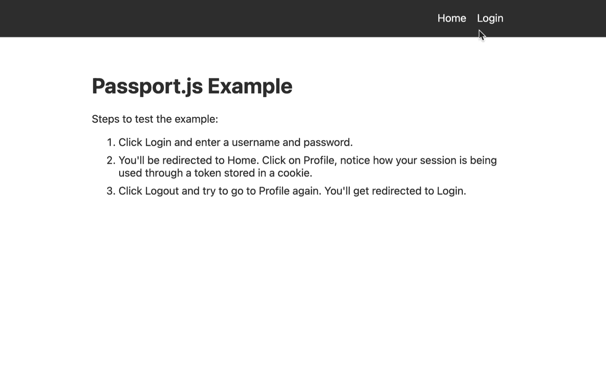

# 如何使用 Passport.js 认证 React 应用程序

> 原文：<https://www.freecodecamp.org/news/react-passport-authentication/>

身份验证是任何严肃的 React 应用程序的主要部分。您需要有一个好的、可靠的方法来验证您的开发人员工具带中的用户。

如今有几十种身份认证解决方案可供选择，其中许多都有价格标签。你应该选择哪一个？

在本教程中，我们将了解如何使用行业标准库 Passport.js 免费为 React 应用程序添加身份验证。

最后，您将理解 Passport 在实际项目中是如何工作的，此外，您还将拥有能够在未来的 React 项目中设置身份验证的所有初始代码。

想要一个学习 React 的好资源吗？用我的 **[React Bootcamp](https://reactbootcamp.com/)** 每天 30 分钟成为 React pro。

## 为什么要用 Passport.js？

Passport.js 是一个久经考验的库。多年来，它一直是 Node.js 应用程序中身份验证的首选解决方案，每周下载量超过 170 万次。


The Passport.js Node Library

它允许您的用户免费使用电子邮件和密码轻松注册。此外，Passport 还让我们能够使用不同的身份验证策略，例如通过 Google 或 Twitter 进行社交登录，以及其他数百种选择。

您可以将身份验证视为用户的重要网关。在许多情况下，您需要身份验证，不仅要将应用程序的普通用户和严肃用户区分开来。身份验证用于为不同类别的用户提供必要的体验。

## 为什么不使用专门的(付费)认证服务？

需要对用户进行身份验证是一个非常普遍的问题，但这并不意味着这是一个容易解决的问题。

事实上，这就是为什么出现了如此多的公司，如 Auth0、Clerk.dev、Okta 和许多其他公司，来提供身份验证即服务。在许多开发人员看来，获得正确的身份验证是有代价的。

幸运的是，对于我们这些 JavaScript 和节点开发人员来说，我们在 Passport.js 中有一个很棒的库，它允许我们非常容易地在节点环境中建立身份验证。

我们将看看 Passport.js 在 React 应用程序中的完整集成，并逐行分析它的工作原理。

## 下载项目代码

要从官方的 Next.js GitHub 获得完整的代码，你可以[去下面的 repo](https://github.com/vercel/next.js/tree/canary/examples/with-passport) 找 NPM 或者 Yarn。

这将为您提供我们将查看的所有项目文件，此外，它还将为您在下一个 React 项目中使用 Passport.js 提供一个理想的模板。

我建议你从[https://github.com/vercel/next.js](https://github.com/vercel/next.js)下载完整的示例文件夹，并抓取带护照的文件夹。自述文件中包含的模板脚本包含损坏的代码。



Passport App Demo

## Passport 本地策略如何运作

要开始在您的项目中使用 Passport，您需要安装主`passport`库以及一个特定的策略。

**策略**是用户验证自身身份的不同方法。Passport Local 是 Passport 提供的策略，使用户能够以最传统的方式(使用电子邮件和密码)注册和登录。

这两者都包含在`package.json`文件中。

如果你查看 lib 文件夹，你可以看到`passport-local`是如何设置的。

```
// /lib/password-local.js

import Local from 'passport-local'
import { findUser, validatePassword } from './user'

export const localStrategy = new Local.Strategy(function (
  username,
  password,
  done
) {
  findUser({ username })
    .then((user) => {
      if (user && validatePassword(user, password)) {
        done(null, user)
      } else {
        done(new Error('Invalid username and password combination'))
      }
    })
    .catch((error) => {
      done(error)
    })
})
```

在`password-local.js`文件中，创建了一个策略，负责根据用户名查找用户并验证其密码。如果找到用户，将通过`done`回调返回。否则，将会抛出一个错误。

如果你查看`/pages/api`，你会看到所有使用 passport 的服务器相关代码。文件名对应于您将需要的操作:登录、注销和注册。

## 如何用 Passport 注册用户

如果您看一下注册文件，它只是根据请求体上提供的数据创建一个用户，并随请求一起传递。

```
// /pages/api/signup.js

import { createUser } from '../../lib/user'

export default async function signup(req, res) {
  try {
    await createUser(req.body)
    res.status(200).send({ done: true })
  } catch (error) {
    console.error(error)
    res.status(500).end(error.message)
  }
} 
```

完成后，服务器会响应一个 200 成功代码，这意味着您的用户已经用他们提供的电子邮件和密码创建好了。

如果您回到 lib 文件夹，进入 user.js，您可以看到这个`createUser`函数是如何工作的:

```
// /lib/user.js

const users = []

export async function createUser({ username, password }) {
  // Here you should create the user and save the salt and hashed password (some dbs may have
  // authentication methods that will do it for you so you don't have to worry about it):
  const salt = crypto.randomBytes(16).toString('hex')
  const hash = crypto
    .pbkdf2Sync(password, salt, 1000, 64, 'sha512')
    .toString('hex')
  const user = {
    id: uuidv4(),
    createdAt: Date.now(),
    username,
    hash,
    salt,
  }

  // This is an in memory store for users, there is no data persistence without a proper DB
  users.push(user)

  return { username, createdAt: Date.now() }
}
```

`createUser`获取用户名和密码，**对密码进行哈希运算**，这样密码就可以安全保存，而不是以纯文本的形式保存。然后，将创建的用户添加到用户数组中。

如果您将一个数据库连接到这个项目，这是您实际上在您的数据库中创建一个新用户并用`users.push`替换它的地方

## 如何使用 Passport 登录用户

如果你看看你的应用程序是如何工作的，在注册并创建你的用户后，用户必须登录。当用户登录时，他们向`/api/login`发出请求。

这就是 Passport 实际介入并为您进行身份验证的地方。在这个例子中，我们使用`next-connect`库在 POST 请求发出之前初始化 passport(在提交登录表单时)。

```
// /api/login.js

passport.use(localStrategy)

export default nextConnect()
  .use(passport.initialize())
  .post(async (req, res) => {
    try {
      const user = await authenticate('local', req, res)
      // session is the payload to save in the token, it may contain basic info about the user
      const session = { ...user }

      await setLoginSession(res, session)

      res.status(200).send({ done: true })
    } catch (error) {
      console.error(error)
      res.status(401).send(error.message)
    }
  })
```

登录端点从您的前端接收数据。当使用用户的凭证(即电子邮件和密码)发出 POST 请求时，它使用 passport 中的 authenticate 函数来验证您的请求。

然后，另一个函数`setLoginSession`负责为带有包`@hapi/iron`的登录用户创建一个会话。

```
// /lib/auth.js

import Iron from '@hapi/iron'
import { MAX_AGE, setTokenCookie, getTokenCookie } from './auth-cookies'

const TOKEN_SECRET = process.env.TOKEN_SECRET

export async function setLoginSession(res, session) {
  const createdAt = Date.now()
  // Create a session object with a max age that we can validate later
  const obj = { ...session, createdAt, maxAge: MAX_AGE }
  const token = await Iron.seal(obj, TOKEN_SECRET, Iron.defaults)

  setTokenCookie(res, token)
}
```

这将负责为您的用户创建一个 cookie，现在可以使用它来识别用户，并在以后的请求中对他们进行身份验证，直到 cookie 过期或用户注销。

如果用户完成登录过程，他们将被重定向到主页。这是因为在你的登录页面中有一个叫做`useUser`的特殊钩子。

```
// /pages/login.js

const Login = () => {
  useUser({ redirectTo: '/', redirectIfFound: true })

  // ...
}
```

`useUser`向`/api/user`端点发出请求。在这个端点中，它负责从发出的请求中获取会话，并根据会话找到用户，最后返回该用户。

```
// /api/user.js

import { getLoginSession } from '../../lib/auth'
import { findUser } from '../../lib/user'

export default async function user(req, res) {
  try {
    const session = await getLoginSession(req)
    const user = (session && (await findUser(session))) ?? null

    res.status(200).json({ user })
  } catch (error) {
    console.error(error)
    res.status(500).end('Authentication token is invalid, please log in')
  }
}
```

对于这个请求，我们使用包`swr`，它允许我们使用一个方便的钩子`useSWR`来发出 GET 请求。

当用户数据被发送回`useUser`钩子时，它根据所提供的`redirectTo`属性将用户重定向到给定的路由。因为这被设置为正斜杠，它会将你的用户重定向到主页。您可以将该属性的值更改为您希望用户登录后立即访问的任何页面，而不是停留在登录页面上。

## 如何用 Passport 注销用户

最后，Passport 在这个应用程序中负责的最后一个操作是注销用户。幸运的是，注销它们就像删除您在登录时创建的 cookie 一样简单。

您注销您的用户并删除服务器端的 cookie。您可以通过向`/api/logout`发出 GET 请求来做到这一点。

```
// /api/logout

import { removeTokenCookie } from '../../lib/auth-cookies'

export default async function logout(req, res) {
  removeTokenCookie(res)
  res.writeHead(302, { Location: '/' })
  res.end()
}
```

在其中，您使用函数`removeTokenCookie`删除您在创建会话时创建的 cookie。这样做之后，使用服务器端重定向将用户重定向回主页。

## 如何更好地认证用户

一般来说，要很好地理解 Passport 和身份验证，最好的方法是使用它。只要你是一个开发人员，它将是一个必不可少的组件来理解和实现。

除了我在这里的解释，一定要自己运行这个应用程序。试着注册、登录和注销用户，这样您就可以很好地理解在对他们进行身份验证时实际发生了什么。

我希望这个项目可以作为任何 React 应用程序的一个好的起点，在这个应用程序中，您可以使用身份验证。如果您想将此示例扩展到电子邮件和密码验证之外，请务必查看 Passport 的网站，了解您的用户可以用来登录的所有 500 多种可用策略。

## 想成为一名工作就绪的 React 开发人员吗？

如果你喜欢这个 React 教程，看看我的 [React 训练营](https://reactbootcamp.com)。

它将为您提供所需的所有培训:

*   每天只需 30 分钟，就能从完全的初学者变成专业的反应者
*   从零开始到部署，构建 4 个全栈 React 项目
*   了解构建您喜欢的任何应用程序的强大技术堆栈

[](https://reactbootcamp.com) 
*点击加入 React 训练营*