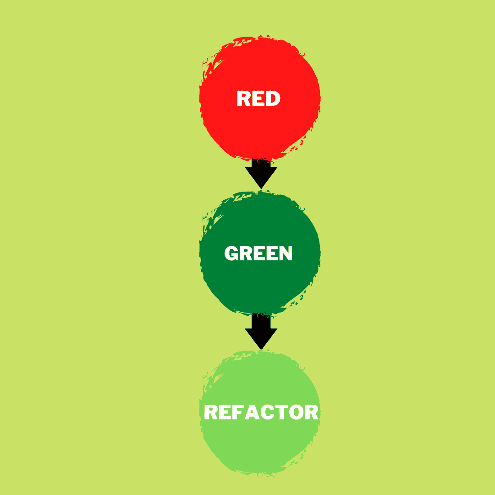
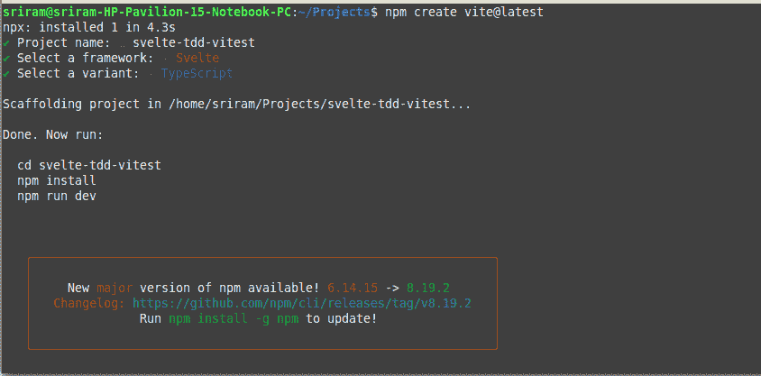
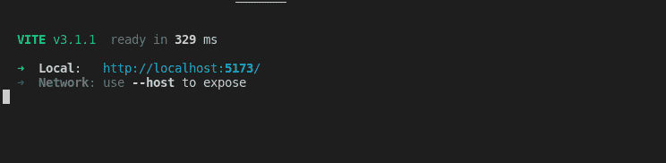
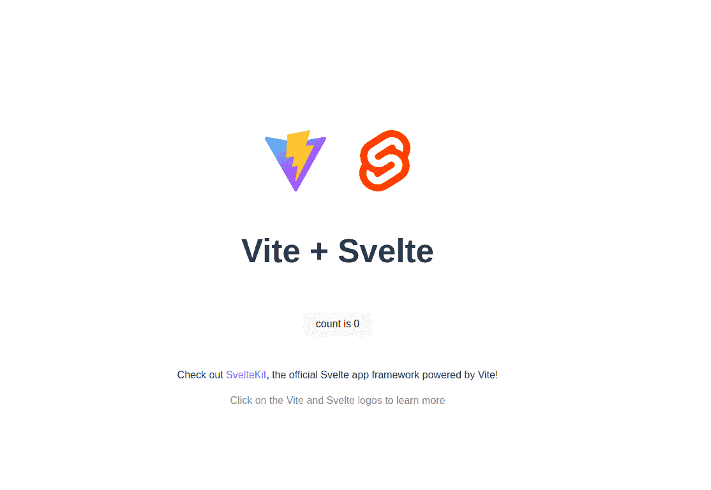
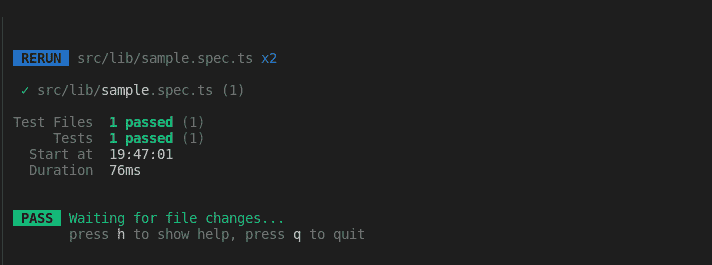
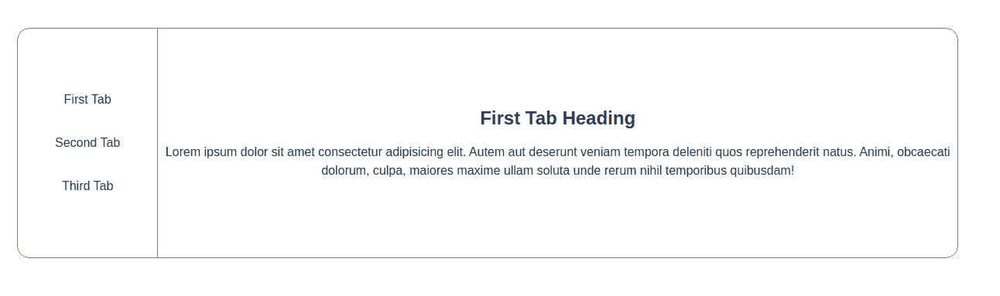
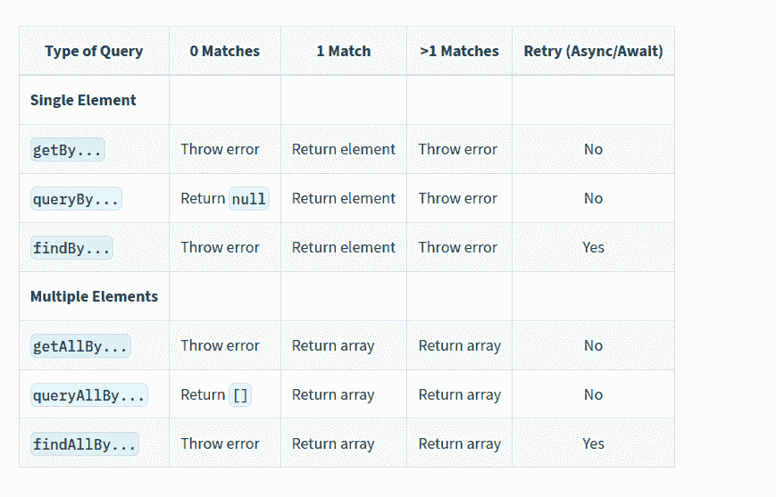
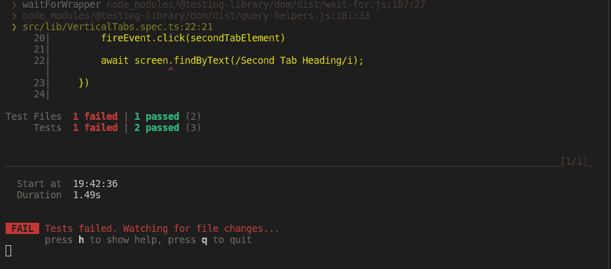
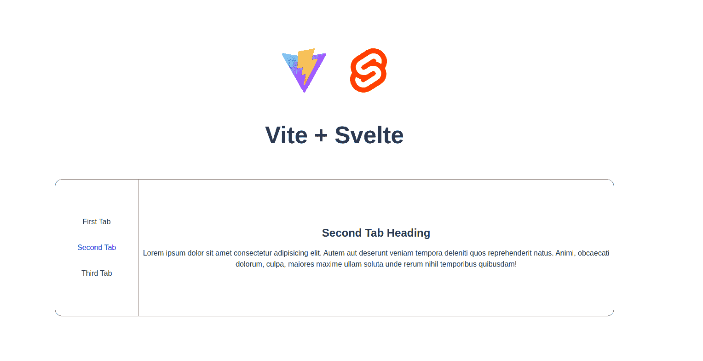
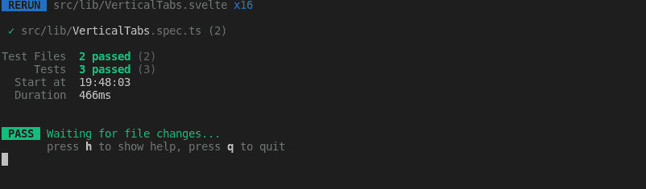

# 如何使用 Svelte 和 Vitest 进行测试驱动开发——基于项目的教程

> 原文：<https://www.freecodecamp.org/news/how-to-do-test-driven-development-with-svelte-and-vitest/>

测试驱动开发(TDD)是确保你的代码是高质量的并且像预期的那样工作的最好方法之一。它还可以帮助您在连续部署期间创建可靠的版本。

在这篇文章中，我们将学习如何使用 TDD 方法创建一个苗条的应用程序。

## 我们正在建造的东西

我们将构建一个垂直标签组件，我们可以在三个标签之间切换。我们将通过首先编写测试用例，然后开发组件功能来构建这个组件，以使测试更加有效。


Final implementation

## 先决条件

我将解释创建一个应用程序所需的所有步骤，你可以跟随代码。如果你对本教程有基本的编程知识和 HTML、CSS 的基础知识，那就太好了。

此外，您需要安装 Node.js。如果您还没有，您可以在这里查看如何操作。

## 什么是测试驱动开发？

测试驱动开发(TDD)的基本思想是在实现实际功能之前编写测试。这有助于你清楚地了解你在开发什么，以及它是如何工作的。

您首先看到测试失败，然后编写代码使其通过。这确保了您的代码中没有假阳性测试。

TDD 是一种可以应用于任何编程语言的方法。当开发包含易于测试的业务逻辑的后端应用程序时，这种情况更为普遍。

好消息是，您也可以应用类似的技术测试您的前端应用程序。

## TDD 的三个阶段

TDD 的三个阶段是:

1.  红色阶段——编写测试，看着它失败
2.  绿色阶段–编写通过测试所需的最少代码
3.  重构——清理并重构代码，使其更加健壮



Three stages of TDD

## 什么是 Vitest？

Vitest 是一个新兴的测试框架，具有与 Jest 相似的功能。

因为我们在本教程中使用 Vite 作为 Svelte 的构建工具，所以 Vitest 与 Vite 有很好的集成，并且提供了一个类似的测试环境，而不需要额外的配置。

## 如何创建一个苗条的应用程序

我们将使用 Vite 作为构建工具来创建一个苗条的应用程序。您可以使用以下命令来实现:

```
npm create vite@latest 
```

这将创建一个新项目，您可以按照以下步骤创建和设置该项目:

1.  输入项目的名称。这也将创建一个具有项目名称的新文件夹。在这个例子中，我将添加项目名为`svelte-tdd-vitest`。
2.  您可以在下一步中选择框架。让我们选择`svelte`作为框架。
3.  然后就可以进入框架的变体了。我们可以为本文选择`TypeScript`变体。如果你不习惯使用 TypeScript，你也可以在这个选项中选择`JavaScript`。



Initialise Svelte project with Vite

然后，您可以按照终端中提供的有用步骤来安装依赖项并启动应用程序。运行以下命令:

```
cd svelte-tdd-vitest
npm install
npm run dev
```

`npm install`将安装项目的依赖项。

`npm run dev`将启动开发服务器。您应该看到应用程序在终端中指定的端口上运行。



Vite Server started using npm run dev

恭喜，你现在可以在浏览器中看到 starter 应用程序了。您可以在您最喜欢的代码编辑器中打开项目并开始工作。



## 如何设置 Vitest

您可以立即将 Vitest 作为开发依赖项添加到项目中。这意味着 Vitest 不会打包到应用程序的生产构建中，因为您将在本地环境中运行测试。

```
npm install -D vitest
```

Vitest 可以读取`vite.config.js`文件中 Vite 的配置，准备类似于构建环境的测试环境。这使得测试更加可靠。因此，您可以重用 Vite 配置文件，并为 Vitest 的配置添加更多选项。

您还可以通过在项目根目录下创建一个名为`vitest.config.js`的新文件来覆盖 Vitest 的配置。现在，创建一个名为`vitest.config.js`的新文件:

```
import { defineConfig } from 'vitest/config'
import { svelte } from '@sveltejs/vite-plugin-svelte'

export default defineConfig({
  plugins: [
    svelte({ hot: !process.env.VITEST }),
  ],
  test: {
    environment: 'jsdom',
  }
}) 
```

vitest.config.js

我们正在向文件中添加一些配置

1.  当测试运行时，我们禁用 Svelte 的热模块重新加载。
2.  我们将运行测试的环境定义为`jsdom`。它有助于模仿 DOM API 并以可靠的方法运行测试。

为了使用`jsdom`,您还需要将它添加为一个开发依赖项。因此，让我们使用终端安装这个包。

```
npm install -D jsdom
```

安装完成后，让我们向`package.json`文件添加几个脚本，从`npm`命令行开始 Vitest 测试:

```
"scripts": {
	...
	"test": "vitest",
    	"coverage": "vitest run --coverage"
}
```

## 如何创建第一个测试

现在您已经拥有了编写第一个测试所需的所有设置。在`lib`目录中创建一个名为`sample.spec.ts`的新文件。

```
import {describe, test, expect } from 'vitest';

describe("Example File", () => {
    test("Sample test", () => {
        expect(1 + 3).equal(4);
    });
}); 
```

sample.spec.ts

让我们来分解用来创建这个测试文件的不同函数:

1.  `describe`–您可以使用它将相似的测试分组在一起，并在生成报告时对测试进行基准测试。它接受一个名称和一个包含测试组的函数。
2.  `test`–代表单一测试。它可以包含多重期望。它是通过传递测试名称和运行测试的函数来创建的。
3.  `expect`–代表您正在测试的表达式。

基于您正在测试的内容，有多种不同的方法来编写您的测试。你可以在[官方 API 参考](https://vitest.dev/api/)里看看完整的 Vitest 的 API。

让我们使用以下 npm 命令运行测试:

```
npm run test
```



Running the test

## 如何添加全局测试配置

您将在测试文件中大量使用`describe`、`test`和`expect`函数，在所有测试文件中导入它们可能会很冗长。因此，Vitest 有一个很好的配置，您可以在其中设置这些全局导入，因此您不必将它们添加到每个文件中。

所以让我们用这个配置更新`vitest.config.js`文件:

```
export default defineConfig({
  ...
  test: {
    ...
    globals: true
  }
}) 
```

vitest.config.js

在您的配置中添加了这个`globals` equals true 行之后，您现在可以删除 spec 文件中的导入。

如果您正在使用 TypeScript，您的 TypeScript 编译器将在您的 spec 文件中报错。您可以通过在您的`tsconfig.json`文件中添加下面一行来解决这个问题:

```
{
  "extends": "@tsconfig/svelte/tsconfig.json",
  "compilerOptions": {
    ...
    "types": ["vitest/globals"]
  },
} 
```

tsconfig.json

现在你的测试可以看起来像这样。对于这个小文件来说，这并不是一个很大的升级，但是当您有很多 spec 文件时，这个配置更改是很有用的。

```
describe("Example File", () => {
    it("Sample test", () => {
        expect(1 + 3).equal(4);
    });
}); 
```

sample.spec.ts

## 如何创建一个苗条的组件

我们将创建一个名为`VerticalTabs.svelte`的新的瘦组件。要求是创建一个可以包含几个项目的垂直选项卡组件，并让用户能够选择一个特定的选项卡，以在右侧查看其内容。

该组件将分为两部分。左侧显示所有选项卡。右侧显示基于选项卡的内容。

让我们创建组件所需的基本 HTML 和 CSS 样式。在编写测试之后，我们将添加切换选项卡的功能。

```
<div class="vertical-tab-container">
    <ul class="vertical-tab">
        <li>First Tab</li>
        <li>Second Tab</li>
        <li>Third Tab</li>
    </ul>

    <div class="vertical-tab-content">
        <h2>First Tab Heading</h2>
        <p>Lorem ipsum dolor sit amet consectetur adipisicing elit. Autem aut deserunt veniam tempora deleniti quos reprehenderit natus. Animi, obcaecati dolorum, culpa, maiores maxime ullam soluta unde rerum nihil temporibus quibusdam!</p>
    </div>
</div>

<style>
    .vertical-tab-container {
        display: flex;
        flex-direction: row;
        align-items: center;
        border: 1px solid gray;
        border-radius: 1rem;
    }

    .vertical-tab {
        margin: 0px;
        padding: 3rem;
        list-style: none;
        border-right: 1px solid gray
    }

    .vertical-tab li {
        margin: 2rem 0;
    }

    .vertical-tab-content {
        flex:1
    }
</style>
```

VerticalTabs.svelte

在这段代码中，您将添加一些简单的元素，比如一个无序列表，以显示选项卡列表。您将在`<style>`标签中对其进行样式化，该标签将成为该组件的本地 CSS。

然后，添加`<h2>`标签来显示选项卡标题，添加一个段落标签`<p>`来显示选项卡的更多虚拟文本。您正在使用`flex`并排显示两个项目，内容上的属性`flex: 1`将使容器占用所有剩余的可用空间来扩展。

该组件应该类似于下图:



Vertical Tab initial

## 如何在测试中安装超薄组件

现在，您需要为组件创建第一个测试，方法是安装 svelte 组件，然后检查是否可以在组件中找到“First Tab”文本。

因此创建一个名为`VerticalTabs.spec.ts`的新规范文件:

```
import VerticalTabs from "./VerticalTabs.svelte";

describe("VerticalTabs Component", () => {

    test("should render the component", () => {
        // Create a new container for the test
        const host = document.createElement('div');

        // Append the new container in the HTML body
        document.body.appendChild(host);

        // Create an instance of the vertical tab
        const instance = new VerticalTabs({ target: host });

        // Check if the instance has value
        expect(instance).toBeTruthy()

        // Test if we can find the "First Tab Heading"
        expect(host.innerHTML).toContain("First Tab Heading")

    });

})
```

VerticalTabs.spec.ts

为了安装这个苗条的组件，你需要首先创建一个`div`容器并将这个`div`附加到 HTML 文档的`body`上。然后，您需要将您的组件连接到`div`。然后，您可以测试主容器的`innerHTML`,看看您是否拥有所需的内容。

现在这个测试应该通过了，因为组件中显示了`First Tab Heading`内容。

在所有步骤中经历这个漫长的过程可能会被证明是困难的。因此，让我们添加另一个包，使这项工作更容易。这个包是`testing-library/svelte`,它提供了更多的特性来使断言变得简单和不那么冗长。

## 如何使用苗条测试库

首先，您需要安装库:

```
npm install -D @testing-library/svelte
```

让我们更新之前的测试，使它不那么冗长，让`testing-library`为我们处理所有繁重的工作。您可以使用`render`函数将组件添加到测试页面。

```
import VerticalTabs from "./VerticalTabs.svelte";
import { render, screen } from '@testing-library/svelte';

describe("VerticalTabs Component", () => {

    test("should render the component", () => {

        render(VerticalTabs);

        const firstTabNode = screen.getByText(/First Tab Heading/i)

        expect(firstTabNode).toBeTruthy()
    });

})
```

VerticalTabs.spec.ts

在`render`函数之后，将组件添加到测试页面。您可以使用从库中导入的`screen`对象来查询呈现的节点。

这个对象中有多个方法可以简化测试，您将使用其中一个方法来获取组件中的文本。

`getByText`将返回给定文本的实例。您希望节点包含一些值。

有三种主要方法来检索测试库中的元素，每种方法都有不同的用途:

1.  getByText——这将在没有找到文本时抛出一个错误，测试将会失败
2.  query bytext–如果没有找到文本，将返回 null
3.  findByText——当没有找到文本时，这也会抛出一个错误，当进行异步测试时，如果元素需要一段时间才能出现/消失，就可以使用它

您可以在[官方文档页面](https://testing-library.com/docs/queries/about)中找到这些助手功能的有用摘要。



Summary screenshot from Official docs of testing library

你可以在这个[官方页面](https://testing-library.com/docs/svelte-testing-library/api)中找到关于这个 API 的更多细节。

## 如何构建制表符切换功能

我们将开始在组件中添加切换选项卡的特性，并通过首先编写测试来测试组件。

### 红色阶段

让我们编写一个测试，在单击“第二个选项卡”列表项时切换到不同的选项卡。

因为我们没有实现这个功能，所以我们会先测试失败，这没关系。一旦测试失败，我们应该编写逻辑来使它通过下一步。

所以让我们写一个失败的测试:

```
test("should switch tabs", async () => {
        render(VerticalTabs);

        const secondTabElement = screen.getByText(/Second Tab/i);

        fireEvent.click(secondTabElement)

        await screen.findByText(/Second Tab Heading/i);
})
```

我们使用测试库中的`fireEvent`来模拟元素的点击。我们可以对元素进行测试`async`和`await`，因为元素被点击后文本会改变。

您现在应该有一个失败的测试:



Test failing unable to find the content

### 绿色舞台

让我们添加逻辑来更改 Svelte 组件中的选项卡。我们可以通过创建一个`selectedIndex`变量并根据所选的选项卡更改它的值来轻松实现。

```
<script lang="ts">
    let selectedIndex = 0;

    const changeSecondTab = () => {
        selectedIndex = 1;
    }
</script>

<div class="vertical-tab-container">
    <ul class="vertical-tab">
        <li>First Tab</li>
        <li on:click={() => changeSecondTab()}>Second Tab</li>
        <li>Third Tab</li>
    </ul>

    <div class="vertical-tab-content">
        {#if selectedIndex == 0}
            <h2>First Tab Heading</h2>
            <p>...</p>
        {:else if selectedIndex == 1}
            <h2>Second Tab Heading</h2>
            <p>...</p>
        {/if}
    </div>
</div> 
```

VerticalTabs.svelte

**注意:这不是最好的实现。**这只是为了表明你可以做最少的工作来通过测试。我们将在下一阶段清理它

我们有一个方法`changeSecondTab`，它将把`selectedIndex`值改为 1，这将使`#if`条件改变标签。尽管它不是处理所有情况的最佳解决方案，但我们有一个起点。

现在让我们来看看测试。它应该在工作:


### 重构

让我们修改实现，使其更加通用，并使其适用于所有三个选项卡。我们还可以添加一个指示器来显示当前选择了哪个选项卡。

```
<script lang="ts">
    let selectedIndex = 0;

    const changeTab = (index: number) => {
        selectedIndex = index;
    }
</script>

<div class="vertical-tab-container">
    <ul class="vertical-tab">
        <li class:selected={selectedIndex == 0} 
        	on:click={() => changeTab(0)}>First Tab</li>

        <li class:selected={selectedIndex == 1} 
        	on:click={() => changeTab(1)}>Second Tab</li>

        <li class:selected={selectedIndex == 2} 
        	on:click={() => changeTab(2)}>Third Tab</li>
    </ul>

    <div class="vertical-tab-content">
        {#if selectedIndex == 0}
            <h2>First Tab Heading</h2>
            <p>...</p>
        {:else if selectedIndex == 1}
            <h2>Second Tab Heading</h2>
            <p>...</p>
        {:else}
            <h2>Third Tab Heading</h2>
            <p>...</p>
        {/if}
    </div>
</div>

<style>
    ...
    .selected {
        color: blue;
    }
</style>
```

VerticalTabs.svelte

我们已经创建了一个方法`changeTab`，它将在点击每个元素时被调用，然后改变`selectedIndex`。这将导致`#if`逻辑根据标签的值来改变标签。

我们还让`class:selected`后跟一个表达式，当表达式为真时，`selected`类被添加到元素中。所以我们增加了一个 CSS 类，我们把文本颜色设为蓝色来显示选中的标签。



Finished vertical tabs component



Test after finishing refactor

我们现在已经确认重构之后测试也通过了。您可以继续这个过程，向您的组件添加更多的测试和特性。

## 如何添加动画

当内容改变时，Svelte 可以很容易地添加动画。您可以利用`transition`指令将预先构建的动画添加到您的应用程序中。

所以让我们在内容发生变化时添加一个苍蝇动画。您可以从`svelte/transition`导入飞行动画，然后使用`transition:fly`将其添加到元素中。这将在内容飞出和新内容飞入时添加默认的飞行动画。只用一行代码就实现了如此简洁的效果！

```
import { fly } from 'svelte/transition';

<div class="vertical-tab-content" >
        {#if selectedIndex == 0}
            <div transition:fly>
                <h2>First Tab Heading</h2>
                <p>...</p>
            </div>
        {:else if selectedIndex == 1}
            <div transition:fly>
                <h2>Second Tab Heading</h2>
                <p>...</p>
            </div>
        {:else}
            <div transition:fly>
                <h2>Third Tab Heading</h2>
                <p>...</p>
            </div>
        {/if}
    </div>
```

Adding transition animation to content

动画为您的应用程序带来活力，并帮助它脱颖而出。我非常喜欢 Svelte 中的简单动画过渡系统。

## 结论

在本教程中，您已经学习了如何使用测试驱动开发方法创建一个新的组件。请分享你对这篇文章的反馈，让我知道你的想法。

感谢阅读！可以通过 Twitter [@sriram_thiagar](https://twitter.com/sriram_thiagar) 联系我。如果你想阅读我的更多文章，我会定期在 eternaldev.com[的博客上发表文章。](https://www.eternaldev.com/)

大家好。我是 Sriram，是一名全栈开发人员。我喜欢和别人分享我的学习。我已经在我的网站上写了一年多的博客了。