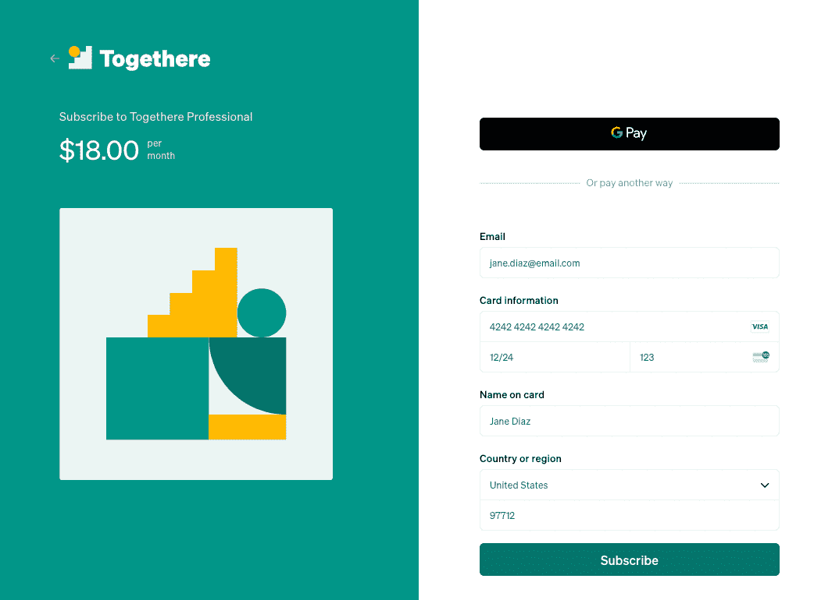
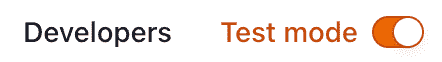
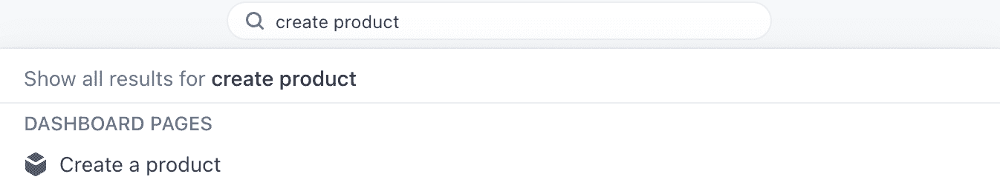
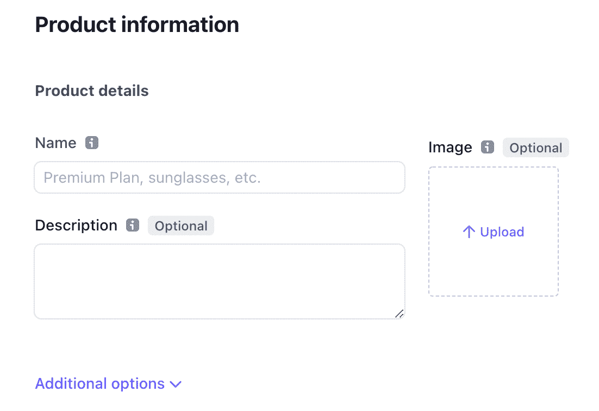
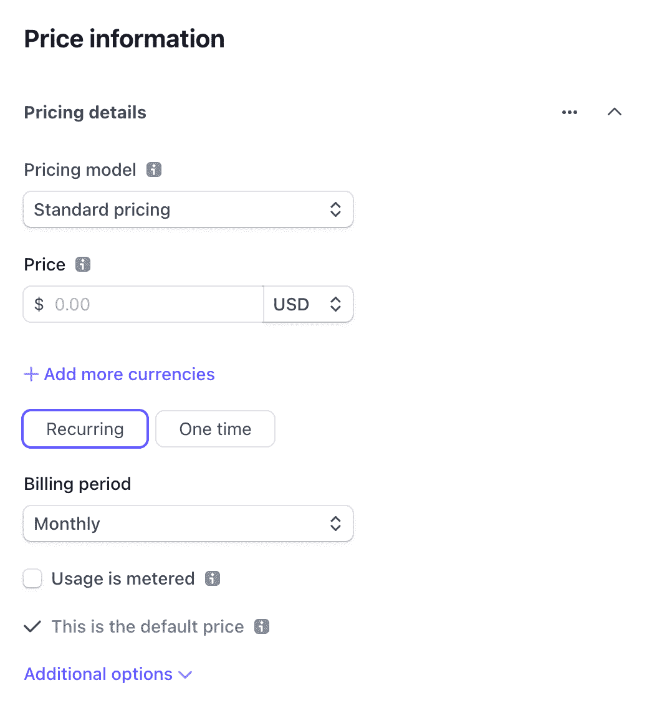
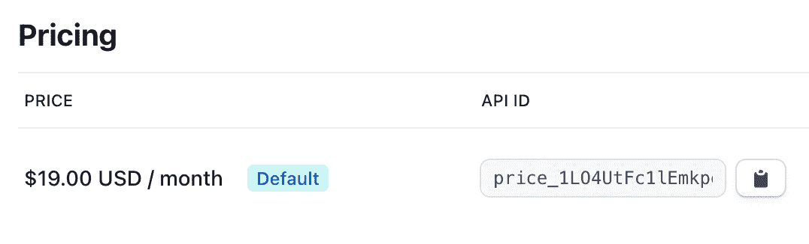
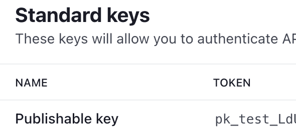

# 如何接受 React 和 Stripe 支付

> 原文：<https://www.freecodecamp.org/news/react-stripe-payments/>

支付是任何在线业务的重要组成部分。但是建立这些支付的过程有时会非常复杂。

为了接受支付，开发人员传统上需要在客户端和服务器端设置代码。除此之外，还要学习复杂的第三方 API，这需要解析大量的文档。

幸运的是，像 Stripe Checkout 这样的工具使得在网络和移动设备上处理购物比以往任何时候都更容易。

在本教程中，您将了解如何在 React 应用中设置 Stripe Checkout 来接受信用卡、Apple Pay 和 Google Pay 支付。

想要一个学习 React 的好资源吗？用我的 [**React Bootcamp**](https://reactbootcamp.com/) 每天 30 分钟成为 React pro。

## 什么是条纹结账？



Example Stripe Checkout page

Stripe Checkout 是一个多合一的工具，它不仅为我们这些开发人员简化了检查过程。它还为我们的客户提供了一个针对性能和可用性进行了优化的用户界面。

当使用条带检出替代选项(如条带元素)时，好处是您只需编写少得多的代码即可获得相同的最终结果。此外，您还可以获得自动翻译全球用户语言的功能。

您还可以定制这个用户界面，而不必编写任何 React 组件。

## 条带结帐在条带上托管

请注意，Stripe Checkout 托管在 Stripe 的服务器上，它涉及到将用户带到*checkout.stripe.com*。然而，这不应该被视为一个不利因素。

因为信任是结帐过程中如此重要的一部分，所以知道 Stripe 正在处理支付通常是一个很大的好处。因此，客户在支付过程中会更加安全和自信。

简而言之，使用 Stripe Checkout 等预制解决方案是一个明智的决定，因为这不仅意味着减少您的工作量，还会提高您对产品的信任度。

## 如何设置条带检验

1.  去 stripe.com 创建一个免费账户。
2.  您将在*dashboard.stripe.com*被导航到您的仪表盘

在仪表板的右上角，确保打开“测试模式”。



Make sure you are in test mode

3.创建条纹新产品。

最快的方法是在搜索中搜索“创建产品”，然后点击“创建产品”结果。



Go to "Create a Product"

4.添加您的产品信息，包括名称、描述和图片。



Provide your product information

5.在同一页面上，添加该产品的价格信息。

在本例中，我们将选择循环(每月)定价模式。请注意，您也可以为产品选择一次性付款。



Select your pricing details

6.保存您的新产品并获取您的价格 id

创建产品后，如果您进入定价部分，您会在价格旁边看到一个以`price_`开头的 id。您将需要创建一个带条带的签出会话。



Grab the created price id for your product

7.获取您的可发布密钥。

最后一步是从 Stripe 获取可发布的(测试)密钥。我们还需要用 Stripe 创建一个签出会话。

这一次，我们可以搜索“api key”，选择第一个结果。


Search for "api key"

在 API keys 页面上(再次处于测试模式)，您将获得以`pk_test`开头的可发布密钥



Grab the publishable key, under "token"

## 如何添加条纹检出反应

现在我们已经拥有了使用 React 设置 Stripe Checkout 所需的一切，即价格 id 和可发布密钥，我们可以创建 React 应用程序了。

对于本教程，我将使用 Next.js，这是一个 React 框架。您可以通过前往 *next.new* 使用 StackBlitz 立即创建自己的 Next.js 应用程序。

我们将首先在主页(pages/index.js)上创建一个结账按钮。当用户点击这个按钮时，Stripe 会将我们的用户重定向到结帐页面。

```
// pages/index.js

export default function Home() {
  return <button>Checkout</button>;
}
```

要与 Stripe 通信，我们需要安装以下带有 NPM 或 Yarn 的包:

```
npm install @stripe/stripe-js
```

安装完成后，我们将在项目的根目录下创建一个新的文件夹和文件:`lib/getStripe.js`。

在这个文件中，我们将只处理一次加载条带。为此，我们通过 Stripe 我们的可发布密钥。

```
import { loadStripe } from '@stripe/stripe-js';

let stripePromise;
const getStripe = () => {
  if (!stripePromise) {
    stripePromise = loadStripe(process.env.NEXT_PUBLIC_STRIPE_PUBLISHABLE_KEY);
  }
  return stripePromise;
};

export default getStripe; 
```

这里，我们从一个`.env`文件中加载可发布的密钥。确保在您的项目的根目录中使用以下两个值创建它，作为您的可发布密钥和价格密钥:

```
NEXT_PUBLIC_STRIPE_PUBLISHABLE_KEY='pk_test_my_key'

NEXT_PUBLIC_STRIPE_PRICE_ID='price_my_id'
```

一旦添加了环境变量，我们将返回主页并创建一个名为`handleCheckout`的函数。

它将首先调用我们需要等待的`getStripe`,因为这个函数返回一个承诺。确保从 lib 文件夹中导入我们的`getStripe`函数。

```
import getStripe from '../lib/getStripe';

export default function Home() {
  async function handleCheckout() {
    const stripe = await getStripe();
    const { error } = await stripe.redirectToCheckout({
      lineItems: [
        {
          price: process.env.NEXT_PUBLIC_STRIPE_PRICE_ID,
          quantity: 1,
        },
      ],
      mode: 'subscription',
      successUrl: `http://localhost:3000/success`,
      cancelUrl: `http://localhost:3000/cancel`,
      customerEmail: 'customer@email.com',
    });
    console.warn(error.message);
  }

  return <button onClick={handleCheckout}>Checkout</button>;
}
```

然后我们会调用`stripe.redirectToCheckout`，这也是我们需要`await`的一个函数。

这个函数将传递一个包含四个主要属性的对象:

1.  `lineItems`:一个对象数组，包括订单中的产品以及这些产品的数量。
2.  `mode`:我们的交易是经常性的还是一次性的
3.  `successUrl`:成功购买后用户将被导航到的页面(请自行设置)
4.  `cancelUrl`:用户成功购买后将被导航到的页面(同样，易于设置)

您可以向该对象传递更多的属性，比如传递`customerEmail`来预先填充用户的电子邮件输入。

## 如何测试条带检出

一旦我们点击我们的结帐按钮，我们应该被引导到一个完整的页面，在测试模式下，将允许我们提供一个测试信用卡号码，以验证结帐过程(重复数字 4242 重复所有字段)。

如果我们的用户取消并试图返回，他们将被带到我们指定的 cancelUrl。否则，如果他们成功完成此过程，他们将被带到 successUrl。

一旦您准备好上线并接受客户的资金，您需要做的就是用一个非测试密钥替换您的测试可发布密钥。

希望这让你很好地理解了如何开始使用 Stripe Checkout，以及如何更容易地在 React 应用中接受支付！

你可以在这里找到这个例子的最终代码:[https://stackblitz.com/edit/nextjs-4ts4y4?file=pages%2Findex.js](https://stackblitz.com/edit/nextjs-4ts4y4?file=pages%2Findex.js)

## 想成为一名工作就绪的 React 开发人员吗？

如果你喜欢这个 React 教程，看看我的 [**React 训练营**](https://reactbootcamp.com) 。

它将为您提供所需的所有培训:

*   每天只需 30 分钟，就能从完全的初学者变成专业的反应者
*   从零开始到部署，构建 4 个全栈 React 项目
*   了解构建您喜欢的任何应用程序的强大技术堆栈

[](https://reactbootcamp.com) 
*点击加入 React 训练营*