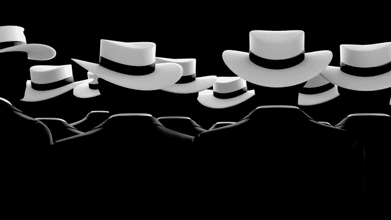
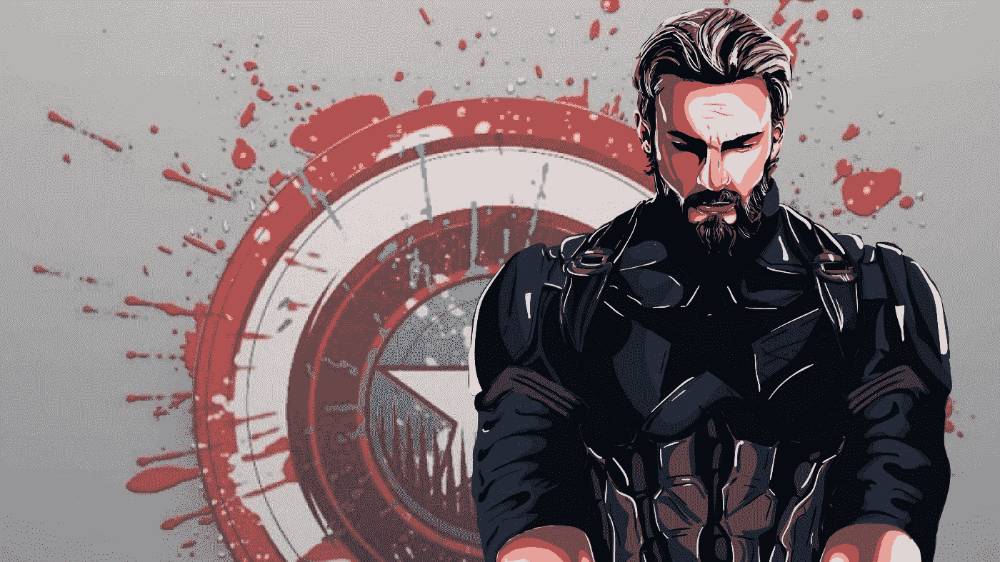
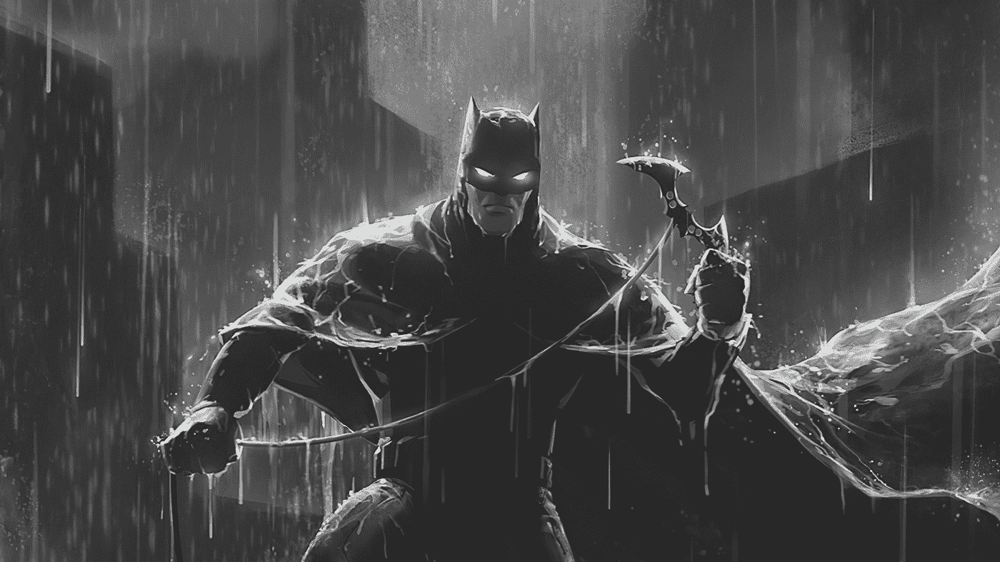
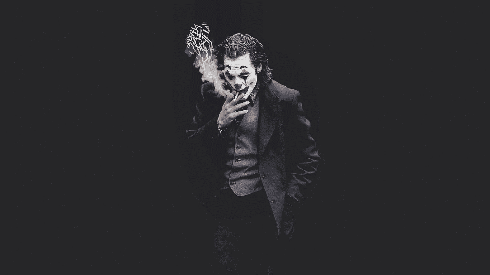
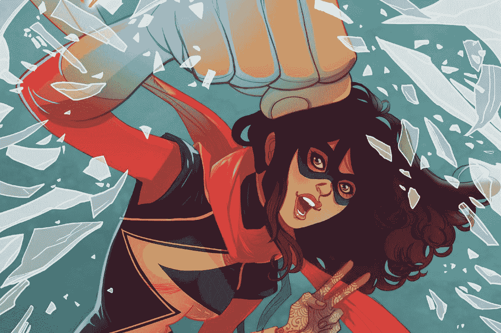
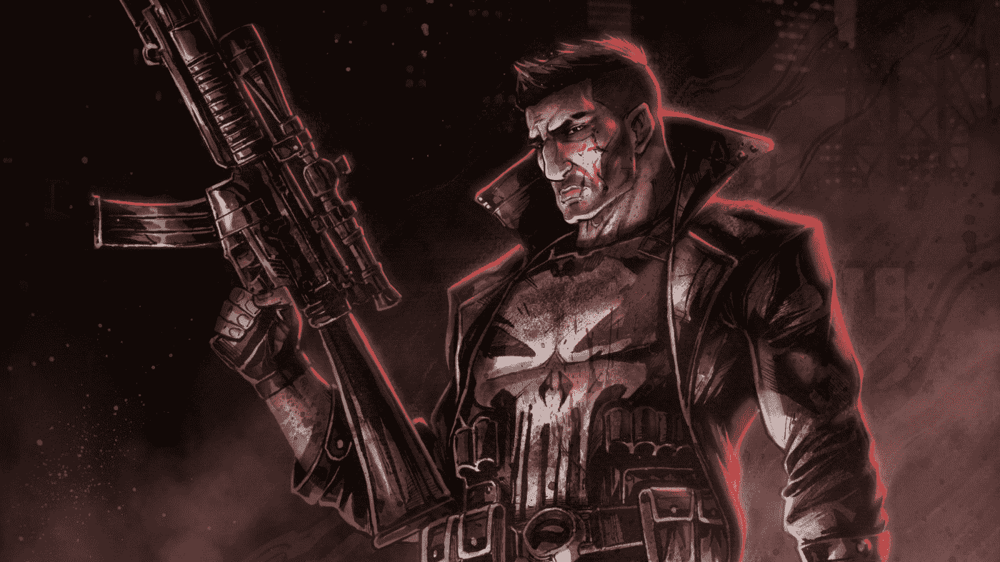

# 什么是白帽、黑帽、红帽黑客？不同类型的黑客解释

> 原文：<https://www.freecodecamp.org/news/white-hat-black-hat-red-hat-hackers/>

欢迎大家来看电影！🍿你是否听说过白帽或黑帽黑客这个术语，并想知道它是什么意思？

在这篇文章中，你将通过将黑客与或多或少代表他们和他们所做的事情的漫威或 DC 英雄进行比较，来了解黑客是如何被分类的。

## 什么是黑客？

Hats on Silhoettes | Credit: Wallpaperflare.com

黑客是利用他们的技能来破坏网络安全防御的个人。在网络安全领域，黑客通常被“帽子”系统分类。这个系统可能来自古老的牛仔电影文化，在那里好的角色通常戴着白帽子，坏的角色戴着黑帽子。

网络空间有三大帽子:

1.  白帽子
2.  灰色帽子
3.  黑色帽子

然而，随着时间的推移，还出现了其他一些问题，例如:

1.  绿色帽子
2.  蓝色的帽子
3.  红帽子

让我们深入了解一下所有这些不同类型的黑客都做些什么，好吗？🙃

## 白帽黑客

Captain America | Credit: Wallpaperaccess.com

白帽子就像漫威的美国队长🛡️.无论是哪一天、哪一次或哪一年，他们总是坚持正义，通过在黑帽之前发现并报告系统漏洞来保护平民和整个组织。

他们通常为组织工作，担任网络安全工程师、渗透测试员、安全分析师、CISO(首席信息安全官)和其他安全职位。

在这些组织下，他们执行以下任务:

1.  扫描网络
2.  配置 IDSs(入侵检测系统)
3.  从道德上来说，黑客攻击计算机是为了找到漏洞并报告它们，以便解决它们
4.  编程蜜罐(攻击者的陷阱😼)
5.  监控网络活动中的可疑活动

这类黑客的著名例子包括:

1.  [杰夫·莫斯](https://en.wikipedia.org/wiki/Jeff_Moss_(hacker)) (DEF CON 创始人)
2.  [理查德·斯托尔曼](https://en.wikipedia.org/wiki/Richard_Stallman)(GNU 项目创始人)
3.  蒂姆·伯恩斯-李(万维网的创始人)
4.  Linus Torvalds(Linux 的创造者)
5.  [下村勉](https://en.wikipedia.org/wiki/Tsutomu_Shimomura)(抓住凯文·米特尼克的人)

如果你想听到更多来自网络安全公司创始人本人的消息，请收听瑞秋·托巴的播客。

## 灰帽黑客

Batman | Credit: Alphacoders.com

DCs 的黑暗骑士和灰帽黑客有很多共同点🦇。他们都想为正确的事情挺身而出，但却用了非常规的方法。

灰帽黑客是白帽和黑帽之间的平衡。与白帽黑客不同，他们不需要获得许可就能入侵系统，但也不会像黑帽黑客那样从事任何其他非法活动。

灰帽子的历史颇具争议。这使得他们很难真正归类，特别是如果他们的道德指南针有点失控，或者他们的所作所为看起来更像黑帽子而不是白帽子。有些人甚至因为他们的所作所为而锒铛入狱。

但是有些人会成为人民的英雄，政府和大组织的敌人。

灰帽黑客的一些著名例子有:

1.  [匿名](https://en.wikipedia.org/wiki/Anonymous_(hacker_group)#2022)(世界著名黑客组织)
2.  [高清摩尔](https://en.wikipedia.org/wiki/H._D._Moore)(Metasploit 的创造者)
3.  阿德里安·拉莫(又名无家可归的黑客)
4.  哈利勒·施雷特黑了马克·扎克伯格的脸书账号🤣)

## 黑帽黑客

The Joker | Credit: Wallpapersden.com

是时候介绍有害的🃏.了小丑和黑帽子就像豆荚里的豌豆。他们从事非法活动是为了经济利益、挑战，或者仅仅是为了好玩。

他们在互联网上寻找易受攻击的计算机，利用它们，并尽可能利用它们。

黑帽子和白帽子一样使用进入系统的技术。然而，他们并不使用他们的防守技能，而是通过做以下事情来提升他们的进攻水平:

1.  安装后门
2.  维护对受损系统的访问
3.  执行权限提升
4.  下载私人/敏感/智力数据
5.  安装勒索软件等恶意软件
6.  创建网络钓鱼电子邮件和链接

臭名昭著的黑帽子的例子包括:

1.  凯文·米特尼克(美国历史上最受通缉的网络罪犯)
2.  朱利安·阿桑奇(维基解密的创始人)
3.  Hamza Bendelladj 又名 Bx1 (宙斯银行恶意软件的最新拥有者)
4.  凯文·鲍尔森(黑暗但丁)
5.  罗伯特·塔潘·莫里斯(莫里斯蠕虫的创造者)

米特尼克、鲍尔森和莫里斯受到刑事指控，服刑期满，现在是好人了。米特尼克创办了一家网络安全公司。鲍尔森创建了 SecureDrop。莫里斯成为了麻省理工学院的教授(难道你不喜欢快乐的结局吗？🤧).

## 绿帽黑客

Ms Marvel | Credit: Wallpapercave.com

漫威女士和绿帽子是天作之合🌟。他们都很年轻，热情，缺乏经验，有冒险和从错误中学习的倾向。绿帽子是新加入这个行业的黑客，但愿意学习成为伟大的黑客。

由于黑客工具的可用性和易用性，绿帽很容易陷入麻烦，因为他们可能没有完全理解工具或目标的全部工作原理。但是，他们从错误中学习，积累经验。

随着等级的不断提升，绿帽黑客可能升级为白帽、灰帽或黑帽黑客。

## 蓝帽黑客

John Wick | Credit: Wallpaperswide.com

好吧，我知道了。疾速追杀不是 DC 或漫威的一部分，但炸药漫画的最大杀手是任何球迷的最爱🐶。

威克先生和蓝帽黑客有着相同的意识形态:复仇。你杀了约翰·威克斯的狗，它就会来找你。你欺负或威胁一个蓝帽子，他们也会跟着你，除了它是你在绞刑架上的数字生活。

但由于我只能猜测是文化差异，蓝帽子也可能意味着在软件发布之前，外部安全专家被请来测试软件的漏洞。

## 红帽黑客

The Punisher | Credit: Wallpaperflare.com

我认为这个角色说明了一切，☠.惩罚者是一个无情的反英雄，支持正义，但永远不会(我的意思是永远😬)打算给罪犯第二次机会。

红帽子也一样。他们以网络罪犯为目标，尽一切可能破坏犯罪活动，使其永久瘫痪。

红帽子是没人想惹的黑客，黑帽子也不行。其他黑客通常攻击微软视窗电脑，但这些黑客，他们黑客 Linux 电脑。

他们无怨无悔，不假思索，通过将正义掌握在手中，让黑帽子为他们的罪行付出相当沉重的代价。他们通过销毁目标的所有数据和备份来做到这一点，通常会使系统变得毫无用处。

## 结论

在这个可怕的提示下，我们已经到了这篇文章的结尾。我希望你喜欢它。正如我常说的，祝你黑客生涯愉快！🙃

### 承认

感谢 [Chinaza Nwukwa](https://www.linkedin.com/in/chinaza-nwukwa-22a256230/) 、 [Holumidey Mercy](https://www.linkedin.com/in/mercy-holumidey-88a542232/) 、 [Georgina Awani](https://www.linkedin.com/in/georgina-awani-254974233/) 以及我的家人，感谢他们给予我灵感、支持和知识，让我撰写了这篇文章。你们太棒了。

### 有用的资源

1.  [蜜罐](https://www.kaspersky.com/resource-center/threats/what-is-a-honeypot)是什么？
2.  [帽子的更多分类](https://www.pandasecurity.com/en/mediacenter/security/14-types-of-hackers-to-watch-out-for/)