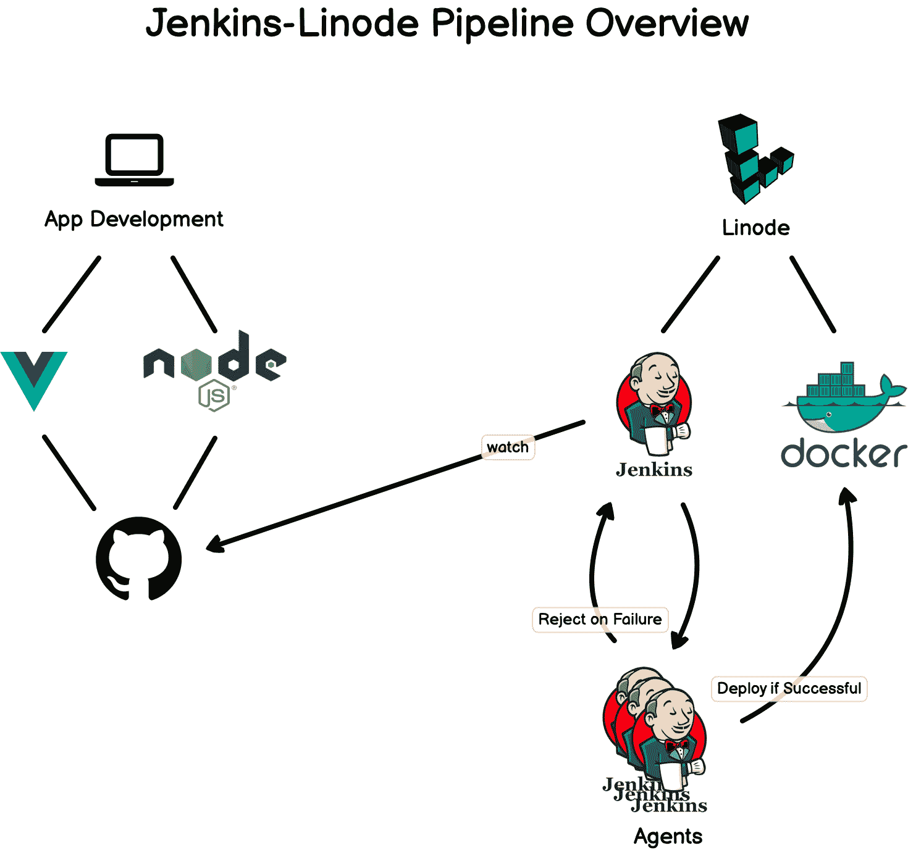

# 通过建立 CI/CD 渠道了解 Jenkins

> 原文：<https://www.freecodecamp.org/news/learn-jenkins-by-building-a-ci-cd-pipeline/>

Jenkins 是一个开源自动化服务器，它使得构建、测试和部署软件变得更加容易。

我们刚刚在 freeCodeCamp.org YouTube 频道上发布了一个视频课程，将通过向您展示如何为 web 应用程序构建 CI/CD 管道来教授您关于 Jenkins 的知识。

格温多林·法拉第开发了这个课程。Gwen 是一名经验丰富的软件开发人员，她在自己的频道和 freeCodeCamp 频道中创建了许多受欢迎的课程。

除了 Jenkins，本课程中的项目还使用了其他技术:

*   Linode 上运行的 Debian 服务器
*   停靠点(k)
*   开源代码库
*   一些用于设置的命令行

Jenkins 可以帮助开发人员自动化他们的软件开发过程，并提高他们的生产力。它还可以帮助用户更容易地获得他们软件项目的新版本。Jenkins 是创建 DevOps 管道的重要工具。

DevOps 管道是一组能够持续交付软件应用的流程和工具。术语“DevOps”是“开发”和“运营”的组合 DevOps 管道用于自动化软件开发生命周期的构建、测试和部署阶段。

本课程的专题以下列架构为特色。

以下是本课程涵盖的所有部分:

*   课程概述
*   詹金斯是什么？
*   术语和定义
*   项目架构
*   Linode 简介
*   陷害詹金斯
*   詹金斯界面之旅
*   安装插件
*   蓝色海洋
*   创建管道
*   安装 Git
*   詹金斯文件
*   更新管道
*   提名的詹金斯
*   停靠点(k)
*   结束语

观看 freeCodeCamp.org YouTube 频道的全部课程(1 小时观看)。

[https://www.youtube.com/embed/f4idgaq2VqA?feature=oembed](https://www.youtube.com/embed/f4idgaq2VqA?feature=oembed)