# 如何在 Excel 中创建数据透视表

> 原文：<https://www.freecodecamp.org/news/how-to-create-a-pivot-table-in-excel/>

在 Excel 中，数据透视表使您能够以一种简单的方式分析和可视化数据。

使用数据透视表，您可以更快地进行比较和创建计算。您甚至可以创建图表来可视化您的数据。

如果您是第一次创建数据透视表，那么创建数据透视表可能会令人生畏。但是在本文中，我将解释开始创建数据透视表所需的一切。

这还没有结束——我还将向您展示如何添加图表，以便您可以可视化您的数据。

此外，您使用的 Excel 版本并不重要。您甚至可以在 Excel 2013 中创建数据透视表。事实上，我使用 Excel 13 为这篇文章做准备。

## 我们将涵盖的内容

*   [如何在 Excel 中创建透视表](#howtocreateapivottableinexcel)
    *   [如何用透视表创建行并进行计算](#howtocreaterowsandmakecalculationswithapivottable)
    *   [如何用数据透视表创建全新的行](#howtocreateentirelynewrowswithapivottable)
*   [如何实现数据透视表的图形化可视化](#howtoimplementgraphicalvisualizationforapivottable)
*   [结束](#wrappingup)

## 如何在 Excel 中创建数据透视表

为了向您展示如何创建数据透视表，我创建了一个由一些虚构的足球运动员组成的表格，显示了:

*   他们的名字
*   他们参加的比赛次数
*   他们的助攻和进球

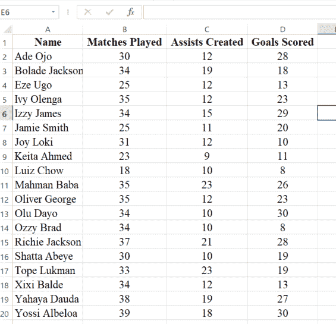

我将创建额外的`Goal Contributions`和`Goal Ratio`行，也称为每场比赛的目标。

在足球(英式足球)中，进球贡献是进球和助攻的总数。当进球数除以比赛次数时，就得到进球数比率。

**要创建数据透视表，请遵循以下步骤**:

**第一步**:在菜单栏中点击“插入”，选择“透视表”:

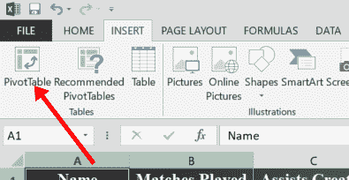

**步骤 2** :保持一切不变，选择“确定”:

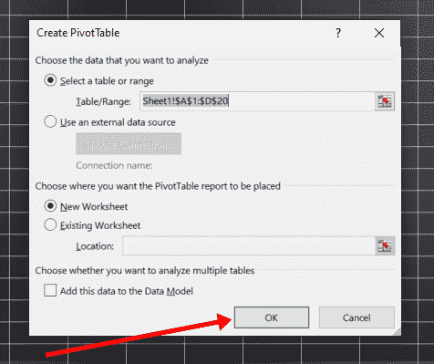

您应该使用一个新的工作表，这样您就可以有一个专用于数据透视表的工作表。

您将看到的下一个界面如下所示:

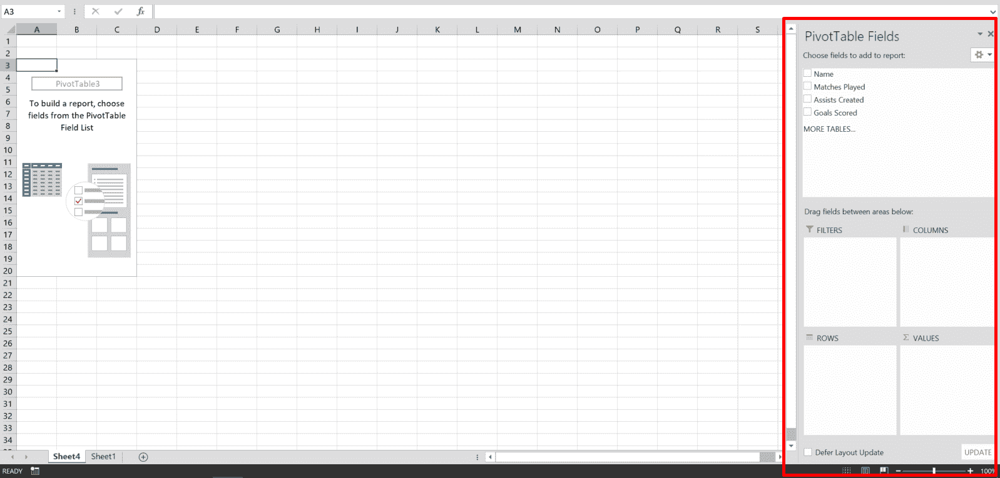

您将使用看到“数据透视表字段”的部分。你甚至可以在那里看到你桌子的柱子。

### 如何使用数据透视表创建行并进行计算

这是您可以创建行、列和进行计算的部分。

要为数据透视表创建行，请将现有表中的一行拖到您看到“行”的部分。

例如，我想用原始表的名称行为数据透视表创建一行。这意味着我必须将 name 行拖到 ROWS 区域:

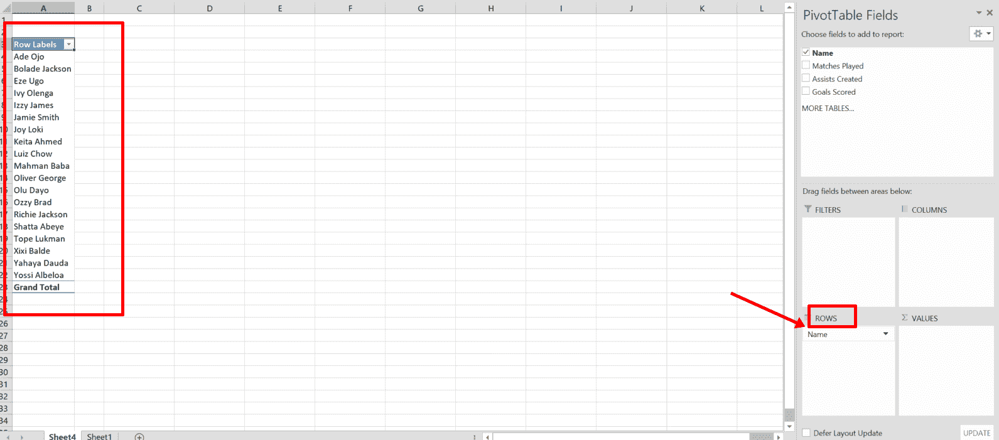

您可以看到，我已经用原始表的名称 row 创建了一个行。

为了便于计算，您可以使用“值”区域。

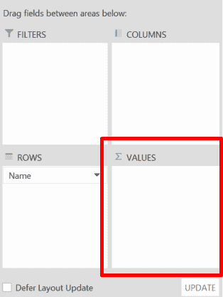

我想看看每个球员的进球数。因此，我将把“进球得分”行拖到“数值”区域:

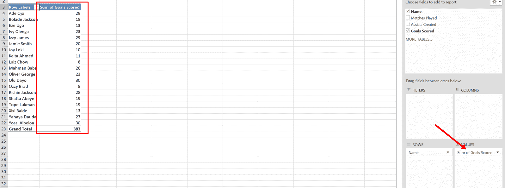

你可以看到我可以直接看到每个球员的进球数。

您还可以在“值”区域进行其他计算。只需点击该列前面的下拉菜单，然后选择“值字段设置…”:

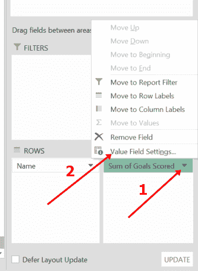

我想看到的是最高的进球，而不是所有球员的总进球数。因此，我将选择“最大”，然后单击“确定”:

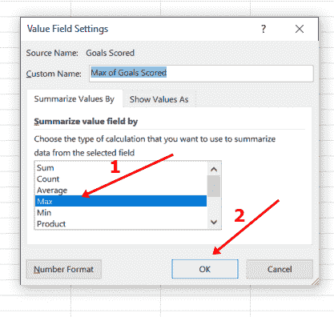

现在我可以看到最大进球数，而不是所有进球数的总和:

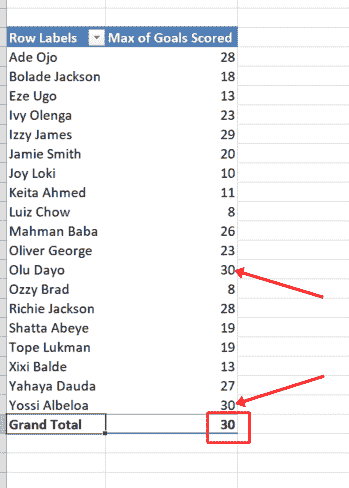

### 如何用数据透视表创建全新的行

还记得我说过我会创建额外的目标贡献和目标比率行，也称为每场比赛的目标？所以，我们开始吧。

我需要创造的助攻和进球得分行来计算进球贡献。因此，我将确保它们都在值区域:

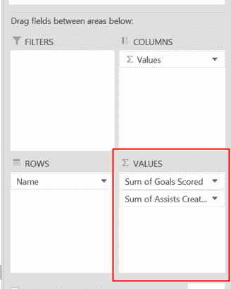

现在，我将确保选择“分析”选项卡，单击“字段、项目和集合”，然后选择“计算字段…”:

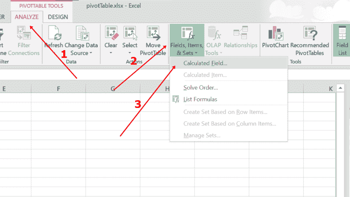

您将看到的下一个界面如下所示:

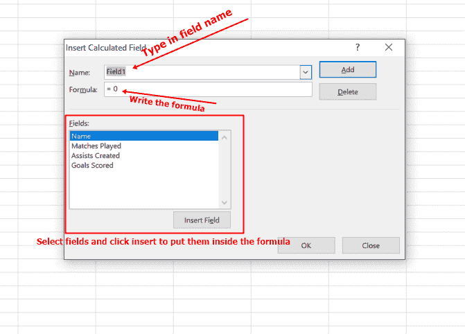

在这里，我将做三件事:

*   在名称字段中键入行的名称
*   写下公式——在这种情况下，“助攻数+进球数”
*   单击添加和确定

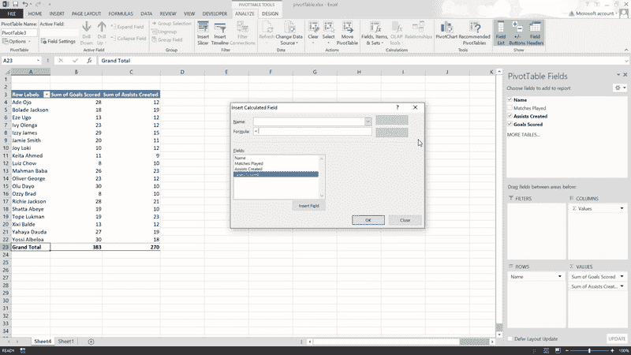

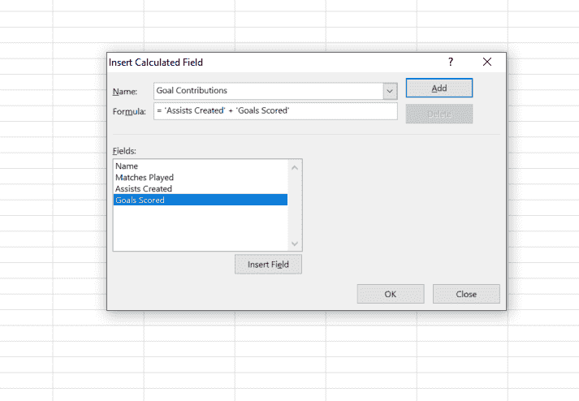

现在，我已经成功创建了目标贡献行:

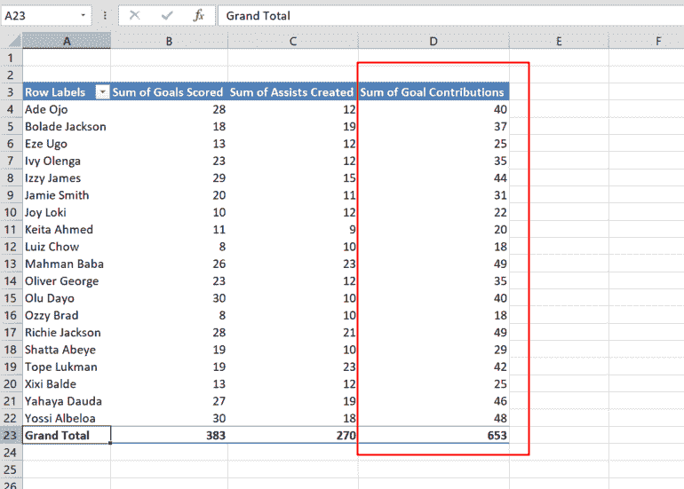

要创建目标比率，我必须确保“比赛次数”行位于值区域:

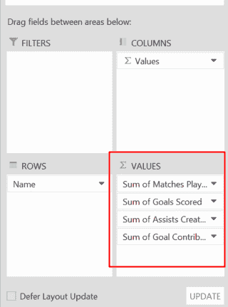

我将使用的公式是进球数/比赛数。因此，我将再次实现计算字段:

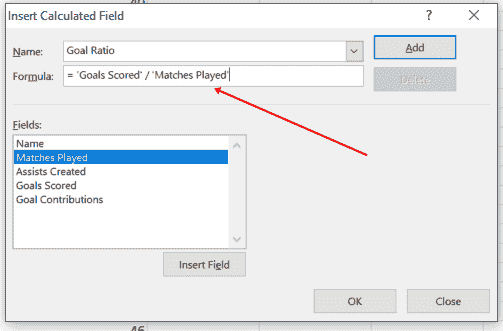

我现在可以看到每个球员的进球率:

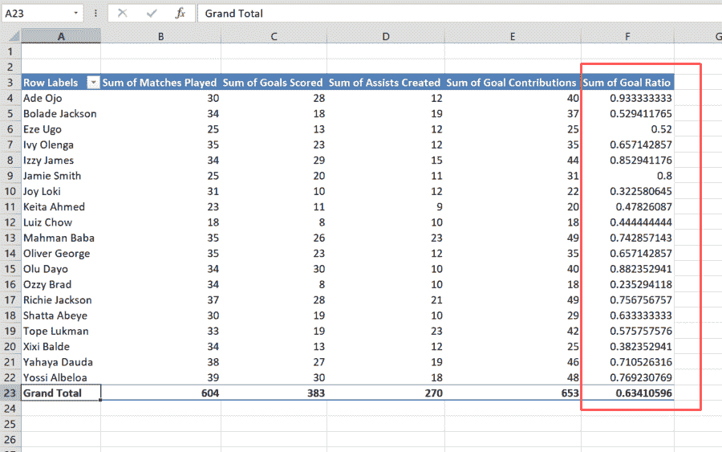

## 如何实现数据透视表的图形可视化

创建一个数据透视表并轻松实现计算很好，但在图表中看到数据透视表的图形表示更好。

要在图表中表示数据透视表:

**步骤 1** :确保选择了“分析”选项卡，然后选择数据透视图:

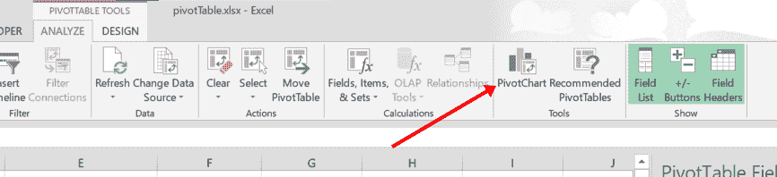

**第二步**:在右边选择你想要的图表类型。它可以是柱形图、饼图或条形图。另外，选择上半部分的格式。这可能是 2D 或三维。

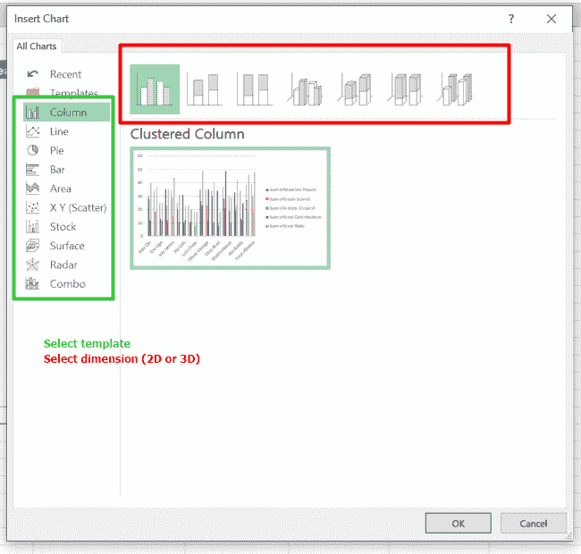

满意后，单击“确定”。

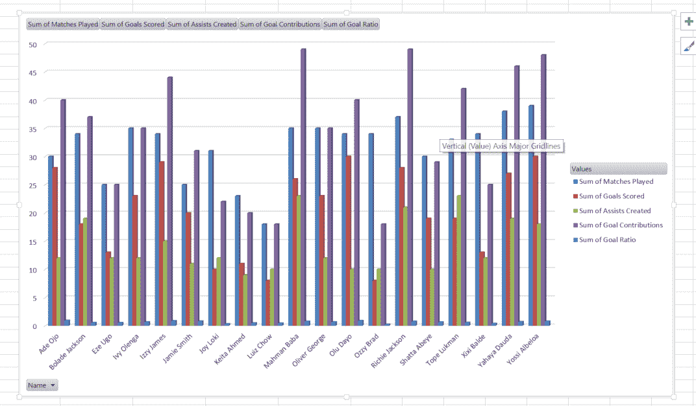

这是代表数据的图表。

## 包扎

数据透视表是 Excel 最强大的功能之一。如果您必须处理大型数据集，那么在进行分析和可视化时，数据透视表可以为您节省大量时间。

数据透视表很好，但是能够创建不同类型的图表来表示数据也非常有用。

我希望这篇文章能帮助你为你正在处理的数据创建一个数据透视表和图表。

如果你觉得这篇文章有帮助，不要犹豫，把它传给别人。