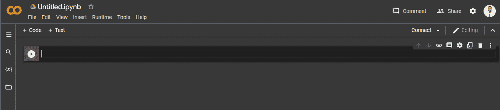
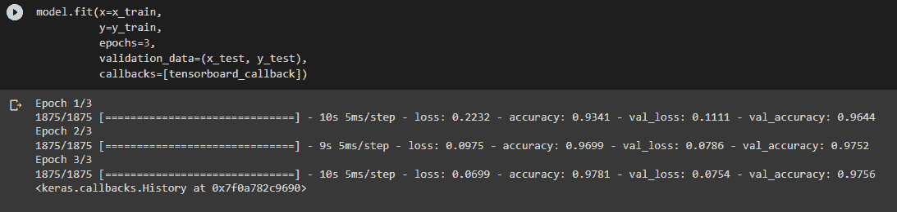
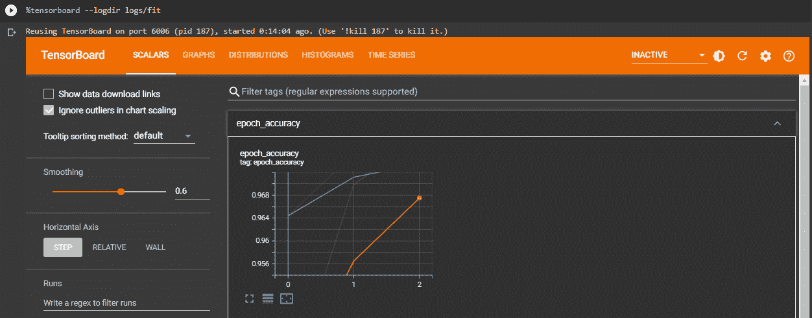
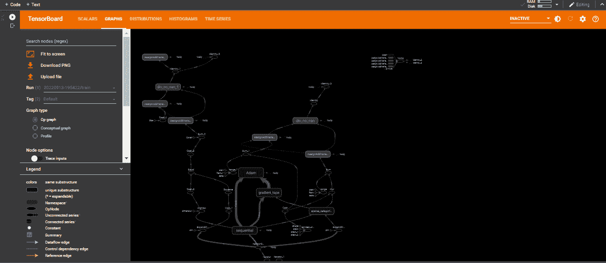
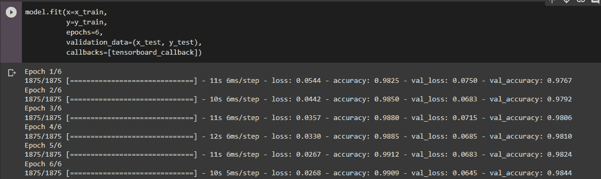
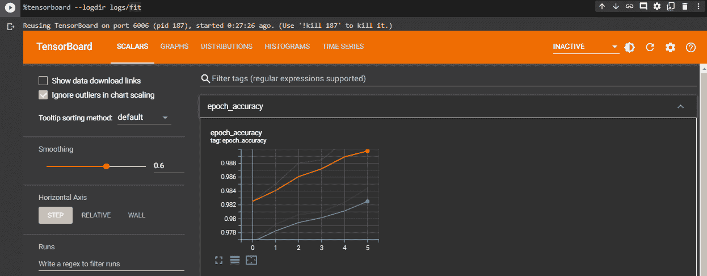

# 如何用 TensorFlow 评估使用 TensorBoard 的机器学习模型

> 原文：<https://www.freecodecamp.org/news/how-to-evaluate-machine-learning-models-using-tensorboard/>

改进机器学习模型是一个迭代的过程。没有一个机器学习模型在第一次训练时是完美的。通常需要几次迭代。

但是作为机器学习实践者，你可能犯的一个常见错误是没有意识到你需要评估(或测量)你的模型来改进它。模型评估是机器学习模型改进和开发过程的组成部分。

它有助于找到代表您的数据的最佳模型以及所选模型在未来的工作情况。

为了让机器学习工程师能够在更深层次上审视他们模型的性能，谷歌创造了 [TensorBoard](https://www.tensorflow.org/tensorboard/get_started) 。

## 什么是 TensorBoard？

TensorBoard 的核心是提供机器学习工作流程所需的测量和可视化。它允许您跟踪实验指标，如损失和准确性、可视化模型图、将嵌入投影到低维空间等等。

TensorBoard 使用图形概念来表达数据流和模型的操作。尽管它允许您可视化大型复杂模型的参数和图形结构，但它的界面非常简单和直观。

在本教程中，您将在经过训练的机器学习模型上分析和评估结果。您将使用的模型将针对 [MNIST 手写数字数据集](https://www.tensorflow.org/api_docs/python/tf/keras/datasets/mnist)进行训练。它使用 MNIST(改进的国家标准和技术研究所)数据库，其中包含大量的手写数字。该数据集通常用于训练各种图像处理系统。

### 先决条件

要完成本教程，您需要:

1.  对机器学习模型工作的基本理解。
2.  一个新的 Google Colab 笔记本可以在你的 Google Drive 中运行 Python 代码。你可以按照这个[教程](https://www.freecodecamp.org/news/google-colaboratory-python-code-in-your-google-drive/)来设置。

## 步骤 1–如何设置 TensorBoard

需要注意的是，与 TensorFlow 一起安装的 TensorBoard 不需要在此设置中使用`pip`进行安装。之所以会这样，是因为当你在 Google Colab 上创建一个新的笔记本时，TensorFlow 已经预装并针对正在使用的硬件进行了优化。



A blank (new) notebook in dark mode 

准备好您的 Google Colab 笔记本后，开始使用笔记本中的`%load_ext`魔法加载`tensorboard`扩展。

```
%load_ext tensorboard
```

这样做之后，像这样导入必要的库(即`tensorflow`和`datetime`):

```
import tensorflow as tf
import datetime
```

至此，您已经成功安装并设置好 TensorBoard。您现在可以开始了。

## 步骤 2–如何创建和训练模型

您将在本教程中使用的数据集是 MNIST 数据集，它由 60，000 个 28×28 像素的小正方形灰度图像组成，这些图像是 0 到 9 之间的手写单个数字。

我们从 Keras 数据集库中获得的数据集通常用于训练数字识别机器学习模型。

首先创建数据集的一个实例，并将其命名为`mnist`。

```
mnist = tf.keras.datasets.mnist 
```

然后将数据分成训练集和测试集，如下所示:

```
(x_train, y_train),(x_test, y_test) = mnist.load_data() 
```

此外，您需要标准化训练集和测试集的所有值。这意味着将图像标准化到[0，1]范围。

```
x_train, x_test = x_train / 255.0, x_test / 255.0
```

然后定义一个函数，该函数将定义机器学习模型来训练数据集。您将使用`Sequential` Keras 模型。其核心是，它将一系列线性层组合成`tf.keras.Model`，同时在这个模型上提供训练和推理功能。

```
def create_model():
  return tf.keras.models.Sequential([
    tf.keras.layers.Flatten(input_shape=(28, 28)),
    tf.keras.layers.Dense(512, activation='relu'),
    tf.keras.layers.Dropout(0.2),
    tf.keras.layers.Dense(10, activation='softmax')
  ])
```

值得注意是，

*   `.Flatten`层使输入变平，而不影响批量大小。本例中的输入形状是 28 x 28。
*   第一个`.Dense`层只是你的正则密接 NN 层。使用的激活函数是“relu ”,其输出空间的维数是 512。
*   `.Dropout`层丢弃了一些输入，本教程中丢弃的输入单位的分数为 0.2。
*   和第一个一样，第二个`.Dense`层也是你的正则密接 NN 层。我们使用的激活函数是“softmax ”,其输出空间的维数是 10。

然后你需要像这样调用已定义的模型(或函数):

```
model = create_model()
```

通过调用定义的函数，您可以用合适的参数来训练模型。

```
model.compile(optimizer='adam',
              loss='sparse_categorical_crossentropy',
              metrics=['accuracy'])
```

使用您之前导入的`datatime`库，将日志放在带有时间戳的子目录中，以便于选择不同的训练运行。

日志很重要，因为 TensorBoard 会从日志中读取数据来显示各种可视化效果。

```
log_dir = "logs/fit/" + datetime.datetime.now().strftime("%Y%m%d-%H%M%S")
tensorboard_callback = tf.keras.callbacks.TensorBoard(log_dir=log_dir, histogram_freq=1) 
```

最后，你将训练机器学习模型。

```
model.fit(x=x_train, 
          y=y_train, 
          epochs=3, 
          validation_data=(x_test, y_test), 
          callbacks=[tensorboard_callback])
```



## 步骤 3–如何评估模型

要使用 [magics](https://ipython.readthedocs.io/en/stable/interactive/magics.html) 在 Google Colab 笔记本中启动 TensorBoard，请运行以下代码:

```
%tensorboard --logdir logs/fit
```

你会看到冲浪板升起。



现在，您可以查看顶部选项卡上显示的仪表板，以评估您的机器学习模型并相应地进行改进。

## 步骤 4–如何改进模型

评估你的机器学习模型的目的是获得更好的洞察力来改进算法。通过这些视觉效果，您现在可以看到模型的深层性能。

*   `Scalars`仪表板展示了指标和损失如何随每个时期波动。还可以用它来监控其他标量值，比如训练效率和学习率。
*   `Graphs`仪表板帮助您可视化您的模型。您也可以通过查看图层的`Keras`图来检查它是否被正确构建。



The Graph with the tensorboard

你可以单独在这里更好地看到图表:


The graph shown alone

*   `Distributions`和`Histograms`仪表盘显示了张量随时间的分布。这可能有助于你看到权重和偏差，并确保它们按照你的预期变化。

为了改进此模型，您将把历元数从 3 调整到 6，并观察模型的执行情况。

一般来说，历元数通常表示机器学习算法已经完成的整个训练数据集的通过次数。

直觉上，增加这个数字会提高机器学习模型的性能。为此，您将按如下方式运行代码:

```
model.fit(x=x_train, 
          y=y_train, 
          epochs=6, 
          validation_data=(x_test, y_test), 
          callbacks=[tensorboard_callback])
```



通过我们所做的更改，您可以生成另一个张量板，如下所示:

```
%tensorboard --logdir logs/fit
```



从新生成的视觉效果中，您可以看到模型的性能有了显著的提高。

## 结论

在本文中，您了解了如何使用 TensorBoard 来检查和改进 ML 模型的性能。

如果此时您对 TensorBoard 和 TensorFlow Metrics Analysis (TFMA)之间的差异有疑问，这是一个有效的关注。毕竟，两者都是在机器学习工作流程中提供测量和可视化所需的工具。

但是需要注意的是，您在开发过程的不同阶段使用了这些工具。TensorBoard 的核心是用来分析训练过程本身，而 TFMA 关注的是对“完成的”训练模型的分析。

感谢您的阅读！