# 如何使用 Azure Databricks 读写数据

> 原文：<https://www.freecodecamp.org/news/how-to-read-and-write-data-using-azure-databricks/>

Azure Databricks 是一个基于云的数据分析平台，托管在微软 Azure 上。它帮助您使用 Apache Spark 分析数据，并允许开发人员更快地创建数据应用程序。这反过来会从您的所有数据中获得洞察力，并帮助您构建人工智能解决方案。

Azure Databricks 融合了微软 Azure 平台的可伸缩性和安全性，以及作为端到端 Apache Spark 平台的 [Databricks](https://www.databricks.com/) 的强大功能。

在本教程中，您将学习如何开始使用 Microsoft Azure 中的平台，并了解如何执行数据交互，包括读取、写入和分析数据集。

在本教程结束时，您将能够使用 Azure Databricks 读取多种文件类型，无论有无模式。

### **先决条件**

您需要一个有效且活跃的 Microsoft Azure 帐户。

*   免费 Azure 试用版:使用这个选项，你将从 200 美元的 Azure 点数开始，除了免费服务之外，还有 30 天的使用时间。
*   学生专用 Azure】:此优惠仅适用于学生。有了这个选项，你将从 100 美元的 Azure 信用开始，不需要信用卡。当您有信用点数时，您将可以免费使用流行的服务。

## **如何创建数据块工作空间**

若要使用 Azure Databricks，您必须在 Azure 订阅中设置 Azure Databricks 工作区。为此，导航到 [Azure 门户](https://portal.azure.com/)。如果您已经创建了一个有效且活跃的 Microsoft Azure 帐户，这将有效。

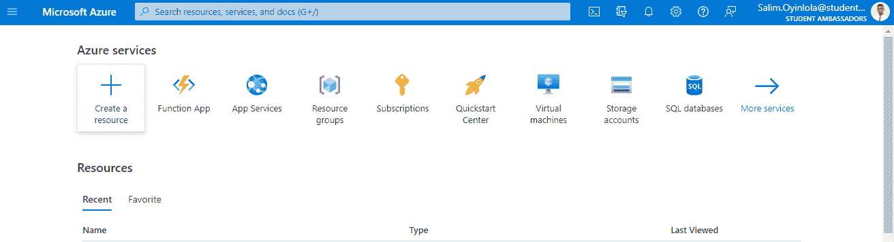

The Microsoft Azure Home Page

到达后，点击`Create a resource`按钮。

在 Create a resource 页面的搜索提示中，您将搜索`Azure Databricks`并选择`Azure Databricks`选项。

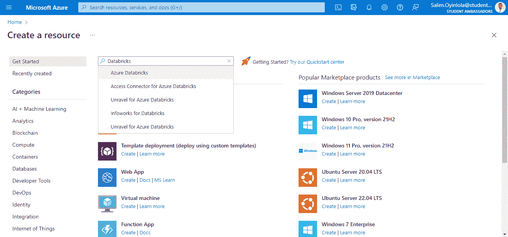

The Microsoft Azure page showing the list of popular resources

打开 Azure Databricks 选项卡并创建一个实例。

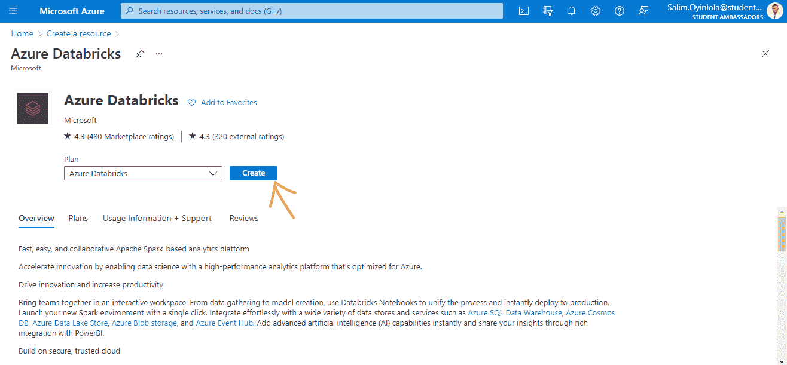

The Azure Databricks pane.

单击蓝色的`Create`按钮(指向它的箭头)创建一个实例。

然后在点击`Review + create`按钮之前输入项目详情。

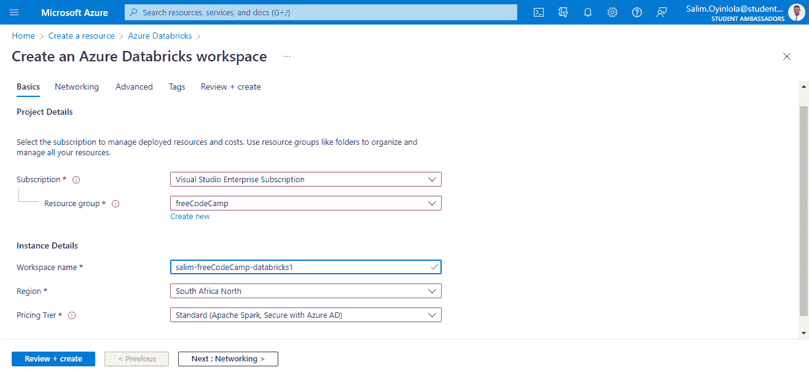

The Azure Databricks configuration page

**注意**:`Subscription`选项将与您的不同。这将取决于您帐户上可用的 Azure 订阅。

资源是一组相似的 Azure 资源。您可以创建一个新的或使用现有的。

`Workspace name`必须填写全球唯一的名称。我的名字叫`salim-freeCodeCamp-databricks1`。

`Region`选项应填入离你最近的位置。区域是一组充当服务器的物理数据中心。因为我在尼日利亚的拉各斯，所以我选择了`South Africa North`。

对于`Pricing Tier`选项，选择包含 Apache Spark 和 Azure AD 的`Standard`选项。

此时，点击`Review + create`按钮。验证过程通常需要大约三分钟。

当工作区的验证和部署过程完成后，使用出现的`Launch Workspace`按钮启动工作区。

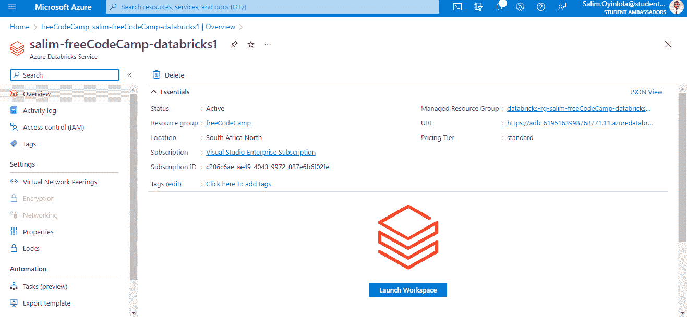

The home page for the created instance of Azure databricks - `salim-freeCodeCamp-databricks`

单击该按钮，您将使用 Azure Directory 单点登录自动登录。

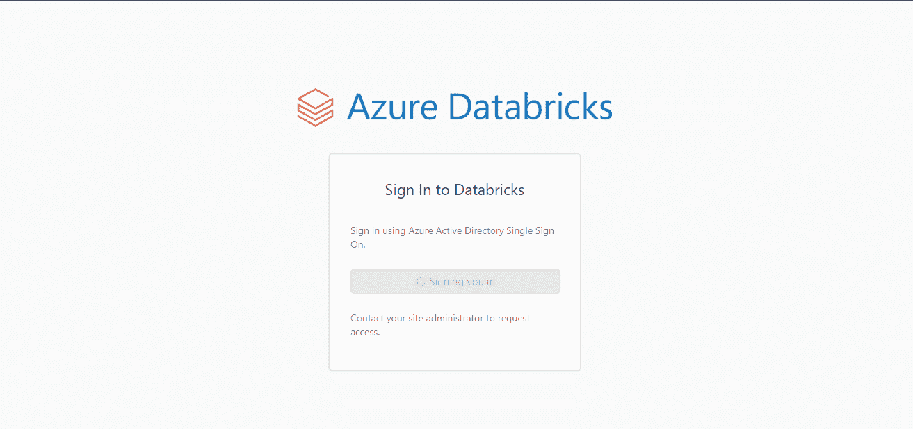

Signing into the workspace of the integration of Microsoft Azure and Databricks

Microsoft Azure Databricks 主页将出现在一个新选项卡中。

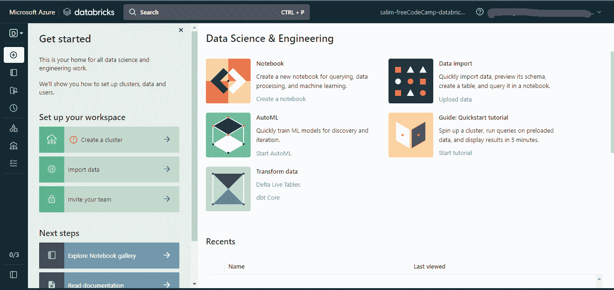

The Microsoft Azure Databricks home page

使用页面左侧的`Create a cluster`选项创建一个集群。

单击该按钮，将会出现一个可用集群列表。如果像我一样，你没有创造任何东西，你也会看到你的是空的。

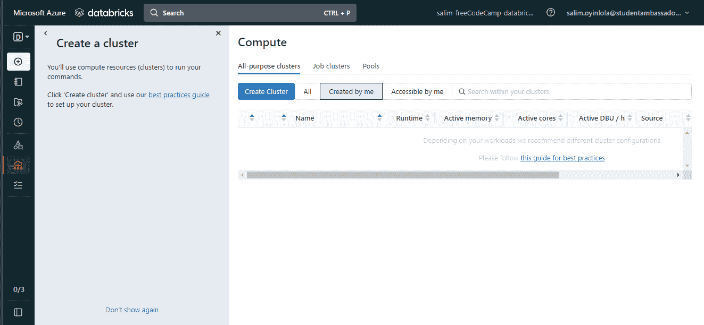

A list of clusters in the Azure Databricks workspace. It is seen that there is no cluster. 

使用`Create Cluster`按钮创建一个新的集群。

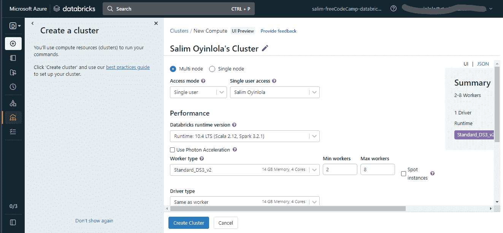

Set the configurations for the Azure Databricks cluster

点击`Single node`选项(从`Multi node`默认选项更改而来)并保持其他设置为默认。然后点击页面底部的`Create Cluster`按钮。这需要几分钟时间。

注意:如果您的数据集很大，您可以探索`Multi node`选项。将所有其他配置设置保留为默认设置。

创建集群后，导航到左侧任务栏上的工作区>用户>您的帐户，导入一些随时可用的笔记本。

右键单击并选择下拉菜单中的`Import`选项。

创建集群后，您需要导入一些现成的笔记本电脑。

为此，使用左侧任务栏，您将通过`Workspace` `>` `Users` `>` `your_account`进行导航。然后右键单击查看下拉菜单。然后在下拉菜单中选择`Import`选项。

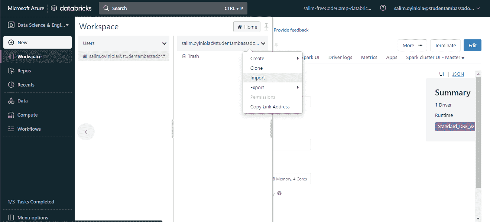

The `import` button will be used to import the dataset to be used

单击`Import`按钮后，您将选择`URL`选项并粘贴以下 URL:

```
https://github.com/salimcodes/microsoft-learning-paths-databricks-notebooks/blob/master/data-engineering/DBC/03-Reading-and-writing-data-in-Azure-Databricks.dbc 
```

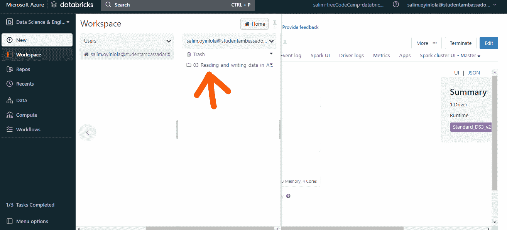

The database folder named `03-Reading-and-writing-data-in-Azure-Databricks.dbc` will be used,

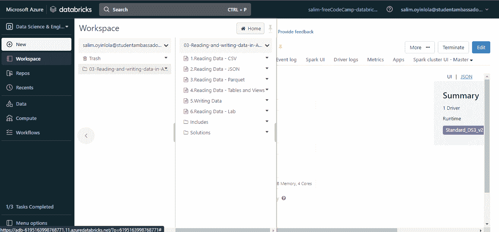

You will see he list of files in the `03-Reading-and-writing-data-in-Azure-Databricks.dbc` database folder

上图是下载文件后工作区的样子。因此，您已经创建了一个 Databricks 工作区。

## **如何读取 CSV 格式的数据**

打开名为`Reading Data - CSV`的文件。

打开文件后，您将看到如下所示的笔记本:

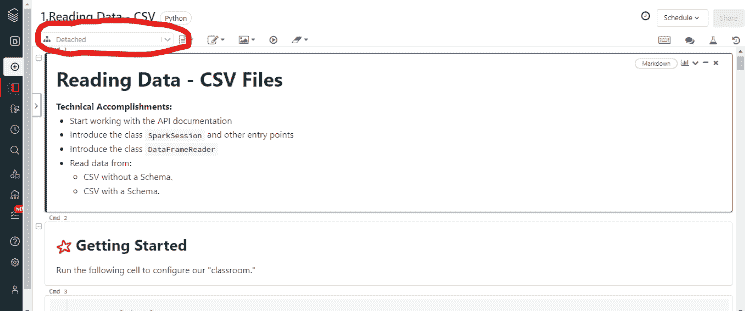

You will see that the cluster created earlier has not been attached.

在左上角，您可以将最初显示`Detached`的下拉列表更改为您的集群名称。我的名字叫`Salim Oyinlola's freeCodeCamp Cluster`。

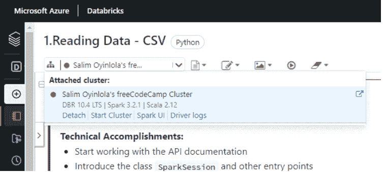

The cluster initially created is now attahed to the python notebook

连接集群后，您将依次运行所有单元。

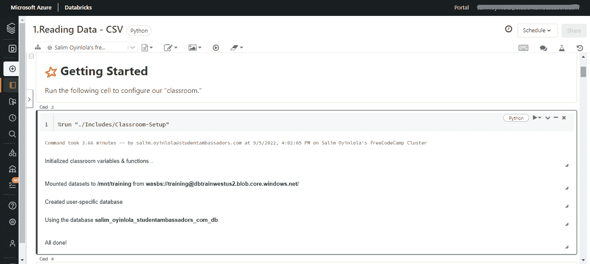

Running the first cell of the python notebook will initialize the classroom variables & function, mount the dataset and create user-specific database

就其核心而言，笔记本只是读取`csv`格式的数据。然后它添加了一个选项，告诉读者数据包含一个标题，并使用该标题来确定我们的列名。

您还可以添加一个选项，告诉读者推断每一列的数据类型(也称为模式)。

值得注意的是，数据可以以不同的格式读取，比如 JSON(有或没有模式)、parquet、表和视图。要做到这一点，您只需运行每种格式的笔记本即可。

## **如何将数据写入拼花文件**

正如读取数据有多种方式一样，写入数据也有多种方式。但是在这本笔记本中，我们将快速浏览一下如何将数据写回到 Parquet 文件中。

Apache Parquet 是 Hadoop 系统(如 Spark 和 Hive)使用的列存储文件格式。该文件格式是跨平台的、独立于语言的，并且它使用二进制表示以列布局存储数据。

有效存储大型数据集的 Parquet 文件的扩展名是`.parquet`。

就像读取数据时所做的一样，您也将一个接一个地运行单元格。

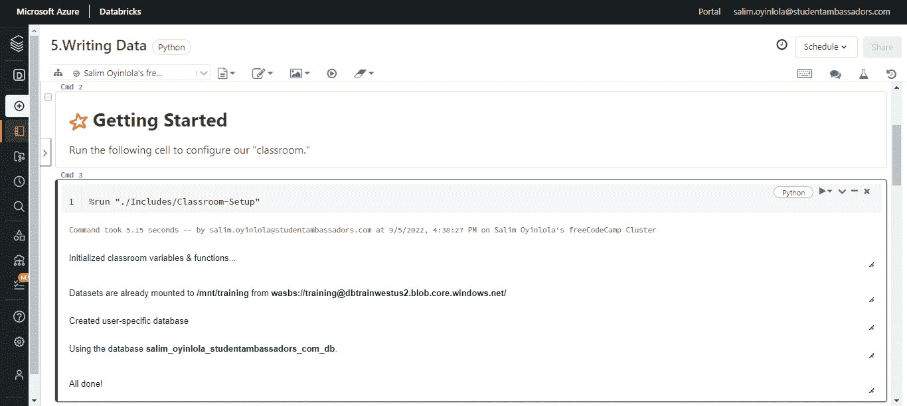

The cell to write data into a parquet file

写入 parquet 文件不可或缺的一部分是创建一个数据帧。您将通过运行此单元来创建一个。

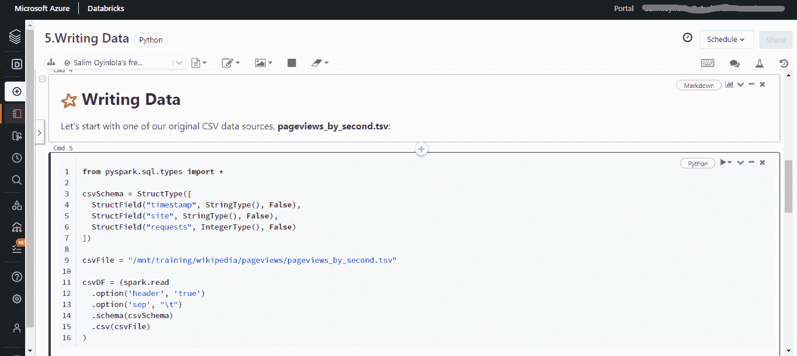

This cell shows that the existing files are being overwritten

下面显示的`.mode"overwrite"`方法意味着，通过将数据帧写入 parquet 文件，您将替换现有的文件。

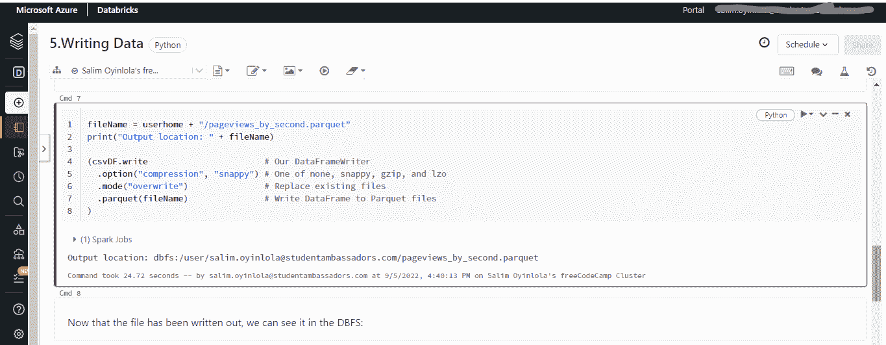

The file has been written and saved in an output location.

在其核心，笔记本读取一个`.tsv`文件(与用于读取`.csv`文件的相同),并将其作为一个拼花文件写回。

## **如何删除 Azure 数据块实例(可选)**

最后，您在本教程中创建的 Azure 资源可能会产生持续的成本。为了避免这种成本，删除包含所有这些资源的资源或资源组是很重要的。你可以通过使用 Azure 门户来做到这一点。

*   导航到 Azure 门户。
*   导航到包含 Azure Databricks 实例的资源组。
*   选择`Delete resource group`。
*   在确认文本框中键入资源组的名称。
*   选择`Delete`。

## **结论**

在本教程中，您已经学习了在 Azure Databricks 中读写数据的基础知识。

您现在知道了什么是 Azure Databricks，如何设置它，如何读取 CSV 和 parquet 文件，以及如何使用压缩选项将 parquet 文件读取到 Databricks 文件系统(DBFS)中。

最后，如果你喜欢这篇文章并想看更多，我在 [Twitter](https://twitter.com/SalimOpines) 上分享我的文章。

感谢您的阅读:)