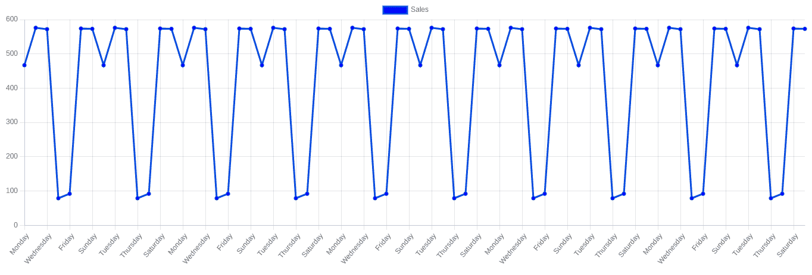
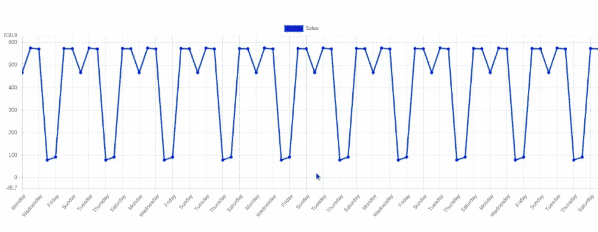

# 如何将 Chart.js 缩放插件添加到 Angular 应用程序

> 原文：<https://www.freecodecamp.org/news/chart-js-zooom-plugin/>

在本教程中，你将学习如何添加 Chart.js 缩放插件到一个角度应用程序。

当图表中有大量数据时，您可能想要放大并查看细节。折线图是可视化大量数据的好方法。您可以使用 Chart.js 中的缩放功能更仔细地浏览您的数据。

Chart.js 是一个开源库，您可以使用它在 Angular 应用程序的任何部分创建漂亮的图表。创建缩放功能是为了允许您放大某些数据点以便更仔细地检查。您可以通过使用鼠标滚轮滚动来快速轻松地缩放。

让我们看看它是如何工作的。

## 入门指南

我假设您已经知道如何在 Angular 应用程序中使用 Chart.js 来创建简单的折线图和条形图。

如果你做不到，不要担心，我会保护你的。可以关注我的 [Chart.js 教程——如何用 Angular](https://www.freecodecamp.org/news/how-to-make-bar-and-line-charts-using-chartjs-in-angular/) 制作条形图和折线图来入门。

我们将为折线图创建一个新的角度组件，然后将缩放插件加入其中。我们将使用大量的数据来看看缩放插件有多有用。

但是首先，在你的 Angular 应用程序中，你需要安装 Chart.js Zoom 插件，如果你还没有的话。

在 Angular 项目文件夹中打开一个新终端，并粘贴以下命令:

```
npm install chartjs-plugin-zoom 
```

这将把插件安装到你的 Angular 应用程序中。

现在让我们创建一个新的角度组件，并制作折线图。使用以下命令创建新的角度分量:

```
ng g c line-chart 
```

这将在`/src`目录中创建一个新的角度组件。

然后打开`line-chart.component.html`文件并粘贴以下代码:

```
<div class="chart-container">
      <canvas  id="MyChart" >{{ chart }}</canvas>
</div> 
```

现在打开`line-chart.component.ts`文件，删除里面的所有代码。然后粘贴以下代码:

```
import { Component, OnInit } from '@angular/core';
import Chart from 'chart.js/auto';

@Component({
  selector: 'app-line-chart',
  templateUrl: './line-chart.component.html',
  styleUrls: ['./line-chart.component.css']
})
export class LineChartComponent implements OnInit {

  constructor() { }

  ngOnInit(): void {
    this.createChart();
  }
  public chart: any;

  createChart() {

    this.chart = new Chart("MyChart", {
      type: 'line', //this denotes tha type of chart

      data: {// values on X-Axis
        labels: ["Monday", "Tuesday", "Wednesday", "Thursday", "Friday", "Saturday", "Sunday",
          "Monday", "Tuesday", "Wednesday", "Thursday", "Friday", "Saturday", "Sunday",
          "Monday", "Tuesday", "Wednesday", "Thursday", "Friday", "Saturday", "Sunday",
          "Monday", "Tuesday", "Wednesday", "Thursday", "Friday", "Saturday", "Sunday",
          "Monday", "Tuesday", "Wednesday", "Thursday", "Friday", "Saturday", "Sunday",
          "Monday", "Tuesday", "Wednesday", "Thursday", "Friday", "Saturday", "Sunday",
          "Monday", "Tuesday", "Wednesday", "Thursday", "Friday", "Saturday", "Sunday",
          "Monday", "Tuesday", "Wednesday", "Thursday", "Friday", "Saturday", "Sunday",
          "Monday", "Tuesday", "Wednesday", "Thursday", "Friday", "Saturday", "Sunday",
          "Monday", "Tuesday", "Wednesday", "Thursday", "Friday", "Saturday", "Sunday"],
        datasets: [
          {
            label: "Sales",
            data: ['467', '576', '572', '79', '92', '574', '573',
            '467', '576', '572', '79', '92', '574', '573',
            '467', '576', '572', '79', '92', '574', '573',
            '467', '576', '572', '79', '92', '574', '573',
            '467', '576', '572', '79', '92', '574', '573',
            '467', '576', '572', '79', '92', '574', '573',
            '467', '576', '572', '79', '92', '574', '573',
            '467', '576', '572', '79', '92', '574', '573',
            '467', '576', '572', '79', '92', '574', '573',
            '467', '576', '572', '79', '92', '574', '573', ],
            backgroundColor: 'blue',
            borderColor: "#084de0"
          }
        ]
      },
      options: {
        aspectRatio: 3
      }

    });
  }

} 
```

同样，如果你不知道这段代码是如何工作的，你可以随时回头参考这个 [Chart.js 教程](https://www.freecodecamp.org/news/how-to-make-bar-and-line-charts-using-chartjs-in-angular/)。

我们需要将折线图组件的 HTML 选择器添加到`app.component.html`文件中。删除 Angular 的初始模板代码，并添加以下内容:

```
<app-line-chart></app-line-chart> 
```

使用以下命令启动本地开发服务器:

```
ng serve -o 
```

将在 [http://localhost:4200/](http://localhost:4200/) 上打开一个浏览器窗口，您可以看到正在运行的 Angular 应用程序。



正如你所看到的，为了呈现整个图表，这个图表开始跳过一些标签。如果图表有更多的数据，情况似乎会更糟。

现在让我们为图表添加一个缩放功能，这样我们就可以放大数据点以便更仔细地观察。

## 如何添加 Chart.js 缩放插件

打开`line-chart.component.ts`文件，导入 chart.js 缩放插件。请确保在导入后注册它。以下代码将向您展示如何做到这一点:

```
import zoomPlugin from 'chartjs-plugin-zoom';
Chart.register(zoomPlugin); 
```

现在您已经导入了插件，在 Chart.js 选项中，我们将添加插件并启用滚轮缩放。

```
options: {
        aspectRatio: 3,
        plugins: {
          zoom: {
            zoom: {
              wheel: {
                enabled: true,
              },
              pinch: {
                enabled: true
              },
              mode: 'xy',
            }
          }
        }
      } 
```



正如你所看到的，现在我们可以放大我们想要近距离观察的点。

## 包扎

这个 Angular 应用程序的完整代码存放在我的 GitHub 上。

我希望这篇教程对你有所帮助。如果您有任何问题或意见，请随时通过 [LinkedIn](http://www.linkedin.com/in/swatejpatil/) 联系我。我将非常乐意帮助你解决问题。

感谢您的阅读！

艾萨克·史密斯在 [Unsplash](https://unsplash.com/s/photos/line-chart?utm_source=unsplash&utm_medium=referral&utm_content=creditCopyText) 上拍摄的照片