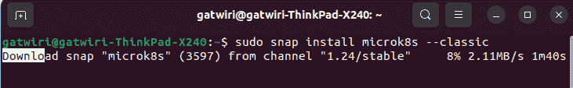
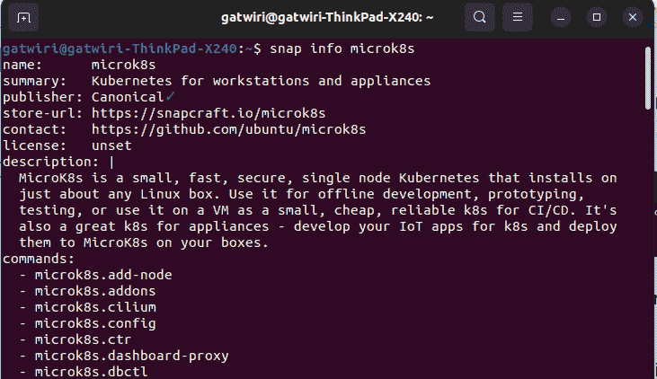
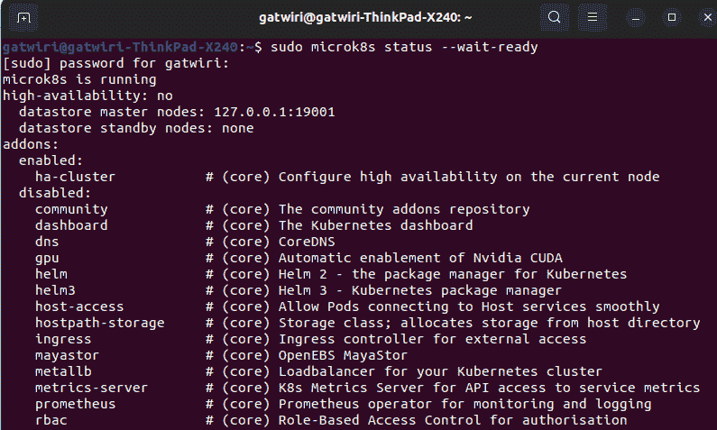
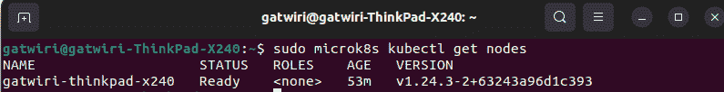
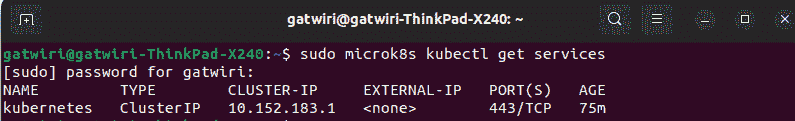
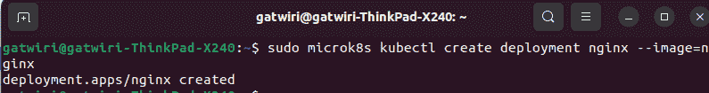
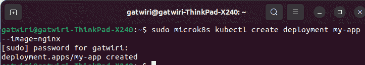

# 什么是容器编排？如何使用 MicroK8s 管理您的容器

> 原文：<https://www.freecodecamp.org/news/container-orchestration-for-beginners/>

容器编排被称为技术世界的下一件大事。原因显而易见。

容器编排帮助 IT 专业人员和程序员最大限度地提高应用程序的性能。这有助于确保多个容器能够协同工作，同时处理比任何一个容器单独处理的任务都多的任务。

但是容器编排到底是如何工作的呢？它的优势是什么，你如何着手实施它？这篇文章将回答你所有的疑问和更多的问题。

## 先决条件

要理解容器编排，您需要:

*   Ubuntu 22.04 LTS，或任何其他版本都可以。
*   对什么是容器及其功能有基本的了解
*   持续的互联网连接
*   Sudo 权限

## 你将学到什么

如果您不熟悉容器编排，您可能会想知道这有什么大惊小怪的。

在本教程中，我们将介绍容器编排的优势以及如何在您的组织中应用它。

最后，您将更好地理解为什么容器编排如此重要，以及它如何帮助您的业务更高效地运行。

## 什么是容器编排？

如果你在经营一家企业，你很有可能使用容器来运行你的应用程序。但是什么是容器编排呢？

简而言之，这是一种管理和自动化容器的部署、伸缩和管理的方法。

## 使用容器编制器的好处

使用容器编排器有很多好处，包括提高效率、可伸缩性和可移植性。

container orchestrator 还可以帮助您管理应用程序的生命周期，使部署和更新应用程序变得更加容易。此外，container orchestrator 可以帮助您自动化诸如监控和日志记录之类的任务。

使用容器编排器，您可以为每个容器定义资源约束。例如，如果您的一个容器比另一个容器需要更多的 CPU 能力，容器编排器将相应地分配资源。

## 如何选择您的容器编排平台

在选择容器编排平台时，您应该考虑一些事情。首先是你想要一个自托管还是基于云的解决方案。如果您刚刚开始使用容器，基于云的解决方案可能是理想的选择。

另一件要考虑的事情是你需要什么特性。一些平台比其他平台提供更全面的管理工具。

最后，考虑该平台的易用性，以及它是否能与您正在使用的其他工具很好地集成。

## 示例堆栈概述

在典型的容器编排设置中，您将有几个不同的组件协同工作来提供一个完整的解决方案。

例如，您可能有:

*   存储图像的容器注册表
*   容器运行时，它管理容器的生命周期
*   以及一个容器编排平台，为您的容器提供调度和协调。

一些需要协调方法的用例包括持续集成/部署(CI/CD)和批处理。

CI/CD 管道是一个自动化系统，通过减少部署脚本和配置管理等手动任务，帮助开发人员随时将新功能发布到产品中。

批处理工作负载是指许多计算密集型任务在特定时间段内共享资源，例如在周末或需求较低的下班时间。

执行这些任务的一种方法是使用队列，但是这种方法伸缩性不好。为了并行处理更多的作业，您需要一个能够管理成百上千个并发作业的调度程序。

批处理对数据一致性也有严格的要求:它不能容忍单个作业之间执行时间的高度可变性，因为它们之间可能存在一些依赖关系。

通过智能地管理它们运行作业的顺序来减少执行时间的可变性的调度算法在这里是优选的。

## 如何规划您的实施

### 步骤 1–决定架构

既然您已经知道了什么是容器编排以及为什么需要它，那么是时候开始规划您的实现了。

第一步是决定系统的架构。这将涉及决定您需要多少个节点，每个节点将使用什么类型的存储，以及节点将如何互连。

一旦您很好地理解了您想要的架构，您就可以开始寻找适合您需求的不同的编排解决方案。

有两种常见的方法可以编排容器:基于调度程序的编排和基于资源的编排。

在基于调度器的编排中，外部调度器决定容器应该在何时何地运行。在基于资源的编排中，资源的分配是由编排器根据预先配置的策略在内部完成的。

如果您希望对容器的放置有更多的控制，那么基于调度器的编排可能更适合您。如果您希望减少配置资源的开销，那么基于资源的编排可能更合适。

### 第二步-准备

随着公司的扩张，你需要考虑如何扩展。

一种方法是使用容器编排。这允许您更有效地管理和部署容器。您甚至可以设置一个自动化功能，根据需要自动为您进行扩展。

### 第三步——把所有的东西放在一起

既然您已经了解了容器编排的基础知识以及它如何为您的业务带来好处，那么是时候将它们整合在一起了。以下是您需要采取的步骤:

1.  定义你的目标和目的。您想通过容器编排实现什么？
2.  为工作选择合适的工具。有各种各样的容器编排工具可供使用，所以请进行研究，找到最适合您需求的工具。
3.  设置您的环境。如果你不知道你在做什么，把你的容器放好会很有挑战性。开始之前，请务必通读文档并遵循任何说明。
4.  测试一下！在完全提交之前，尝试使用新的流程编排系统运行您的应用。一旦已经在生产服务器上实现，您最不希望的事情就是不能按计划工作或进行。幸运的是，事先测试将有助于你减少未来的任何意外。

现在，您已经在较高的层次上了解了容器编排的基础，是时候开始了！

## 容器编排平台的类型

有三种主要类型的容器编排平台:Kubernetes、Docker Swarm 和 Apache Mesos。每一种都有优点和缺点，所以选择最适合你的是至关重要的。

例如，如果你是一家 IT 资源有限的初创企业或小型企业，那么你可能会希望使用 Docker Swarm。它是为没有很多系统管理员的团队设计的。

对于拥有更有经验的 IT 人员的大型企业来说，Kubernetes 是一个不错的选择，因为它更具可伸缩性，并且对如何部署容器提供了更多的控制。但是 Kubernetes 和 Docker Swarm 都提供了出色的可伸缩性以及高度的用户友好性。

在本教程中，我们将使用 Kubernetes。Kubernetes 是一个开源的容器编制器。通过用 Kubernetes 编排您的容器，您可以自动化许多与管理它们相关的任务。

## 如何将 Kubernetes 作为单个节点安装

开始使用 Kubernetes 的一个选择是将其作为单个节点安装。这是学习系统基础知识和感受其工作原理的好方法。另外，它的设置相对简单。

Kubernetes 是一个开放的平台，允许你自己做出许多决定，这真的很有帮助。

在下面的教程中，我决定使用:

*   Ubuntu 22.04。如果您正在使用任何其他操作系统，您可以在此了解更多[。](https://kubernetes.io/docs/home/)
*   MicroK8s。从单个节点，MicroK8s 只需几分钟就能创建一个经过认证的 Kubernetes 集群。Canonical 的 Microk8s Kubernetes 发行版体积小、功能多且可移植。

### 第一步:使用 snap 包安装 MicroK8s。

MicroK8s 是以 snap 的形式发布的，这就需要安装 snapd。这已经包含在最新版本的 Ubuntu 中了。

键入以下命令以获取最新版本的 MicroK8s:

```
sudo snap install microk8s --classic
```

运行上面的命令后。它将开始下载 MicroK8s，如下图所示。



### 第二步:在你的 Ubuntu 系统上，列出 Microk8s 的各种版本。

您可以使用下面的 snap 命令来查看所有可能的 microk8s 版本。

```
snap info microk8s
```

当您执行上面的命令时，您应该会看到下图中的输出:



### 第三步:检查 MicroK8s 是否已经安装。

您可以使用 Ubuntu 中现有的命令来检查 MicroK8s 的状态。为此，请在终端中输入以下命令。

```
sudo microk8s status --wait-ready
```

请注意，要等待 Kubernetes 服务启动，您必须在安装过程中使用“-wait-ready”参数。

执行该命令后，您将获得以下输出:



### 步骤 4:连接到 Kubernetes

现在最关键的一步是进入 Kubernetes。MicroK8s 提供了它的 kubectl 版本，用于与 Kubernetes 交互。它能够运行跟踪和控制 Kubernetes 集群的命令。

在终端中输入以下命令，查看当前节点。

```
sudo microk8s kubectl get nodes
```

运行上面的命令后，您将获得以下输出。如您所见，状态为“就绪”。通过使用这个命令，您还可以查看节点的名称、角色、年龄和版本。



### 步骤 5:检查正在运行的服务

如果您希望查看当前正在运行的 MicroK8s 服务，请使用以下命令:

```
sudo microk8s kubectl get services
```

此命令显示当前运行的服务的名称、类型、集群 IP、外部 IP、端口和年龄。



### 步骤 6:用 MickroK8s 部署应用程序。

在下面的例子中，我们使用 kubectl 来部署一个 NGINX 应用程序。要成功部署 NGINX，请输入以下命令:

```
sudo microk8s kubectl create deployment nginx --image=nginx
```

正如您在下图中看到的，应用程序已经部署:



您可以使用相同的命令来部署任何其他应用程序。

确保您记得将`Nginx`替换为您喜欢的应用程序名称，如下图所示。



## 结论

如果您正在寻找一种方法来提高应用程序的效率和部署，容器编排是一个很好的解决方案。

通过使用容器，您可以将应用程序的所有必要组件打包到一个易于部署的单元中。

另外，通过使用像 Kubernetes 这样的容器编排工具，您可以自动化整个过程。你不用担心手动配置任何东西；只需编写一些代码，将其放入容器中，然后部署即可。

有了这种自动化，事情只会变得更容易。