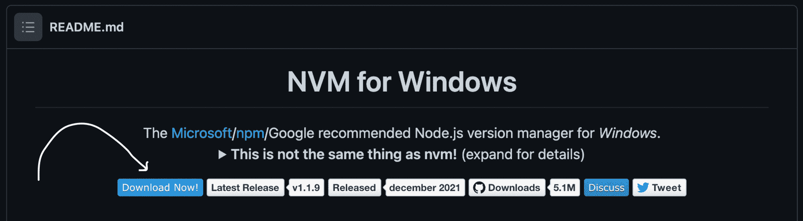
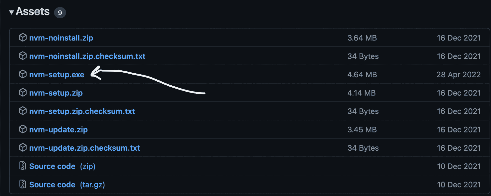

# 节点版本管理器–nvm 安装指南

> 原文：<https://www.freecodecamp.org/news/node-version-manager-nvm-install-guide/>

在本文中，我将解释如何在 Windows、Linux 和 Mac 上安装 NVM 或节点版本管理器。

## NVM 是什么？

顾名思义，节点版本管理器(NVM)是一种用于管理设备上的节点版本的工具。

设备上的不同项目可能使用不同版本的 Node。对这些不同的项目只使用一个版本(由`npm`安装的版本)可能不会给你准确的执行结果。

例如，如果您为使用 **12.0.0** 的项目使用 **10.0.0** 的节点版本，您可能会得到一些错误。而如果你用 npm 把节点版本更新到 **12.0.0** ，你用在一个使用 **10.0.0** 的项目上，你可能得不到预期的体验。

事实上，您很可能会收到一条警告，上面写着:

```
This project requires Node version X 
```

您可以使用 **nvm** 来帮助您有效地管理每个项目的节点版本，而不是使用 npm 来安装和卸载不同项目的节点版本。

NVM 允许你安装不同版本的 Node，并通过命令行根据你正在进行的项目在这些版本之间切换。

在接下来的部分中，我将向您展示如何在您的 Windows、Linux 或 Mac 设备上安装 NVM。

在继续之前，我还建议您卸载 Node.js(如果您已经安装了它),这样您就不会与 Node.js 和 nvm 发生任何冲突。

## 如何在 Windows 上安装 NVM

NVM 主要在 Linux 和 Mac 上受支持。它不支持 Windows。但是 coreybutler 创造了一个类似的工具，在 Windows 中提供 nvm 体验，叫做 [nvm-windows](https://github.com/coreybutler/nvm-windows) 。

`nvm-windows`提供一个管理实用程序，用于管理 Windows 中的 Node.js 版本。以下是安装方法:

### 1.点击“立即下载”

在 [nvm-windows 存储库自述文件](https://github.com/coreybutler/nvm-windows#readme)中，点击“立即下载！”：



这将打开一个页面，显示不同的 NVM 版本。

### 2.安装。最新版本的 exe 文件

在最新的版本中(在撰写本文时是 1.1.9 )，您会发现不同的资产。点击 nvm-setup.exe 资产**，这是工具的安装文件；**



### 3.完成安装向导

打开您下载的文件，并完成安装向导。

完成后，您可以通过运行以下命令来确认 nvm 已安装:

```
nvm -v 
```

如果 nvm 安装正确，此命令将显示安装的 nvm 版本。

## 如何在 Linux 和 Mac 上安装 NVM

由于 Linux 和 Mac 有一些相似之处(它们都是基于 UNIX 的操作系统)，您可以用类似的方法在它们上面安装 nvm。

### 1.运行 nvm 安装程序

在您的终端中，运行 nvm 安装程序，如下所示:

```
curl -o- https://raw.githubusercontent.com/nvm-sh/nvm/v0.39.1/install.sh | bash

# or

wget -qO- https://raw.githubusercontent.com/nvm-sh/nvm/v0.39.1/install.sh | bash 
```

根据设备上可用的命令，您可以使用`curl`或`bash`。

这些命令会将 nvm 存储库克隆到设备上的一个`~/.nvm`目录中。

### 2.更新您的个人资料配置

步骤 1 中的安装过程也会自动将 nvm 配置添加到您的配置文件中。如果你用的是 zsh，那就是`~/.zshrc`。如果你使用 bash，那就是`~/.bash_profile`...或者一些其他轮廓。

如果它没有自动添加 nvm 配置，您可以自己将其添加到您的配置文件中:

```
export NVM_DIR="$([ -z "${XDG_CONFIG_HOME-}" ] && printf %s "${HOME}/.nvm" || printf %s "${XDG_CONFIG_HOME}/nvm")"
[ -s "$NVM_DIR/nvm.sh" ] && \. "$NVM_DIR/nvm.sh" 
```

上面的命令加载 nvm 以供使用。

### 3.重新加载外壳配置

随着您的配置文件配置的更新，现在您将重新加载配置供您的终端使用:

```
source ~/.bashrc 
```

执行此命令后，nvm 就可以使用了。您可以通过运行以下命令来确认 nvm 安装正确:

```
nvm -v 
```

这应该显示安装的 nvm 的版本。

## 包扎

安装 nvm 后，您现在可以在 Windows、Linux 或 Mac 设备中安装、卸载不同的节点版本，并在不同的节点版本之间切换。

您可以像这样安装节点版本:

```
nvm install latest 
```

此命令将安装节点的最新版本:

```
nvm install vX.Y.Z 
```

这将安装`X.Y.Z`节点版本。

您还可以通过运行以下命令将某个版本设为默认版本:

```
nvm alias default vX.Y.Z 
```

如果您想随时使用特定的版本，可以在终端中运行以下命令:

```
nvm use vA.B.C 
```

NVM 使得跨需要不同版本的不同项目管理 Node.js 的多个版本变得更加容易。