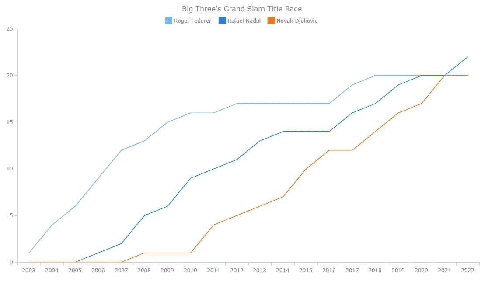
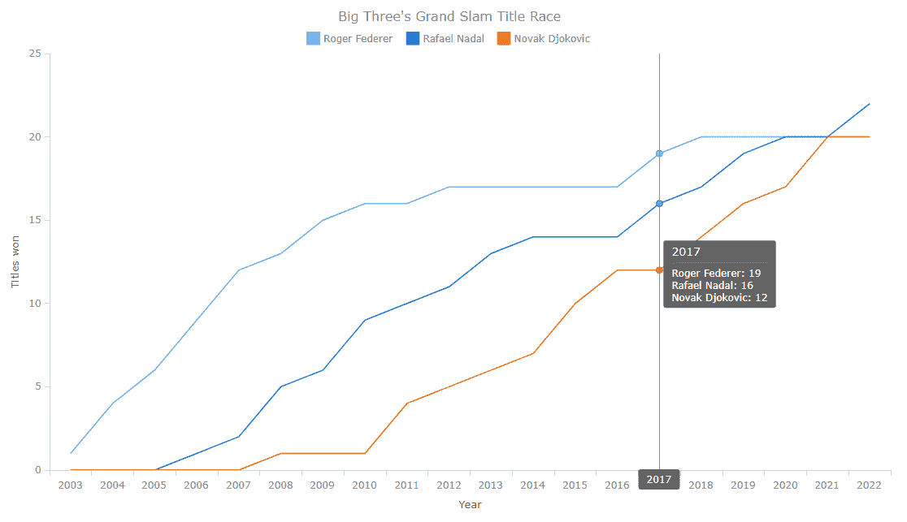
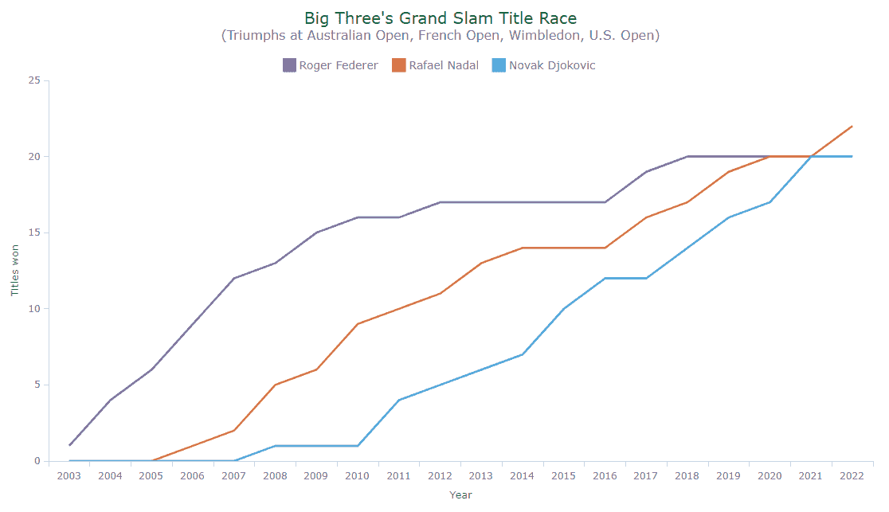
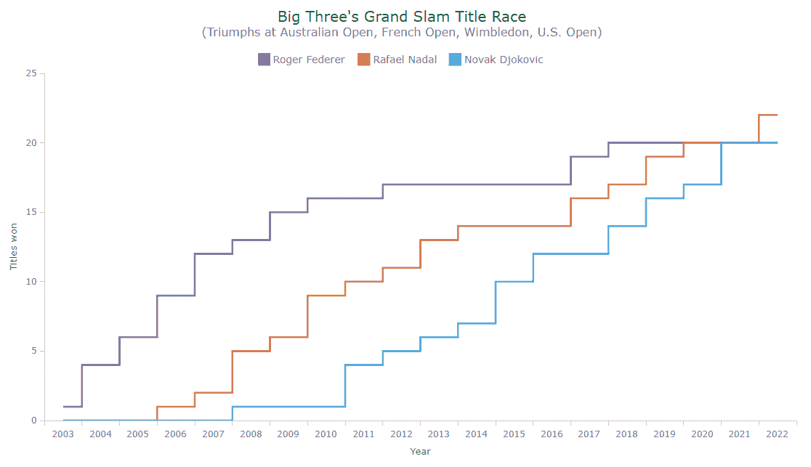

# 折线图教程–如何用 JavaScript 创建折线图

> 原文：<https://www.freecodecamp.org/news/how-to-make-line-charts-in-javascript/>

数据可视化是一个广阔的领域，有如此多不同类型的图表需要学习和创建。

但是有几个基本的、常青的图表，每个处理分析的数据设计师和 web 开发人员都应该知道如何构建。

其中一个是**折线图**(或**折线图**)。它主要被设计用来表示随时间变化的数据。

您可以跟随本教程学习如何使用 JavaScript 快速创建漂亮的交互式折线图(和步进线图)。我们将看一些很酷的例子，并一步一步地构建它们，这将使过程既清晰又有趣。

为了您的方便，您可以在 [CodePen](https://codepen.io/collection/pgPwyr) 上找到它们，这样您就可以无限制地进一步使用线条图代码。

### 我们的数据集

过去的 20 年在网球界可谓波澜壮阔。三巨头——罗杰·费德勒、拉斐尔·纳达尔和诺瓦克·德约科维奇——在过去的 78 场大满贯赛事中总共赢得了令人惊讶的 63 场。这些是最负盛名的锦标赛。

我决定画出他们杰出的竞争。因此，本教程中的 JS 线图将可视化**三巨头的大满贯冠军赛**。而且第一次发球已经来了！

# **如何通过 4 个步骤构建折线图**

一般来说，用 JavaScript 创建任何图表的整个过程分为四个步骤，折线图也不例外:

1.  制作一个带有容器的 HTML 页面。
2.  包括 JavaScript 文件。
3.  添加您的数据。
4.  编写可视化代码。

现在让我们来看一下这些步骤。

### 1.用容器制作一个 HTML 页面

首先，您需要一个您希望图表出现的位置。

如果你还没有，创建一个基本的网页。然后为折线图创建一个容器——添加一个 HTML 块级元素，并给它一个惟一的 ID 以供进一步引用。

这种页面可能是这样的:

```
<html>
  <head>
    <title>Line Chart JS</title>
    <style type="text/css">      
      html, body, #container { 
        width: 100%; height: 100%; margin: 0; padding: 0; 
      } 
    </style>
  </head>
  <body>
    <div id="container"></div>
  </body>
</html>
```

元件的`width`和`height`参数设置为 100%。因此，折线图将呈现在整个网页上。当然，您可以根据自己的喜好和需求设置风格设置。

### 2.包括 JavaScript 文件

接下来，在`<head>`部分包含所有 JavaScript 文件，我们将使用它们来创建折线图。

有一大堆不同的 [JavaScript 图表库](https://en.wikipedia.org/wiki/Comparison_of_JavaScript_charting_libraries)让你以一种快速简单的方式可视化数据。其中许多都支持折线图，您可以根据您的项目需求选择一种或另一种。

为了便于说明，在本教程中，我使用了 [AnyChart JS Charts](https://www.anychart.com/) 。它很灵活，附带了大量的[制图文档](https://docs.anychart.com)和 [API 引用](https://api.anychart.com)，你可以免费使用它(除非你是在为一家企业做什么)。)

对于折线图，我添加了来自 [CDN](https://www.anychart.com/download/cdn/) 的“基础”模块。(当然，你可以下载它，放在你网站的一个文件夹里，在那种情况下使用你自己的链接。)

```
<html>
  <head>
    <title>Line Chart JS</title>
    <script src="https://cdn.anychart.com/releases/8.11.0/js/anychart-base.min.js"></script>
    <style type="text/css">      
      html, body, #container { 
        width: 100%; height: 100%; margin: 0; padding: 0; 
      } 
    </style>
  </head>
  <body>  
    <div id="container"></div>
    <script>
      // JavaScript code for the line chart.
    </script>
  </body>
</html>
```

线图的 JavaScript 代码将被插入到位于`<body>`部分的`<script>`和`</script>`标记之间(如果您愿意，可以将它们放在`<head>`部分)。

### 3.添加您的数据

然后，添加要在折线图中显示的数据。

我按年份统计了费德勒、纳达尔和德约科维奇获得的所有大满贯单打冠军。我会把它作为数组的数组来添加。

如果您在特定情况下喜欢其他格式，比如 JSON、XML、CSV 或其他格式，请查看使用数据的[方式](https://docs.anychart.com/Working_with_Data/Overview)。

```
var data = [
  ["2003", 1, 0, 0],
  ["2004", 4, 0, 0],
  ["2005", 6, 0, 0],
  ["2006", 9, 1, 0],
  ["2007", 12, 2, 0],
  ["2008", 13, 5, 1],
  ["2009", 15, 6, 1],
  ["2010", 16, 9, 1],
  ["2011", 16, 10, 4],
  ["2012", 17, 11, 5],
  ["2013", 17, 13, 6],
  ["2014", 17, 14, 7],
  ["2015", 17, 14, 10],
  ["2016", 17, 14, 12],
  ["2017", 19, 16, 12],
  ["2018", 20, 17, 14],
  ["2019", 20, 19, 16],
  ["2020", 20, 20, 17],
  ["2021", 20, 20, 20],
  ["2022", 20, 22, 20]
];
```

在每个数组中，年份是第一个参数(第 0 列)。接下来是三名球员随后赢得的冠军数量(每个球员的累计)。

### 4.编写可视化代码

现在，热身赛已经结束，场地也准备好了。因此，让我们开始比赛，并做一些快速的 JavaScript 编码！

首先添加`anychart.onDocumentReady()`，如下图所示:

```
<script>
  anychart.onDocumentReady(function() {
    // The main JS line charting code will be here.
  });
</script>
```

其他的都在这个函数里面。

因此，第二步，包括数据(来自上一步)。

第三，创建一个数据集，并为每个系列进行映射(每个球员一个):

```
// create a data set
var dataSet = anychart.data.set(data);

// map the data for all series
var firstSeriesData = dataSet.mapAs({x: 0, value: 1});
var secondSeriesData = dataSet.mapAs({x: 0, value: 2});
var thirdSeriesData = dataSet.mapAs({x: 0, value: 3});
```

第四，创建一个折线图实例和三个包含映射数据的序列:

```
// create a line chart
var chart = anychart.line();

// create the series and name them
var firstSeries = chart.line(firstSeriesData);
firstSeries.name("Roger Federer");
var secondSeries = chart.line(secondSeriesData);
secondSeries.name("Rafael Nadal");
var thirdSeries = chart.line(thirdSeriesData);
thirdSeries.name("Novak Djokovic");
```

第五，为了使折线图中显示的内容一目了然，一个好主意是添加一个图例和一个标题:

```
// add a legend
chart.legend().enabled(true);

// add a title
chart.title("Big Three's Grand Slam Title Race");
```

最后，引用容器元素 ID 并绘制结果折线图:

```
// specify where to display the chart
chart.container("container");

// draw the resulting chart
chart.draw();
```

就是这样！一个用 JS 构建的全功能线图就做好了。感觉像是直落两盘的胜利，不是吗？



Line chart showing the Big 3't title race - created with AnyChart

在 [CodePen](https://codepen.io/shacheeswadia/pen/gOvjVaK) 上查看这个基本版的折线图，其中包含完整的 HTML/CSS/JS 代码。为了以防万一，这里也有代码:

```
<html>
  <head>
    <title>Line Chart JS</title>
    <script src="https://cdn.anychart.com/releases/8.11.0/js/anychart-base.min.js"></script>
    <style type="text/css">      
      html, body, #container { 
        width: 100%; height: 100%; margin: 0; padding: 0; 
      } 
    </style>
  </head>
  <body>  
    <div id="container"></div>
    <script>
      anychart.onDocumentReady(function () {

        // add data
        var data = [
          ["2003", 1, 0, 0],
          ["2004", 4, 0, 0],
          ["2005", 6, 0, 0],
          ["2006", 9, 1, 0],
          ["2007", 12, 2, 0],
          ["2008", 13, 5, 1],
          ["2009", 15, 6, 1],
          ["2010", 16, 9, 1],
          ["2011", 16, 10, 4],
          ["2012", 17, 11, 5],
          ["2013", 17, 13, 6],
          ["2014", 17, 14, 7],
          ["2015", 17, 14, 10],
          ["2016", 17, 14, 12],
          ["2017", 19, 16, 12],
          ["2018", 20, 17, 14],
          ["2019", 20, 19, 16],
          ["2020", 20, 20, 17],
          ["2021", 20, 20, 20],
          ["2022", 20, 22, 20]
        ];

        // create a data set
        var dataSet = anychart.data.set(data);

        // map the data for all series
        var firstSeriesData = dataSet.mapAs({x: 0, value: 1});
        var secondSeriesData = dataSet.mapAs({x: 0, value: 2});
        var thirdSeriesData = dataSet.mapAs({x: 0, value: 3});

        // create a line chart
        var chart = anychart.line();

        // create the series and name them
        var firstSeries = chart.line(firstSeriesData);
        firstSeries.name("Roger Federer");
        var secondSeries = chart.line(secondSeriesData);
        secondSeries.name("Rafael Nadal");
        var thirdSeries = chart.line(thirdSeriesData);
        thirdSeries.name("Novak Djokovic");

        // add a legend
        chart.legend().enabled(true);

        // add a title
        chart.title("Big Three's Grand Slam Title Race");

        // specify where to display the chart
        chart.container("container");

        // draw the resulting chart
        chart.draw();

      });
    </script>
  </body>
</html>
```

# **如何定制您的折线图**

我们按照上面的四个步骤创建的基本折线图看起来已经很不错了。但是如果要定制呢？

让我告诉你如何以同样快速简单的方式做一些改变。

### 1.命名坐标轴

解释折线图的每个轴代表什么总是一个好主意，即使它看起来很明显。要向 X 轴和 Y 轴添加标题，请使用以下命令:

```
chart.yAxis().title("Titles won");
chart.xAxis().title("Year");
```

### 2.自定义标记

默认情况下，当您在绘图上移动鼠标指针时，标记会显示在每个线条系列上，并且它们的形状是不同的。为什么不给马克笔同样的形状呢？另外，如果能让它们变小就太好了。

了解如何自定义线条系列标记的外观:

```
firstSeries.hovered().markers().type("circle").size(4);
secondSeries.hovered().markers().type("circle").size(4);
thirdSeries.hovered().markers().type("circle").size(4);
```

### 3.启用十字光标

十字光标是跟随鼠标指针的一对垂直线，有助于您更好地理解任何当前悬停点的 X 和 Y 值。

在这种情况下，只需要一条垂直线来突出年份就足够了。这是如何做到的:

```
chart.crosshair().enabled(true).yStroke(null).yLabel(false);
```

### 4.更改工具提示位置

目前，工具提示跟随鼠标指针。但是在这种情况下，让它坚持数据点可能会更好。

要实现这种行为，只需将折线图工具提示位置模式定义为“点”，并根据您的喜好微调其他位置设置。例如:

```
chart.tooltip().positionMode("point");
chart.tooltip().position("right").anchor("left-center").offsetX(5).offsetY(5);
```

看看在所有这些定制之后 JavaScript 折线图现在是什么样子。(在 [CodePen](https://codepen.io/shacheeswadia/pen/vYdaoyR) 上查看完整代码。)



### 5.改变颜色

个性化数据可视化的一个最简单也是最有效的方法是使用颜色。

下面的代码将每个球员的线条颜色改为他赢得次数最多的大满贯赛事的主色调:温网的紫色代表费德勒，法网的棕色代表纳达尔，澳网的蓝色代表德约科维奇。此外，还会调整线条的粗细。

```
firstSeries.normal().stroke("#7b60a2", 2.5);
secondSeries.normal().stroke("#db7346", 2.5);
thirdSeries.normal().stroke("#43a7dc", 2.5);
```

### 6.改进标题和图例文本

我想在本教程中演示的最后一个变化是定制标题和图例，这将使交互式折线图更加完整。

您可以添加一个副标题来提供更多的上下文，还可以借助 HTML 进行一些快速调整，使文本样式更具吸引力:

```
chart
  .title()
  .enabled(true)
  .useHtml(true)
  .text(
    '<span style="color: #006331; font-size:20px;">Big Three&#39;s Grand Slam Title Race</span>' +
      '<br/><span style="font-size: 16px;">(Triumphs at Australian Open, French Open, Wimbledon, U.S. Open)</span>'
  );
```

对于图表图例，很容易修改字体大小和填充:

```
chart.legend().enabled(true).fontSize(14).padding([10, 0, 10, 0]);
```

看看我们有什么！(在 [CodePen](https://codepen.io/shacheeswadia/pen/wvyxVqZ) 上查看这个 JS 折线图。)



[https://codepen.io/shacheeswadia/embed/preview/wvyxVqZ?default-tabs=js%2Cresult&height=300&host=https%3A%2F%2Fcodepen.io&slug-hash=wvyxVqZ](https://codepen.io/shacheeswadia/embed/preview/wvyxVqZ?default-tabs=js%2Cresult&height=300&host=https%3A%2F%2Fcodepen.io&slug-hash=wvyxVqZ)

## 如何创建步骤折线图

就像当一场网球比赛是五盘比赛时总是更令人兴奋一样，这里有一些额外的东西使这个教程和这个线图可视化更加令人敬畏。

从数据可视化的角度来看，阶梯式折线图在这种情况下实际上会更好。我们可以做一个小小的改动。

只需将`line()`功能更改为`stepLine()`，您的折线图将变成阶梯式折线图:

```
// create a stepped line chart
var chart = anychart.stepLine();

// create the series and name them
var firstSeries = chart.stepLine(firstSeriesData);
firstSeries.name("Roger Federer");
var secondSeries = chart.stepLine(secondSeriesData);
secondSeries.name("Rafael Nadal");
var thirdSeries = chart.stepLine(thirdSeriesData);
thirdSeries.name("Novak Djokovic");
```

享受优雅的 JavaScript 支持的阶梯式线图，可视化网球三巨头之间的大满贯冠军赛。(请在 [CodePen](https://codepen.io/shacheeswadia/pen/zYRmXpv) 上随意探索并继续使用它的完整源代码。)



这是完整的代码:

```
<html>
  <head>
    <title>Line Chart JS</title>
    <script src="https://cdn.anychart.com/releases/8.11.0/js/anychart-base.min.js"></script>
    <style type="text/css">      
      html, body, #container { 
        width: 100%; height: 100%; margin: 0; padding: 0; 
      } 
    </style>
  </head>
  <body>  
    <div id="container"></div>
    <script>
      anychart.onDocumentReady(function () {

        // add data
        var data = [
          ["2003", 1, 0, 0],
          ["2004", 4, 0, 0],
          ["2005", 6, 0, 0],
          ["2006", 9, 1, 0],
          ["2007", 12, 2, 0],
          ["2008", 13, 5, 1],
          ["2009", 15, 6, 1],
          ["2010", 16, 9, 1],
          ["2011", 16, 10, 4],
          ["2012", 17, 11, 5],
          ["2013", 17, 13, 6],
          ["2014", 17, 14, 7],
          ["2015", 17, 14, 10],
          ["2016", 17, 14, 12],
          ["2017", 19, 16, 12],
          ["2018", 20, 17, 14],
          ["2019", 20, 19, 16],
          ["2020", 20, 20, 17],
          ["2021", 20, 20, 20],
          ["2022", 20, 22, 20]
        ];

        // create a data set
        var dataSet = anychart.data.set(data);

        // map the data for all series
        var firstSeriesData = dataSet.mapAs({x: 0, value: 1});
        var secondSeriesData = dataSet.mapAs({x: 0, value: 2});
        var thirdSeriesData = dataSet.mapAs({x: 0, value: 3});

        // create a stepped line chart
        var chart = anychart.stepLine();

        // create the series and name them
        var firstSeries = chart.stepLine(firstSeriesData);
        firstSeries.name("Roger Federer");
        var secondSeries = chart.stepLine(secondSeriesData);
        secondSeries.name("Rafael Nadal");
        var thirdSeries = chart.stepLine(thirdSeriesData);
        thirdSeries.name("Novak Djokovic");

        // add a legend and customize it
        chart.legend().enabled(true).fontSize(14).padding([10, 0, 10, 0]);

        // add a title and customize it
        chart
          .title()
          .enabled(true)
          .useHtml(true)
          .text(
            '<span style="color: #006331; font-size:20px;">Big Three&#39;s Grand Slam Title Race</span>' +
              '<br/><span style="font-size: 16px;">(Triumphs at Australian Open, French Open, Wimbledon, U.S. Open)</span>'
          );

        // name the axes
        chart.yAxis().title("Titles won");
        chart.xAxis().title("Year");

        // customize the series markers
        firstSeries.hovered().markers().type("circle").size(4);
        secondSeries.hovered().markers().type("circle").size(4);
        thirdSeries.hovered().markers().type("circle").size(4);

        // turn on crosshairs and remove the y hair
        chart.crosshair().enabled(true).yStroke(null).yLabel(false);

        // change the tooltip position
        chart.tooltip().positionMode("point");
        chart.tooltip().position("right").anchor("left-center").offsetX(5).offsetY(5);

        // customize the series stroke in the normal state
        firstSeries.normal().stroke("#7b60a2", 2.5);
        secondSeries.normal().stroke("#db7346", 2.5);
        thirdSeries.normal().stroke("#43a7dc", 2.5);

        // specify where to display the chart
        chart.container("container");

        // draw the resulting chart
        chart.draw();

      });
    </script>
  </body>
</html>
```

[https://codepen.io/shacheeswadia/embed/preview/zYRmXpv?default-tabs=js%2Cresult&height=300&host=https%3A%2F%2Fcodepen.io&slug-hash=zYRmXpv](https://codepen.io/shacheeswadia/embed/preview/zYRmXpv?default-tabs=js%2Cresult&height=300&host=https%3A%2F%2Fcodepen.io&slug-hash=zYRmXpv)

# **结论**

正如您在本教程中看到的，用 JavaScript 创建交互式折线图(和阶梯式折线图)非常简单。如果你有任何问题或建议，请告诉我。

看到这些伟人在职业生涯中取得如此多的成就令人振奋。

让我们利用这一灵感，通过构建更多(而且更棒的)图表和图形，在数据可视化开发领域取得进步！