# 如何用 Scikit-learn 管道和 ColumnTransformer 提高机器学习代码质量

> 原文：<https://www.freecodecamp.org/news/machine-learning-pipeline/>

当你在进行机器学习项目时，最繁琐的步骤通常是数据清理和预处理。尤其是当你在 Jupyter 笔记本上工作时，在许多单元格中运行代码可能会令人困惑。

Scikit-learn 库提供了名为 Pipeline 和 ColumnTransformer 的工具，可以让您的生活更加轻松。流水线结合了所有的转换步骤，而不是一步一步地转换数据帧。你可以用更少的代码得到同样的结果。也更容易理解数据工作流并为其他项目修改它们。

本文将一步一步地向您展示如何创建机器学习管道，从简单的管道开始，到更复杂的管道。

如果您熟悉 Scikit-learn 管道和 ColumnTransformer，您可以直接跳到您想要了解更多的部分。

## 目录

*   什么是 Scikit-learn 管道？
*   [什么是 Scikit-learn ColumnTransformer？](#what-is-the-scikit-learn-columntransformer)
*   [管道和 ColumnTransformer 有什么区别？](#what-s-the-difference-between-the-pipeline-and-columntransformer)
*   [如何创建管道](#how-to-create-a-pipeline)
*   [如何找到最佳的超参数和数据准备方法](#how-to-find-the-best-hyperparameter-and-data-preparation-method)
*   [如何添加自定义转换](#how-to-add-custom-transformations-and-find-the-best-machine-learning-model)
*   [如何选择最佳的机器学习模型](#how-to-add-custom-transformations-and-find-the-best-machine-learning-model)

## 什么是 Scikit-learn 管道？

在定型模型之前，应该将数据分成定型集和测试集。在将每个数据集放入机器学习模型之前，它们将经过数据清理和预处理步骤。

为训练集和测试集编写重复的代码是没有效率的。这就是 scikit-learn 管道发挥作用的时候了。

Scikit-learn pipeline 是一种创建机器学习模型训练工作流的优雅方式。看起来是这样的:

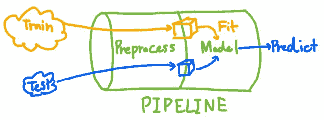

Pipeline illustration

首先，假设您只能创建一个可以输入任何数据的管道。在模型训练或预测之前，这些数据将被转换成适当的格式。

Scikit-learn pipeline 是一个将数据操作的所有步骤链接在一起以创建管道的工具。它会缩短你的代码，使它更容易阅读和调整。(您甚至可以可视化您的管道来查看内部的步骤。)执行 GridSearchCV 也更容易，不会从测试集中泄漏数据。

## 什么是 Scikit-learn ColumnTransformer？

如 scikit-learn 网站所述，这是 ColumnTransformer 的目的:

> 该估计器允许输入的不同列或列子集被分别变换，并且由每个变换器生成的特征将被连接以形成单个特征空间。

简而言之，ColumnTransformer 将分别转换每组 dataframe 列，稍后再组合它们。这在数据预处理过程中很有用。


ColumnTransformer Illustration

## 管道和 ColumnTransformer 有什么区别？

您应该理解 Pipeline 和 ColumnTransformer 之间的巨大差异。

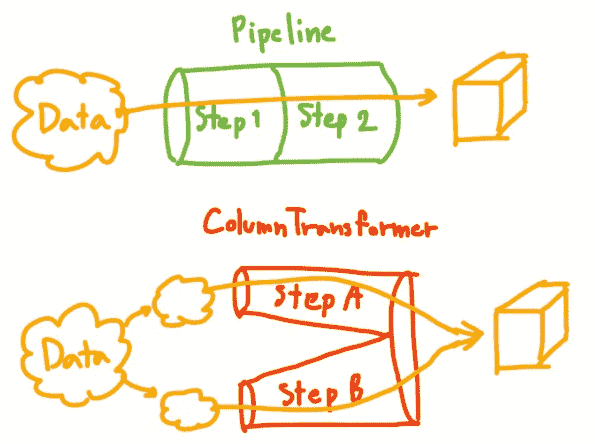

Pipeline VS ColumnTransformer

**您使用管道**对相同的列进行多次转换。

另一方面，**您使用 **ColumnTransformer**** 来分别转换每个列集，然后再组合它们。

好了，有了这些，让我们开始编码吧！！

## 如何创建管道

### 获取数据集

您可以从这个 [kaggle 数据集](https://www.kaggle.com/datasets/arashnic/hr-analytics-job-change-of-data-scientists?datasetId=1019790&sortBy=voteCount&select=aug_train.csv)下载我在本文中使用的数据。以下是数据集的一个示例:

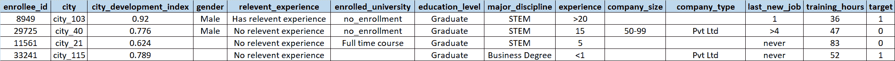

Dataset sample

我写了一篇文章探索这个数据集中的数据，如果你感兴趣，你可以在这里找到[。](https://medium.com/mlearning-ai/data-analysis-job-change-of-data-scientist-685f3de0a983)

简而言之，这个数据集包含求职者的信息以及他们是否想换工作的决定。数据集同时包含数值列和分类列。

我们的目标是根据求职者的信息预测他们是否会跳槽。这是一项分类任务。

## 数据预处理计划

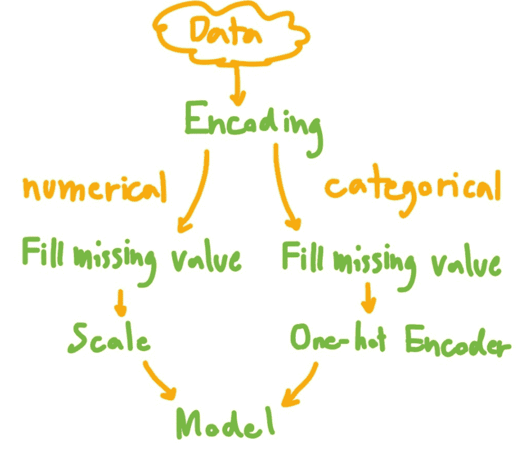

注意，为了本文的简单，我跳过了分类特征编码。

### 以下是我们将遵循的步骤:

1.  导入数据和编码
2.  定义要以不同方式转换的列集
3.  将数据拆分为定型集和测试集
4.  为数值和分类要素创建管道
5.  创建 ColumnTransformer 以对每个列集应用管道
6.  将模型添加到最终管道
7.  显示管道
8.  通过管道传递数据
9.  (可选)保存管道

### 步骤 1:导入并编码数据

下载数据后，您可以使用 Pandas 导入数据，如下所示:

```
import pandas as pd

df = pd.read_csv("aug_train.csv")
```

然后，使用映射对序数特征进行编码，将分类特征转换为数字特征(因为模型只接受数字输入)。

```
# Making Dictionaries of ordinal features

relevent_experience_map = {
    'Has relevent experience':  1,
    'No relevent experience':    0
}

experience_map = {
    '<1'      :    0,
    '1'       :    1, 
    '2'       :    2, 
    '3'       :    3, 
    '4'       :    4, 
    '5'       :    5,
    '6'       :    6,
    '7'       :    7,
    '8'       :    8, 
    '9'       :    9, 
    '10'      :    10, 
    '11'      :    11,
    '12'      :    12,
    '13'      :    13, 
    '14'      :    14, 
    '15'      :    15, 
    '16'      :    16,
    '17'      :    17,
    '18'      :    18,
    '19'      :    19, 
    '20'      :    20, 
    '>20'     :    21
} 

last_new_job_map = {
    'never'        :    0,
    '1'            :    1, 
    '2'            :    2, 
    '3'            :    3, 
    '4'            :    4, 
    '>4'           :    5
}

# Transform categorical features into numerical features

def encode(df_pre):
    df_pre.loc[:,'relevent_experience'] = df_pre['relevent_experience'].map(relevent_experience_map)
    df_pre.loc[:,'last_new_job'] = df_pre['last_new_job'].map(last_new_job_map)
    df_pre.loc[:,'experience'] = df_pre['experience'].map(experience_map)

    return df_pre

df = encode(df)
```

### 步骤 2:定义要以不同方式转换的列集

数字数据和分类数据应该以不同的方式进行转换。所以我为数字列定义了`num_col`,为分类列定义了`cat_cols`。

```
num_cols = ['city_development_index','relevent_experience', 'experience','last_new_job', 'training_hours']

cat_cols = ['gender', 'enrolled_university', 'education_level', 'major_discipline', 'company_size', 'company_type']
```

### 步骤 3:为数字和分类特征创建管道

管道的语法是:

```
Pipeline(steps = [(‘step name’, transform function), …])
```

对于**数字特征**，我执行以下动作:

1.  用该列的平均值填充缺失值。
2.  MinMaxScaler 将值缩放到 0 到 1 的范围内(这将影响回归性能)。

对于**分类特征**，我执行以下操作:

1.  SimpleImputer 用该列中出现频率最高的值来填充缺失值。
2.  OneHotEncoder 可以拆分成许多数字列用于模型训练。(指定 handle_unknown='ignore '是为了防止它在测试集中找到一个看不见的类别时出错)

```
from sklearn.impute import SimpleImputer
from sklearn.preprocessing import OneHotEncoder, MinMaxScaler
from sklearn.pipeline import Pipeline

num_pipeline = Pipeline(steps=[
    ('impute', SimpleImputer(strategy='mean')),
    ('scale',MinMaxScaler())
])
cat_pipeline = Pipeline(steps=[
    ('impute', SimpleImputer(strategy='most_frequent')),
    ('one-hot',OneHotEncoder(handle_unknown='ignore', sparse=False))
])
```

### 步骤 4:创建 ColumnTransformer，为每个列集应用管道

ColumnTransformer 的语法是:

```
ColumnTransformer(transformers=[(‘step name’, transform function,cols), …])
```

通过数值管道传递数值列，通过步骤 3 中创建的分类管道传递分类列。

指定 remainder='drop '以忽略 dataframe 中的其他列。

n_job = -1 意味着我们将使用所有处理器并行运行。

```
from sklearn.compose import ColumnTransformer

col_trans = ColumnTransformer(transformers=[
    ('num_pipeline',num_pipeline,num_cols),
    ('cat_pipeline',cat_pipeline,cat_cols)
    ],
    remainder='drop',
    n_jobs=-1)
```

### 步骤 5:向最终管道添加模型

在这个例子中，我使用了逻辑回归模型。

创建一个新管道，将步骤 4 中的 ColumnTransformer 与逻辑回归模型混合在一起。在这种情况下，我使用管道，因为整个数据帧必须分别通过 ColumnTransformer 步骤和建模步骤。

```
from sklearn.linear_model import LogisticRegression

clf = LogisticRegression(random_state=0)
clf_pipeline = Pipeline(steps=[
    ('col_trans', col_trans),
    ('model', clf)
])
```

### 步骤 6:显示管道

其语法是`display(pipeline name)`:

```
from sklearn import set_config

set_config(display='diagram')
display(clf_pipeline)
```

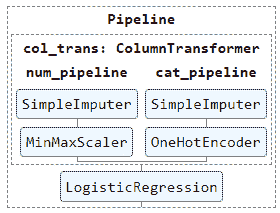

Displayed pipeline

您可以单击显示的图像来查看每个步骤的详细信息。多方便啊！

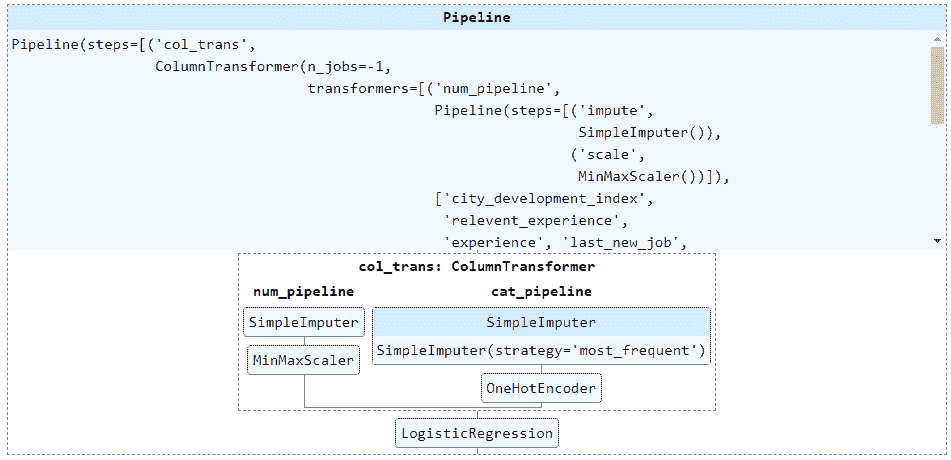

Expanded displayed pipeline

### 步骤 7:将数据分成训练集和测试集

将 20%的数据分成一个测试集，如下所示:

```
from sklearn.model_selection import train_test_split

X = df[num_cols+cat_cols]
y = df['target']
# train test split
X_train, X_test, y_train, y_test = train_test_split(X, y, test_size=0.2, stratify=y)
```

我将为训练集安装管道，并将安装的管道用于测试集，以防止数据从测试集泄漏到模型。

### 步骤 8:通过管道传递数据

下面是它的语法:

```
pipeline_name.fit, pipeline_name.predict, pipeline_name.score
```

通过管道传递数据。也符合模型。

`pipeline.predict`使用在`pipeline.fit` s 时训练的模型来预测新数据。

`pipeline.score`获取管道中模型的得分(本例中为逻辑回归的准确性)。

```
clf_pipeline.fit(X_train, y_train)
# preds = clf_pipeline.predict(X_test)
score = clf_pipeline.score(X_test, y_test)
print(f"Model score: {score}") # model accuracy
```


### (可选)步骤 9:保存管道

这个的语法是`joblib.dumb`。

使用 joblib 库保存管道供以后使用，这样就不需要再次创建和安装管道。当您想要使用保存的管道时，只需使用 joblib.load 加载文件，如下所示:

```
import joblib

# Save pipeline to file "pipe.joblib"
joblib.dump(clf_pipeline,"pipe.joblib")

# Load pipeline when you want to use
same_pipe = joblib.load("pipe.joblib")
```

## 如何找到最佳的超参数和数据准备方法

管道不仅使您的代码更加整洁，还可以帮助您优化超参数和数据准备方法。

### 这是我们将在这一部分讨论的内容:

*   如何找到可变的管道参数
*   如何找到最佳超参数集:在网格搜索中添加管道
*   如何找到最佳的数据准备方法:跳过管道中的一个步骤
*   如何找到最佳超参数集和最佳数据准备方法

### 如何找到可变的管道参数

首先，我们来看看可以调整的参数列表。

```
clf_pipeline.get_params()
```

结果可能会很长。深呼吸，继续读下去。

第一部分只是关于管道的步骤。

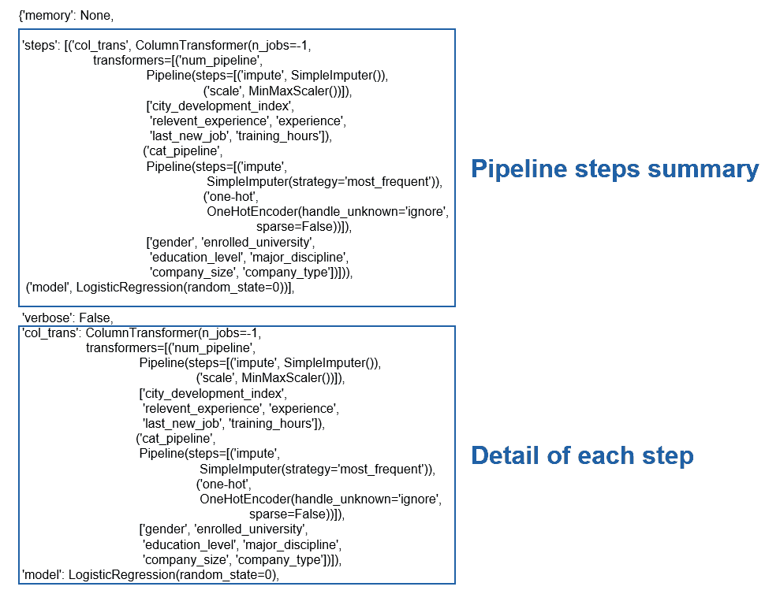

在第一部分下面，你会发现我们感兴趣的是:我们可以调整的参数列表。

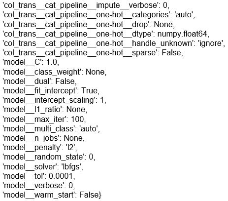

格式为****step 1 _ step 2 _…_ parameter****。

例如****col _ trans****_****cat _ pipeline****_****one-hot****_****sparse****表示 one-hot 步骤的参数稀疏。


您可以使用 set_param 直接更改参数。

```
clf_pipeline.set_params(model_C = 10)
```

### 如何找到最佳超参数集:在网格搜索中添加管道

网格搜索是一种可用于执行超参数调整的方法。它帮助您找到产生最高模型精度的最佳参数集。

#### 设置调谐参数及其范围。

创建调整参数(超参数)字典

```
{ ‘tuning parameter’ : ‘possible value’, … }
```

在这个例子中，我想找到一个逻辑回归模型的最佳惩罚类型和 C。

```
grid_params = {'model__penalty' : ['none', 'l2'],
               'model__C' : np.logspace(-4, 4, 20)}
```

#### 将管道添加到网格搜索中

```
GridSearchCV(model, tuning parameter, …)
```

我们的管道有一个模型步骤作为最后一步，所以我们可以将管道直接输入到 GridSearchCV 函数中。

```
from sklearn.model_selection import GridSearchCV

gs = GridSearchCV(clf_pipeline, grid_params, cv=5, scoring='accuracy')
gs.fit(X_train, y_train)

print("Best Score of train set: "+str(gs.best_score_))
print("Best parameter set: "+str(gs.best_params_))
print("Test Score: "+str(gs.score(X_test,y_test)))
```

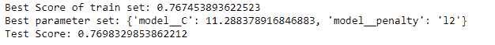

Result of Grid Search

设置网格搜索后，您可以用数据拟合网格搜索并查看结果。让我们看看代码在做什么:

*   `.fit`:拟合模型并尝试调谐参数字典中的所有参数集
*   `.best_score_`:所有参数组的最高精度
*   `.best_params_`:产生最佳分数的一组参数
*   `.score(X_test,y_test)`:用测试集尝试最佳模型时的分数。

你可以在文档[中阅读更多关于 GridSearchCV 的内容。](https://scikit-learn.org/stable/modules/generated/sklearn.model_selection.GridSearchCV.html)

### 如何找到最佳的数据准备方法:跳过管道中的一个步骤

如果没有管道，找到最佳的数据准备方法可能会很困难，因为您必须为许多数据转换案例创建如此多的变量。

通过管道，我们可以在管道中创建数据转换步骤，并执行网格搜索来找到最佳步骤。网格搜索将选择跳过哪个步骤，并比较每个案例的结果。

#### 如何稍微调整一下当前的管道

我想知道在 MinMaxScaler 和 StandardScaler 之间，哪种缩放方法最适合我的数据。

我在 num_pipeline 中添加了一个 step StandardScaler。其余不变。

```
from sklearn.preprocessing import StandardScaler

num_pipeline2 = Pipeline(steps=[
    ('impute', SimpleImputer(strategy='mean')),
    ('minmax_scale', MinMaxScaler()),
    ('std_scale', StandardScaler()),
])

col_trans2 = ColumnTransformer(transformers=[
    ('num_pipeline',num_pipeline2,num_cols),
    ('cat_pipeline',cat_pipeline,cat_cols)
    ],
    remainder='drop',
    n_jobs=-1)

clf_pipeline2 = Pipeline(steps=[
    ('col_trans', col_trans2),
    ('model', clf)
])
```

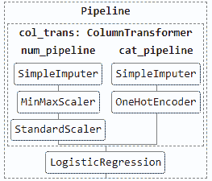

Adjusted pipeline

### 如何执行网格搜索

在网格搜索参数中，指定要跳过的步骤，并将其值设置为**。**

**由于 MinMaxScaler 和 StandardScaler 不应该同时执行，所以我将使用 ****一个字典列表**** 作为网格搜索参数。**

```
`[{case 1},{case 2}]`
```

**如果使用字典列表，网格搜索将执行情况 1 中每个参数的组合，直到完成。然后，它将执行情况 2 中每个参数的组合。所以不存在 MinMaxScaler 和 StandardScaler 一起使用的情况。**

```
`grid_step_params = [{'col_trans__num_pipeline__minmax_scale': ['passthrough']},
                    {'col_trans__num_pipeline__std_scale': ['passthrough']}]`
```

**执行网格搜索并打印结果(像普通网格搜索一样)。**

```
`gs2 = GridSearchCV(clf_pipeline2, grid_step_params, scoring='accuracy')
gs2.fit(X_train, y_train)

print("Best Score of train set: "+str(gs2.best_score_))
print("Best parameter set: "+str(gs2.best_params_))
print("Test Score: "+str(gs2.score(X_test,y_test)))`
```

**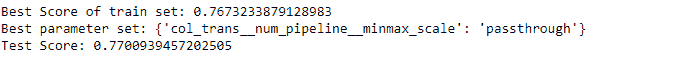**

**最好的情况是 minmax_scale : 'passthrough '，因此 StandardScaler 是此数据的最佳缩放方法。**

### **如何找到最佳超参数集和最佳数据准备方法**

**通过将调整参数添加到数据准备方法的每种情况的字典中，可以找到最佳的超参数集和最佳的数据准备方法。**

```
`grid_params = {'model__penalty' : ['none', 'l2'],
               'model__C' : np.logspace(-4, 4, 20)}

grid_step_params = [{**{'col_trans__num_pipeline__minmax_scale': ['passthrough']}, **grid_params},
                    {**{'col_trans__num_pipeline__std_scale': ['passthrough']}, **grid_params}]`
```

**grid_params 将被添加到情况 1(跳过 MinMaxScaler)和情况 2(跳过 StandardScalerand)中。**

```
`# You can merge dictionary using the syntax below.

merge_dict = {**dict_1,**dict_2}`
```

**执行网格搜索并打印结果(像普通网格搜索一样)。**

```
`gs3 = GridSearchCV(clf_pipeline2, grid_step_params2, scoring='accuracy')
gs3.fit(X_train, y_train)

print("Best Score of train set: "+str(gs3.best_score_))
print("Best parameter set: "+str(gs3.best_params_))
print("Test Score: "+str(gs3.score(X_test,y_test)))`
```

**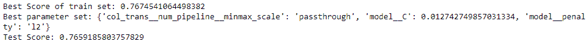**

**您可以使用找到最佳参数集。best_params_。由于 minmax_scale : 'passthrough '，所以 StandardScaler 是此数据的最佳缩放方法。**

**您可以使用显示所有网格搜索案例。cv _ 结果 _:**

```
`pd.DataFrame(gs3.cv_results_)`
```

**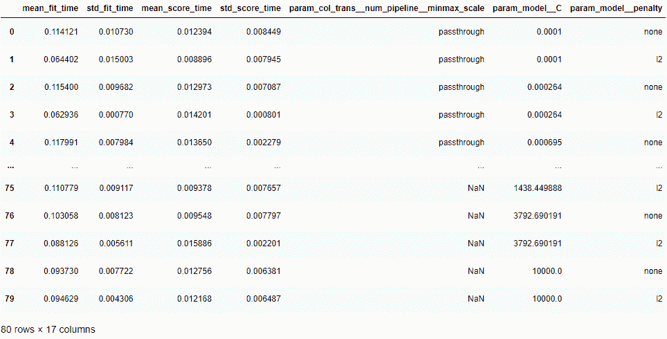

GridSearch result** 

**这个例子有 80 个案例。您需要考虑每种情况的运行时间和精确度，因为有时我们可能会选择精确度可接受的最快模型，而不是精确度最高的模型。**

## **如何添加自定义转换并找到最佳的机器学习模型**

**搜索最佳的机器学习模型可能是一项耗时的任务。管道可以使这项任务更加方便，这样您就可以缩短模型训练和评估循环。**

### **这是我们将在这一部分讨论的内容:**

*   **添加自定义转换**
*   **找到最好的机器学习模型**

### **如何添加自定义转换**

**除了标准的数据转换函数，比如 sklearn 的 MinMaxScaler，您还可以为您的数据创建自己的转换。**

**在这个例子中，我将创建一个类方法，使用映射将分类特征转换成数字特征，从而对顺序特征进行编码。简单地说，我们将把数据从文本转换成数字。**

**首先，我们将在回归模型训练之前进行所需的数据处理。**

```
`from sklearn.base import TransformerMixin

class Encode(TransformerMixin):

    def __init__(self):
        # Making Dictionaries of ordinal features
        self.rel_exp_map = {
            'Has relevent experience': 1,
            'No relevent experience': 0}

    def fit(self, df, y = None):
    	return self

    def transform(self, df, y = None):
        df_pre = df.copy()
        df_pre.loc[:,'rel_exp'] = df_pre['rel_exp']\
                               .map(self.rel_exp_map)
        return df_pre`
```

**下面是这段代码的解释:**

*   **创建一个名为 Encode 的类，它继承了 sklearn 中名为 TransformerMixin 的基类。**
*   **在类内部，有 3 个必要的方法:`__init__`、`fit`和`transform`**
*   ******`__init__`**** 在创建管道时会被调用。这是我们在类中定义变量的地方。我创建了一个变量‘rel _ exp _ map ’,这是一个将类别映射到数字的字典。**
*   ******`fit`**** 在拟合管道时会被调用。这个案子我留了空白。**
*   ******`transform`**** 在使用流水线变换时会被调用。这个方法需要一个 dataframe (df)作为输入，而 y 默认设置为 None(它被强制使用 y 参数，但我无论如何也不会使用它)。**
*   **在 ****转换**** 中，数据帧列‘rel _ exp’将与 rel_exp_map 进行映射。**

**注意，`\`只是将代码延续到新的一行。**

**接下来，添加这个编码类作为管道步骤。**

```
`pipeline = Pipeline(steps=[
    ('Encode', Encode()),
    ('col_trans', col_trans),
    ('model', LogisticRegression())
])`
```

**然后，您可以像普通管道一样对管道进行拟合、转换或网格搜索。**

### **如何找到最好的机器学习模型**

**我想到的第一个解决方案是在管道中添加许多模型步骤，并通过在网格搜索中将步骤值更改为“通过”来跳过一个步骤。这就像我们在寻找最佳数据准备方法时所做的一样。**

```
`temp_pipeline = Pipeline(steps=[
    ('model1', LogisticRegression()),
    ('model2',SVC(gamma='auto'))
])`
```

**但是我看到了这样一个错误:**

**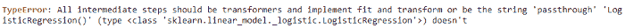

Error when there are 2 classifiers in 1 pipeline** 

**啊哈——一个管道中不能有两个分类模型！**

**这个问题的解决方案是创建一个定制的转换，它接收一个模型作为输入，并执行网格搜索来找到最佳模型。**

### **以下是我们将遵循的步骤:**

1.  **创建一个接收模型作为输入的类**
2.  **将步骤 1 中的类添加到管道中**
3.  **执行网格搜索**
4.  **以表格形式打印网格搜索结果**

### **步骤 1:创建一个接收模型作为输入的类**

```
`from sklearn.base import BaseEstimator
from sklearn.linear_model import LogisticRegression
from sklearn.svm import SVC

class ClfSwitcher(BaseEstimator):

def __init__(self, estimator = LogisticRegression()):
        self.estimator = estimator

def fit(self, X, y=None, **kwargs):
        self.estimator.fit(X, y)
        return self

def predict(self, X, y=None):
        return self.estimator.predict(X)

def predict_proba(self, X):
        return self.estimator.predict_proba(X)

def score(self, X, y):
        return self.estimator.score(X, y)`
```

******代号解释:******

*   **创建一个名为`ClfSwitcher`的类，它继承了 sklearn 中名为 BaseEstimator 的基类。**
*   **在类内部，有五个必要的方法，如`classification model: __init__`、`fit`、`predict`、`predict_proba`、`score`**
*   ******`__init__`**** 接收一个估计器(模型)作为输入。我将 LogisticRegression()声明为默认模型。**
*   ******`fit`**** 是为了模型拟合。没有返回值。**
*   **其他方法是模拟模型。它将返回结果，就像它是模型本身一样。**

### **步骤 2:将步骤 1 中的类添加到管道中**

```
`clf_pipeline = Pipeline(steps=[
    ('Encode', Encode()),
    ('col_trans', col_trans),
    ('model', ClfSwitcher())
])`
```

### **步骤 3:执行网格搜索**

**在网格搜索参数中使用不同的分类模型有两种情况，包括逻辑回归和支持向量机。**

```
`from sklearn.model_selection import GridSearchCV

grid_params = [
    {'model__estimator': [LogisticRegression()]},
    {'model__estimator': [SVC(gamma='auto')]}
]

gs = GridSearchCV(clf_pipeline, grid_params, scoring='accuracy')
gs.fit(X_train, y_train)

print("Best Score of train set: "+str(gs.best_score_))
print("Best parameter set: "+str(gs.best_params_))
print("Test Score: "+str(gs.score(X_test,y_test)))`
```

**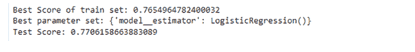

Grid Search Result** 

**结果表明，逻辑回归的结果最好。**

### **步骤 4:以表格形式打印网格搜索结果**

```
`pd.DataFrame(gs.cv_results_)`
```

**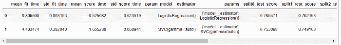

Grid Search Result Table** 

**逻辑回归比 SVC 的精度稍高，但速度更快(拟合时间更短)。**

**请记住，您也可以为每个模型应用不同的数据准备方法。**

## **结论**

**从数据清理到数据建模步骤，您可以实现 Scikit-learn 管道和 ColumnTransformer，以使您的代码更加整洁。**

**还可以通过网格搜索和 passthrough 关键字找到最佳的超参数、数据准备方法和机器学习模型。**

**你可以在这个 [GitHub](https://github.com/Yannawut/ML_Pipeline) 中找到我的代码**