# Microsoft Excel 教程–如何创建公式和函数

> 原文：<https://www.freecodecamp.org/news/how-to-create-microsoft-excel-formulas-and-functions/>

电子表格不仅仅是将数据排列成行和列。大多数时候，你也用它们进行数据分析。

Microsoft Excel 是使用最广泛的电子表格应用程序之一，尤其是在金融和会计领域。这部分是因为它简单的用户界面和无与伦比的功能深度。

在本文中，您将了解到:

*   什么是 Excel 公式
*   如何在 Excel 中编写公式
*   什么是 Excel 函数
*   如何使用 Excel 函数
*   最后，我们来看看动态 Excel 函数。

# 要阅读这篇文章，我需要在电脑上安装什么？

要继续学习，您需要在计算机上安装 Microsoft Excel。本文我们将使用 Windows 计算机。

# 如何在我的电脑上安装 Microsoft Excel？

按照下列步骤在 Windows 计算机上安装 Microsoft Excel:

1.  如果您尚未登录，请登录到[www.office.com](https://www.office.com/)。
2.  使用与您的 [Microsoft 365](https://www.microsoft.com/en/microsoft-365?ocid=oo_support_mix_marvel_ups_support_railbanner_1000852&rtc=1) 订阅关联的帐户登录。你也可以免费试用[Office](https://signup.live.com/signup?mkt=en-US&uiflavor=web&lw=1&fl=easi2&client_id=4345a7b9-9a63-4910-a426-35363201d503&wreply=https%3A%2F%2Fwww.office.com%2F%3Fauth%3D1%26from%3DOdotComFreeSignup)。
3.  登录后，从 Office 主页选择“安装 Office”。这将自动将 Microsoft Office 下载到您的 Windows 计算机上。
4.  运行安装程序来设置 Microsoft Office，完成后选择“关闭”。
5.  完成后，选择“开始”按钮(位于屏幕左下角)并键入“Microsoft Excel”
6.  点击 Microsoft Excel 打开它。
7.  接受许可协议，让我们开始吧。

# 什么是 Excel 公式？

Excel 公式是根据单元格或单元格区域的值执行运算的表达式。您可以使用 Excel 公式来:

*   执行简单的数学运算，如加法或减法。
*   执行简单的操作，如连接分类数据。

理解两件事很重要:Excel 公式总是以等号“=”开始，如果没有正确执行，它们可能会返回错误。

# Excel 公式中使用了哪些运算符？

Excel 中有四种不同类型的运算符—算术、比较、文本连接和引用。但是对于大多数公式，您通常会使用这三个:

### 算术运算符

| + | 加法 |
| - | 减法 |
| / | 分部 |
| * | 乘法运算 |
| ^ | 求幂运算 |

### 比较运算符

| = | 等于 |
| > | 大于 |
| < | 小于 |
| > = | 大于或等于 |
| < = | 小于或等于 |
| <> | 不等于 |

### 文本连接

在这里，您只有用于连接文本的&符号。

# 如何创建 Excel 公式？

让我们看一个使用算术运算符的简单场景。

在数学中，要把两个数相加，比如说 20 和 30，你会这样计算:20 + 30 =

这会给你 50 美元。

在 Excel 中，情况是这样的:

1.  首先，打开一个空白的 Excel 工作表。
2.  在单元格 A1 中，键入 20。
3.  在单元格 A2 中，键入 30。
4.  要相加，请在单元格 A3 中键入= 20 + 30。

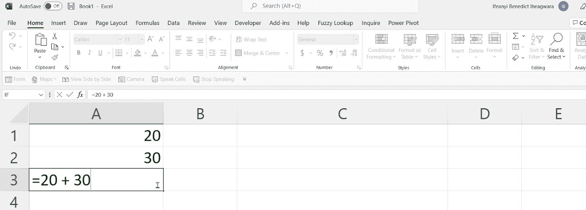

How can I create an Excel formula?

5.然后，按键盘上的 ENTER 键。Excel 将立即对此进行计算并返回 50。

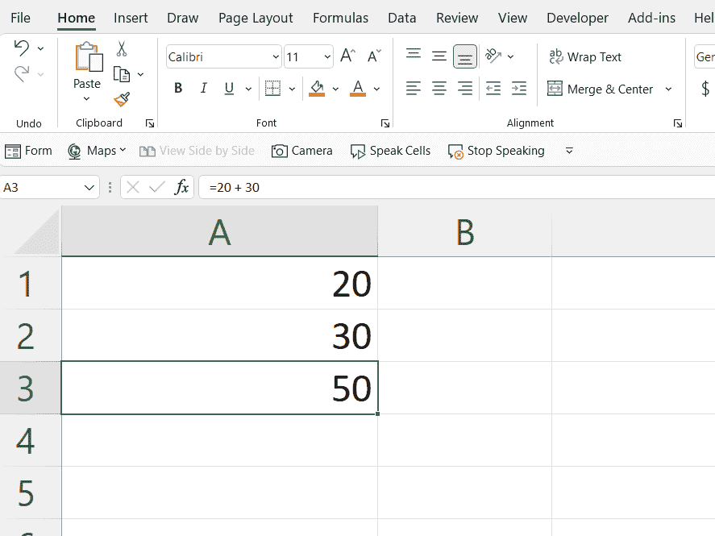

How can I create an Excel formula? Adding numbers in Excel

我之前提到过，每个公式都以等号“=”开头。我就是这个意思。若要编写公式，请键入等号，后跟数值。这也适用于减法、除法、乘法和取幂运算。

让我们看另一个使用比较运算符的简单场景。假设我们想知道 30 是否大于 40。

在 Excel 中，我们是这样做的:

1.  键入 in =30>40
2.  按回车键。

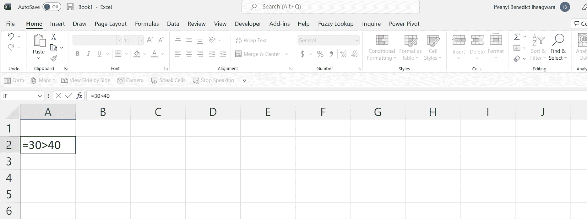

How can I create an Excel formula? Comparison operators

3。这将返回 FALSE，因为 30 不大于 40。Excel 对逻辑语句使用真和假，就像我们人类说是和不是一样。

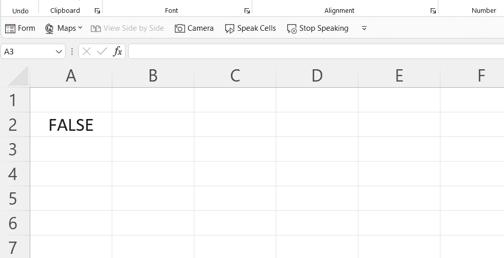

How can I create an Excel formula? Comparison operators 

最后，让我们看另一个使用文本连接操作符——“与”符号的简单场景。这适用于您的字符串数据类型，您可以使用它来连接文本。

假设我们在工作表的不同单元格(A1、A2 和 A3)中有“Welcome”、“To”和“FreeCodeCamp”。我们可以键入=A1&" "&A2&" "&A3 来加入它们。

引号" "中的空格表示我们希望单词之间有空格。

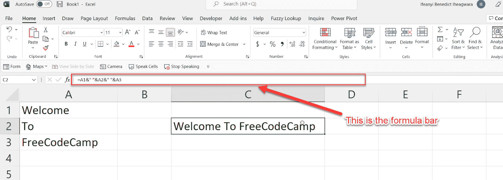

How can I create an Excel formula using the ampersand “&” sign

另一个提示:公式栏显示用于生成值的公式。

# 什么是 Excel 函数？

Excel 函数是预定义的内置公式，使用您的值和参数执行数学、统计和逻辑计算和操作。

对于 Excel 函数，您应该知道:

*   它们是公式，所以它们也是以等号“=”开始的。
*   顺序很重要。

有 500 多种功能可用。您可以在功能区的“公式”选项卡上找到所有可用的 Excel 函数。

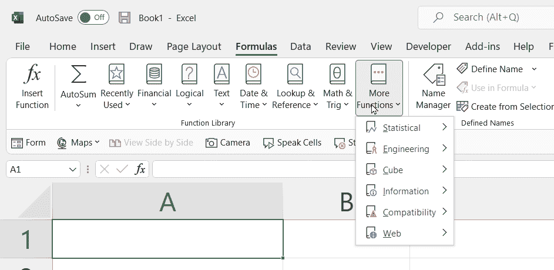

All available Excel formulas and functions

但是当你可以写一个公式的时候为什么要用函数呢？

下面是 Excel 函数的一些好处。

*   提高生产力和效率。
*   简化复杂的计算。
*   让你的工作自动化。
*   快速可视化数据。

## Excel 函数是由什么组成的？

与公式不同，Excel 函数是由一个带有需要传递的参数的结构组成的。

每个功能:

*   以等号“=”开始
*   有名字。例如 VLOOKUP、SUM、UNIQUE 和 XLOOKUP。
*   需要用逗号分隔的参数。你应该知道分号在西班牙、法国、意大利、荷兰和德国等国家被用作分隔符。但是，您可以通过 Excel 设置对此进行更改。
*   带方括号[]的参数是可选的
*   有一个左括号和右括号。
*   有一个参数工具提示，告诉你应该传递什么。

也有一些例外。举个例子，

*   DATEDIF 在 Excel 中不显示，因为它不是标准函数，在某些情况下会给出不正确的结果。但是，语法如下:

`DATEDIF(birthdate, TODAY(), "y")`

*   像 PI()、RAND()、NOW()、TODAY()这样的函数不需要参数。

# 如何使用 Excel 函数

让我们来看几个函数:

### 如何使用 Excel 中的`SUM()`函数

根据文档，SUM 函数增加值。下面是语法:

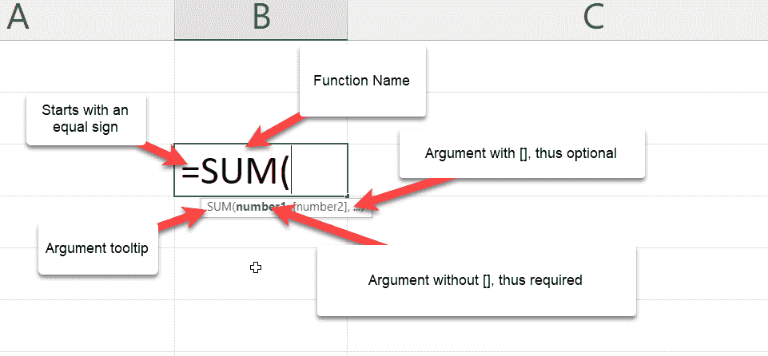

Excel Sum Syntax

假设我们有一行从 1 到 10 的数字，我们想把它们加起来。为此，我们只需键入=SUM(A1:A10)。A1:A10 简单地返回位于单元格 A1 到 A10 的数字数组，它们是从 A10 向上的 A1、A2 和 A3。

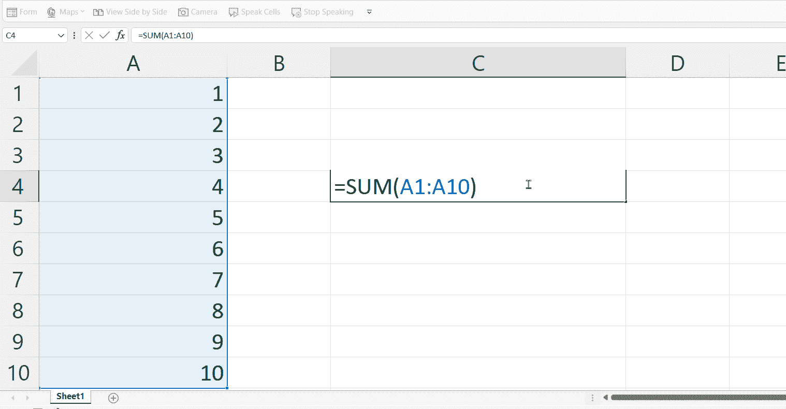

How to use Sum in Excel

由于第二个参数是可选的，这意味着 sum(A10)将返回一个值。在我们的例子中，它只返回 10，因为 A10 的值是 10。试试看。

如果您使用加法运算符编写这段代码，您应该编写:

=1 + 2 + 3 + 4 + 5 + 6 + 7 + 8 + 9 + 10

或者

= A1+A2+A3+A4+A5+A6+A7+A8+A9+A10

这看起来不是很有成效或效率。

### 如何使用 Excel 中的`TODAY()`函数

根据文档，TODAY 函数在工作表中显示当前日期。这也不需要争论。下面是语法:

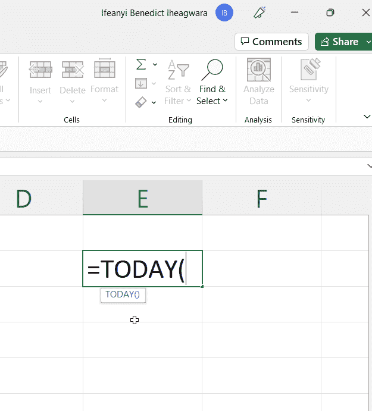

How to use Today() in Excel

Excel 根据计算机的日期和时间设置自动显示当前日期。NOW()函数也是如此，它显示当前的日期和时间。

### 如何使用 Excel 中的`CONCATENATE()`函数

让我们看一个文本函数。使用 CONCATENATE 将两个或多个文本字符串连接成一个字符串。

下面是语法:

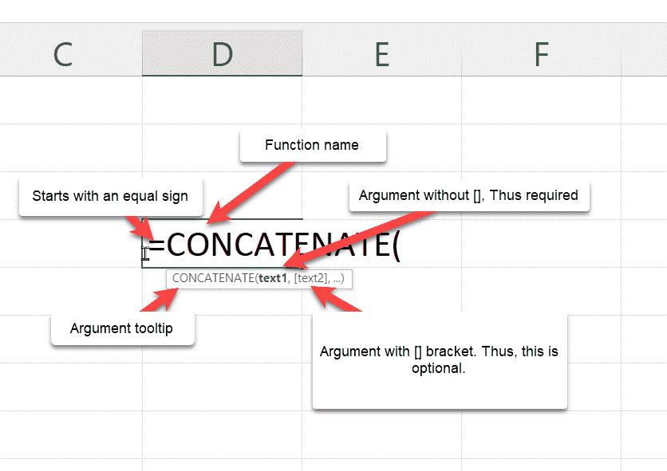

Excel CONCATENATE() Syntax

让我们假设我们想加入“这是”和“自由代码营”——但是在你的细胞中，你只有“自由代码营”。

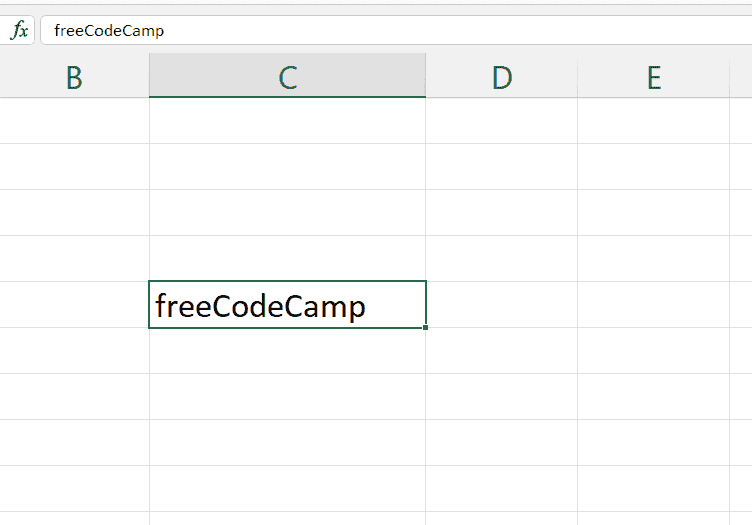

freeCodeCamp Excel

如果你要在一个公式里写一个字符串，你必须把它写在引号里，就像这样。

为什么？

这样，Excel 不会认为您在尝试编写另一个函数。

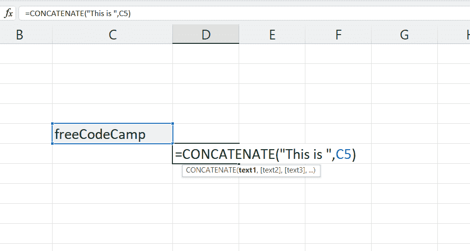

How to use Excel CONCATENATE function

这将返回短语“这是 freeCodeCamp”

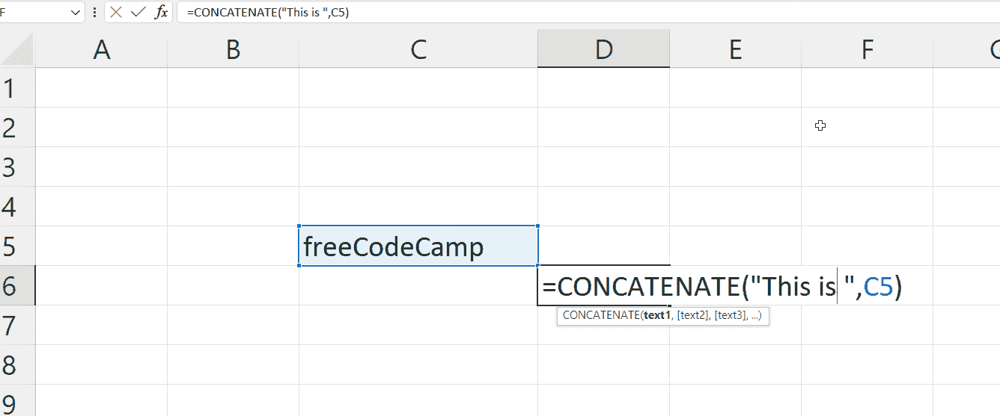

How to use CONCATENATE() in Excel

### 如何使用 Excel 中的`VLOOKUP()`函数

这是 Excel 最有趣、最常用的公式或函数之一。您可以用它来查找表格或行范围中的值。

这里有一个场景:

我们有一个简单的表格，显示了各种电影及其类型、主要工作室、观众评分%、盈利能力、烂番茄百分比、全球总收入和年份。我将只使用这个 [GitHub Gist](https://gist.github.com/tiangechen/b68782efa49a16edaf07dc2cdaa855ea) 中样本数据的前 10 行。

Flim dataset

我希望，每当我在黄色单元格中输入一部电影，年份就会显示在绿色单元格中。我们用 VLOOKUP 来找吧。

这是 VLOOKUP 语法:

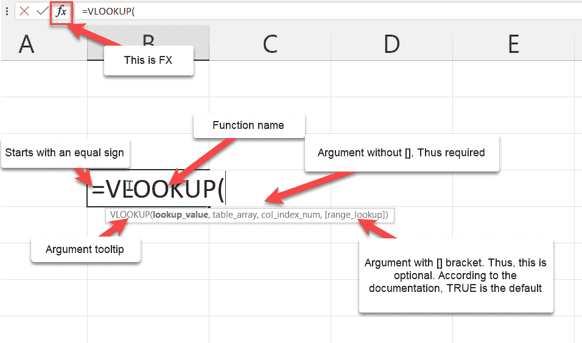

Excel Vlookup Syntax

除了在单元格中编写公式之外，您还可以使用 Excel 插入函数(fx)按钮来编写公式，该按钮靠近公式栏。

让我们试试这个。

1.  在绿色单元格上写下`=Vlookup(`。
2.  点击外汇。将弹出一个对话框，显示该公式需要的所有参数。
3.  输入每个参数的值。
4.  Lookup_value(必选参数):这是您要查找的内容。在我们的案例中，这是在 B1 号牢房中的电影《反叛的青年》。
5.  Table_array(必选参数):这只是要求您提供包含数据的表。你给它整个表，在我们的例子中是 A4:H13
6.  Col_index_num(必选参数):这是在询问您所给表格的列号。在我们的例子中，我们需要年份。这在第八栏。
7.  Range_lookup(可选参数):最后，我们选择想要近似匹配(TRUE)还是精确匹配(FALSE)。

- TRUE 表示近似匹配，因此它返回最接近的值或估计值。

- FALSE 表示完全匹配，因此如果没有找到，它将返回一个错误。

8.我们会选假的，因为我们想要精确的匹配。

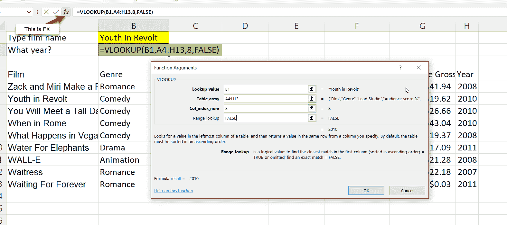

How to use VLOOKUP() in Excel

9.点击“确定”Excel 将返回 2010 年。

但是，您可以通过在单元格中键入`=VLOOKUP(B1,A4:H13,8,FALSE)`来在单元格中写入此内容。

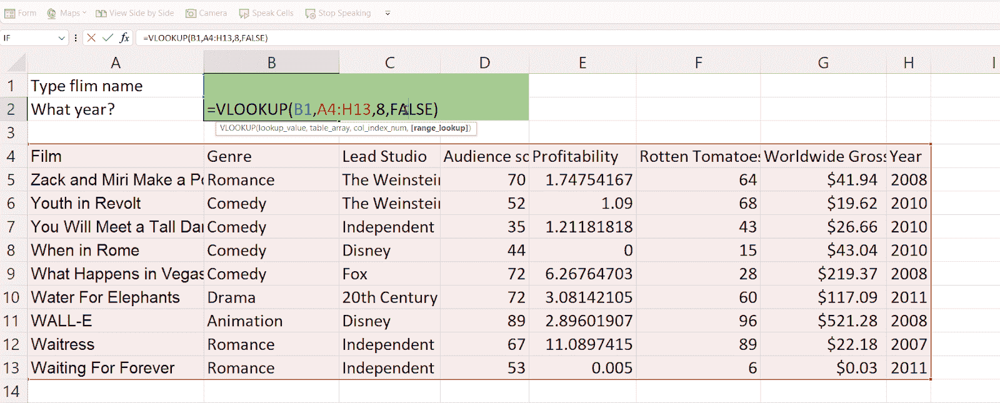

How to use VLOOKUP() in Excel

# 编写 Excel 函数的技巧和规则

在编写我们的函数时，Excel 提供了一些公式提示。

1.  参数工具提示不会离开，直到您关闭最后一个括号。
2.  公式栏显示您的公式。
3.  你目前写的论点总是阴暗的。看看下图中的 lookup_value。
4.  方括号[]告诉你它是可选的。
5.  最后，颜色代码-我们的 B1 是蓝色的，单元格 B1 是蓝色的，以指导我们选择了哪个单元格或表格。当我们选择 A4:H13 作为 table_array 参数时，同样的事情也会发生。

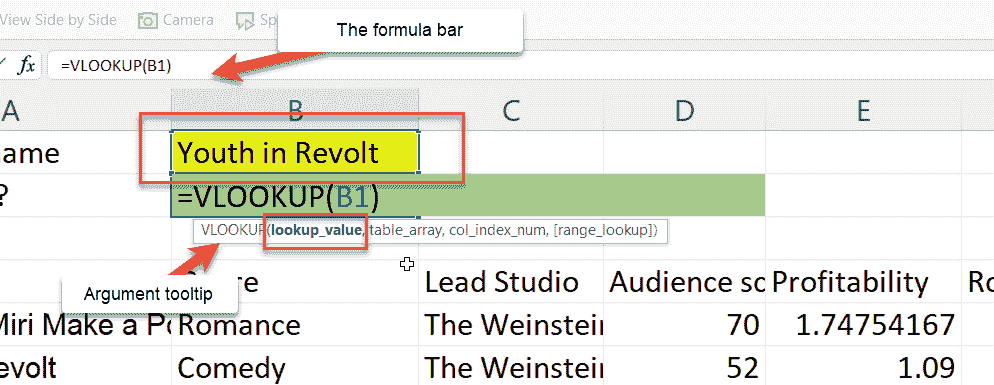

Vlookup and Excel formula bar

# 如何在 Excel 中使用嵌套函数

嵌套函数是指在一个函数中编写另一个函数。例如，求值之和的平均值。

编写嵌套函数的第一个技巧是单独处理每个函数。所以在处理第二个函数之前先处理第一个函数。一个专业的建议是在写参数的时候看它的工具提示。

我们来看一个简单的场景。

我们有两组数字。每个都有班上学生的分数。我想在得到平均值之前把两个数组相加。

让我们开始吧。

1.  键入您的=后接平均值。
2.  第一名将是一班分数的总和。
3.  第二个数字是二班分数的总和。

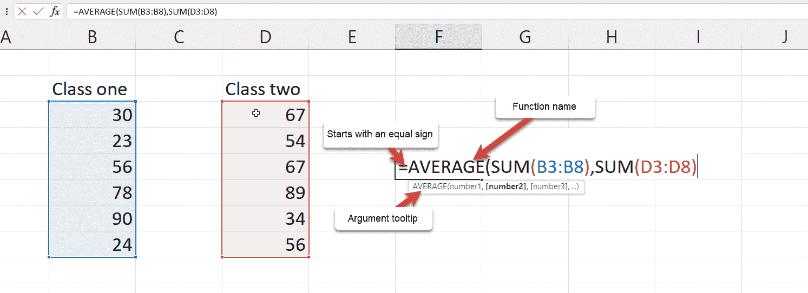

Nested Function: Excel AVERAGE and SUM syntax

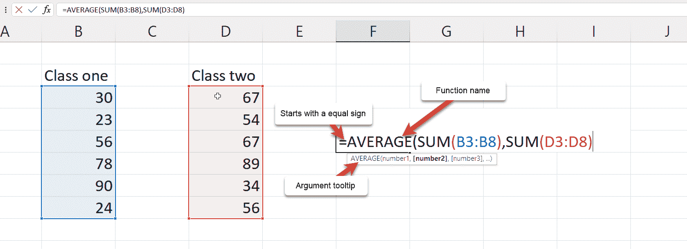

Excel AVERAGE syntax

最后，不要忘记右括号。

因此，公式将为`=AVERAGE(SUM(B3:B8),SUM(D3:D8))`。

# 如何在 Excel 中使用动态数组函数

动态数组函数是与溢出数组行为相关的公式。

在此之前，你写了一个函数，它只返回一个输入。我们称这类函数为遗留数组公式。

另一方面，动态数组函数将返回进入相邻单元格的值。动态数组函数的几个例子是:

*   独一无二的
*   文本拆分
*   过滤器
*   顺序
*   分类
*   索提比
*   readarray

我们来看看独特的配方。

### 如何在 Excel 中使用 UNIQUE()公式

唯一公式的工作原理是从数组或列表中返回唯一值。让我们使用这个 [GitHub Gist](https://gist.github.com/tiangechen/b68782efa49a16edaf07dc2cdaa855ea) 的电影样本数据。该表包含 77 行胶片，不包括标题。

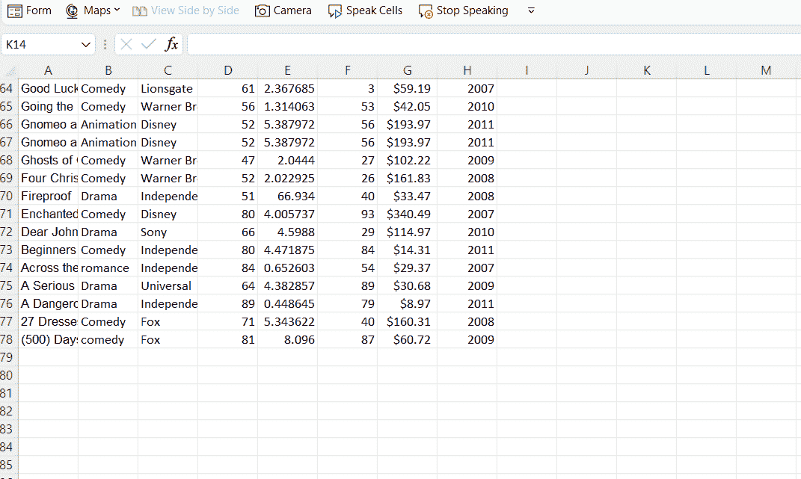

Flim data GitHub

让我们试着从数据集中获取唯一的年份，也就是没有重复的年份。

为此:

1.  类型`=UNIQUE(`
2.  从“年份”列中选择整个数值数组:=UNIQUE(H2:H78)

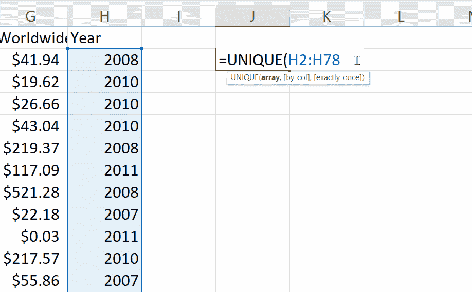

How to use Excel UNIQUE formula

3.关闭括号，然后按 Enter 键。

虽然公式是在单个单元格中编写的，但返回值会溢出到它下面的单元格中。这就是溢出数组的行为。

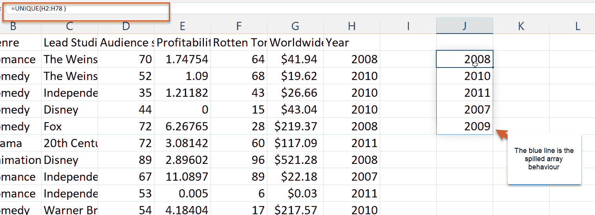

Excel dynamic array formula

# 如何在 Excel 中创建自己的函数

微软 Excel 发布了一系列新功能来提高用户的工作效率。其中一个函数是 LAMBDA 函数。

LAMBDA 函数允许您在没有宏、VBA 或 JavaScript 的情况下创建自定义函数，并在整个工作簿中重用它们。

最精彩的部分？你能说出它的名字。

### 如何使用 Excel 中的`LAMBDA()`函数

这个 LAMBDA 函数将通过消除复制和粘贴这个容易出错的公式的需要来提高生产率。

以下是 LAMBDA 语法:

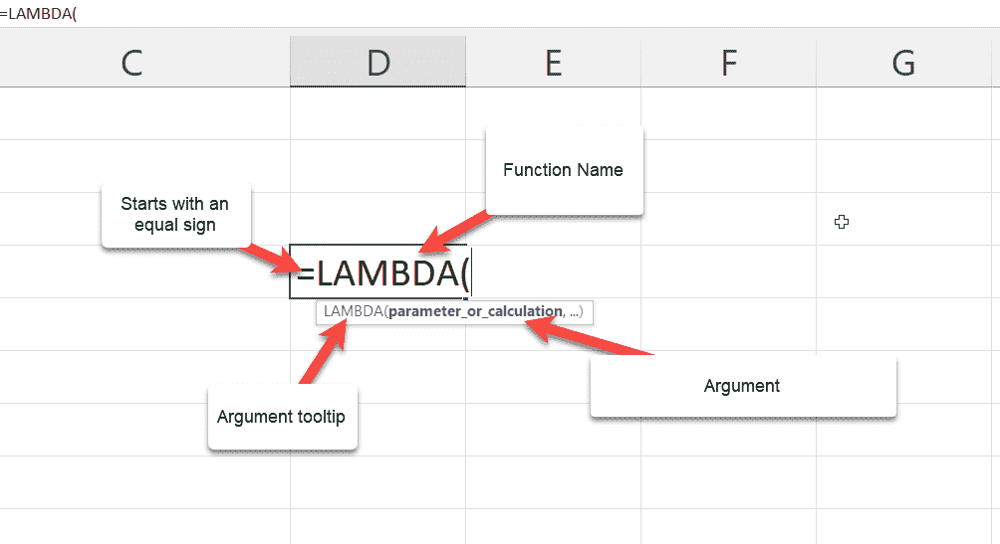

Excel LAMBDA function

让我们从一个简单的用例开始，使用来自这个 [GitHub Gist](https://gist.github.com/tiangechen/b68782efa49a16edaf07dc2cdaa855ea) 的电影样本数据。

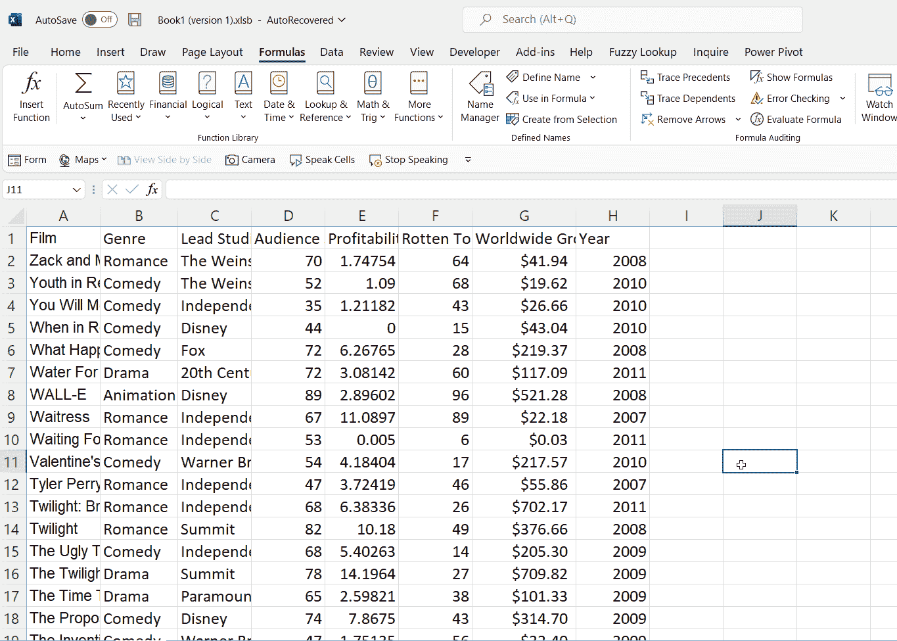

The Movie dataset

我们有一个名为“全球总值”的栏目，让我们试着找出奈拉值。

1.  创建一个新列，并将其命名为“以奈拉为单位的全球总值”。
2.  在我们的列名，单元格 I2 的正下方，键入`=lAMBDA(`
3.  LAMBDA 需要参数和/或计算。

参数意味着您想要传递的值，在我们的用例中，我们想要更改总值。姑且称之为恶心。

计算是指要执行的公式或函数。对我们来说，这将是乘以汇率。目前，这是 670。所以我们写毛* 670。

How to use LAMBDA function in Excel

4.按回车键。这将返回一个错误，因为 gross 不存在，您需要让 excel 知道这些名称。

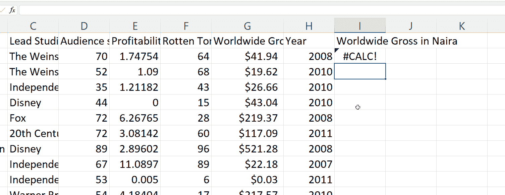

Using Excel LAMBDA

5.要使用新创建的函数，您需要复制编写的语法。

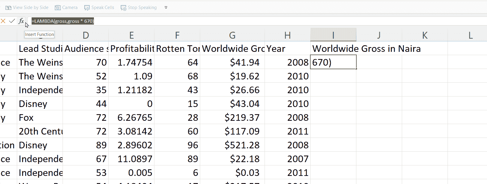

Writing function with Excel LAMBDA

6.转到公式功能区并打开名称管理器。

Excel name manger using the LAMBDA function

7.定义名称管理器参数:

*   名字就是你想怎么称呼这个函数。我要和奈拉康弗特一起去。
*   范围应为工作簿，因为您希望在工作簿中使用该函数。
*   注释解释了你的函数的作用。它作为一个文件。
*   在**引用**中，应该粘贴复制的函数语法。

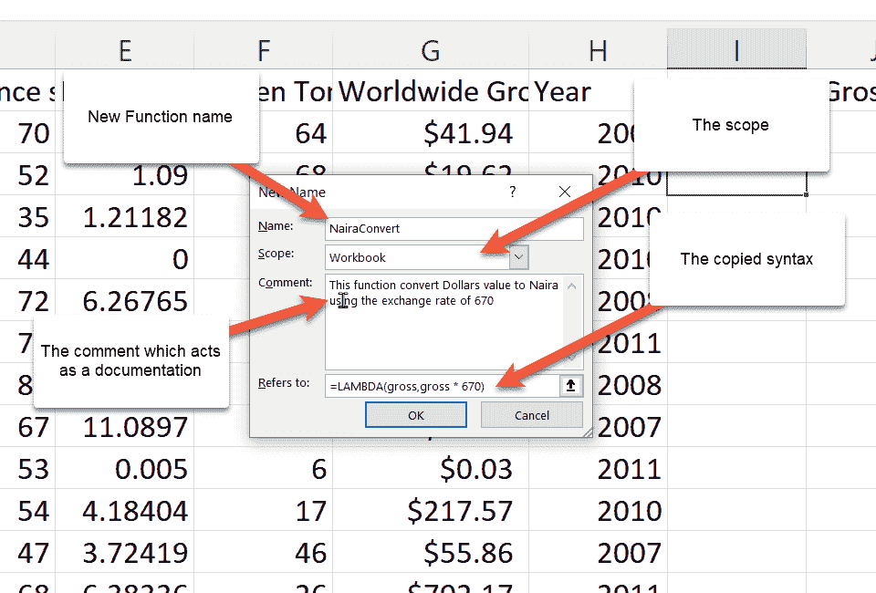

Excel name manager

8.按确定。

9.要使用这个新函数，您可以用您定义的名称调用它——NairaConvert——并给它一个总值，这是我们在 G2 上的世界总值。

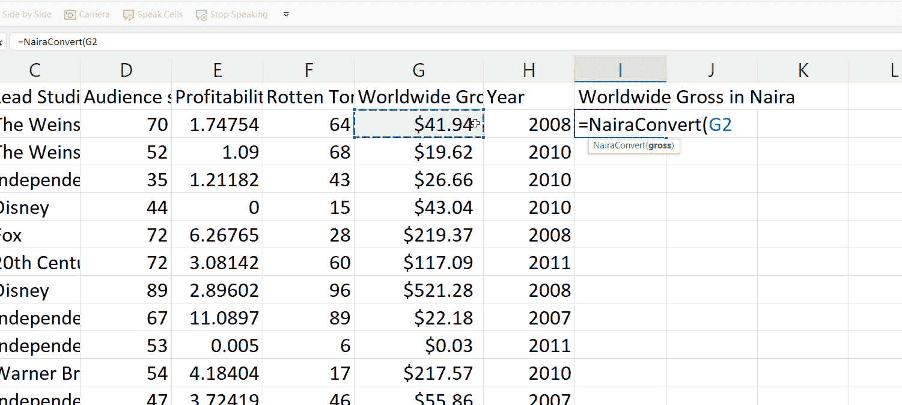

Custom function with LAMBDA

10.关闭括号，然后按确定

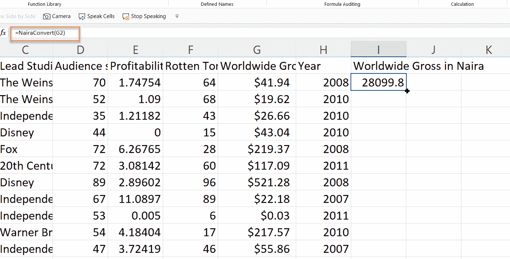

Calculating with Excel LAMBDA

# 在哪里可以了解更多关于 Excel 的信息？

现在有很多学习微软 Excel 的资源。数量如此之多，以至于很难找出哪些是最新的、有帮助的。

你能做的最好的事情是找到一个有用的教程，并按照它完成，而不是试图一次参加几个。我会建议你从 [freeCodeCamp 的《微软 Excel 初学者教程——全教程](https://www.youtube.com/watch?v=Vl0H-qTclOg)开始，YouTube 上有。

你也应该加入像微软 Excel 和数据分析学习社区这样的社区。然而，如果你正在寻找资源的汇编，请查看 [freeCodeCamp 的出版物 Excel tags](https://www.freecodecamp.org/news/tag/excel/) 。

如果你喜欢阅读这篇文章和/或有任何问题想联系，你可以在 [LinkedIn](https://www.linkedin.com/in/ifeanyi-iheagwara/) 或 [Twitter](https://twitter.com/Bennykillua) 上找到我。