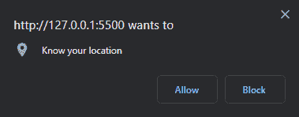

# JavaScript 地理定位 API 教程——如何在 JS 中获取用户的位置

> 原文：<https://www.freecodecamp.org/news/how-to-get-user-location-with-javascript-geolocation-api/>

一些应用程序要求你知道用户的位置，比如送餐或电子商务应用程序。所以你需要一个有效的方法来获取这些信息。

我们今天要讨论的地理定位 API 是一个简单的解决方案。您可以使用它来确定用户的位置、当地货币、语言和其他有用的信息。然后，您可以利用这一点，根据他们的位置为他们提供最相关的内容。

在本文中，我们将介绍什么是地理定位 API，它为什么有用，以及如何在您的应用程序中使用它。

## 什么是地理定位 API？

JavaScript 地理定位 API 提供对与用户设备相关联的地理位置数据的访问。这可以使用 GPS、WIFI、IP 地理定位等等来确定。

为了保护用户的隐私，它请求允许定位设备。如果用户授予权限，您将可以访问位置数据，如纬度、经度、高度和速度。您还将获得获取的位置数据的准确性以及获取位置的大致时间。

以下是地理定位的一些用途:

*   在地图上显示用户的位置
*   获取最新的本地信息
*   显示用户附近的本地兴趣点
*   启用即时路线导航(GPS)
*   跟踪车队或运输车辆
*   用位置标记照片

## 如何使用地理定位 API

您可以通过调用`navigator.geolocation`对象来访问地理定位 API。它授予应用程序访问设备位置的权限。

该对象提供下列方法来处理设备的位置:

1.  getCurrentPosition:返回设备的当前位置。
2.  watchPosition:当设备位置改变时自动调用的处理函数。

这些方法有三个可能的参数:

*   成功回拨(必需)
*   错误回调(可选)
*   选项对象(可选)

### 如何用`getCurrentPosition()`获取用户位置

您可以使用`getCurrentPosition`方法来获取用户的当前位置。它向浏览器发送异步请求，请求同意共享他们的位置。

以下是获取用户位置的语法:

```
const successCallback = (position) => {
  console.log(position);
};

const errorCallback = (error) => {
  console.log(error);
};

navigator.geolocation.getCurrentPosition(successCallback, errorCallback); 
```

当您运行这个时，您将在浏览器中得到一个请求许可的弹出窗口:



点击**允许**，打开开发者控制台。您将看到成功的调用返回两件事:

1.  `GeolocationPosition.coords`对象:表示位置、高度和设备计算这些属性的精度。
2.  `timestamp`:表示获取位置的时间。

您应该会在控制台中看到类似这样的内容:

```
GeolocationPosition {coords: GeolocationCoordinates, timestamp: 1662499816712}
    coords: GeolocationCoordinates
        accuracy: 7173.528443511279
        altitude: null
        altitudeAccuracy: null
        heading: null
        latitude: 6.5568768
        longitude: 3.3488896
        speed: null
        [[Prototype]]: GeolocationCoordinates
timestamp: 1662499816712 
```

通过这个简单的请求，我们成功地找到了位置。但这还不是全部。我们还可以通过观察用户的位置来追踪他们。

### 如何用`watchPosition()`追踪用户位置

`watchPosition()`方法允许应用程序持续跟踪用户，并随着用户位置的变化而更新。它通过安装一个处理函数来实现这一点，只要用户的设备位置发生变化，就会自动调用这个函数。

下面是语法，其中`id`基本上用于管理或引用方法:

```
const id = navigator.geolocation.watchPosition(successCallback, errorCallback); 
```

### 如何用`clearWatch()`停止跟踪位置

我们使用`clearWatch()`方法来取消之前使用`watchPosition`安装的处理函数。

```
navigator.geolocation.clearWatch(id); 
```

### 如何使用`options`对象

虽然 [`options`](https://developer.mozilla.org/en-US/docs/Web/API/Geolocation/getCurrentPosition#parameters) 对象是可选的，但它提供的参数可以帮助您获得更精确的结果，例如:

```
const options = {
  enableHighAccuracy: true,
  timeout: 10000,
};

navigator.geolocation.getCurrentPosition(
  successCallback,
  errorCallback,
  options
); 
```

在上面的代码中，我们在 out options 对象中指定了:

*   通过将 enablehighcrability 设置为 true，响应应该提供更准确的位置。
*   允许设备返回一个位置的最大时间长度(毫秒)。在这种情况下，10 秒。

## 包扎

在本文中，我们学习了 JavaScript 地理定位 API，以及如何使用它来获取用户的位置，并使用 watchPosition()方法跟踪用户。

您可以通过构建天气应用程序、搜索应用程序或地图应用程序来进一步探索这个 API。感谢阅读！