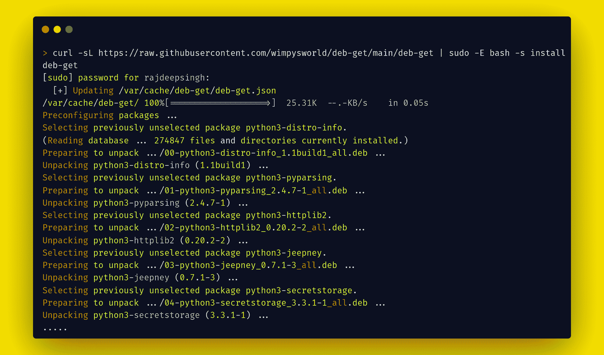
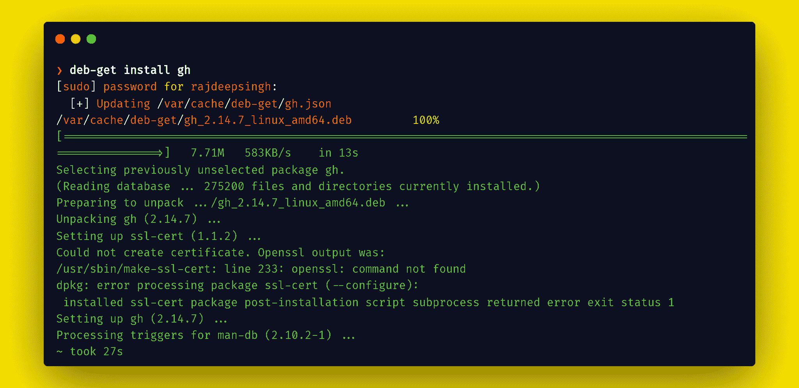
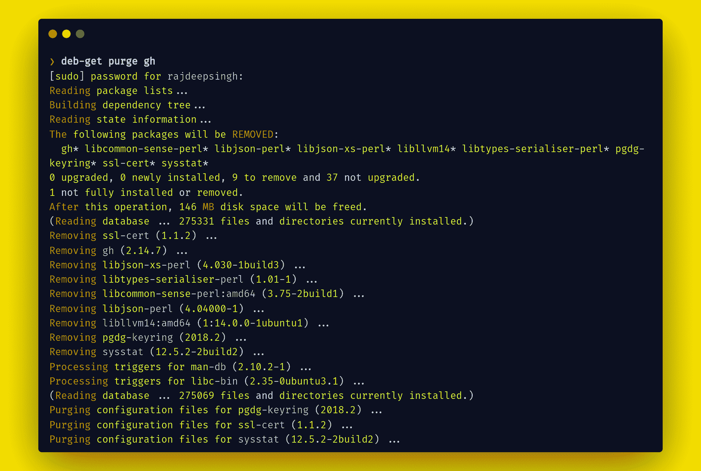
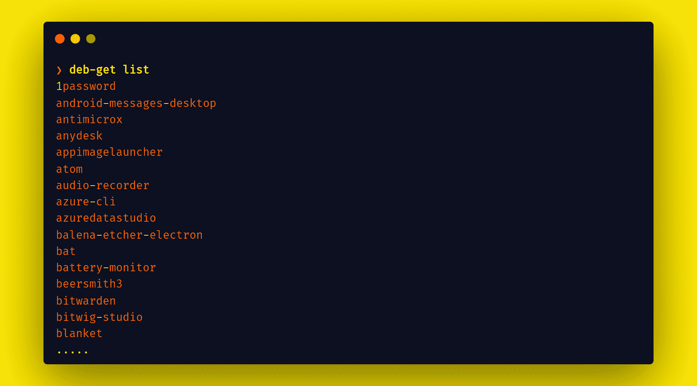

# deb-get 是什么？如何用 deb-get 命令安装 Debian 包

> 原文：<https://www.freecodecamp.org/news/what-is-deb-get-debian-package-manager/>

`deb-get`是一个新的命令行工具，由 Linux 社区的积极贡献者[马丁·温普雷斯](https://twitter.com/m_wimpress)构建。

您可以使用这个工具在您的 Debian 机器上安装第三方软件包。它只适用于 Debian 或基于 Debian 的发行版，如 Ubuntu、Linux mint、Kali Linux 等等。

## 为什么要用`deb-get`？

这是一个很棒的问题。我觉得`deb-get`比其他包管理器更安全，更快。

例如，snap 包要慢得多，而 flatpack 在你的 Debian 系统中安装一个包需要很大的空间。

`deb-get`管理器只使用官方来源的`.deb`文件，并将它们安装到您的系统中。

### `deb-get`命令的优点

我认为`deb-get`命令比 snap、Flatpak 等其他包管理器更有优势。

1.  命令是一个轻量级且稳定的 bash 命令实用程序。
2.  您可以使用 deb-get CLI 工具轻松地做出贡献。您可以在 deb-get 中添加自己的包或其他包。要添加一个包，您需要三到四行代码。
3.  命令从源代码安装官方软件包。它不支持第三方构建包。

### `deb-get`命令的缺点

同样，`deb-get`命令利大于弊。但是主要缺点是`deb-get`是一个新的实用程序。因此，它支持的包比 snap 或 flatpack 少。

## 如何在 Debian 发行版上安装`deb-get`命令

可以用 bash 脚本安装`deb-get`。对于安装，您需要使用`curl`命令在您的 Debian 发行版中安装`deb-get`。如果你已经在你的发行版上安装了`curl`命令，那么跳过这一步。

```
sudo apt install curl  // alredy install,then skip it.
curl -sL https://raw.githubusercontent.com/wimpysworld/deb-get/main/deb-get | sudo -E bash -s install deb-get
```

Installation of deb-get command.

命令输出如下所示:



Your deb-get installation looks like this.

确认`deb-get`已经安装在您的机器上，然后在您的终端上运行`deb-get version`命令。

```
> deb-get version
0.3.5 
```

Check version

## 如何使用`deb-get`

### 如何用`deb-get`安装 Debian 包

使用`deb-get install`命令，您可以从`deb-get`安装软件包。

```
❯ deb-get install    <package-name> 
```

Install the package with deb-get



Install github-cli with the deb-get command

### 如何用`deb-get`删除包

使用`deb-get purge`或`deb-get remove`命令，可以删除任何带有`deb-get`的包。我更喜欢使用`deb-get purge`命令，但是两个标志(`purge`和`remove`)的作用是一样的。标志删除所有安装或配置软件包的配置文件。

```
❯ deb-get purge   <package-name> 
```

Delete package with all config



Delete or uninstall the package with the deb-get command

### 如何在`deb-get`中查看哪些包可用

您可以通过两种方式检查包的可用性。首先，您可以访问 [deb-get 官方文档](https://github.com/wimpysworld/deb-get#supported-software)来查找可用软件包的列表。

第二种方式是命令行实用程序。deb-get 提供了许多标志或选项。我最喜欢的是 deb-get 附带的两个旗帜。

1.  `deb-get list`
2.  `deb-get search  <package-name>`

### 如何使用 deb-get list

`deb-get list`标志提供了终端中所有可用包的列表。



list of available package 

### 如何使用 deb-get 搜索<package-name></package-name>

`deb-get search  <package-name>`标志帮助您根据名称找到一个包。如果标志找到一个包，那么它返回这个包。否则，它返回一个空字符串。


Search package with deb-get

您可以使用`deb-get help`检查所有可用的命令。

## 结论

我认为 deb-get 发行商或 Debian 软件包管理器比其他软件包管理器更有潜力。

每个包管理器都有优点和缺点。但我相信 deb-get 是未来的游戏规则改变者。

你可以在 [Twitter](https://twitter.com/Official_R_deep) 和 [Linkedin](https://www.linkedin.com/in/officalrajdeepsingh/) 上分享和关注。如果你喜欢我的作品，可以在[官方网站](https://officialrajdeepsingh.dev/)和[媒体](https://officialrajdeepsingh.medium.com/)上阅读更多内容。

### 参考

[GitHub - wimpysworld/deb-get: apt-get functionality for .debs published in 3rd party repositories or via direct download 📦apt-get functionality for .debs published in 3rd party repositories or via direct download 📦 - GitHub - wimpysworld/deb-get: apt-get functionality for .debs published in 3rd party repositories or v...wimpysworldGitHub](https://github.com/wimpysworld/deb-get)[deb-get/CONTRIBUTING.md at main · wimpysworld/deb-getapt-get functionality for .debs published in 3rd party repositories or via direct download 📦 - deb-get/CONTRIBUTING.md at main · wimpysworld/deb-getwimpysworldGitHub](https://github.com/wimpysworld/deb-get/blob/main/CONTRIBUTING.md)