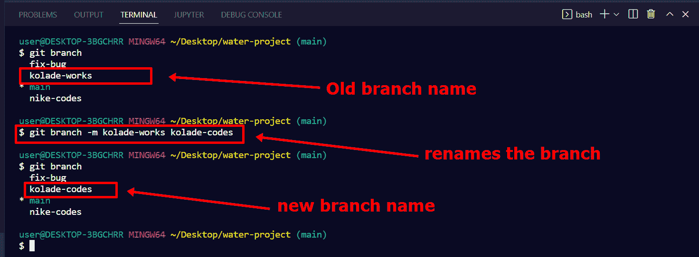
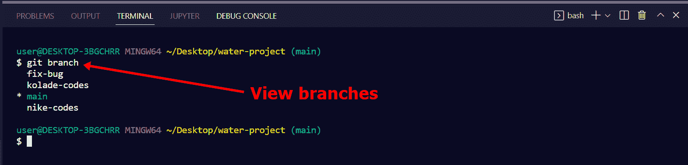
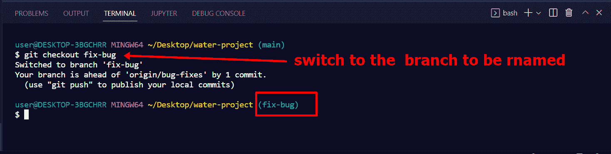
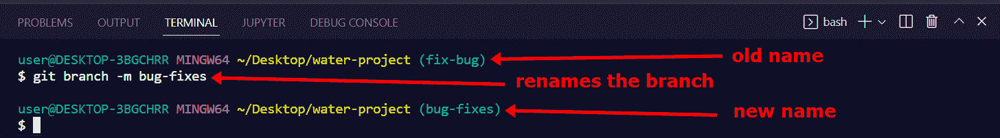
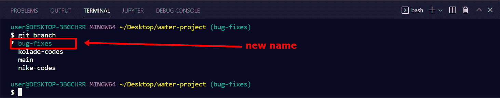

# 重命名 Git 分支——如何在 Git 中重命名当前分支

> 原文：<https://www.freecodecamp.org/news/renaming-a-git-branch-how-to-rename-the-current-branch-in-git/>

如果您正在使用 Git 进行版本控制，那么您可能出于各种原因创建了分支。

既然已经有了这些分支，例如，如果发现输入错误，或者改变代码的用途，您可能想要重命名其中的任何一个分支。

在本文中，我将向您展示如何在不切换到另一个分支的情况下重命名您正在使用的分支。

## 如何在 Git 中重命名分支

要重命名您当前不工作的分支，您通常运行命令`git branch -m old-name new-name`。

例如，我目前在主分支上，我能够将`kolade-works`重命名为`kolade-codes`。

继续本文的下一节，看看如何在 Git 中重命名当前分支。

## 如何在 Git 中重命名当前分支

您需要做的第一件事是运行`git branch`,这样您就可以看到您已经就位的分支:

接下来，确保您位于要更改名称的分支中。你可以通过运行`git checkout branch-name`来实现。

在这种情况下，我想将`fix-bug`分支改为`bug-fixes`。所以我会跑`git checkout fix-bug`:

你可以看到 git bash 向我展示了我现在所在的分支，也就是`fix bug`。

要重命名分支，您需要运行命令`git branch -m new-name`。

记得我指出过我想将`fix bug`分支重命名为`bug-fixes`，所以我将运行`git branch -m bug-fixes`。

在这种情况下，`-m`是代表`move`的旗帜。

您可以看到分支的名称已经成功更改为`bug fixes`。

要确认这一点，您可以再次运行`git branch`:

## 包扎

本文向您展示了如何重命名本地 Git 分支，尤其是如果它是当前分支的话。即使它不是当前分支，您也已经了解了在这种情况下要使用的命令。

如果你也想了解如何重命名一个远程分支，我也写了一篇关于它的文章。

感谢您的阅读。