# Java 手册——初学者学习 Java 编程

> 原文：<https://www.freecodecamp.org/news/the-java-handbook/>

Java 从 90 年代就已经出现了。尽管它在许多领域取得了巨大的成功，这种跨平台、面向对象的编程语言却经常受到诽谤。

不管人们对 Java 的感觉如何，我可以凭经验告诉你，它是一门优秀的编程语言。在 1995 年首次出现后，它仍然被广泛使用——而且很可能不会很快消失。

您可以使用 Java 构建服务器、创建桌面应用程序、游戏、移动应用程序等等。还有其他 JVM(我们很快会讨论这意味着什么)语言，如 [Kotlin](https://kotlinlang.org/) 、 [Groovy](https://groovy-lang.org/) 、 [Scala](https://www.scala-lang.org/) 和 [Clojure](https://clojure.org/) 可以用于不同的目的。

Java 也是跨平台的，这意味着你在一个平台上编写和编译的代码可以在任何其他安装了 Java 的平台上运行。我们将在后面更详细地讨论这个话题。

现在，我可以告诉你，尽管 Java 也有一些缺陷，但它也有很多优点。

## 目录

*   [先决条件](#prerequisites)
*   [如何用 Java 编写 Hello World](#how-to-write-hello-world-in-java)
    *   [代码中发生了什么？](#what-s-going-on-in-the-code)
    *   [什么是 JVM？](#what-is-jvm)
    *   什么是 JRE 和 JDK？
*   如何在电脑上设置 Java？
*   [如何在电脑上安装 Java IDE？](#how-to-install-a-java-ide-on-your-computer)
*   [如何在 IntelliJ IDEA 上创建新项目](#how-to-create-a-new-project-on-intellij-idea)
*   [如何在 Java 中使用变量](#how-to-work-with-variables-in-java)
    *   [声明变量的规则是什么？](#what-are-the-rules-for-declaring-variables)
    *   什么是最终变量？
*   [Java 中的原始数据类型有哪些？](#what-are-the-primitive-data-types-in-java)
    *   [什么是类型转换或造型？](#what-is-type-conversion-or-casting)
    *   [什么是 Java 中的包装类](#what-are-wrapper-classes-in-java)
*   [如何在 Java 中使用运算符](#how-to-use-operators-in-java)
    *   [算术运算符有哪些？](#what-are-the-arithmetic-operators)
    *   [什么是赋值运算符？](#what-are-the-assignment-operators)
    *   [关系运算符有哪些？](#what-are-the-relational-operators)
    *   [逻辑运算符有哪些？](#what-are-the-logical-operators)
    *   [一元运算符有哪些？](#what-are-the-unary-operators)
*   [如何在 Java 中使用字符串](#how-to-work-with-strings-in-java)
    *   [如何格式化字符串](#how-to-format-a-string)
    *   [如何获得一个字符串的长度或者检查它是否为空](#how-to-get-the-length-of-a-string-or-check-if-it-s-empty-or-not)
    *   [如何拆分和连接字符串](#how-to-split-and-join-strings)
    *   [如何将字符串转换成大写或小写](#how-to-convert-a-string-to-upper-or-lowercase)
    *   [如何比较两个字符串](#how-to-compare-two-strings)
    *   [如何替换字符串中的字符或子串](#how-to-replace-characters-or-substring-in-a-string)
    *   [如何检查一个字符串是否包含子串](#how-to-check-if-a-string-contains-a-substring-or-not)
*   [输入和输出数据有哪些不同的方式？](#what-are-the-different-ways-of-inputting-and-outputting-data)
*   [如何在 Java 中使用条件语句](#how-to-use-conditional-statements-in-java)
*   什么是 switch-case 语句？
*   [什么是 Java 中的变量作用域？](#what-is-variable-scope-in-java)
*   [Java 中变量的默认值有哪些？](#what-are-default-values-of-variables-in-java)
*   [如何在 Java 中使用数组](#how-to-work-with-arrays-in-java)
    *   [如何对数组进行排序](#how-to-sort-an-array)
    *   [如何在数组上执行二分搜索法](#how-to-perform-binary-search-on-an-array)
    *   [如何填充数组](#how-to-fill-an-array)
    *   [如何复制数组](#how-to-make-copies-of-an-array)
    *   [如何比较两个数组](#how-to-compare-two-arrays)
*   [如何在 Java 中使用循环](#how-to-use-loops-in-java)
    *   [为循环](#for-loop)
    *   [For-每个循环](#for-each-loop)
    *   [While 循环](#while-loop)
    *   [Do-While 循环](#do-while-loop)
*   [如何在 Java 中使用数组列表](#how-to-work-with-array-lists-in-java)
    *   [如何添加或删除多个元素](#how-to-add-or-remove-multiple-elements)
    *   [如何根据条件删除元素](#how-to-remove-elements-based-on-a-condition)
    *   [如何克隆和比较数组列表](#how-to-clone-and-compare-array-lists)
    *   [如何检查元素是否存在或数组列表是否为空](#how-to-check-if-an-element-is-present-or-the-array-list-is-empty)
    *   [如何对数组列表进行排序](#how-to-sort-an-array-list)
    *   [如何保存两个数组列表中的公共元素](#how-to-keep-common-elements-from-two-array-lists)
    *   [如何对数组列表的所有元素执行操作](#how-to-perform-an-action-on-all-elements-of-an-array-list)
*   [如何在 Java 中使用散列图](#how-to-work-with-hash-maps-in-java)
    *   [如何在散列图中放置或替换多个元素](#how-to-put-or-replace-multiple-elements-in-a-hash-map)
    *   [如何检查散列图是否包含项目或是否为空](#how-to-check-if-a-hash-map-contains-an-item-or-if-it-s-empty)
    *   [如何对散列图的所有元素执行操作](#how-to-perform-an-action-on-all-elements-of-a-hash-map)
*   [Java 中的类和对象](#classes-and-objects-in-java)
    *   [什么是方法？](#what-is-a-method)
    *   什么是方法重载？
*   [Java 中的构造函数有哪些？](#what-are-constructors-in-java)
*   [Java 中的访问修饰符是什么？](#what-are-access-modifiers-in-java)
*   [Java 中的 Getter 和 Setter 方法有哪些？](#what-are-the-getter-and-setter-methods-in-java)
*   [Java 中的继承是什么？](#what-is-inheritance-in-java)
*   [如何在 Java 中覆盖一个方法](#how-to-override-a-method-in-java)
*   [结论](#conclusion)

## **先决条件**

本课程的唯一先决条件是熟悉任何其他编程语言，如 Python、JavaScript 等。

虽然我将在 Java 的上下文中解释关键的编程概念，但我不会解释在一般的编程上下文中变量是什么。

## 如何用 Java 编写 Hello World

理想情况下，第一步应该是在你的电脑上安装 Java，但是我不想一开始就下载和安装一堆软件，让你感到厌烦。对于这个例子，你将使用[https://replit.com/](https://replit.com/)作为你的平台。

首先，去[https://replit.com/](https://replit.com/)创建一个新账户，如果你还没有的话。您可以使用现有的 Google/GitHub/脸书帐户登录。一旦登录，你将登陆你的家。从那里，使用**我的副本**下的**创建**按钮来创建一个新的副本。


在**创建 Repl** 模态中，选择 **Java** 作为**模板，**设置一个描述性的**标题**如 **HelloWorld** 并点击**创建 Repl** 按钮。

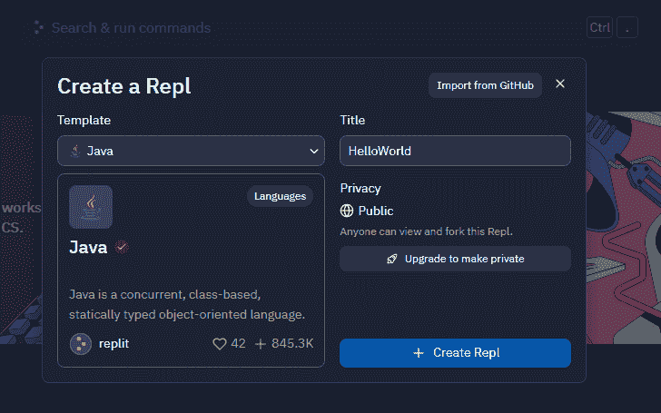

代码编辑器将与集成终端一起出现，如下所示:

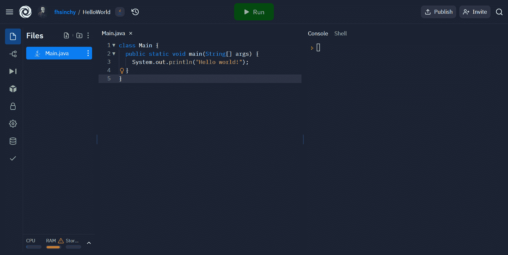

左边是这个项目的文件列表，中间是代码编辑器，右边是终端。

默认情况下，模板附带了一些代码。您可以通过点击**运行**按钮来运行代码。继续这样做，运行程序。

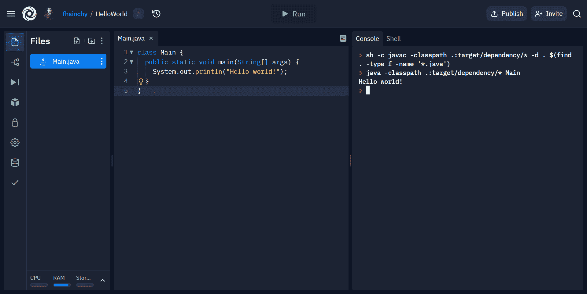

如果一切顺利，你会看到“你好，世界！”印在右边。祝贺你，你已经成功运行了你的第一个 Java 程序。

### 代码中发生了什么？

hello world 程序可能是你能编写的最基本的可执行 Java 程序——理解这个程序是至关重要的。

```
class Main {
  public static void main(String[] args) {
    System.out.println("Hello world!");
  }
}
```

让我们从第一行开始:

```
class Main {
  //...
}
```

这一行创建了一个`Main`类。一个类将一堆相关的代码组合在一个单元中。

这是一个`public`类，这意味着这个类可以在代码库中的任何地方访问。一个 Java 源文件(扩展名为`.java`的文件)只能包含一个顶级的`public`类。

这个顶级公共类的名称必须与源代码文件名完全相同。这就是为什么这个项目中名为`Main.java`的文件包含了`main`类。

要了解原因，点击文件列表中的三个点，然后点击**显示隐藏文件**选项。

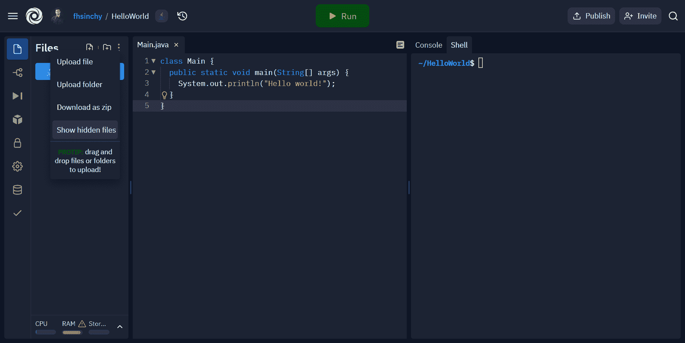

这将揭示项目中的一些新文件。其中就有`Main.class`文件。这被称为字节码。当您点击 Run 按钮时，Java 编译器将您的代码从`Main.java`文件编译成这个字节码。

现在，修改现有的 Hello World 代码，如下所示:

```
class Main {
  public static void main(String[] args) {
    System.out.println("Hello world!");
  }
}

class NotMain {
  public static void main(String[] args) {
    System.out.println("Not hello world!");
  }
}
```

如您所见，添加了一个名为`NotMain`的新类。继续点击**运行**按钮，同时保持你的眼睛在**文件**菜单上。

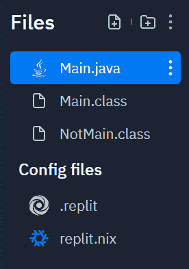

一个名为`NotMain.class`的新字节码出现了。这意味着对于整个代码库中的每个类，编译器都会创建一个单独的字节码。

这就造成了混淆，不知道哪个类是这个程序的入口点。为了解决这个问题，Java 使用与源代码文件名匹配的类作为这个程序的入口点。

关于这个类已经说得够多了，现在让我们看看它内部的函数:

```
class Main {
  public static void main(String[] args) {
    System.out.println("Hello world!");
  }
}
```

`public static void main (String[] args)`函数在 Java 中很特殊。如果你有使用 C、C++或 Go 等语言的经验，你应该已经知道这些语言中的每个程序都有一个 main 函数。程序的执行从这个主函数开始。

在 Java 中，你必须完全按照`public static void main (String[] args)`来写这个函数，否则它就不会工作。事实上，如果你稍微改变一下，Java 就会开始尖叫。

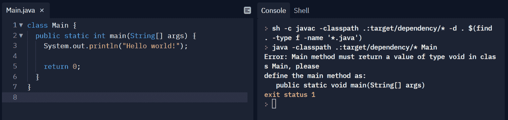

返回类型已经从`void`变为`int`，函数现在在最后返回`0`。正如你在控制台上看到的，它说:

```
Error: Main method must return a value of type void in class Main, please 
define the main method as:
   public static void main(String[] args)
```

听听这个建议，把你的程序恢复到原来的样子。

```
class Main {
  public static void main(String[] args) {
    System.out.println("Hello world!");
  }
} 
```

`main`方法是一个`public`方法，`static`意味着，你可以在不实例化它的类的情况下调用它。

`void`意味着函数不返回值，而`String[] args`意味着函数接受一个字符串数组作为参数。该数组保存执行期间传递给程序的命令行参数。

`System.out.println`在终端上打印出字符串。在上面的例子中，`"Hello world!"`已经被传递给了函数，所以您得到了在终端上打印的`Hello world!`。

在 Java 中，每个语句都以分号结尾。**与 JavaScript 或 Python 不同，Java 中的分号是强制的**。遗漏一个将导致编译失败。

这个项目到此为止。如果您没有逐字理解本节的每个方面，不要担心。随着你的前进，事情会变得更加清楚。

现在，记住 Java 源文件中的顶层`public class`必须与文件名匹配，任何 Java 程序的主函数都必须定义为`public static void main(String[] args)`。

### JVM 是什么？

在前一节中，我已经多次提到“字节码”这个词。我还说过 Java 是“跨平台”的，这意味着在一个平台上编写和编译的代码可以在任何安装了 Java 的平台上运行。

你看，你的处理器不懂英语。事实上，它唯一能理解的是 0 和 1，也就是二进制。

当你编写和编译一个 C++程序时，它会产生一个二进制文件。您的处理器理解它，并且基于程序的目标平台，这个文件可以是不同的。

以 AMD64 和 ARMv8-A 处理器为例。这些处理器有不同的指令集。所以为了在这两个不同的平台上运行你的程序，你必须分别编译它们。

但是 Java 程序可以编写一次，在任何地方运行。我希望您还记得我们在上一节中谈到的字节码。当你编译 Java 代码时，它不会产生二进制代码，而是字节码。

这个字节码不完全是二进制的，但也不是人类可读的。其实你的处理器也读不出来。

因此，我们没有将字节码扔给 CPU，而是通过 Java 虚拟机(简称 JVM)来运行它。JVM 然后读取字节码并解释给 CPU。

如果你想在更深的层次上理解 JVM 的架构，我会推荐 [Siben Nayak](https://www.freecodecamp.org/news/author/theawesomenayak/) 的[关于这个主题的深度文章](https://www.freecodecamp.org/news/jvm-tutorial-java-virtual-machine-architecture-explained-for-beginners/)。

### 什么是 JRE 和 JDK？

JRE 代表 Java 运行时环境，JDK 代表 Java 开发工具包。

JRE 或 Java 运行时环境将 JVM 的实现与运行 Java 程序所需的一组库打包在一起。

另一方面，JDK 将 JRE 与开发 Java 程序所需的所有库打包在一起。

所以如果你想在你的电脑上运行 Java 程序，你需要安装 JRE。如果你想自己开发 Java 程序，你可以安装 JDK。JDK 有多种实现方式。

有来自甲骨文的 [Java SE(标准版)开发套件](https://www.oracle.com/java/technologies/downloads/)，然后有 [OpenJDK](https://openjdk.org/) ，Java SE(标准版)开发套件的官方参考实现。

从 OpenJDK 的名字就可以看出，它是开源的。所以它有多个版本。如果你在一台 Linux 机器上使用你的发行版的包管理器来安装 JDK，你很可能会安装一个 OpenJDK 版本，比如 [Adoptium](https://adoptium.net/) 、[微软 OpenJDK 版本](https://docs.microsoft.com/en-us/java/openjdk/)等等。

我希望你明白 JRE 是 JVM 的超集，JDK 是 JRE 的超集。现在不要担心不同的实现或构建，到时候你会得到它们的。

## 如何在你的电脑上设置 Java

首先，前往[https://www.oracle.com/java/technologies/downloads/](https://www.oracle.com/java/technologies/downloads/)，根据你所在的平台下载最新版本的 **Java SE 开发包**:

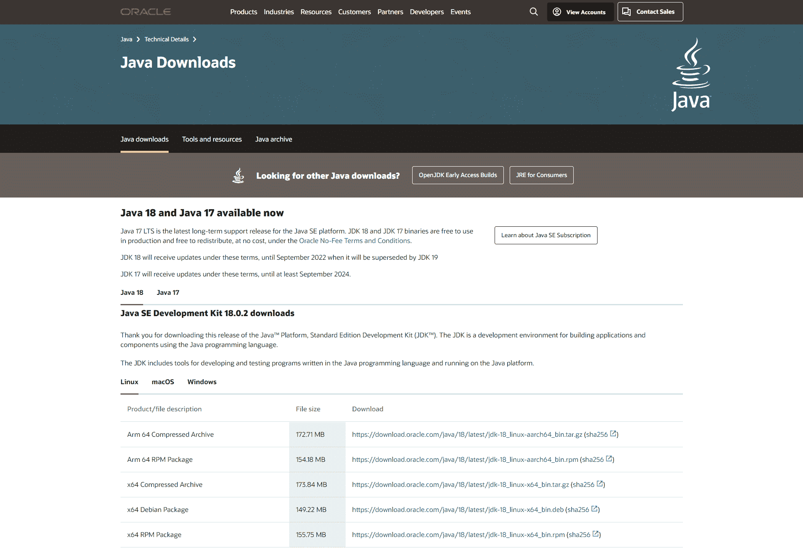

下载完成后，启动安装程序，点击“下一步”按钮完成安装过程。点击最后一页的关闭按钮完成。

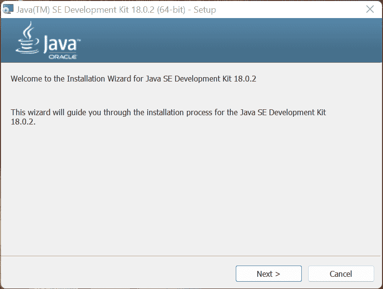

在 macOS 和 Linux 上，安装过程可能会有所不同，但是您应该能够自己解决这个问题。

安装完成后，在终端上执行以下命令:

```
java --version

# java 18.0.2 2022-07-19
# Java(TM) SE Runtime Environment (build 18.0.2+9-61)
# Java HotSpot(TM) 64-Bit Server VM (build 18.0.2+9-61, mixed mode, sharing)
```

如果成功，您就成功地在计算机上安装了 Java SE 开发工具包。如果你想使用 OpenJDK，可以随意下载 OpenJDK 的微软版本或 T2 版本并完成安装过程。

对于我们将在本文中编写的简单示例程序，您使用哪个 JDK 并不重要。但是在现实生活中，要确保你的 JDK 版本和你正在做的项目类型配合得很好。

## 如何在计算机上安装 Java IDE

说到 Java，IntelliJ IDEA 无疑是最好的 IDE。甚至谷歌也把它作为他们在 T2 的安卓工作室 T3 的基地。

IDE 的终极版本可能会让个人每年花费高达 149.00 美元。但是如果你是学生，你可以免费获得所有 JetBrains 产品的[教育许可证](https://www.jetbrains.com/community/education/#students)。

还有完全免费的开源社区版。这是我们整本书都会用到的。

前往 [IntelliJ IDEA 下载页面](https://www.jetbrains.com/idea/download/)，下载适用于您平台的社区版。


下载完成后，使用安装程序像安装其他软件一样安装 IntelliJ IDEA。

## 如何在 IntelliJ IDEA 上创建新项目

使用“开始”菜单中的快捷方式启动 IntelliJ IDEA。将出现以下窗口:


使用**新项目**按钮，将出现一个**新项目**窗口:

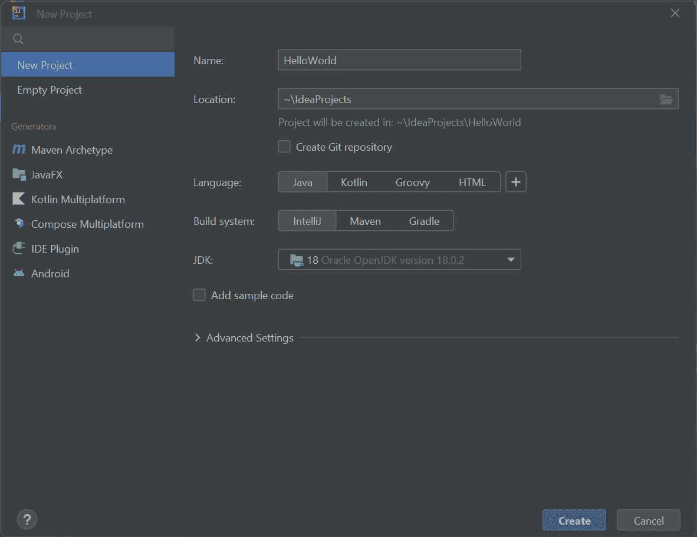

为你的项目起一个描述性的名字。保留其余选项，并按下**创建**按钮。

项目创建应该不会超过一分钟，一旦完成，将出现以下窗口:

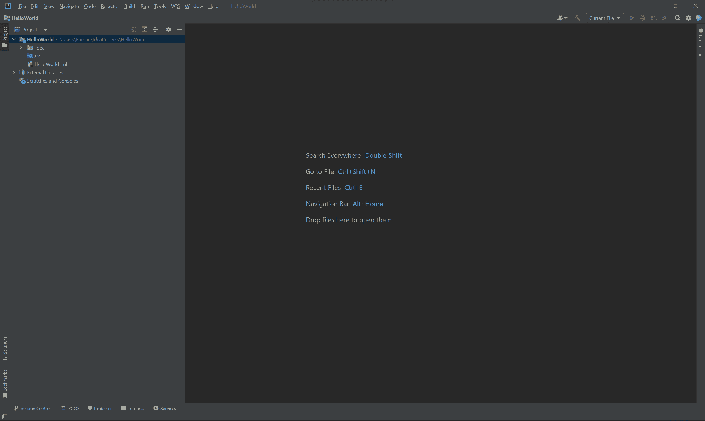

左侧是项目工具窗口。你所有的源代码都将存在于那个`src`文件夹中。

右键点击`src`文件夹，进入**新建> Java 类**。

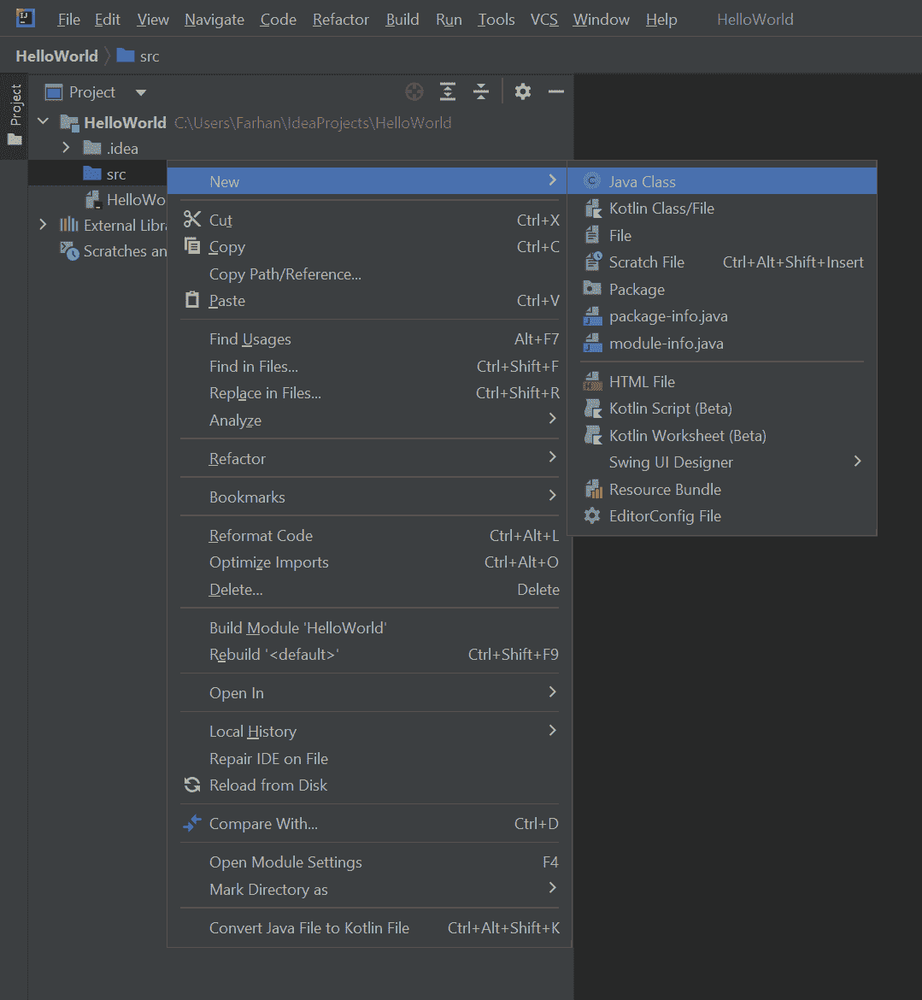

在下一步中，为你的类输入一个名字，比如`Main`，并确保**类**被突出显示为类型。

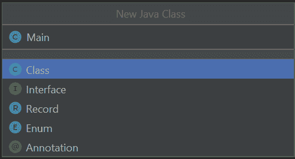

将用几行代码创建一个新类。

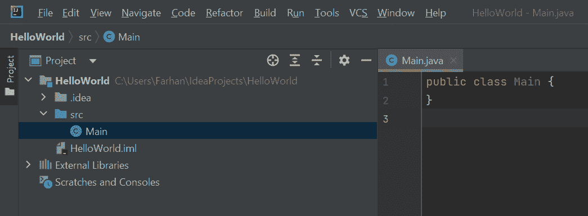

按如下方式更新代码:

```
public class Main {
    public static void main (String[] args) {
        System.out.println("Hello World!");
    }
} 
```

要运行此代码，请使用顶部栏右侧的绿色 play 按钮。

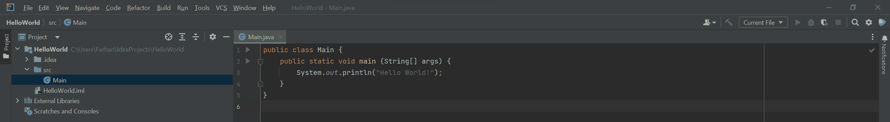

代码将运行，输出将显示在窗口底部的集成终端中。

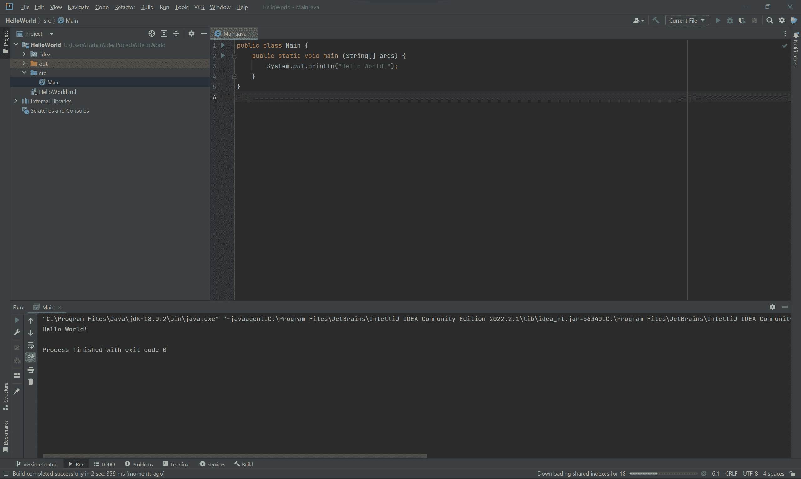

恭喜你，你已经成功地在 IntelliJ IDEA 中重新创建了之前讨论过的`HelloWorld`程序。

## 如何在 Java 中使用变量

要在 Java 中处理不同种类的数据，您可以创建不同类型的变量。例如，如果您想将您的年龄存储在一个新变量中，您可以这样做:

```
public class Main {

	public static void main(String[] args) {
		// <type> <name>
		int age;

	}

} 
```

首先写出数据或变量的类型。由于`age`是一个整数，所以它的类型将是 integer 或简称为`int`，后跟变量的名称`age`和一个分号。

现在，你已经声明了变量，但是还没有初始化它。换句话说，变量没有任何值。您可以按如下方式初始化变量:

```
public class Main {

	public static void main(String[] args) {
		// <type> <name>
		int age;

		// <name> = <value>
		age = 27;

		// prints the age on the terminal
		System.out.println("I am " + age + " years old.");

	}

}
```

赋值时，首先写下要初始化的变量的名字，然后是等号(称为赋值操作符),最后是要赋给变量的值。别忘了结尾的分号。

函数调用`System.out.println();`将把行`I am 27 years old.`打印到控制台。如果您想知道，使用加号是在句子中间动态打印变量的许多方法之一。

你必须记住的一点是，你不能在 Java 中使用未初始化的变量。因此，如果您通过在前面加两个正斜杠来注释掉行`age = 27`,并尝试编译代码，编译器将向您抛出以下错误消息:

```
Exception in thread "main" java.lang.Error: Unresolved compilation problem: 
	The local variable age may not have been initialized

	at variables.Main.main(Main.java:13)
```

行`The local variable age may not have been initialized`表示变量还没有初始化。

不用在不同的行中声明和初始化变量，您可以一次性完成，如下所示:

```
public class Main {

	public static void main(String[] args) {
		// <type> <name> = <value>
		int age = 27;

		// prints the age on the terminal
		System.out.println("I am " + age + " years old.");

	}

}
```

代码应该会再次恢复正常。此外，您可以在代码中任意多次更改变量值。

```
public class Main {

	public static void main(String[] args) {
		int age = 27;

		// updates the value to be 28 instead of 27
		age = 28;

		System.out.println("I am " + age + " years old.");

	}

}
```

在这段代码中，`age`的值将从 27 变为 28，因为您在打印之前覆盖了它。

请记住，尽管您可以根据需要多次为变量赋值，但您不能两次声明同一个变量。

```
public class Main {

	public static void main(String[] args) {
		// <type> <name> = <value>
		int age = 27;

		int age = 28;

		// prints the age on the terminal
		System.out.println("I am " + age + " years old.");

	}

}
```

如果您尝试编译这段代码，编译器将向您抛出以下错误消息:

```
Exception in thread "main" java.lang.Error: Unresolved compilation problem: 
	Duplicate local variable age

	at variables.Main.main(Main.java:9) 
```

第`Duplicate local variable age`行表示该变量已经被声明。

除了变量，你可能会在互联网上找到“文字”这个术语。文字是具有硬编码值的变量。

比如这里，`age = 27`并且不是动态计算的。您已经将值直接写在源代码中。所以`age`是一个整数字面值。

### 声明变量的规则是什么？

在用 Java 命名变量时，有一些规则。你可以给它起任何名字，只要它不是以数字开头，并且名称中不能包含任何空格。

尽管可以用下划线(_)或美元符号($)作为变量名的开头，但是不注意它们的用法会使代码难以阅读。变量名也区分大小写。所以`age`和`AGE`是两个不同的变量。

另一件要记住的重要事情是，你不能使用 Java 保留的任何关键字。目前他们大约有 50 人。你可以从[官方文档](https://docs.oracle.com/javase/tutorial/java/nutsandbolts/_keywords.html)中了解这些关键词，但是不要担心记住它们。

随着你不断练习，重要的会自动溜进你的神经元。如果你还是搞砸了变量声明，编译器会提醒你有问题。

除了规则之外，还有一些你应该遵守的惯例:

*   变量名以小写字母开头，不要使用任何特殊字符(如下划线或美元符号)。
*   如果变量名有多个单词，使用 camel case: `firstName`，`lastName`
*   不要使用单字母名称:`f`、`l`

只要你遵循这些规则和惯例，你就可以做得很好。如果你想从总体上了解更多关于命名约定的知识，[查看我关于主题](https://www.freecodecamp.org/news/programming-naming-conventions-explained/)的文章。

### 什么是`final`变量？

Java 中的`final`变量只能初始化一次。所以如果你声明一个变量为`final`，你就不能重新赋值。

```
public class Main {

	public static void main(String[] args) {
		// final <type> <name> = <value>
		final int age = 27;

		age = 28;

		System.out.println("I am " + age + " years old.");

	}

}
```

由于`age`变量已经被声明为`final`，代码将向您抛出以下错误消息:

```
Exception in thread "main" java.lang.Error: Unresolved compilation problem: 
	The final local variable age cannot be assigned. It must be blank and not using a compound assignment

	at variables.Main.main(Main.java:9) 
```

但是，如果在声明时未初始化该变量，代码将正常工作:

```
public class Main {

	public static void main(String[] args) {
		// final <type> <name>
		final int age;

		age = 28;

		// prints the age on the terminal
		System.out.println("I am " + age + " years old.");

	}

}
```

因此，将变量声明为`final`会限制您重新赋值的能力。如果您不初始化它，您将能够像往常一样初始化它。

## Java 中的原始数据类型有哪些？

在高层次上，Java 中有两种类型的数据。有“原语类型”和“非原语”或“引用类型”。

基本类型存储值。例如，`int`是一个原始类型，它存储一个整数值。

另一方面，引用类型存储对存储动态对象的内存位置的引用。

Java 中有八种基本数据类型。

| 类型 | 说明 |
| --- | --- |
| `byte` | -128 到 127 范围内的 8 位有符号整数 |
| `short` | -32，768 到 32，767 范围内的 16 位有符号整数 |
| `int` | 在-2147483648 到 2147483647 范围内的 32 位有符号整数 |
| `long` | -9223372036854775808 到 9223372036854775807 范围内的 64 位有符号整数 |
| `float` | 1.4E-45 到 3.4028235E38 范围内的单精度 32 位浮点 |
| `double` | 在 4.9E-324 到 1.79e-308 范围内的双精度 64 位浮点 |
| `boolean` | 可以是`true`也可以是`false` |
| `char` | 在`\u0000`(或 0)到`\uffff`(或 65，535，含 65，535)范围内的单个 16 位 Unicode 字符 |

是的，是的，我知道这桌子看起来很吓人，但不要给自己太大压力。你不需要记住它们。

您不需要经常考虑这些范围，即使考虑了，也有办法在 Java 代码中打印出来。

然而，如果你不明白什么是位，我会推荐[这篇短文](https://www.freecodecamp.org/news/binary-definition/)来学习二进制。

在上一节中，你已经学习了如何声明一个整数。你可以用同样的方法声明一个`byte`、`short`和`long`。

声明一个`double`也以同样的方式工作，除了你可以用一个小数点而不是一个整数来分配一个数字:

```
public class Main {

	public static void main(String[] args) {
		double gpa = 4.8;

		System.out.println("My GPA is " + gpa + ".");

	}
}
```

如果给`double`赋值一个`int`，比如用`4`代替`4.8`，输出将是`4.0`而不是`4`，因为`double`总会有一个小数点。

由于`double`和`float`是相似的，你可能认为用`float`替换`double`关键字会将这个变量转换成浮点数——但这是不正确的。您必须在值后面追加一个`f`或`F`:

```
public class Main {

	public static void main(String[] args) {
		float gpa = 4.8f;

		System.out.println("My GPA is " + gpa + ".");

	}
}
```

这是因为，在 Java 中，默认情况下，每个带小数点的数字都被视为一个`double`。如果你没有添加`f`，编译器会认为你试图给`float`变量赋值`double`。

`boolean`数据可以保存`true`或`false`值。

```
public class Main {

	public static void main(String[] args) {
		boolean isWeekend = false;

		System.out.println(isWeekend); // false

	}
}
```

可以想象，`false`可以当作是否定的，`true`可以当作是肯定的。

一旦你学会了条件语句，布尔将变得更加有用。所以现在，只要记住它们是什么，它们能容纳什么。

`char`类型可以保存一定范围内的任何 Unicode 字符。

```
public class Main {

	public static void main(String[] args) {
		char percentSign = '%';

		System.out.println(percentSign); // %

	}
}
```

在本例中，您将百分号保存在一个`char`变量中，并在终端上打印出来。

您还可以使用 Unicode 转义序列打印出某些符号。

```
public class Main {

	public static void main(String[] args) {
		char copyrightSymbol = '\u00A9';

		System.out.println(copyrightSymbol); // ©

	}
}
```

例如，版权符号的 Unicode 转义序列是`\u00A9`，你可以在[这个网站](https://www.rapidtables.com/code/text/unicode-characters.html)上找到更多的 Unicode 转义序列。

在这 8 种类型的数据中，大部分时间你将使用`int`、`double`、`boolean`和`char`。

### 什么是类型转换或类型转换？

Java 中的类型转换可以是“隐式的”，也可以是“显式的”。当编译器自动将较小类型的数据转换为较大类型的数据时，这被称为隐式或收缩类型转换。

```
public class Main {

	public static void main(String[] args) {
		int number1 = 8;
		double number2 = number1;

		System.out.println(number2); // 8.0
	}

} 
```

由于 double 比 integer 大，编译器可以很容易地执行转换。然而，如果您尝试反过来做，您将面临来自编译器的以下错误:

```
Exception in thread "main" java.lang.Error: Unresolved compilation problem: 
	Type mismatch: cannot convert from double to int

	at operators.Main.main(Main.java:7) 
```

执行隐式转换时，转换流程应该如下所示:


例如，你当然可以从一个`short`到一个`double`，跳过中间的其他。

您也可以从较小的数据类型到较大的数据类型。这被称为显式或扩展类型转换。

```
package datatypes;

public class Main {

	public static void main(String[] args) {
		double number1 = 8.5;
		int number2 = (int) number1;

		System.out.println(number2); // 8
	}

}
```

以前您已经看到，如果您试图将较大的数据类型转换为较小的数据类型，编译器会报错。但是当您显式添加`(int)` cast 操作符时，您向编译器显示了谁是老大。

这样做，您会丢失一部分数据。如果您将初始的`double`号从`8.5`更改为仅`8.0`，您将不会丢失任何信息。因此，无论何时执行显式转换，都要小心。

您也可以将`char`转换为`int`，如下所示:

```
public class Main {

	public static void main(String[] args) {
		char character = 'F';
		int number = character;

		System.out.println(number); // 70
	}

} 
```

`70`是字符`F`的 ASCII 码——这就是为什么输出是这样的。如果你想了解更多关于 ASCII 码的知识，我的同事 [Kris Koishigawa](https://www.freecodecamp.org/news/author/kris/) 已经为[写了一篇关于这个主题的优秀文章](https://www.freecodecamp.org/news/ascii-table-hex-to-ascii-value-character-code-chart-2/)。

在这种情况下，转化的流程将与你已经看到的相反。


我建议您尝试将不同的值从一种类型转换为另一种类型，看看会发生什么。这会加深你的理解，让你自信。

### Java 中的包装类是什么？

包装类可以包装原始数据类型，并将它们转换成引用类型。包装类可用于所有八种原始数据类型。

| 原语类型 | 包装类 |
| --- | --- |
| `int` | `Integer` |
| `long` | `Long` |
| `short` | `Short` |
| `byte` | `Byte` |
| `boolean` | `Boolean` |
| `char` | `Character` |
| `float` | `Float` |
| `double` | `Double` |

您可以按如下方式使用这些包装类:

```
public class Main {
    public static void main (String[] args) {
        Integer age = 27;
        Double gpa = 4.8;

        System.out.println(age); // 27
        System.out.println(gpa); // 4.8
    }
}
```

您所要做的就是用等价的包装类替换原始数据类型。这些引用类型也有从其中提取基元类型的方法。

例如，`age.intValue()`将年龄作为原始整数返回，而`gpa.doubleValue()`将 GPA 作为原始双精度类型返回。

所有八种数据类型都有这样的方法。尽管大多数时候您将使用基本类型，但是这些包装类在我们将在后面讨论的一些场景中将会很方便。

## 如何在 Java 中使用运算符

编程中的运算符是某些符号，它们告诉编译器执行某些操作，如算术、关系或逻辑运算。

虽然 Java 中有六种类型的运算符，但这里我就不说按位运算符了。在初学者指南中讨论按位运算符可能会令人生畏。

### 算术运算符有哪些？

算术运算符是可以用来执行算术运算的运算符。他们有五个人:

| 操作员 | 操作 |
| --- | --- |
| `+` | 添加 |
| `-` | 减法 |
| `*` | 增加 |
| `/` | 分开 |
| `%` | 余数(模/模数) |

加法、减法、乘法和除法运算是不言自明的。看看下面的代码示例就明白了:

```
public class Main {

	public static void main(String[] args) {
		int number1 = 10;
		int number2 = 5;

		System.out.println(number1 + number2); // 15
		System.out.println(number1 - number2); // 5
		System.out.println(number1 * number2); // 50
		System.out.println(number1 / number2); // 2
		System.out.println(number1 % number2); // 0

	}

}
```

前四个操作的输出不需要解释。在最后一个操作中，您已经使用`%`符号执行了模/模数操作。结果是`0`,因为如果你把 10 除以 2，就没有余数了。

加法和乘法运算非常简单。但是，当执行减法时，如果第一个操作数大于第二个操作数，结果将是负数，就像在现实生活中一样。

您正在处理的数据类型会影响除法和模运算的结果。

```
public class Main {

	public static void main(String[] args) {
		int number1 = 8;
		int number2 = 5;

		System.out.println(number1 / number2); // 1
	}

}
```

虽然这个操作的结果应该是 1.6，但它没有发生，因为在 Java 中，如果你用一个整数除以另一个整数，结果将是一个整数。但是如果你把两个或者其中一个都改成 float/double，一切都会恢复正常。

```
public class Main {

	public static void main(String[] args) {
		double number1 = 8;
		double number2 = 5;

		System.out.println(number1 / number2); // 1.6
	}

} 
```

这个原理也适用于模运算。如果两个或其中一个操作数是浮点/双精度，结果将是浮点/双精度。

### 什么是赋值运算符？

在上一节中，您已经使用了赋值操作符。

```
public class Main {

	public static void main(String[] args) {
		// <type> <name> = <value>
		int age = 27;

		// prints the age on the terminal
		System.out.println(age);

	}

}
```

当你使用`=`符号给一个变量赋值时，它就像一个赋值操作符。但是，这不是该运算符的唯一形式。

将常规赋值运算符与算术运算符结合使用，可以获得不同的结果。

| 操作员 | 操作 | 等于 |
| --- | --- | --- |
| `+=` | `a += b` | `a = a + b` |
| `-=` | `a -= b` | `a = a - b` |
| `*=` | `a *= b` | `a = a * b` |
| `/=` | `a /= b` | `a = a / b` |
| `%=` | `a %= b` | `a = a % b` |

下面的代码示例应该能让事情变得更清楚:

```
package operators;

public class Main {

	public static void main(String[] args) {
		double number1 = 10;
		double number2 = 5;

		number1 += number2;

		System.out.println(number1); // 15
	}

} 
```

其他操作员的工作方式相同。它们进行运算，然后将结果值赋给左操作数。

我可以用代码演示其他的方法，但是我想如果你自己尝试一下，你会有更好的理解。毕竟，实验和实践是巩固知识的唯一途径。

### 什么是关系运算符？

关系运算符用于检查操作数之间的关系。例如一个操作数是否等于另一个操作数。

这些关系运算符根据您执行的操作返回`true`或`false`。

Java 中有六种关系运算符。

| 操作员 | 说明 | 使用 |
| --- | --- | --- |
| `==` | 等于 | `5 == 8`返回`false` |
| `!=` | 不等于 | `5 != 8`返回`true` |
| `>` | 大于 | `5 > 8`返回`false` |
| `<` | 小于 | `5 < 8`返回`true` |
| `>=` | 大于或等于 | `5 >= 8`返回`false` |
| `<=` | 小于或等于 | `5 <= 8`返回`true` |

下面的代码示例演示了这些运算符的用法:

```
public class Main {

	public static void main(String[] args) {
		double number1 = 10;
		double number2 = 5;

		System.out.println(number1 == number2); // false
		System.out.println(number1 != number2); // true
		System.out.println(number1 > number2); // true
		System.out.println(number1 < number2); // false
		System.out.println(number1 >= number2); // true
		System.out.println(number1 <= number2); // false
	}

} 
```

一旦您在后面的章节中学习了条件语句，这些操作符的实际用法将变得非常明显。

您也可以将这些运算符用于字符。

```
public class Main {

	public static void main(String[] args) {
		char smallLetter = 'a';
		char capitalLetter = 'A';

		System.out.println(smallLetter > capitalLetter); // ???
	}

} 
```

你认为这段代码的输出会是什么？自己去找吧。还记得字符的 ASCII 值吗？它们在这个程序的输出中起作用。

### 逻辑运算符有哪些？

想象一个场景，你做的程序只能被 18 岁以上但不超过 40 岁的人使用。所以逻辑应该如下:

```
can run the program if ->
	age >= 18 and age <= 40
```

或者在另一个场景中，用户必须是你学校的学生或图书馆的成员才能借书。在这种情况下，逻辑应该如下:

```
can borrow books if ->
	isSchoolStudent or isLibraryMember
```

这些逻辑决策可以使用逻辑运算符来做出。Java 中有三个这样的操作符。

| 操作员 | 使用 | 说明 |
| --- | --- | --- |
| 逻辑与(`&&`) | `age >= 18 && age <= 40` | 仅当两个条件都为真时，计算结果为真 |
| 逻辑或(`&#124;&#124;`) | `isSchoolStudent &#124;&#124; isLibraryMember` | 如果两个条件中的一个或两个都为真，则计算结果为真 |
| 不(`!`) | `!isLibraryMember` | 如果内部条件评估为 true，则评估为 false，反之亦然 |

让我们看看代码中的这些操作符。首先，逻辑`and`运算符:

```
public class Main {

	public static void main(String[] args) {
		int age = 20;

		System.out.println(age >= 18 && age <= 40); // true
	}

} 
```

在这种情况下，`&&`操作符的两边都有两个条件。当且仅当两个条件都评估为`true`时，`and`操作评估为`true`。

如果第一个条件评估为`false`，计算机将不会评估其余条件并返回`false`。因为如果第一个求值为`false`，那么整个运算就没有办法求值为`true`。

逻辑`or`操作符的工作方式类似，但是在这种情况下，如果任何条件为真，那么整个操作将评估为真:

```
public class Main {

	public static void main(String[] args) {
		boolean isSchoolStudent = true;
		boolean isLibraryMember = false;

		System.out.println(isSchoolStudent || isLibraryMember); // true
	}

} 
```

如果逻辑`or`运算的第一个条件评估为`true`，计算机将不会评估其余条件并返回`true`。因为如果第一个条件评估为`true`，那么操作将评估为`true`，而不管其他条件评估为什么。

最后，`not`操作符的计算结果与条件的计算结果相反。看一下下面的代码示例:

```
public class Main {

	public static void main(String[] args) {
		boolean isLibraryMember = true;

		System.out.println(isLibraryMember); // true
		System.out.println(!isLibraryMember); // false
	}

} 
```

如您所见，not 操作符返回与给定的`boolean`值相反的值。not 运算符是一元运算符，这意味着它对单个操作数进行运算。

```
public class Main {

	public static void main(String[] args) {
		boolean isLibraryMember = true;
		boolean isSchoolStudent = false;

		System.out.println(!isSchoolStudent || isLibraryMember); // true
	}

} 
```

在本例中，not 运算符将`isSchoolStudent`转换为`true`，因此运算结果为`true`。但是，如果您按如下方式修改代码:

```
public class Main {

	public static void main(String[] args) {
		boolean isLibraryMember = true;
		boolean isSchoolStudent = false;

		System.out.println(!(isSchoolStudent || isLibraryMember)); // false
	}

} 
```

首先，将进行逻辑或运算，并评估为`true`。not 运算符会把它变成`false`。

虽然每个操作符使用了两个操作数，但是您可以使用任意多个操作数。您还可以混合搭配多个运算符。

```
public class Main {

	public static void main(String[] args) {
		boolean isSchoolStudent = true;
		boolean isLibraryMember = false;
		int age = 10;

		System.out.println(isSchoolStudent || isLibraryMember && age > 18); // ???
	}

} 
```

你认为这段代码的输出会是什么？我建议你自己去找。:)

### 一元运算符有哪些？

有些运算符一次只能使用一个操作数，这些运算符称为一元运算符。虽然有五个，但我只讨论两个。

| 操作员 | 说明 |
| --- | --- |
| 增量(`++`) | 将给定值增加 1 |
| 减量(`--`) | 将给定值减 1 |

下面的代码示例将很好地演示它们:

```
public class Main {

	public static void main(String[] args) {
		int score = 95;
		int turns = 11;

		score++;
		turns--;

		System.out.println(score); // 96
		System.out.println(turns); // 10
	}

} 
```

您也可以使用运算符作为前缀:

```
public class Main {

	public static void main(String[] args) {
		int score = 95;
		int turns = 11;

		++score;
		--turns;

		System.out.println(score); // 96
		System.out.println(turns); // 10
	}

} 
```

到目前为止，这很简单。但是您需要了解后缀和前缀语法之间的一些细微差别。请看下面的代码:

```
package operators;

public class Main {

	public static void main(String[] args) {
		int score = 95;

		System.out.println(++score); // 96
		System.out.println(score); // 96
	}

} 
```

这是预期的行为。前缀减量运算符的工作原理相同。但是看看如果切换到后缀版本会发生什么:

```
package operators;

public class Main {

	public static void main(String[] args) {
		int score = 95;

		System.out.println(score++); // 95
		System.out.println(score); // 96
	}

} 
```

很困惑，不是吗？你认为现在变量的实际值是多少？是 96。让我解释一下。

在 print 函数中使用后缀语法时，print 函数首先遇到变量，然后递增变量。这就是为什么第二行打印出新更新的值。

在前缀语法的情况下，函数首先遇到增量运算符，然后执行运算。然后，它继续打印更新后的值。

如果你不小心的话，这个小小的差别可能会让你措手不及。或者在函数调用中尽量避免递增或递减。

## 如何在 Java 中使用字符串

Java 中的`String`类型是最常用的引用类型之一。它是一个字符的集合，你可以用它在你的程序中形成文本行。

在 Java 中创建新字符串有两种方法。第一种是字面意思:

```
public class Main {
	public static void main(String[] args) {
		String name = "Farhan";

		System.out.println("My name is " + name + ".");
	}

}
```

正如您所看到的，以这种方式声明和使用`String`与在 Java 中声明基本类型没有太大的不同。

创建新的`String`的第二种方法是使用`new`操作符。

```
public class Main {
	public static void main(String[] args) {
		// <type> <name> = new <type>(<value>)
		String name = new String("Farhan");

		System.out.println("My name is " + name + ".");
	}

}
```

这个程序将完全像前一个程序一样工作，但两者之间有一点点不同。

JVM 维护计算机内存的一部分来存储字符串。这部分被称为字符串池。

每当您以文字方式创建一个新的`String`时，JVM 首先检查这个`String`是否已经存在于池中。如果是的话，JVM 将重用它。如果没有，那么 JVM 将创建它。

另一方面，当您使用`new`操作符时，JVM 无论如何都会创建一个新的`String`对象。下面的程序清楚地演示了这个概念:

```
public class Main {

	public static void main(String[] args) {
		String literalString1 = "abc";
		String literalString2 = "abc";

		String objectString1 = new String("abc");
		String objectString2 = new String("abc");

		System.out.println(literalString1 == literalString2);
		System.out.println(objectString1 == objectString2);

	}

} 
```

您可能已经知道，`==`操作符用于检查等式。该程序的输出将是:

```
true
false
```

因为`abc`已经在字符串池中，所以`literalString2`变量重用它。然而，在对象字符串的情况下，它们是不同的实体。

### 如何格式化字符串

您已经看到了使用`+`操作符将字符串缝合在一起或者以特定的方式格式化它们。

这种方法一直有效，直到你对一个字符串做了大量的添加。很容易弄乱引号的位置。

格式化字符串的一个更好的方法是`String.format()`方法。

```
public class Main {
	public static void main(String[] args) {
		String name = "Farhan";
		int age = 27;

		String formattedString = String.format("My name is %s and I'm %d years old.", name, age);

		System.out.println(formattedString);
	}

}
```

该方法将带有格式说明符的字符串作为其第一个参数，并将替换这些说明符的参数作为后面的参数。

在上面的代码中，`%s`和`%d`字符是格式说明符。它们负责告诉编译器，字符串的这一部分将被替换。

然后编译器会用`name`替换`%s`，用`age`替换`%d`。说明符的顺序需要与参数的顺序相匹配，而参数需要与说明符的类型相匹配。

`%s`和`%d`不是随机的。它们专用于字符串数据和十进制整数。图表中常用的说明符如下:

| 分类符 | 数据类型 |
| --- | --- |
| `%b`，`%B` | 布尔代数学体系的 |
| `%s`，`%S` | 线 |
| `%c`，`%C` | Unicode 字符 |
| `%d` | 十进制整数 |
| `%f` | 浮点数 |

还有八进制整数的`%o`，十六进制数的`%x`或`%X`，科学记数法的`%e`或`%E`。但是因为，我们不会在本书中讨论它们，所以我把它们省略了。

就像您看到的`%s`和`%d`说明符一样，您可以将这些说明符中的任何一个用于它们对应的数据类型。如果你想知道，那个`%f`说明符对浮点和双精度都有效。

### 如何获得一个字符串的长度或者检查它是否为空

在执行某些操作之前，检查字符串的长度或确保它不为空是一项常见的任务。

每个 string 对象都有一个返回字符串长度的`length()`方法。这就像数组的`length`属性。

```
public class Main {
	public static void main(String[] args) {
		String name = "Farhan";

		System.out.println(String.format("Length of this string is: %d.", name.length())); // 6
	}

}
```

方法以整数形式返回长度。因此您可以自由地将它与整数格式说明符结合使用。

要检查一个字符串是否为空，可以使用`isEmpty()`方法。像`length()`方法一样，它也带有每个 string 对象。

```
public class Main {
	public static void main(String[] args) {
		String name = "Farhan";

		if (name.isEmpty()) {
			System.out.println("There is no name mentioned here");
		} else {
			System.out.println(String.format("Okay, I'll take care of %s.", name));
		}
	}

}
```

该方法返回一个布尔值，因此您可以在 if 语句中直接使用它。该程序检查名称是否为空，并基于此打印出不同的响应。

### 如何拆分和连接字符串

`split()`方法可以根据正则表达式拆分字符串。

```
import java.util.Arrays;

public class Main {
	public static void main(String[] args) {
		String name = "Farhan Hasin Chowdhury";

		System.out.println(Arrays.toString(name.split(" ")));
	}

}
```

方法返回字符串数组。数组中的每个字符串都是原始字符串的子字符串。例如，在这里，你在每个空格处断开字符串`Farhan Hasin Chowdhury`。所以输出会是`[Farhan, Hasin, Chowdhury]`。

只是提醒一下，数组是同一类型的多个数据的集合。

由于该方法采用正则表达式作为参数，因此可以使用正则表达式来执行更复杂的拆分操作。

您也可以将这个数组重新连接成一个字符串，如下所示:

```
public class Main {
	public static void main(String[] args) {
		String name = "Farhan Hasin Chowdhury";

		String substrings[] = name.split(" ");

		String joinedName = String.join(" ", substrings);

		System.out.println(joinedName); // Farhan Hasin Chowdhury
	}

}
```

`join()`方法还可以帮助你在数组之外将多个字符串连接在一起。

```
public class Main {
	public static void main(String[] args) {
		System.out.println(String.join(" ", "Farhan", "Hasin", "Chowdhury")); // Farhan Hasin Chowdhury
	}

}
```

### 如何将字符串转换成大写或小写

在 Java 中，将字符串转换成大写或小写非常简单。有恰当命名的`toUpperCase()`和`toLowerCase()`方法来执行任务:

```
public class Main {
	public static void main(String[] args) {
		String name = "Farhan Hasin Chowdhury";

		System.out.println(name.toUpperCase()); // FARHAN HASIN CHOWDHURY

		System.out.println(name.toLowerCase()); // farhan hasin chowdhury
	}

}
```

### 如何比较两个字符串

因为字符串是引用类型，所以不能使用`=`操作符来比较它们。

`equals()`方法检查两个字符串是否相等，而`equalsIgnoreCase()`方法在比较时忽略它们的大小写。

```
public class Main {
	public static void main(String[] args) {
		String name = "Farhan Hasin Chowdhury";
		String nameUpperCase = name.toUpperCase();

		System.out.println(name.equals(nameUpperCase)); // false

		System.out.println(name.equalsIgnoreCase(nameUpperCase)); // true
	}

}
```

### 如何替换字符串中的字符或子字符串

方法可以替换给定字符串中的字符或整个子字符串。

```
package strings;

public class Main {
	public static void main(String[] args) {
		String loremIpsumStd = "Sed ut perspiciatis unde omnis iste natus error sit voluptatem accusantium doloremque laudantium, totam rem aperiam, eaque ipsa quae ab illo inventore veritatis et quasi architecto beatae vitae dicta sunt explicabo.";

		System.out.println(String.format("Standard lorem ipsum text: %s", loremIpsumStd));

		String loremIpsumHalfTranslated = loremIpsumStd.replace("Sed ut perspiciatis unde omnis iste natus error sit voluptatem accusantium doloremque laudantium", "But I must explain to you how all this mistaken idea of denouncing pleasure and praising pain was born and I will give you a complete account of the system");

		System.out.println(String.format("Translated lorem ipsum text: %s", loremIpsumHalfTranslated));
	}

}
```

这里，`loremIpsumStd`字符串包含原始 lorem ipsum 文本的一部分。然后替换该字符串的第一行，并将新字符串保存在`loremIpsumHalfTranslated`变量中。

### 如何检查一个字符串是否包含子串

`contains()`方法可以检查给定的字符串是否包含某个子串。

```
public class Main {
	public static void main(String[] args) {
		String lyric = "Roses are red, violets are blue";

		if (lyric.contains("blue")) {
			System.out.println("The lyric has the word blue in it.");
		} else {
			System.out.println("The lyric doesn't have the word blue in it.");
		}
	}

}
```

该方法返回一个布尔值，因此您可以在任何条件语句中使用该函数。

有一些最常见的字符串方法。如果你想了解其他的，请随意查阅官方文档。

## 输入和输出数据的方式有哪些不同？

到目前为止，您已经学习了在终端上打印信息的`System.out.println()`方法。在上一节中，您还学习了`String.format()`方法。

在这一节中，您将了解一些`System.out.println()`方法的兄弟方法。您还将学习如何接受用户的输入。

在像 Python 这样的语言中，接受用户的输入非常容易。然而在 Java 中，这需要多几行代码。

```
import java.util.Scanner;

public class Main {

	public static void main(String[] args) {
		Scanner scanner = new Scanner(System.in);

		System.out.print("What's your name? ");
		String name = scanner.nextLine();

		System.out.printf("So %s. How old are you? ", name);
		int age = scanner.nextInt();

		System.out.printf("Cool! %d is a good age to start programming.", age);

		scanner.close();

	}

} 
```

`java.util.Scanner`类是获取用户输入所必需的。您可以使用`import`关键字将该类引入到您的程序中。

然后，您需要使用`new`关键字创建一个`Scanner`类的新实例。在创建新实例时，您必须让它知道您想要的输入流。

您可能希望从用户或文件中获取输入。不管它是什么，你必须让编译器知道它。`System.in`流是标准的输入和输出流。

scanner 对象有一些方法，比如用`nextLine()`接受字符串输入、`nextInt()`接受整数输入、`nextDouble()`接受双精度输入等等。

在上面的代码中，`scanner.nextLine()`方法将向用户请求一个字符串，然后返回给定的输入，并附加一个换行符。

然后`scanner.nextInt()`方法将要求一个整数，并从用户返回给定的数字。

您可能是第一次在这里看到`System.out.printf()`方法。除了`System.out.println()`方法之外，还有一种`System.out.print()`方法，它打印出一个给定的字符串，而不附加一个换行符。

`System.out.printf()`是一种`System.out.print()`和`String.format()`方法的组合。您也可以在这个方法中使用前面讨论过的格式说明符。

一旦完成输入，您需要关闭 scanner 对象。只需调用`scanner.close()`方法就可以做到这一点。

简单吧？让我把它复杂化一点。

```
import java.util.Scanner;

public class Main {

    public static void main(String[] args) {
        Scanner scanner = new Scanner(System.in);

        System.out.print("What's your name? ");
        String name = scanner.nextLine();

        System.out.printf("So %s. How old are you? ", name);
        int age = scanner.nextInt();

        System.out.printf("Cool! %d is a good age to start programming. \nWhat language would you prefer? ", age);
        String language = scanner.nextLine();

        System.out.printf("Ah! %s is a solid programming language.", language);

        scanner.close();

    }

} 
```

我在`scanner.nextInt()`方法调用之后添加了一个新的`scanner.nextLine()`语句。行得通吗？

不，不会的。程序将简单地跳过最后一个输入提示并打印出最后一行。这种行为不仅仅是`scanner.nextInt()`独有的。如果您在使用任何其他的`nextWhatever()`方法之后使用`scanner.nextLine()`，您将面临这个问题。

简而言之，发生这种情况是因为当您在`scanner.nextInt()`方法上按 enter 时，它会消耗整数并将换行符留在输入缓冲区中。

因此，当调用`scanner.nextLine()`时，它使用换行符作为输入的结尾。这个问题最简单的解决方案是在其他 scanner 方法调用之后编写一个额外的`scanner.nextLine()`调用。

```
import java.util.Scanner;

public class Main {

    public static void main(String[] args) {
        Scanner scanner = new Scanner(System.in);

        System.out.print("What's your name? ");
        String name = scanner.nextLine();

        System.out.printf("So %s. How old are you? ", name);
        int age = scanner.nextInt();

        // consumes the dangling newline character
        scanner.nextLine();

        System.out.printf("Cool! %d is a good age to start programming. \nWhat language would you prefer? ", age);
        String language = scanner.nextLine();

        System.out.printf("Ah! %s is a solid programming language.", language);

        scanner.close();

    }

} 
```

有另一种方法可以解决这个问题。但是我不会在这里讨论这个问题。如果你有兴趣，[看看我关于这个话题的文章](https://www.freecodecamp.org/news/java-scanner-nextline-call-gets-skipped-solved/)。

## 如何在 Java 中使用条件语句

您使用条件语句根据条件做出决策。

这是使用如下的`if`语句完成的:

```
public class Main {

	public static void main(String[] args) {
		int age = 20;

		// if (condition) {...}
		if (age >= 18 && age <= 40) {
			System.out.println("you can use the program");
		}

	}

} 
```

该语句以一个`if`开始，然后是一对括号内的条件。如果条件评估为真，花括号内的代码将被执行。

一组花括号中的代码称为代码块。

如果您将`age`的值更改为`50`，将不会执行打印语句，控制台上也不会有输出。对于条件评估为`false`的这种情况，您可以添加一个`else`块:

```
public class Main {

	public static void main(String[] args) {
		int age = 20;

		if (age >= 18 && age <= 40) {
			System.out.println("you can use the program");
		} else {
			System.out.println("you can not use the program");
		}

	}

} 
```

现在，如果条件评估为`false`，那么`else`块中的代码将执行，您将看到`you can not use the program`打印在您的终端上。

在一个`if-else if-else`阶梯中也可以有多个条件:

```
public class Main {

	public static void main(String[] args) {
		int age = 50;
		boolean isSchoolStudent = true;
		boolean isLibraryMember = false;

		// if (condition) {...}
		if (age >= 18 && age <= 40) {
			System.out.println("you can use the program");
		} else if (isSchoolStudent || isLibraryMember) {
			System.out.println("you can use the program for a short time");
		} else {
			System.out.println("you can not use the program");
		}

	}

} 
```

现在，如果第一个条件评估为`false`，那么将测试第二个条件。如果第二个求值结果为`true`，那么花括号内的代码将被执行。如果两个`if`语句中的条件评估为`false`，那么`else`块将被执行。

您还可以将`if`语句嵌套在其他`if`语句中，如下所示:

```
package operators;

public class Main {

	public static void main(String[] args) {
		int age = 20;

		if (age >= 18 && age <= 40) {
			boolean isSchoolStudent = true;
			boolean isLibraryMember = false;

			if (isSchoolStudent || isLibraryMember) {
				System.out.println("you can use the program");
			}
		} else {
			System.out.println("you can not use the program");
		}

	}

} 
```

在这种情况下，只有当第一个`if`语句评估为 true 时，内部的`if`语句才会被测试。

## 什么是 switch-case 语句？

除了 if-else 块之外，还有一些开关情况，您可以基于单个开关定义多个开关情况。

```
import java.util.Scanner;

public class Main {

    public static void main(String[] args) {
        Scanner scanner = new Scanner(System.in);

        System.out.print("What is the first operand? ");
        int a =scanner.nextInt();

        // consumes the dangling newline character
        scanner.nextLine();

        System.out.print("What is the second operand? ");
        int b = scanner.nextInt();

        // consumes the dangling newline character
        scanner.nextLine();

        System.out.print("What operation would you like to perform? ");
        String operation = scanner.nextLine();

        switch (operation) {
            case "sum":
                System.out.printf("%d + %d = %d", a, b, a+b);
                break;
            case "sub":
                System.out.printf("%d - %d = %d", a, b, a-b);
                break;
            case "mul":
                System.out.printf("%d * %d = %d", a, b, a*b);
                break;
            case "div":
                if (b == 0) {
                    System.out.print("Can't divide by zero!");
                } else {
                    System.out.printf("%d / %d = %d", a, b, a / b);
                }
                break;
            default:
                System.out.printf("Invalid Operation!");
        }

        scanner.close();

    }

} 
```

这是一个非常简单的计算器程序。程序提示用户输入两个数字，然后询问他们想要执行什么操作。

每个 switch-case 语句都有一个开关和多个 case。当你说`case "sum"`时，程序检查开关的值或这里的`operation`变量是否是`sum`。

如果匹配，案例体将执行。如果没有匹配的案例，将执行`default`案例。

还有那个`break`声明。它做的和听起来一样:阻止程序进入下一个案例。

如果您删除了`break`语句，所有的案例将一个接一个地执行，直到到达`default`案例。

## Java 中的变量作用域是什么？

作用域是变量的生存期和可访问性。取决于你在哪里声明一个变量，你可能或者不可能从其他地方访问它。

以下面的代码片段为例:

```
public class Main {

	public static void main(String[] args) {
		int age = 20;

		if (age >= 18 && age <= 40) {
			// age variable is accessible here
			// booleans are not accessible here

			boolean isSchoolStudent = true;
			boolean isLibraryMember = false;

			if (isSchoolStudent || isLibraryMember) {
				// booleans are accessible here
				// age variable is accessible here

				System.out.println("you can use the program");
			}
		} else {
			// age variable is accessible here
			// booleans are not accessible here

			System.out.println("you can not use the program");
		}

	}

} 
```

这里，`age`变量是在`class`代码块中声明的。这意味着你可以在整个类中访问这个变量，不会有任何问题。因为变量可以在整个类实例中访问，所以它是一个实例变量。

然而，`isSchoolStudent`和`isLibraryMember`变量已经在第一个`if`语句代码块中声明。所以它在代码块之外是不可访问的。

但是，它可以在第一个`if`块中的任何嵌套代码块中访问。这些被称为局部变量。

也有使用关键字`static`声明的类变量，但是您将在面向对象编程部分了解它们。

所以现在，经验法则是，变量在声明它的代码块和嵌套在父代码块中的任何其他代码块中都是可访问的。

## Java 中变量的默认值是什么？

你已经知道了在 Java 中，你需要在声明一个变量之后初始化它。否则，你将不能使用它。并不是在所有情况下都是这样。

如果在类级别声明一个变量，编译器会给这个变量赋一个默认值。

```
public class Main {

	// gets 0 as the value by default
	static int age;

	public static void main(String[] args) {
		System.out.println(age); // 0
	}
} 
```

由于`main`方法是`static`，它只能访问类级别的`static`变量。我将在面向对象编程部分更详细地讨论`static`。

但是如果您将变量声明移动到`main`方法内部，它就变成了该方法的局部变量，并且不会获得任何默认值。

```
public class Main {
	public static void main(String[] args) {
		// remains uninitialized
		int age;

		System.out.println(age); // fails to compile
	}
} 
```

这段代码将在编译时抛出`The local variable age may not have been initialized`错误。

变量根据它们的类型获得默认值。在大多数情况下，会是`0`或`null`。我给出了所有基本类型及其默认值的列表:

| 数据类型 | 缺省值 |
| --- | --- |
| `byte` | `0` |
| `short` | `0` |
| `int` | `0` |
| `long` | `0L` |
| `float` | `0.0f` |
| `double` | `0.0d` |
| `char` | `'\u0000'` |
| `boolean` | `false` |

默认情况下，任何引用类型都将被赋予值`null`。我们将在面向对象编程部分讨论引用类型、类和对象。

## 如何在 Java 中使用数组

你已经学习了声明单个变量并在你的程序中使用它们。这就是数组的用武之地。

数组是在连续的内存位置中包含相同数据类型的多个值的数据结构。数组可以是任何原始或非原始数据类型。

您可以用 Java 创建一个数组，如下所示:

```
public class Main {

	public static void main(String[] args) {
		// <type> <name>[] = new <type>[<length>]
		char vowels[] = new char[5];

	}
} 
```

首先输入希望保存在数组中的数据类型，在本例中为`char`。然后写出数组的名字，`vowels`，后面跟着一对方括号。这对大括号告诉 Java，你在声明一个字符数组，而不是一个常规的字符变量。

然后在等号后面加上用于在 Java 中创建新对象的操作符`new`。因为数组是 Java 中的引用类型，所以创建新实例需要使用`new`。

通过再次写出类型，然后用另一对方括号将数组的长度括起来，来结束声明。这里，`5`表示数组将保存五个元素，不会超过五个。

当处理单个变量时，可以只通过变量的名称来引用它。但是在数组的情况下，每个元素都有一个索引，数组是从零开始的。这意味着数组中的第一个元素将把`0`作为其索引，而不是`1`。

要访问数组中的一个元素，首先要写出数组的名称——在本例中是`vowels`,后面是一对方括号，将您想要的索引括起来。所以如果你想访问数组中的第一个元素，你可以这样做:

```
public class Main {

	public static void main(String[] args) {
		char vowels[] = new char[5];

		vowels[0] = 'a';
	}
} 
```

在这一点上，`vowels[0]`类似于一个常规的字符变量。您可以将它打印出来，给它赋值，对数字类型进行计算，等等。

因为此时数组是空的，所以我将字符`a`赋给第一个索引。您可以将其余的元音分配给其余的索引，如下所示:

```
public class Main {

	public static void main(String[] args) {
		char vowels[] = new char[5];

		vowels[0] = 'a';
		vowels[1] = 'e';
		vowels[2] = 'i';
		vowels[3] = 'o';
		vowels[4] = 'u';

	}
} 
```

由于索引从`0`开始，它们将在数组- 1 的长度处结束，在本例中是`4`。如果你试图像`vowels[4] = 'x';`一样给数组赋值另一个元素，编译器会抛出如下错误:

```
Exception in thread "main" java.lang.ArrayIndexOutOfBoundsException: Index 5 out of bounds for length 5
	at arrays.Main.main(Main.java:18) 
```

数组不能像常规变量一样打印。你将不得不使用一个循环或者你将不得不把数组转换成一个字符串。因为，我还没有讨论循环，我将使用第二种方法。

```
import java.util.Arrays;

public class Main {

	public static void main(String[] args) {
		char vowels[] = new char[5];

		vowels[0] = 'a';
		vowels[1] = 'e';
		vowels[2] = 'i';
		vowels[3] = 'o';
		vowels[4] = 'u';

		System.out.println("These are the vowels: " + Arrays.toString(vowels));

	}
} 
```

您需要首先导入`java.util.Arrays;`并使用`Arrays.toString()`方法将数组转换成字符串。这个类有很多其他有趣的方法，但是在讨论它们之前，我想向你展示如何一次性声明和初始化一个数组。

```
import java.util.Arrays;

public class Main {

	public static void main(String[] args) {
		char vowels[] = {'a', 'e', 'i', 'o', 'u'};

		System.out.println("These are the vowels: " + Arrays.toString(vowels));

	}
} 
```

声明语法的左侧保持不变。然而，在赋值操作符之后，不是使用`new`,而是写出由逗号分隔并包含在一对花括号中的单个数组元素。

在这种情况下，编译器将计算数组中元素的数量，并将其作为数组的长度。

如果您不知道数组的长度，可以查看一下`length`属性。

在这种情况下，`vowels.length`将是`5`，因为数组中有五个元素。`length`属性是一个整数，存在于 Java 的每个数组中。

数组也可以是多维的。到目前为止，您已经使用了如下所示的数组:


当您想要存储一系列值时，像这样的一维数组是最理想的。但是想象一下，某人的日常用药程序以表格的形式出现:


第一行代表一周的七天，各列代表患者一天三次中应该服药的次数。`0`表示否，`1`表示是。

您可以在程序中使用多维数组来映射此例程:

```
import java.util.Arrays;

public class Main {

	public static void main(String[] args) {		
		int medicineRoutine[][] = {
				{1, 2, 3, 4, 5, 6, 7},
				{0, 1, 1, 0, 1, 1, 0},
				{1, 0, 1, 0, 1, 0, 0},
				{0, 0, 1, 1, 0, 1, 0},
		};

		System.out.println(Arrays.deepToString(medicineRoutine)); // [[1, 2, 3, 4, 5, 6, 7], [0, 1, 1, 0, 1, 1, 0], [1, 0, 1, 0, 1, 0, 0], [0, 0, 1, 1, 0, 1, 0]]

	}
} 
```

多维数组不能用常规的`Arrays.toString()`方法打印出来，你得深入挖掘。

虽然输出看起来一点也不像表格，但是您可以使用一些巧妙的编程使它看起来像表格:

```
import java.util.Arrays;

public class Main {

	public static void main(String[] args) {		
		int medicineRoutine[][] = {
				{1, 2, 3, 4, 5, 6, 7},
				{0, 1, 1, 0, 1, 1, 0},
				{1, 0, 1, 0, 1, 0, 0},
				{0, 0, 1, 1, 0, 1, 0},
		};

		System.out.println(Arrays.deepToString(medicineRoutine).replace("], ", "]\n"));
	}
}

// [[1, 2, 3, 4, 5, 6, 7]
// [0, 1, 1, 0, 1, 1, 0]
// [1, 0, 1, 0, 1, 0, 0]
// [0, 0, 1, 1, 0, 1, 0]]
```

你已经学习了字符串的`replace()`方法。您只是用一个方括号和一个换行符替换了每一行的结尾方括号。

第一行代表 7 个工作日，其余的行是每天的药物常规。该表中的每一行代表一个数组。

要从多维数组中访问单个值，需要两个索引。第一个索引确定行，第二个索引确定列。

所以`medicineRoutine[2][3]`将选择第三个数组的索引`3`中的元素。这个元素就是`0`。使用多维数组看起来有点棘手，但是练习会使它变得容易得多。

既然你可以用 Java 创建任何类型的数组，你为什么不试着自己创建一些其他类型的数组呢，嗯？

### 如何对数组进行排序

对数组执行的最常见的任务之一是对它们进行排序。`java.utils.Arrays`附带了`Arrays.sort()`方法来实现这一点:

```
import java.util.Arrays;

public class Main {

	public static void main(String[] args) {		
		char vowels[] = {'e', 'u', 'o', 'i', 'a'};

		Arrays.sort(vowels);

		System.out.println("The sorted array: " + Arrays.toString(vowels)); // [a, e, i, o , u]

	}
} 
```

`Arrays.sort()`方法将未排序的数组作为其参数，并对其进行排序。因此，您的原始数组本身将按升序排序，而不是返回一个新的排序数组。

默认情况下，方法将数组的第一个索引视为其起始索引，将数组的长度视为其结束索引。

您可以手动指定这两个索引。例如，如果您只想按升序对`u, o, i`进行排序，而让`e, a`保持不变，您可以按如下方式进行:

```
import java.util.Arrays;

public class Main {

	public static void main(String[] args) {		
		char vowels[] = {'e', 'u', 'o', 'i', 'a'};

		int startIndex = 1;
		int endIndex = 4;

		Arrays.sort(vowels, startIndex, endIndex);

		System.out.println("The sorted array: " + Arrays.toString(vowels)); // [e, i, o, u , a]

	}
} 
```

这一次，该方法将数组作为第一个参数，起始索引作为第二个参数，结束索引作为第三个参数。其余的行为保持不变。

### 如何在阵列上执行二分搜索法

在排序值中搜索值是另一项常见任务。`Arrays.binarySearch()`方法允许您使用二分搜索法算法在一个排序的数组中搜索条目。

```
public class Main {

	public static void main(String[] args) {
		char vowels[] = {'a', 'e', 'i', 'o', 'u'};

        char key = 'i';

		int foundItemIndex = Arrays.binarySearch(vowels, key);

		System.out.println("The vowel 'i' is at index: " + foundItemIndex); // 2

	}
} 
```

`Arrays.binarySearch()`方法将一个数组作为它的第一个参数，将搜索关键字(也就是您正在寻找的项目)作为它的第二个参数。它将以整数的形式返回找到的项目的索引。

您可以将该索引存储在一个`int`中，并使用它作为`vowels[foundItemIndex]`从数组中访问元素。

请注意，数组必须按升序排序。如果你不确定数组的顺序，先用`Arrays.sort()`方法排序。

默认情况下，方法将数组的第一个索引视为其起始索引，将数组的长度视为其结束索引。但是您也可以手动指定这些索引。

例如，如果您希望从索引`2`到索引`4`进行搜索，您可以按如下方式进行:

```
import java.util.Arrays;

public class Main {

	public static void main(String[] args) {
		char vowels[] = {'a', 'e', 'i', 'o', 'u'};

        char key = 'i';
		int startIndex = 2;
		int endIndex = 4;

		int foundItemIndex = Arrays.binarySearch(vowels, startIndex, endIndex, key);

		System.out.println("The vowel 'i' is at index: " + foundItemIndex); // 2

	}
} 
```

这一次，该方法将您要搜索的数组作为第一个参数，起始索引作为第二个参数，结束索引作为第三个参数，搜索键作为第四个参数。

现在，搜索将在`i`、`o`和`u`内进行。所以你找`a`，也找不到。在没有找到给定项目的情况下，您将得到一个负索引。由此产生的负指数会因多种因素而异，但我不会在这里讨论这些因素。如果你有兴趣了解更多，[可以看看我关于这个话题的文章](https://www.freecodecamp.org/news/how-to-use-arrays-binarysearch-in-java/)。

### 如何填充数组

你已经学习了用值初始化一个数组，但是有时你可能想用相同的值填充整个数组。`Arrays.fill()`方法可以帮你做到这一点:

```
import java.util.Arrays;

public class Main {

	public static void main(String[] args) {		
		char vowels[] = {'e', 'u', 'o', 'i', 'a'};

		Arrays.fill(vowels, 'x');

		System.out.println("The filled array: " + Arrays.toString(vowels)); // [x, x, x, x, x]

	}
} 
```

与`Arrays.sort()`方法一样，`Arrays.fill()`也就地执行其操作。它将您的数组作为第一个参数，您希望用来填充数组的值作为第二个参数，并就地更新原始数组。

此方法还将第一个索引视为起始索引，将数组的长度视为结束索引。您可以按如下方式手动指定这些索引:

```
import java.util.Arrays;

public class Main {

	public static void main(String[] args) {		
		char vowels[] = {'e', 'u', 'o', 'i', 'a'};

		int startIndex = 1;
		int endIndex = 4;

		Arrays.fill(vowels, startIndex, endIndex, 'x');

		System.out.println("The filled array: " + Arrays.toString(vowels)); // [e, x, x, x, a]

	}
} 
```

这一次，该方法将数组作为第一个参数，起始索引作为第二个参数，结束索引作为第三个参数，填充符作为第四个参数。

### 如何制作数组的副本

由于 Java 中的数组是引用类型，使用赋值操作符复制它们会导致一些意外的行为。

```
import java.util.Arrays;

public class Main {

	public static void main(String[] args) {
		int oddNumbers[] = {1, 3, 5};
		int copyOfOddNumbers[] = oddNumbers;

		Arrays.fill(oddNumbers, 0);

		System.out.println("The copied array: " + Arrays.toString(copyOfOddNumbers)); // [0, 0, 0]

	}
} 
```

尽管您已经对源数组进行了更改，副本也会反映这些更改。这是因为当使用赋值操作符复制数组时，副本引用了内存中的原始数组。

要正确地复制一个数组，可以使用如下的`Arrays.copyOf()`方法:

```
import java.util.Arrays;

public class Main {

	public static void main(String[] args) {
		int oddNumbers[] = {1, 3, 5};
		int copyOfOddNumbers[] = Arrays.copyOf(oddNumbers, oddNumbers.length);

		Arrays.fill(oddNumbers, 0);

		System.out.println("The copied array: " + Arrays.toString(copyOfOddNumbers)); // [1, 3, 5]

	}
} 
```

该方法将源数组作为其第一个参数，并将新数组的所需长度作为第二个参数。如果希望长度相同，只需使用`length`属性传递原始数组的长度。

如果您输入一个较小的长度，那么其后的任何值都将被截断；如果您输入一个较大的长度，那么新的索引将被填充数组数据类型的默认值。

还有另一种方法`Arrays.copyOfRange()`可以将数组的一部分复制到一个新的数组中:

```
import java.util.Arrays;

public class Main {

	public static void main(String[] args) {
		int oddNumbers[] = {1, 3, 5, 7, 9, 11, 13, 15};

		int startIndex = 2;
		int endIndex = 7;

		int copyOfOddNumbers[] = Arrays.copyOfRange(oddNumbers, startIndex, endIndex);

		System.out.println("The copied array: " + Arrays.toString(copyOfOddNumbers)); // [5, 7, 9, 11, 13]

	}
} 
```

该方法将源数组作为其第一个参数，然后是起始索引，最后是结束索引。

请记住，结束指数不是包容性的。这就是为什么新数组中没有 15。但是如果你想包含数组的最后一个索引，就用原数组的长度作为结束索引。

```
import java.util.Arrays;

public class Main {

	public static void main(String[] args) {
		int oddNumbers[] = {1, 3, 5, 7, 9, 11, 13, 15};

		int startIndex = 2;
		int endIndex = oddNumbers.length;

		int copyOfOddNumbers[] = Arrays.copyOfRange(oddNumbers, startIndex, endIndex);

		System.out.println("The copied array: " + Arrays.toString(copyOfOddNumbers)); // [5, 7, 9, 11, 13, 15]

	}
} 
```

现在，新数组中也将包含 15 个。你也可以输入一个比源数组长度更大的数字。在这种情况下，新添加的索引将包含数组数据类型的默认值。

### 如何比较两个数组

如果您在 Java 中使用 equal 关系运算符尝试两次检查两个数组是否相同，您会得到一些意想不到的结果。

```
public class Main {

	public static void main(String[] args) {		
		int oddNumbers1[] = {1, 3, 5, 7, 9, 11, 13, 15};
		int oddNumbers2[] = {1, 3, 5, 7, 9, 11, 13, 15};

		System.out.println(oddNumbers1 == oddNumbers2); // false
	}
} 
```

即使两个数组是相同的，程序的输出也是`false`。由于数组是引用类型，关系运算符将检查它们是否是同一个实例。

要在 Java 中比较两个数组，可以使用`Arrays.equals()`方法:

```
import java.util.Arrays;

public class Main {

	public static void main(String[] args) {		
		int oddNumbers1[] = {1, 3, 5, 7, 9, 11, 13, 15};
		int oddNumbers2[] = {1, 3, 5, 7, 9, 11, 13, 15};

		System.out.println(Arrays.equals(oddNumbers1, oddNumbers2)); // true
	}
} 
```

但是，如果您更改了这些数组中的一个元素，输出将会是`false`,因为数组不再保持相同。

您也可以比较多维数组，但是为此您必须使用`Arrays.deepEquals()`方法，而不是常规方法。

```
import java.util.Arrays;

public class Main {

	public static void main(String[] args) {		
		int medicineRoutine[][] = {
				{1, 2, 3, 4, 5, 6, 7},
				{0, 1, 1, 0, 1, 1, 0},
				{1, 0, 1, 0, 1, 0, 0},
				{0, 0, 1, 1, 0, 1, 0},
		};

		int medicineRoutine2[][] = {
				{1, 2, 3, 4, 5, 6, 7},
				{0, 1, 1, 0, 1, 1, 0},
				{1, 0, 1, 0, 1, 0, 0},
				{0, 0, 1, 1, 0, 1, 0},
		};

		System.out.println(Arrays.deepEquals(medicineRoutine, medicineRoutine2)); // true
	}
} 
```

每当在父数组中遇到新数组时，此方法都会调用自身。

这些是`java.util.Arrays`类中一些最常见的方法。如果你想了解更多，你可以查阅官方文件。

## 如何在 Java 中使用循环

如果你需要重复一个任务一定的次数，你可以使用循环。循环有三种类型:它们是`for`循环、`for...each`循环和`while`循环。

### For 循环

For 循环可能是你在互联网上看到的最常见的循环类型。

每个 for 循环由三部分组成。初始化、条件和更新表达式。循环分多个步骤进行。


如果要使用 for 循环打印从 0 到 10 的数字，可以按如下方式进行:

```
public class Main {

	public static void main(String[] args) {
		for (int number = 0; number <= 10; number++) {
			System.out.println(number);
		}
	}
}

// 0
// 1
// 2
// 3
// 4
// 5
// 6
// 7
// 8
// 9
// 10
```

该循环的流程图如下所示:


1.  在循环的开始，用初始值`0`初始化一个名为`number`的新整数。
2.  然后检查`number`是否小于等于`10`。
3.  如果它小于或等于`10`，则执行循环块中的语句，并在终端上打印出数字。
4.  然后，通过将 number 变量的值增加 1 来更新它。
5.  循环返回到检查 number 的值是否仍然小于或等于。

只要 number 的值保持小于或等于 10，循环就会继续。当`number`变量的值变为`11`时，循环结束。

您可以使用 for 循环来循环数组，如下所示:

```
public class Main {

	public static void main(String[] args) {
		int fibonacciNumbers[] = {0, 1, 1, 2, 3, 5, 8, 13, 21, 34, 55};

		for(int index = 0; index < fibonacciNumbers.length; index++) {
			System.out.println(fibonacciNumbers[index]);
		}
	}
} 
```

该循环的流程图如下:


因为数组的最后一个索引比它的长度小一，所以只要索引小于数组长度，就运行循环。当索引等于数组的长度时，就退出循环。

你可以用循环做的一件有趣的事情是打印出乘法表。例如，5 的乘法表如下所示:

```
public class Main {

	public static void main(String[] args) {
		int number = 5;

		for (int multiplier = 1; multiplier <= 10; multiplier++) {
			System.out.println(String.format("%d x %d = %d", number, multiplier, number * multiplier));
		}
	}
}

// 5 x 1 = 5
// 5 x 2 = 10
// 5 x 3 = 15
// 5 x 4 = 20
// 5 x 5 = 25
// 5 x 6 = 30
// 5 x 7 = 35
// 5 x 8 = 40
// 5 x 9 = 45
// 5 x 10 = 50
```

循环也可以嵌套。也就是说你可以把一个循环放在另一个循环里。您可以使用嵌套循环打印出从 1 到 10 的所有数字的乘法表:

```
public class Main {

	public static void main(String[] args) {
		for (int number = 1; number <= 10; number++) {
			System.out.println(String.format("\nmultiplication table of %d", number));
			for (int multiplier = 1; multiplier <= 10; multiplier++) {
				System.out.println(String.format("%d x %d = %d", number, multiplier, number * multiplier));
			}
		}
	}
} 
```

我不敢在这里打印输出。相反，您可以自己尝试代码。在一张纸上画出循环的每一次迭代，以便理解每一步发生了什么。

### For-Each 循环

如果您希望像数组一样遍历集合，并对该集合的每个元素执行一些操作，可以使用 for...每个循环。

```
public class Main {

	public static void main(String[] args) {
		int fibonacciNumbers[] = {0, 1, 1, 2, 3, 5, 8, 13, 21, 34, 55};

		for(int number : fibonacciNumbers) {
			System.out.println(number);
		}
	}
} 
```

在 for-each 循环的情况下，项的类型需要与您正在处理的集合的类型相匹配。这里，数组的类型是 integer，所以循环中的项的类型是 integer。

这与前面显示的 for 循环执行相同的任务。但是在这个例子中，您不必跟踪索引或者使用方括号来访问元素。它看起来更干净，更不容易出错。

### While 循环

如果想执行一堆代码，直到满足某个条件，可以使用 while 循环。


while 循环中没有初始化或更新步骤。无论发生什么，都发生在循环体内。如果您使用 while 循环重写打印 5 乘法表的程序，将如下所示:

```
public class Main {

	public static void main(String[] args) {
		int number = 5;
		int multiplier = 1;

		while (multiplier <= 10) {
			System.out.println(String.format("%d x %d = %d", number, multiplier, number*multiplier));

			multiplier++;
		}
	}
}

// 5 x 1 = 5
// 5 x 2 = 10
// 5 x 3 = 15
// 5 x 4 = 20
// 5 x 5 = 25
// 5 x 6 = 30
// 5 x 7 = 35
// 5 x 8 = 40
// 5 x 9 = 45
// 5 x 10 = 50
```

虽然循环不像现实世界中的循环那样常见，但了解它们是值得的。

### Do-While 循环

您将了解的最后一种循环是 do-while 循环。它有点颠倒了常规 while 循环的顺序——因此，不是在执行循环体之前检查条件，而是先执行循环体，然后检查条件。


使用 do-while 循环实现的乘法表代码如下:

```
public class Main {

	public static void main(String[] args) {
		int number = 5;
		int multiplier = 1;

		do {
			System.out.println(String.format("%d x %d = %d", number, multiplier, number*multiplier));

			multiplier++;
		} while (multiplier <= 10);
	}
}

// 5 x 1 = 5
// 5 x 2 = 10
// 5 x 3 = 15
// 5 x 4 = 20
// 5 x 5 = 25
// 5 x 6 = 30
// 5 x 7 = 35
// 5 x 8 = 40
// 5 x 9 = 45
// 5 x 10 = 50
```

当你需要执行一些操作直到用户给出一个特定的输入时，Do-while 循环非常有用。例如，显示菜单直到用户按下“x”键。

## 如何在 Java 中使用数组列表

Java 中的数组不可调整大小。一旦你设置了数组的长度，你就不能以任何方式改变它。Java 中的`ArrayList`类减轻了这种限制。

```
import java.util.ArrayList;

public class Main {
    public static void main (String[] args) {
        ArrayList<Integer> oddNumbers = new ArrayList<>();

        oddNumbers.add(1);
        oddNumbers.add(3);
        oddNumbers.add(5);
        oddNumbers.add(7);
        oddNumbers.add(9);

        System.out.println(oddNumbers.toString()); // [1, 3, 5, 7, 9]
    }
} 
```

要创建数组列表，您需要在源文件的顶部导入`java.util.ArrayList`类。

然后开始编写`ArrayList`，然后在一对小于-大于符号中，编写元素的数据类型。然后您将添加数组列表本身的名称，后跟赋值操作符和`new ArrayList<>()`。

您不能创建基本类型的数组列表，所以您必须使用相应的包装类。

尽管这些元素像数组一样有从零开始的索引，但是您不能使用方括号符号来访问它们。相反，您必须使用`get()`方法:

```
import java.util.ArrayList;

public class Main {
    public static void main (String[] args) {
        ArrayList<Integer> oddNumbers = new ArrayList<>();

        oddNumbers.add(1);
        oddNumbers.add(3);
        oddNumbers.add(5);
        oddNumbers.add(7);
        oddNumbers.add(9);

        System.out.println(oddNumbers.get(2)); // 5
    }
}
```

`get()`方法将获得给定索引中的值。就像`get()`一样，您可以使用`set()`方法来更新元素的值。

```
import java.time.LocalDate;
import java.util.ArrayList;

public class Main {
    public static void main (String[] args) {
        ArrayList<Integer> oddNumbers = new ArrayList<>();

        oddNumbers.add(1);
        oddNumbers.add(3);
        oddNumbers.add(5);
        oddNumbers.add(7);
        oddNumbers.add(9);

        oddNumbers.set(2, 55);

        System.out.println(oddNumbers.get(2)); // 55
    }
}
```

`set()`方法的第一个参数是索引，第二个参数是更新后的值。

没有类似于数组中的`length`属性，但是你可以在任何数组列表中使用`size()`方法来找出它的长度。

```
import java.util.ArrayList;

public class Main {
    public static void main (String[] args) {
        ArrayList<Integer> oddNumbers = new ArrayList<>();

        oddNumbers.add(1);
        oddNumbers.add(3);
        oddNumbers.add(5);
        oddNumbers.add(7);
        oddNumbers.add(9);

        System.out.println(oddNumbers.size()); // 5
    }
}
```

可以使用 remove 方法从数组列表中删除元素:

```
import java.util.ArrayList;

public class Main {
    public static void main (String[] args) {
        ArrayList<Integer> oddNumbers = new ArrayList<>();

        oddNumbers.add(1);
        oddNumbers.add(3);
        oddNumbers.add(5);
        oddNumbers.add(7);
        oddNumbers.add(9);

        oddNumbers.remove(Integer.valueOf(7));
        oddNumbers.remove(Integer.valueOf(9));

        System.out.println(oddNumbers.toString()); // [1, 3, 5]
    }
} 
```

方法可以通过值或索引移除元素。如果您将一个原始的整数值传递给这个方法，它将删除给定索引中的元素。

但是如果你传递一个对象，比如下面的代码，这个方法会找到并删除给定的元素。所有包装类中都有`valueOf()`方法，它可以将原始值转换为引用类型。

### 如何添加或删除多个元素

您已经看到了`add()`和`remove()`方法的例子。还有另外两种方法`addAll()`和`removeAll()`来处理多个元素。

```
import java.util.ArrayList;

public class Main {
    public static void main (String[] args) {
        ArrayList<Integer> oddNumbers = new ArrayList<>();

        oddNumbers.add(1);
        oddNumbers.add(3);
        oddNumbers.add(5);

        ArrayList<Integer> moreOddNumbers = new ArrayList<>();

        moreOddNumbers.add(7);
        moreOddNumbers.add(9);
        moreOddNumbers.add(11);

        oddNumbers.addAll(moreOddNumbers); // [1, 3, 5, 7, 9, 11]

        System.out.println(oddNumbers.toString());

        oddNumbers.removeAll(moreOddNumbers);

        System.out.println(oddNumbers.toString()); // [1, 3, 5]
    }
} 
```

两种方法都接受集合作为它们的参数。在上面的代码中，您创建了两个独立的数组列表，并使用`addAll()`方法将它们连接起来。

然后，使用`removeAll()`方法从第二个数组列表中移除元素，数组列表回到其原始状态。

您也可以使用`clear()`方法从数组列表中删除所有元素:

```
import java.util.ArrayList;

public class Main {
    public static void main (String[] args) {
        ArrayList<Integer> oddNumbers = new ArrayList<>();

        oddNumbers.add(1);
        oddNumbers.add(3);
        oddNumbers.add(5);

        oddNumbers.clear();

        System.out.println(oddNumbers.toString()); // []
    }
}
```

该方法根本不需要任何参数，也不返回任何值。它只是在一次调用中清空数组列表。

### 如何基于条件删除元素

`removeIf()`方法可以从数组列表中移除满足特定条件的元素:

```
import java.util.ArrayList;

public class Main {
    public static void main (String[] args) {
        ArrayList<Integer> numbers = new ArrayList<>();

        for (int i = 0; i <= 10; i++) {
            numbers.add(i);
        }

        System.out.println(numbers.toString()); // [0, 1, 2, 3, 4, 5, 6, 7, 8, 9, 10]

        numbers.removeIf(number -> number % 2 == 1);

        System.out.println(numbers.toString()); // [0, 2, 4, 6, 8, 10]
    }
}
```

该方法将 lambda 表达式作为参数。Lambda 表达式类似于未命名的方法。他们可以接收参数并使用它们。

这里，`removeIf()`方法将遍历数组列表，并将每个元素作为`number`变量的值传递给 lambda 表达式。

然后 lambda 表达式将检查给定的数字是否能被 2 整除，并基于此返回`true`或`false`。

如果 lambda 表达式返回`true`，`removeIf()`方法将保留该值。否则该值将被删除。

### 如何克隆和比较数组列表

要复制数组列表，可以使用`clone()`方法。

```
import java.util.ArrayList;

public class Main {
    public static void main (String[] args) {
        ArrayList<Integer> numbers = new ArrayList<>();

        for (int i = 0; i <= 10; i++) {
            numbers.add(i);
        }

        ArrayList<Integer> numbersCloned = (ArrayList<Integer>)numbers.clone();

        System.out.println(numbersCloned.equals(numbers)); // true
    }
} 
```

`clone()`方法返回一个对象，所以您必须手动将它转换成一个合适的数组列表。您可以像在数组中一样使用`equals()`方法来比较两个数组列表。

### 如何检查元素是否存在或数组列表是否为空

您可以使用`contains()`方法来检查数组列表是否包含给定的元素:

```
import java.util.ArrayList;

public class Main {
    public static void main (String[] args) {
        ArrayList<Integer> oddNumbers = new ArrayList<>();

        oddNumbers.add(1);
        oddNumbers.add(3);
        oddNumbers.add(5);
        oddNumbers.add(7);
        oddNumbers.add(9);

        System.out.println(oddNumbers.isEmpty()); // false
        System.out.println(oddNumbers.contains(5)); // true
    }
}
```

如果你想检查一个数组列表是否为空，只需对它调用`isEmpty()`方法，你将得到一个布尔值作为返回。

### 如何对数组列表进行排序

您可以使用`sort()`方法以不同的顺序对数组列表进行排序:

```
import java.util.ArrayList;
import java.util.Comparator;

public class Main {
    public static void main (String[] args) {
        ArrayList<Integer> oddNumbers = new ArrayList<>();

        oddNumbers.add(5);
        oddNumbers.add(7);
        oddNumbers.add(1);
        oddNumbers.add(9);
        oddNumbers.add(3);

        System.out.println(oddNumbers.toString()); [5, 7, 1, 9, 3]

        oddNumbers.sort(Comparator.naturalOrder());

        System.out.println(oddNumbers.toString()); [1, 3, 5, 7, 9]
    }
}
```

`sort()`方法将一个比较器作为其参数。比较器对数组列表施加排序顺序。

您可以通过更改传递的比较器来对数组列表进行逆序排序:

```
import java.util.ArrayList;
import java.util.Comparator;

public class Main {
    public static void main (String[] args) {
        ArrayList<Integer> oddNumbers = new ArrayList<>();

        oddNumbers.add(5);
        oddNumbers.add(7);
        oddNumbers.add(1);
        oddNumbers.add(9);
        oddNumbers.add(3);

        System.out.println(oddNumbers.toString()); // [5, 7, 1, 9, 3]

        oddNumbers.sort(Comparator.reverseOrder());

        System.out.println(oddNumbers.toString()); // [9, 7, 5, 3, 1]
    }
}
```

比较器还有其他的用法，但是这些已经超出了本书的范围。

### 如何保持两个数组列表中的公共元素

想象一个场景，你有两个数组列表。现在，您必须找出哪些元素同时出现在两个数组列表中，并从第一个数组列表中删除其余的元素。

```
import java.util.ArrayList;

public class Main {
    public static void main (String[] args) {
        ArrayList<Integer> oddNumbers = new ArrayList<>();

        oddNumbers.add(1);
        oddNumbers.add(3);
        oddNumbers.add(5);

        ArrayList<Integer> moreOddNumbers = new ArrayList<Integer>();

        moreOddNumbers.add(5);
        moreOddNumbers.add(7);
        moreOddNumbers.add(9);

        oddNumbers.retainAll(moreOddNumbers);

        System.out.println(oddNumbers.toString()); // [5]
    }
}
```

`retainAll()`方法可以从第一个数组列表中去掉不常见的元素。您需要在您想要操作的数组列表上调用方法，并将第二个数组列表作为参数传递。

### 如何对数组列表的所有元素执行操作

您已经在前面的章节中学习了循环。嗯，数组列表有自己的`forEach()`方法，该方法将 lambda 表达式作为参数，可以对数组列表的所有元素执行操作。

```
import java.util.ArrayList;

public class Main {
    public static void main (String[] args) {
        ArrayList<Integer> oddNumbers = new ArrayList<>();

        oddNumbers.add(1);
        oddNumbers.add(3);
        oddNumbers.add(5);
        oddNumbers.add(7);
        oddNumbers.add(9);

        oddNumbers.forEach(number -> {
            number = number * 2;
            System.out.printf("%d ", number); // 2 6 10 14 18
        });

        System.out.println(oddNumbers.toString()); // [1, 3, 5, 7, 9]
    }
}
```

上次，你看到的 lambda 表达式是一行——但是它们可以更长。这里，`forEach()`方法将遍历数组列表，并将每个元素作为`number`变量的值传递给 lambda 表达式。

lambda 表达式然后将提供的值乘以 2，并在终端上打印出来。但是，原始数组列表将保持不变。

## 如何在 Java 中使用散列映射

Java 中的哈希映射可以在键值对中存储元素。这种集合类型相当于 Python 中的字典和 JavaScript 中的对象。

```
import java.util.HashMap;

public class Main {
    public static void main (String[] args) {
        HashMap<String, Double> prices = new HashMap<>();

        prices.put("apple", 2.0);
        prices.put("orange", 1.8);
        prices.put("guava", 1.5);
        prices.put("berry", 2.5);
        prices.put("banana", 1.0);

        System.out.printf(prices.toString()); // {orange=1.8, banana=1.0, apple=2.0, berry=2.5, guava=1.5}
    }
}
```

要创建散列映射，首先必须在源文件的顶部导入`java.util.HashMap`类。

然后开始编写`HashMap`，然后在一对小于-大于符号中，编写键和值的数据类型。

这里，键是字符串，值是双精度值。之后是赋值操作符，后面是`new HashMap<>()`。

您可以使用`put()`方法将记录放入哈希表中。该方法将键作为第一个参数，将其对应的值作为第二个参数。

还有一种`putIfAbsent()`方法，它只在给定元素已经不存在于哈希映射中时才添加它。

```
import java.util.HashMap;

public class Main {
    public static void main (String[] args) {
        HashMap<String, Double> prices = new HashMap<>();

        prices.put("apple", 2.0);
        prices.put("orange", 1.8);
        prices.put("guava", 1.5);
        prices.put("berry", 2.5);
        prices.put("banana", 1.0);

        prices.putIfAbsent("guava", 2.9);

        System.out.println(prices.toString()); // {orange=1.8, banana=1.0, apple=2.0, berry=2.5, guava=1.5}
    }
}
```

您可以使用`get()`方法从哈希表中取出一个值。该方法将密钥作为其参数。

```
import java.util.HashMap;

public class Main {
    public static void main (String[] args) {
        HashMap<String, Double> prices = new HashMap<>();

        prices.put("apple", 2.0);
        prices.put("orange", 1.8);
        prices.put("guava", 1.5);
        prices.put("berry", 2.5);
        prices.put("banana", 1.0);

        System.out.println(prices.get("banana")); // 1.000000
    }
}
```

这种方法还有另一种变体。`getOrDefault()`方法的工作方式类似于`get()`，但是如果没有找到给定的键，它将返回一个指定的默认值。

```
import java.util.HashMap;

public class Main {
    public static void main (String[] args) {
        HashMap<String, Double> prices = new HashMap<>();

        prices.put("apple", 2.0);
        prices.put("orange", 1.8);
        prices.put("guava", 1.5);
        prices.put("berry", 2.5);
        prices.put("banana", 1.0);

        System.out.println(prices.getOrDefault("jackfruit", 0.0)); // 0.0
    }
}
```

默认值必须与哈希表中值的类型相匹配。您可以使用`replace()`方法更新哈希表中的值:

```
import java.util.HashMap;

public class Main {
    public static void main (String[] args) {
        HashMap<String, Double> prices = new HashMap<>();

        prices.put("apple", 2.0);
        prices.put("orange", 1.8);
        prices.put("guava", 1.5);
        prices.put("berry", 2.5);
        prices.put("banana", 1.0);

        prices.replace("berry", 2.8);

        System.out.printf(prices.toString()); // {orange=1.8, banana=1.0, apple=2.0, berry=2.8, guava=1.5}
    }
}
```

要从哈希映射中删除元素，可以使用名副其实的`remove()`方法:

```
import java.util.HashMap;

public class Main {
    public static void main (String[] args) {
        HashMap<String, Double> prices = new HashMap<>();

        prices.put("apple", 2.0);
        prices.put("orange", 1.8);
        prices.put("guava", 1.5);
        prices.put("berry", 2.5);
        prices.put("banana", 1.0);

        prices.remove("guava");

        System.out.printf(prices.toString()); // {orange=1.8, banana=1.0, apple=2.0, berry=2.5}
    }
}
```

如果您需要知道一个 hash map 中有多少个条目，您可以使用`size()`方法:

```
import java.util.HashMap;

public class Main {
    public static void main (String[] args) {
        HashMap<String, Double> prices = new HashMap<>();

        prices.put("apple", 2.0);
        prices.put("orange", 1.8);
        prices.put("guava", 1.5);
        prices.put("berry", 2.5);
        prices.put("banana", 1.0);

        System.out.println(prices.size()); // 5
    }
}
```

最后，如果你想在 Java 中清除一个散列映射，你可以通过使用`clear()`方法来完成。

```
import java.util.HashMap;

public class Main {
    public static void main (String[] args) {
        HashMap<String, Double> prices = new HashMap<>();

        prices.put("apple", 2.0);
        prices.put("orange", 1.8);
        prices.put("guava", 1.5);
        prices.put("berry", 2.5);
        prices.put("banana", 1.0);

        prices.clear();

        System.out.println(prices.toString()); // {}
    }
}
```

就像在数组列表中一样，该方法不接受任何参数，也不返回任何值。

### 如何在哈希映射中放置或替换多个元素

如果想一次将多个元素放入一个 hash map 中，可以使用`putAll()`方法:

```
import java.util.HashMap;

public class Main {
    public static void main (String[] args) {
        HashMap<String, Double> prices = new HashMap<>();

        prices.put("apple", 2.0);
        prices.put("orange", 1.8);
        prices.put("guava", 1.5);
        prices.put("berry", 2.5);
        prices.put("banana", 1.0);

        HashMap<String, Double> morePrices = new HashMap<>();

        prices.put("jackfruit", 2.9);
        prices.put("pineapple", 1.1);
        prices.put("tomato", 0.8);

        prices.putAll(morePrices);

        System.out.println(prices.toString()); // {orange=1.8, banana=1.0, apple=2.0, berry=2.5, pineapple=1.1, tomato=0.8, guava=1.5, jackfruit=2.9}
    }
}
```

该方法将另一个哈希映射作为其参数，并将其元素添加到调用该方法的元素中。

您还可以使用`replaceAll()`方法来更新一个哈希映射中的多个值。

```
import java.util.HashMap;

public class Main {
    public static void main (String[] args) {
        HashMap<String, Double> prices = new HashMap<>();

        prices.put("apple", 2.0);
        prices.put("orange", 1.8);
        prices.put("guava", 1.5);
        prices.put("berry", 2.5);
        prices.put("banana", 1.0);

        prices.replaceAll((fruit, price) -> price * 2);

        System.out.println(prices.toString()); // {orange=3.6, banana=2.0, apple=4.0, berry=5.0, guava=3.0}
    }
}
```

replace all 方法遍历 hashmap，并将每个键值对传递给 lambda 表达式。

lambda 表达式的第一个参数是键，第二个参数是值。在 lambda 表达式中，您执行您的操作。

### 如何检查一个哈希映射是否包含一个条目或者是否为空

您可以使用方法`containsKey()`和`containsValue()`来检查哈希映射是否包含值。

```
import java.util.HashMap;

public class Main {
    public static void main (String[] args) {
        HashMap<String, Double> prices = new HashMap<>();

        prices.put("apple", 2.0);
        prices.put("orange", 1.8);
        prices.put("guava", 1.5);
        prices.put("berry", 2.5);
        prices.put("banana", 1.0);

        System.out.println(prices.containsKey("banana")); // true
        System.out.println(prices.containsValue(2.5)); // true
    }
}
```

这两种方法的区别在于，`containsKey()`方法检查给定的键是否存在，而`containsValue()`方法检查给定值是否存在。

如果您想检查一个散列映射是否为空，您可以使用`isEmpty()`方法:

```
import java.util.HashMap;

public class Main {
    public static void main (String[] args) {
        HashMap<String, Double> prices = new HashMap<>();

        prices.put("apple", 2.0);
        prices.put("orange", 1.8);
        prices.put("guava", 1.5);
        prices.put("berry", 2.5);
        prices.put("banana", 1.0);

        System.out.println(prices.isEmpty()); // false
    }
}
```

因为该方法返回一个布尔值，所以可以在 if-else 语句中使用它。

### 如何对哈希映射的所有元素执行操作

像数组列表一样，哈希表也有自己的`forEach()`方法，您可以用它来遍历哈希表，并对每个条目重复某个操作。

```
import java.util.HashMap;

public class Main {
    public static void main (String[] args) {
        HashMap<String, Double> prices = new HashMap<>();

        prices.put("apple", 2.0);
        prices.put("orange", 1.8);
        prices.put("guava", 1.5);
        prices.put("berry", 2.5);
        prices.put("banana", 1.0);

        System.out.println("prices after discounts");

        prices.forEach((fruit, price) -> {
            System.out.println(fruit + " - " + (price - 0.5));
        });
    }
}

// prices after discounts
// orange - 1.3
// banana - 0.5
// apple - 1.5
// berry - 2.0
// guava - 1.0
```

该方法循环遍历每个条目，并将键和值传递给 lambda 表达式。在 lambda 表达式体内，你可以做任何你想做的事情。

## Java 中的类和对象

这里有一个[面向对象编程](https://en.wikipedia.org/wiki/Object-oriented_programming)的有用定义:

> OOP(面向对象编程)是一种基于“对象”概念的编程范式，它可以包含数据和代码:字段形式的数据(通常称为属性或特性)，以及过程形式的代码(通常称为方法)。

想象一个图书馆管理系统，图书馆的成员可以登录，看看他们已经借的书，请求新书，等等。

在这个系统中，用户和书籍都可以是对象。这些对象将拥有自己的属性，比如姓名和生日(对于用户而言)以及书名和作者(对于书籍而言)。

面向对象编程中的类是上述对象的蓝图。我们已经讨论了 user 和 book 对象的可能属性。

要创建一个新的`User`类，再次右键单击`src`文件夹。然后转到 **New > Java 类**，将其命名为`User`，并回车。

记住前面讨论的属性，您的`User`类的代码应该如下所示:

```
import java.time.LocalDate;

public class User {
    String name;
    LocalDate birthDay;
}
```

`LocalDate`是表示日期的引用数据类型。现在回到`Main.java`文件，创建这个类的一个新实例:

```
import java.time.LocalDate;

public class Main {
    public static void main (String[] args) {
        User user = new User();

        user.name = "Farhan";
        user.birthDay = LocalDate.parse("1996-07-15");

        System.out.printf("%s was born on %s.", user.name, user.birthDay.toString()); // Farhan was born on 15th July 1996.
    }
} 
```

创建一个新用户与创建一个新的字符串或数组没有太大的不同。首先写出类名，然后写出实例或对象名。

然后，在赋值操作符后面加上`new`关键字和构造函数调用。构造函数是初始化对象的特殊方法。

构造函数已经用默认值初始化了对象属性，默认值是所有这些引用类型的`null`。

您可以通过写出对象的名称，后跟一个点，然后是属性的名称来访问对象的属性。

`LocalDate.parse()`方法可以从给定的字符串中解析日期。由于`birthDay`是一个引用类型，你必须使用`toString()`方法在控制台上打印出来。

### 什么是方法？

类的变量或属性描述了它的对象的状态。另一方面，方法描述了行为。

例如，您可以在您的`User`类中有一个计算用户年龄的方法。

```
import java.time.Period;
import java.time.LocalDate;

public class User {
    String name;
    LocalDate birthDay;

    int age() {
        return Period.between(this.birthDay, LocalDate.now()).getYears();
    }
}
```

这里，`this`关键字表示该类的当前实例。首先写出方法的返回类型。由于用户的年龄是一个整数，所以这个方法的返回类型将是`int`。

在返回类型之后，写下方法的名称，后面跟着一对括号。

然后，在一对花括号内编写方法体。Java 中的`Period`类表示 ISO-8601 日历系统中的时间框架。`LocalDate.now()`方法返回当前日期。

因此`Period.between(this.birthDay, LocalDate.now()).getYears()`方法调用将返回当前日期和出生日期之间的差值。

现在回到`Main.java`文件，您可以如下调用这个方法:

```
import java.time.LocalDate;

public class Main {
    public static void main (String[] args) {
        User user = new User();

        user.name = "Farhan";
        user.birthDay = LocalDate.parse( "1996-07-15");

        System.out.printf("%s is %s years old.", user.name, user.age()); // Farhan a 26 years old.
    }
} 
```

方法也可以接受参数。例如，如果您想要创建一个方法`borrow()`，用于将新书插入到该用户的借书列表中，您可以按如下方式进行:

```
import java.time.LocalDate;
import java.time.Period;
import java.util.ArrayList;

public class User {
    String name;
    LocalDate birthDay;

    ArrayList<String> borrowedBooks = new ArrayList<String>();

    int age() {
        return Period.between(this.birthDay, LocalDate.now()).getYears();
    }

    void borrow(String bookTitle) {
        this.borrowedBooks.add(bookTitle);
    }
}
```

回到`Main.java`文件，您可以如下调用这个方法:

```
public class Main {
    public static void main (String[] args) {
        User user = new User();

        user.name = "Farhan";

        user.borrow("Carmilla");
        user.borrow("Hard West");

        System.out.printf("%s has borrowed these books: %s", user.name, user.borrowedBooks.toString()); // Farhan has borrowed these books: [Carmilla, Hard West]
    }
} 
```

让我们也为这些书创建一个类:

```
import java.util.ArrayList;

public class Book {
    String title;
    ArrayList<String> authors = new ArrayList<String>();
} 
```

书籍通常有多个作者。现在您可以在`Main.java`文件中创建一个新的 book 实例。

```
import java.time.LocalDate;

public class Main {
    public static void main (String[] args) {
        User user = new User();
        user.name = "Farhan";
        user.birthDay = LocalDate.parse( "1996-07-15");

        Book book = new Book();
        book.title = "Carmilla";
        book.authors.add("Sheridan Le Fanu");

        System.out.printf("%s is written by %s", book.title, book.authors.toString()); // Carmilla is written by [Sheridan Le Fanu]

    }
} 
```

现在让我们回到`User.java`文件，在用户和书籍之间创建一个关系:

```
import java.time.LocalDate;
import java.time.Period;
import java.util.ArrayList;

public class User {
    String name;
    LocalDate birthDay;

    ArrayList<Book> borrowedBooks = new ArrayList<Book>();

    int age() {
        return Period.between(this.birthDay, LocalDate.now()).getYears();
    }

    void borrow(Book book) {
        this.borrowedBooks.add(book);
    }
}
```

不使用字符串数组列表，而是使用书籍数组列表来存储该用户所借的书籍。

由于方法的参数类型已经改变，您必须相应地更新`Main.java`文件中的代码:

```
import java.time.LocalDate;

public class Main {
    public static void main (String[] args) {
        User user = new User();
        user.name = "Farhan";
        user.birthDay = LocalDate.parse( "1996-07-15");

        Book book = new Book();
        book.title = "Carmilla";
        book.authors.add("Sheridan Le Fanu");

        user.borrow(book);

        System.out.printf("%s has borrowed these books: %s", user.name, user.borrowedBooks.toString()); // Farhan has borrowed these books: [Book@30dae81]
    }
}
```

除了书籍信息没有正确打印之外，一切都很好。

希望你记住`toString()`的方法。当你调用`user.borrowedBooks.toString()`时，编译器意识到存储在数组列表中的项是对象或引用类型。所以它开始调用这些项目中的`toString()`方法。

问题是，在你的`Book`类中没有正确实现`toString()`。打开`Book.java`，更新其代码如下:

```
import java.util.ArrayList;

public class Book {
    String title;
    ArrayList<String> authors = new ArrayList<String>();

    public String toString() {
        return String.format("%s by %s", this.title, this.authors.toString());
    }
} 
```

`toString()`方法现在返回一个格式良好的字符串，而不是对象引用。再次运行代码，这次输出应该是`Farhan has borrowed these books: [Carmilla by [Sheridan Le Fanu]]`。

正如你所看到的，能够围绕现实生活中的实体来设计你的软件，使得它更有关联。虽然只有一个数组列表和一串字符串在运行，但感觉就像是在进行真正的图书借阅操作。

### 什么是方法重载？

在 Java 中，如果参数不同，多个方法可以同名。这被称为方法重载。

一个例子是`User`类上的`borrow()`方法。现在，它接受一本书作为它的参数。让我们制作一个重载版本，它可以接受一组书籍。

```
import java.time.LocalDate;
import java.time.Period;
import java.util.ArrayList;
import java.util.Arrays;

public class User {
    private String name;
    private LocalDate birthDay;
    private ArrayList<Book> borrowedBooks = new ArrayList<Book>();

    public String getName() {
        return this.name;
    }

    public void setName(String name) {
        this.name = name;
    }

    public String getBorrowedBooks() {
        return this.borrowedBooks.toString();
    }

    User (String name, String birthDay) {
        this.name = name;
        this.birthDay = LocalDate.parse(birthDay);
    }

    int age() {
        return Period.between(this.birthDay, LocalDate.now()).getYears();
    }

    void borrow(Book book) {
        borrowedBooks.add(book);
    }

    void borrow(Book[] books) {
        borrowedBooks.addAll(Arrays.asList(books));
    }
}
```

新方法的返回类型和名称与前一个方法相同，但是这个方法接受一组`Book`对象，而不是单个对象。

让我们更新`Main.java`文件来利用这个重载的方法。

```
public class Main {
    public static void main (String[] args) {
        User user = new User("Farhan", "1996-07-15");

        Book book1 = new Book("Carmilla", new String[]{"Sheridan Le Fanu"});
        Book book2 = new Book("Frankenstein", new String[]{"Mary Shelley"});
        Book book3 = new Book("Dracula", new String[]{"Bram Stoker"});

        user.borrow(new Book[]{book1, book2});

        user.borrow(book3);

        System.out.printf("%s has borrowed these books: %s", user.getName(), user.getBorrowedBooks());
    }
}
```

如您所见，`borrow()`方法现在可以毫无问题地接受一组书籍或单个书籍对象。

## Java 中的构造函数是什么？

构造函数是一种特殊的方法，存在于每个类中，每当你从一个类中创建一个新对象时，编译器都会调用它。

因为该方法是在对象的构造过程中被调用的，所以它被称为构造函数。默认情况下，构造函数为其所有属性分配默认值。

要重写默认的构造函数，您需要在您的类下创建一个与类同名的新方法。

```
import java.time.LocalDate;
import java.time.Period;
import java.util.ArrayList;

public class User {
    public String name;
    public LocalDate birthDay;
    public ArrayList<Book> borrowedBooks = new ArrayList<Book>();

    User (String name, String birthDay) {
        this.name = name;
        this.birthDay = LocalDate.parse(birthDay);
    }

    int age() {
        return Period.between(this.birthDay, LocalDate.now()).getYears();
    }

    void borrow(Book book) {
        this.borrowedBooks.add(book);
    }
}
```

现在您有了一个构造函数，而不是从`Main.java`文件中的字符串解析日期，您可以在这里这样做。

这是因为生日的形式是`User`类关心的，而`Main`类不需要为此费心。

对 book 类的处理也一样:

```
import java.util.ArrayList;
import java.util.Arrays;

public class Book {
    public String title;
    public ArrayList<String> authors = new ArrayList<String>();

    Book(String title, String[] authors) {
        this.title = title;
        this.authors = new ArrayList<String>(Arrays.asList(authors));
    }

    public String toString() {
        return String.format("%s by %s", this.title, this.authors.toString());
    }
} 
```

同样，`authors`集合的类型与`Main`类无关。在 Java 中，处理一堆值的最基本方式是数组。

因此，您将从`Main`类接收作者姓名作为数组，并在`Book`类中创建一个数组列表。

现在，当在`Main.java`文件中创建新的用户或图书对象时，您必须将这些参数传递给构造函数。

```
import java.util.ArrayList;

public class Main {
    public static void main (String[] args) {
        User user = new User("Farhan", "1996-07-15");

        Book book = new Book("Carmilla", new String[]{"Sheridan Le Fanu"});

        user.borrow(book);

        System.out.printf("%s has borrowed these books: %s", user.name, user.borrowedBooks.toString()); // Farhan has borrowed these books: [Carmilla, Hard West]
    }
}
```

看它已经看起来干净多了。但很快就会变得更好看。

## Java 中的访问修饰符是什么？

你已经多次看到关键字`public`。这是 Java 中的访问修饰符之一。

Java 中有四种访问修饰符:

| 原语类型 | 包装类 |
| --- | --- |
| 默认 | 可在包内访问 |
| 公共 | 随处可得 |
| 私人的 | 可在类内访问 |
| 保护 | 可在类和子类中访问 |

现在，我将讨论`Default`、`Public`和`Private`访问修饰符。`Protected`将在后面的章节中讨论。

你已经了解了类。包是由功能分隔的多个类的集合。

例如，如果你在做一个游戏，你可以把所有物理相关的类放在一个单独的包里，把图形相关的放在另一个包里。

软件包超出了本书的范围，但是随着您继续从事越来越大的项目，您将会掌握它们的窍门。

`Public`访问修饰符是不言自明的。这些变量、方法或类可以从项目中的任何其他类或包中访问。

另一方面，那些人则相反。它们只在他们的班级中可用。

以`User`类为例。用户的名字和生日不应该从外部访问。

```
import java.time.LocalDate;
import java.time.Period;
import java.util.ArrayList;

public class User {
    private String name;
    private LocalDate birthDay;
    private ArrayList<Book> borrowedBooks = new ArrayList<Book>();

    User (String name, String birthDay) {
        this.name = name;
        this.birthDay = LocalDate.parse(birthDay);
    }

    int age() {
        return Period.between(this.birthDay, LocalDate.now()).getYears();
    }

    void borrow(Book book) {
        borrowedBooks.add(book);
    }
}
```

那更好。更新`Book`类，对外界隐藏标题和作者信息。

```
import java.util.ArrayList;
import java.util.Arrays;

public class Book {
    private String title;
    private ArrayList<String> authors = new ArrayList<String>();

    Book(String title, String[] authors) {
        this.title = title;
        this.authors = new ArrayList<String>(Arrays.asList(authors));
    }

    public String toString() {
        return String.format("%s by %s", this.title, this.authors.toString());
    }
} 
```

因为这些属性现在已经变成私有的了，`Main.java`文件中的`System.out.println()`行将无法直接访问它们，这将导致一个问题。

这个程序的解决方案是编写其他类可以用来访问这些属性的公共方法。

## Java 中的 Getter 和 Setter 方法有哪些？

Getters 和 setters 是类中用于读写私有属性的公共方法。

```
import java.time.LocalDate;
import java.time.Period;
import java.util.ArrayList;

public class User {
    private String name;
    private LocalDate birthDay;
    private ArrayList<Book> borrowedBooks = new ArrayList<Book>();

    public String getName() {
        return this.name;
    }

    public String getBirthDay() {
        return this.birthDay.toString();
    }

    public String getBorrowedBooks() {
        return this.borrowedBooks.toString();
    }

    User (String name, String birthDay) {
        this.name = name;
        this.birthDay = LocalDate.parse(birthDay);
    }

    int age() {
        return Period.between(this.birthDay, LocalDate.now()).getYears();
    }

    void borrow(Book book) {
        borrowedBooks.add(book);
    }
}
```

`getName()`和`getBorrowedBooks()`负责返回`name`和`borrowedBooks`变量的值。

您实际上从来没有在`age()`方法之外访问过生日变量，所以 getter 是不必要的。

由于`borrowedBooks`变量的类型与`Main`类无关，getter 确保以正确的格式返回值。

现在更新`Main.java`文件中的代码，以利用这些方法:

```
public class Main {
    public static void main (String[] args) {
        User user = new User("Farhan", "1996-07-15");

        Book book = new Book("Carmilla", new String[]{"Sheridan Le Fanu"});

        user.borrow(book);

        System.out.printf("%s has borrowed these books: %s", user.getName(), user.getBorrowedBooks());
    }
}
```

非常好。它变得更加清晰易读。像 getters 一样，也有 setters 用于将值写入私有属性。

例如，您可能希望允许用户更改他们的姓名或生日。`borrow()`方法已经作为`borrowedBooks`数组列表的设置器。

```
import java.time.LocalDate;
import java.time.Period;
import java.util.ArrayList;

public class User {
    private String name;
    private LocalDate birthDay;
    private ArrayList<Book> borrowedBooks = new ArrayList<Book>();

    public String getName() {
        return this.name;
    }

    public void setName(String name) {
        this.name = name;
    }

    public void setBirthDay(String birthDay) {
        this.birthDay = LocalDate.parse(birthDay);
    }

    public String getBorrowedBooks() {
        return this.borrowedBooks.toString();
    }

    User (String name, String birthDay) {
        this.name = name;
        this.birthDay = LocalDate.parse(birthDay);
    }

    int age() {
        return Period.between(this.birthDay, LocalDate.now()).getYears();
    }

    void borrow(Book book) {
        borrowedBooks.add(book);
    }
}
```

现在，您可以用您想为用户设置的任何名称来调用`setName()`方法。同样，`setBirthDay()`方法可以设置生日。

您也可以为`Book`类实现一些 getters 和 setters。

```
import java.util.ArrayList;
import java.util.Arrays;

public class Book {
    private String title;
    private ArrayList<String> authors = new ArrayList<String>();

    public String getTitle() {
        return this.title;
    }

    public void setTitle(String title) {
        this.title = title;
    }

    public String getAuthors() {
        return this.authors.toString();
    }

    public void setTitle(String[] authors) {
        this.authors = new ArrayList<String>(Arrays.asList(authors));
    }

    Book(String title, String[] authors) {
        this.title = title;
        this.authors = new ArrayList<String>(Arrays.asList(authors));
    }

    public String toString() {
        return String.format("%s by %s", this.title, this.authors.toString());
    }
}
```

现在您不能直接访问这些属性。相反，您将不得不使用 getters 或 setters 之一。

## Java 中的继承是什么？

继承是面向对象编程的另一大特点。想象你有三种书。普通的，电子书和有声读物。

虽然它们有标题、作者等相似之处，但也有一些不同之处。例如，普通书籍和电子书有页数，而有声书籍有运行时间。电子书也有 PDF 或 EPUB 等格式。

所以对它们三个使用同一个类是不可取的。但是，这并不意味着您必须创建三个略有不同的独立类。你可以为电子书和有声读物创建单独的类，并让它们从`Book`类继承属性和方法。

让我们从在`Book`类中添加页面计数开始:

```
import java.util.ArrayList;
import java.util.Arrays;

public class Book {
    private String title;
    private int pageCount;
    private ArrayList<String> authors = new ArrayList<String>();

    Book(String title, int pageCount, String[] authors) {
        this.title = title;
        this.pageCount = pageCount;
        this.authors = new ArrayList<String>(Arrays.asList(authors));
    }

    public String length() {
        return String.format("%s is %d pages long.", this.title, this.pageCount);
    }

    public String toString() {
        return String.format("%s by %s", this.title, this.authors.toString());
    }
}
```

因为在这些例子中不打算使用 getters 和 setters，所以清理看起来是个好主意。`length()`方法以字符串形式返回书的长度。

现在创建一个名为`AudioBook`的新 Java 类，并将以下代码放入其中:

```
public class AudioBook extends Book{
    private int runTime;

    AudioBook(String title, String[] authors, int runTime) {
        super(title, 0, authors);

        this.runTime = runTime;
    }
}
```

`extends`关键字让编译器知道这个类是`Book`类的子类。这意味着该类继承了父类的所有属性和方法。

在`AudioBook`构造函数方法中，您可以设置有声读物的运行时间——但是您还必须手动调用父类的构造函数。

Java 中的`super`关键字指的是父类，所以`super(title, 0, authors)`本质上是用必要的参数调用父构造函数方法。

由于有声读物没有任何页面，将页面计数设置为零是一个简单的解决方案。

或者您可以创建一个重载版本的`Book`构造函数方法，它不需要页面计数。

接下来，用下面的代码创建另一个名为`Ebook`的 Java 类:

```
public class Ebook extends Book{
    private String format;

    Ebook(String title, int pageCount, String[] authors, String format) {
        super(title, pageCount, authors);

        this.format = format;
    }
}
```

这个类与`Book`类基本相同，除了它有一个格式属性。

```
public class Main {
    public static void main (String[] args) {
        Book book = new Book("Carmilla", 200, new String[]{"Sheridan Le Fanu"});
        Ebook ebook = new Ebook("Frankenstein", 220, new String[]{"Mary Shelley"}, "EPUB");
        AudioBook audioBook = new AudioBook("Dracula", new String[]{"Bram Stoker"}, 160);

        System.out.println(book.toString()); // Carmilla by [Sheridan Le Fanu]
        System.out.println(ebook.toString()); // Frankenstein by [Mary Shelley]
        System.out.println(audioBook.toString()); // Dracula by [Bram Stoker]
    }
}
```

到目前为止，一切都运行良好。但是你还记得你在`Book`类里面写的`length()`方法吗？它对普通书籍有效，但对电子书无效。

这是因为页面计数属性被标记为`private`，除了`Book`之外没有其他类能够访问它。这个头衔也是`private`的财产。

打开`Book.java`文件，将`title`和`pageCount`属性标记为受保护。

```
import java.util.ArrayList;
import java.util.Arrays;

public class Book {
    protected String title;
    protected int pageCount;
    private ArrayList<String> authors = new ArrayList<String>();

    Book(String title, int pageCount, String[] authors) {
        this.title = title;
        this.pageCount = pageCount;
        this.authors = new ArrayList<String>(Arrays.asList(authors));
    }

    public String length() {
        return String.format("%s is %d pages long.", this.title, this.pageCount);
    }

    public String toString() {
        return String.format("%s by %s", this.title, this.authors.toString());
    }
}
```

这将使它们可以从子类中访问。有声读物还有一个关于`length()`方法的问题。

有声书没有页数。他们有运行时间，这种差异将打破长度方法。

解决这个问题的一个方法是重写`length()`方法。

## 如何在 Java 中重写方法

顾名思义，覆盖意味着通过用别的东西替换一个方法来取消它的效果。

```
public class AudioBook extends Book{
    private int runTime;

    AudioBook(String title, String[] authors, int runTime) {
        super(title, 0, authors);

        this.runTime = runTime;
    }

    @Override
    public String length() {
        return String.format("%s is %d minutes long.", this.title, this.runTime);
    }
}
```

通过重写子类中的方法，可以覆盖父类中的方法。`@Override`关键字是一个注释。Java 中的注释是元数据。

像这样注释方法并不是强制性的。但是如果你这样做了，编译器会知道注释的方法覆盖了父方法，并确保你遵守了所有的覆盖规则。

例如，如果您在方法名中犯了一个错误，并且它与父方法中的任何方法都不匹配，编译器会让您知道该方法没有覆盖任何内容。

```
public class Main {
    public static void main (String[] args) {
        AudioBook audioBook = new AudioBook("Dracula", new String[]{"Bram Stoker"}, 160);

        System.out.println(audioBook.length()); // Dracula is 160 minutes long.
    }
}
```

很酷，不是吗？每当在 Java 中重写一个方法时，请记住，原始方法和被重写的方法必须具有相同的返回类型、相同的名称和相同的参数。

## 结论

我衷心感谢你花时间阅读这本书。我希望您已经享受了这段时间，并且已经学习了 Java 的所有基本概念。

这本手册不是时间凝固的。我会继续努力，我会用改进、新内容等等来更新它。您可以通过此表格对手册[提出匿名意见和建议。](https://forms.gle/RYPzQybBEYNc5q9g9)

除了这本书，我还在 [freeCodeCamp](https://www.freecodecamp.org/news/author/farhanhasin/) 上免费写过关于其他复杂主题的长篇手册。

这些手册是我的使命的一部分，为每个人简化难以理解的技术。这些手册中的每一本都需要花费大量的时间和精力来编写。

如果你喜欢我的写作，想让我保持动力，可以考虑在 [GitHub](https://github.com/fhsinchy/) 上离开 starts，并在 [LinkedIn](https://www.linkedin.com/in/farhanhasin/) 上为我的相关技能背书。

我总是乐于接受 Twitter 或 T2 LinkedIn 上的建议和讨论。直接给我发信息。

最后，考虑与他人共享资源，因为:

> 在开源领域，我们强烈地感觉到，要真正做好一件事，你必须让很多人参与进来。——莱纳斯·托瓦尔兹

直到下一个，保持安全，继续学习。