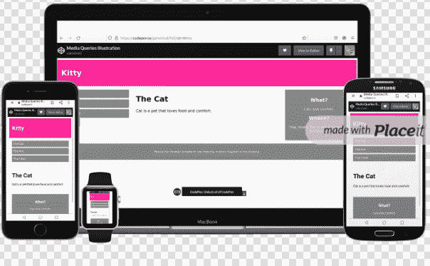

# 响应式网页设计如何帮助你的企业——RWD 入门指南

> 原文：<https://www.freecodecamp.org/news/how-responsive-web-design-helps-businesses/>

随着技术世界的不断进步，人们与企业和组织互动的方式也在不断进步。

随着移动设备的日益普及，响应式网站设计已经成为必备。它有助于您为客户提供最佳的用户体验，无论他们在任何给定时间使用哪种设备。

在本文中，我们将讨论响应式网站设计能给你的企业或组织带来的一些好处。

## 你将学到什么

在这篇文章中，你将了解响应式网页设计以及它如何给你的企业带来好处。

您还将了解一些使网站具有响应性的关键特征。

在这篇文章结束时，你应该很好地理解了为什么你需要转换到一个响应性网站。

## 什么是响应式网页设计(RWD)？

响应式网站设计是一种让网站在所有设备上都好看的网站设计方法，从小型手机到大型桌面显示器，如下所示。



responsive web design

RWD 很重要，因为它允许每个人都可以访问您的网站，不管他们使用什么设备。

## 为什么 RWD 对我的业务很重要？

如今，越来越多的人使用他们的移动设备浏览网页。

事实上，根据统计数据，今年移动设备占全球互联网使用量的 50%以上。那就超过一半了！随着技术变得更加先进，这种情况只会越来越多。

如您所见，您的企业需要随时随地通过任何设备进行访问，响应式设计是实现这一目标的最佳方式。

如果你的网站没有响应，你就失去了来自移动用户的宝贵流量，因为如果他们不能在手机或平板电脑上正常浏览你的网站，他们会立即退出。

## 响应式网页设计如何让我和我的客户受益？

一个响应式的网站提供了更好的用户体验，可以带来更多的客户和转化。

响应式网站不仅对企业有益。它们也给消费者带来了好处。只需轻触或点击鼠标，用户就可以从他们喜欢的任何设备(无论是笔记本电脑、平板电脑还是手机)访问他们需要的任何内容。

如果你像大多数企业主一样，你想确保尽可能多的人可以访问你的网站。这就是为什么响应式设计如此重要。

响应式网站也更容易维护，因为你可以在一个版本上更新内容，它会自动反映在所有屏幕上。从长远来看，这可以节省你的时间和金钱。

## 如何开始响应式网页设计

拥有一个反应灵敏的设计对于吸引新客户至关重要。虽然看起来很难，但我向你保证你能做到！

这里有几个简单的步骤，你可以从今天开始变得有反应:

1.  首先，用适合平板电脑和智能手机等小屏幕的图片和内容重新设计你的网站。这样，当移动应用开始主导市场时，你将走在时代的前列。
2.  回应性地写你的内容。
3.  使用`CSS`媒体查询，以便您可以根据用于查看网站的设备显示不同的样式。下面的`CSS`代码将作为一个例子:

```
@media only screen and (max-width: 768px){...} 
```

当屏幕缩小到小于 768px 时，每列的宽度应为 95%:

```
@media only screen and (max-width: 768px) {
  /* For mobile phones: */
  [class*="col-"] {
    width: 95%;
  }
}
```

检查以下[代码](https://codepen.io/gatwirival/pen/qBYBRXa)。您可以使用它来了解更多关于媒体查询的信息。

4.将你所有的字体转换成网络字体，这比其他字体加载速度更快，在不同浏览器间兼容性更好。你也可以考虑投资一个[视网膜就绪标志和网站设计](https://designmodo.com/responsive-retina-images/)。

5.将社交媒体图标添加到您的网站，以便从移动设备访问的人可以与朋友共享您的内容。

6.让网站上的任何视频或幻灯片在加载后自动播放，而不是让用户先点击。这有助于确保人们在查看重要信息之前不会退出。

7.确保你的导航菜单使用清晰的语言和大按钮，无论屏幕大小如何，都易于访问。

8.当添加链接时，想想你将如何在智能手机或平板电脑上浏览网站，以帮助那些从这些小屏幕上浏览的人增加可用性。

9.定期测试您的网站，以确保所有内容看起来都不错，并且在各种类型的设备上都能正常运行。

## 时机就是一切！

你可能想知道响应式网站设计是否值得投资。毕竟，你目前的网站可能会做得很好。

但在当今移动优先的世界，一个响应迅速的网站对于保持竞争力至关重要。以下是你应该转向一个响应性网站的四个原因

1.  这将改善你的客户体验
2.  这将提高搜索引擎优化
3.  这将提高用户参与度
4.  这将有助于留住客户

## 如何学习响应式网页设计

如果你想开始学习响应式网页设计，以便更新你的网站，请点击这里查看 freeCodeCamp 最新更新的 [RWD 课程。通过构建 20 个项目，你将学习主要的响应式网页设计概念和语法。](https://www.freecodecamp.org/news/responsive-web-design-certification-redesigned/)

以下是认证涵盖的内容:

1.  通过构建一个猫照片应用程序来学习 HTML
2.  通过建立一个咖啡馆菜单学习基本的 CSS
3.  通过创建标记集了解 CSS 颜色
4.  通过构建注册表单来学习 HTML 表单
5.  ****认证项目:建立调查表格****
6.  通过构建 Rothko 绘画来学习 CSS 盒子模型
7.  通过建立一个图片库来学习 CSS Flexbox
8.  通过制作营养标签来学习排版
9.  通过建立测验来了解可访问性
10.  ****认证项目:**** 建立致敬页面
11.  通过构建资产负债表了解更多关于 CSS 伪选择器的信息
12.  通过构建一幅毕加索的画来学习中级 CSS
13.  通过建造一架钢琴来学习响应式网页设计
14.  ****认证项目:建立技术文档页面****
15.  通过构建城市天际线学习 CSS 变量
16.  通过建立一个杂志来学习 CSS 网格
17.  ****认证项目:搭建产品登陆页面****
18.  通过构建企鹅来学习 CSS 转换
19.  通过建造摩天轮学习 CSS 动画
20.  ****认证项目:建立个人作品集网页****

它是免费的，可以自定进度，你可以在这里查看。

## 结论

如果你还没有使用响应式网站设计，是时候做出改变了。

一个响应迅速的网站对于提供积极的用户体验是必不可少的，这对于让你的客户满意也很重要。

此外，响应式设计可以帮助提高您的搜索引擎排名，从而带来更多的流量和更多的客户。

有这么多的好处，没有理由不转向一个响应式的网站设计。