# 如何使用 Pyctuator 和 SpringBootAdmin 监控 Python APIs

> 原文：<https://www.freecodecamp.org/news/how-to-monitor-python-apis-using-pyctuator-and-springbootadmin/>

执行器端点帮助我们监控我们的服务。通过使用致动器，我们可以获得许多关于正在发生的事情的信息。

SpringBoot 有许多内置的致动器，它还允许我们创建自己的致动器端点。

对于像 Flask 或 FastAPI 这样用 Python 编写的框架，我们可以通过集成一个名为 Pyctuator 的库来合并执行器。

在本文中，我将解释如何使用 Pyctuator 库来监控用 FastAPI 编写的应用程序。我还将向您展示如何使用 SpringBootAdmin 服务器管理执行器端点。

## 什么是执行器？

我们使用执行器来监控和管理生产中的应用程序使用。这些使用信息通过 REST 端点暴露给我们。

例如，我们可以访问生产中的应用程序日志、环境详细信息和 HTTP 跟踪。如果应用程序中出现问题，我们甚至可以访问应用程序的“线程转储”来进行调试。

以下是几个重要执行器端点的示例:

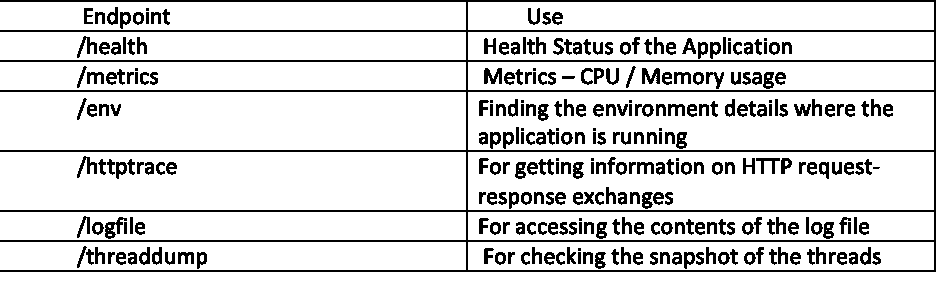

Actuators

## 什么是 Pyctuator？

执行器因为 SpringBoot 而变得流行，但是你可以通过集成一个叫做 Pyctuator 的模块在 FastAPI 或者 Flask 这样的框架中实现它们。

Pyctuator 是一个 Python 模块，它是 SpringBoot Actuators 的部分实现。Pyctuator 由 SolarEdge 管理。

Pyctuators 支持的一些致动器有:

*   /health:py actuator 中的这个端点内置了对 Redis 和 MySQL 的监控
*   /env
*   /指标
*   /日志文件
*   /threaddump
*   /httptrace
*   /记录器

## 什么是 SpringBootAdmin？

想象一下，一个服务拥有所有这些用于检查指标、httptrace、threaddump 等的执行器。单独调用它们中的每一个来检查服务中发生了什么是非常乏味的。如果我们有许多服务，并且每个服务都有自己的执行器端点，这使得监控更加困难。

在那里，您可以使用 SpringBootAdmin 来管理和监控应用程序。

简而言之，SpringBootAdmin 在一个地方为所有执行器端点提供了一个很好的仪表板。

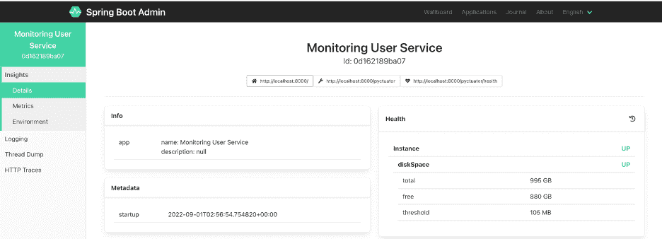

Admin Dashboard

## Pyctuator 的使用案例

用例很简单:我们将使用 FastAPI 框架开发一个 RESTful 服务，并使用 Pyctuator 模块配置服务中的执行器。

该服务有 3 个端点，如下面的 API-Docs (Swagger)所示

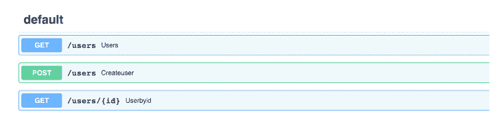

API-Docs 

*   GET /users:返回系统中存在的所有用户。
*   帖子/用户:创建用户
*   GET /users/{id}:返回具有给定 id 的用户

你可以在这里找到代码[。](https://github.com/sameershukla/fastapi-pyctuator)

在用户服务中，我们将使用 Pyctuator 启用执行器，并使用 SpringBootAdmin 仪表板监控它们。我们还将探讨如何增强/health actuator 来监控 Redis。

为了配置执行器，首先我们需要安装“pyctuator”。您可以使用命令“pip install pyctuator”来完成此操作。

安装后，简单地实例化 Pyctuator 对象是查看 web 框架内内置执行器的入口点。

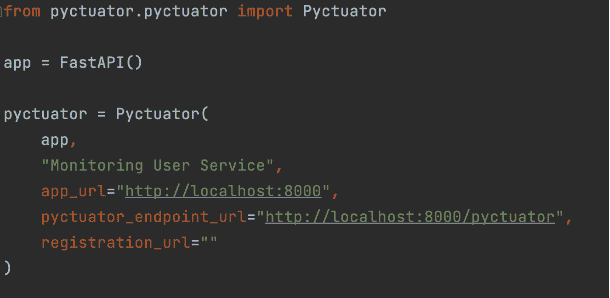

Pyctuator Constructor

在实例化 py actuator 之前，如果您访问/py actuator 端点，您将得到“Not Found”消息:

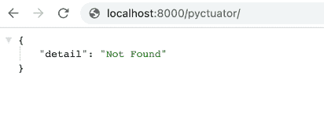

Without Pyctuator Configuration

实例化后，在访问/py actuator 端点时，您将看到默认情况下启用的所有执行器。这是因为我们在 pyactuator 中定义了“pyactuator_endpoint_url”。

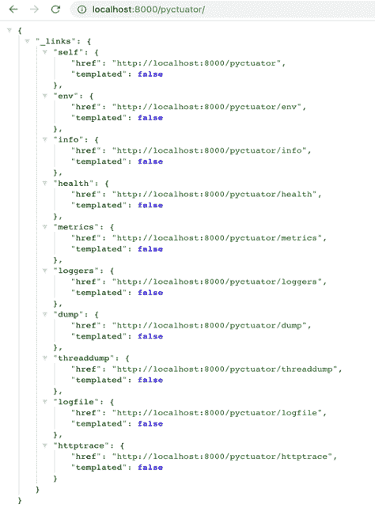

After Pyctuator Configuration

我强烈建议仔细阅读 Pyctuator 对象，因为它解释了我们需要提供的强制和可选参数。

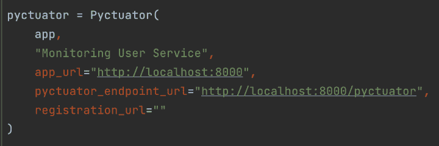

Understanding Constructor parameters

强制参数包括:

*   app–FastAPI 或 Flask 的实例
*   应用程序名称–显示在 SpringBootAdmin 的信息部分
*   “py actuator _ endpoint _ URL”——我们所看到的返回所有执行器端点的内容
*   “registration _ URL”——你很快就会明白这一点。

## 如何增强/health 端点

您可以增强 Pyctuator 中的/health 端点来监视 Redis 或 MySQL 数据库。假设您在应用程序中使用 Redis——那么我们需要使用 RedisHealthProvider 并将 Redis 实例传递给它。

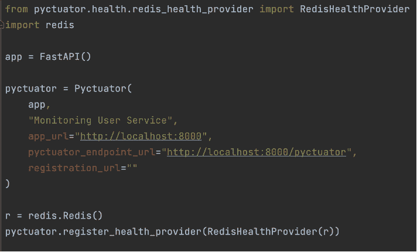

Redis Health

## 如何启动 SpringBootAdmin 服务器

要在本地运行 SpringBootAdmin 服务器，我们有两个选择:首先，我们可以通过手动创建 SpringBootAdmin 来完成，方法是转到 start.spring.io 并添加库。

Spring Web & Spring Boot 管理(服务器):

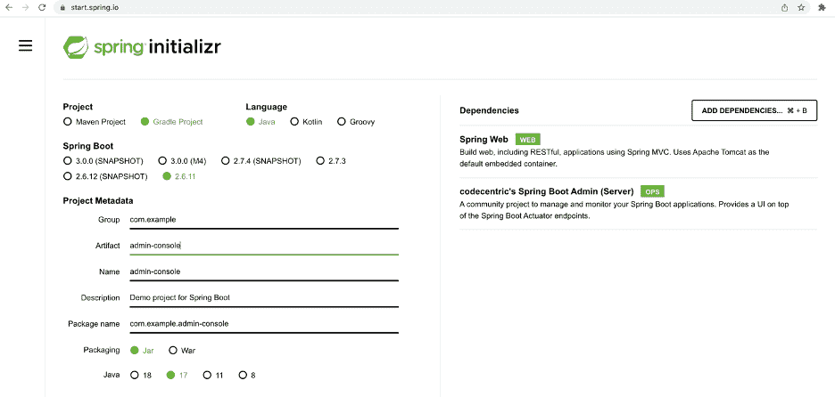

Creating SpringBootAdmin 

第二个选项是运行 Docker 映像:

```
docker run --rm --name spring-boot-admin -p 8080:8080 michayaak/spring-boot-admin:2.2.3-1 
```

管理服务器启动后，我们需要向 Pyctuator 构造函数提供“registration_url ”,如前所述。

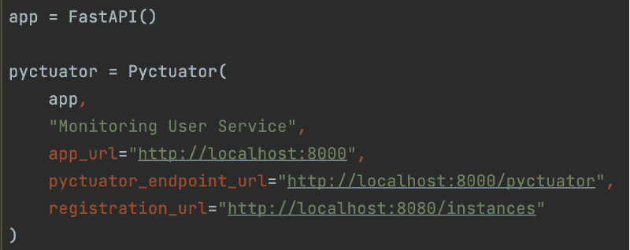

URL registration in SpringBootAdmin

管理服务器正在 localhost:8080 上运行，这应该会将我们的应用程序注册到 SpringBootAdmin。我们可以在一个地方访问所有执行器端点:

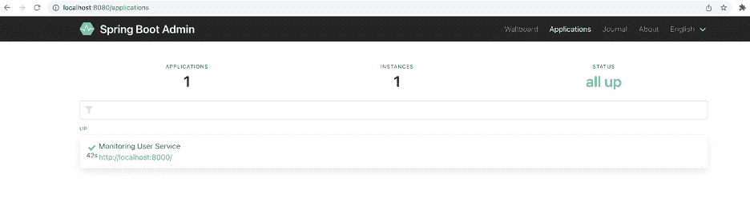

Dashboard 


All Configured Actuator Endpoints

我执行了几次/users 端点，现在管理端的 HTTP 跟踪显示了所有请求-响应交换的细节。

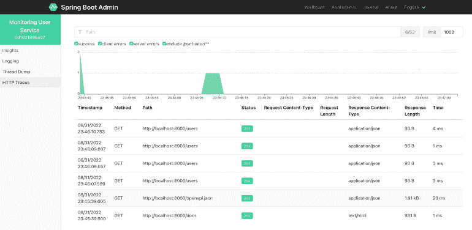

HTTP Traces

## 包扎

致动器对生产中的监控和调试应用非常有帮助。通过访问端点，我们可以获得关于线程转储、堆转储、HTTP 跟踪等等的详细信息。

Pyctuator 在很大程度上简化了 Python APIs 中的执行器。通过简单地导入库并定义一个对象，我们的应用程序中所有的执行器都准备好了。