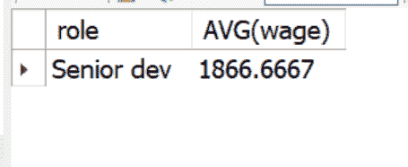
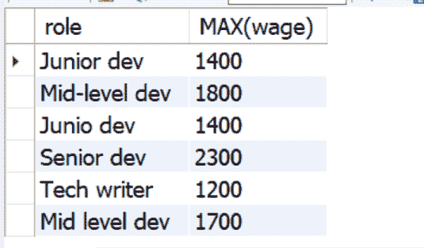
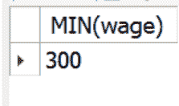
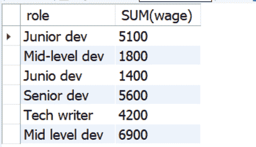

# SQL 聚合函数——如何在 MySQL 和 PostgreSQL 中分组

> 原文：<https://www.freecodecamp.org/news/sql-aggregate-functions-how-to-group-by-in-mysql-and-postgresql/>

在 SQL 中，聚合函数允许您对多个数据执行计算并返回单个值。这就是它们被称为“聚合”函数的原因。

那些集合函数是`AVG()`、`COUNT()`、`SUM()`、`MIN()`和`MAX()`。

在使用聚合函数进行查询时，您还可以在任何关系数据库(MySQL PostgreSQL 等)中将它们与`GROUP BY`子句和`HAVING`语句结合使用。

在本文中，您将学习如何单独使用聚合函数，以及如何与`GROUP BY`子句和`HAVING`语句一起使用。

## 我们将涵盖的内容

*   [如何使用聚合函数](#howtouseaggregatefunctions)
*   [聚合函数的语法](#syntaxofaggregatefunctions)
*   [如何使用`AVG()`聚合函数](#howtousetheavgaggregatefunction)
    *   [如何将`AVG()`功能与`GROUP BY`和`HAVING`](#howtousetheavgfunctionwithgroupbyandhaving) 配合使用
*   [如何使用`COUNT()`聚合函数](#howtousethecountaggregatefunction)
    *   [如何用`COUNT()`搭配`GROUP BY`和`HAVING`](#howtousecountwithgroupbyandhaving)
*   [如何使用`MAX()`聚合函数](#howtousethemaxaggregatefunction)
    *   [如何用`MAX()`搭配`GROUP BY`和`HAVING`](#howtousemaxwithgroupbyandhaving)
*   [如何使用`MIN()`聚合函数](#howtousetheminaggregatefunction)
    *   [如何用`MIN()`搭配`GROUP BY`和`HAVING`](#howtouseminwithgroupbyandhaving)
*   [如何使用`SUM()`聚合函数](#howtousethesumaggregatefunction)
    *   [如何用`SUM()`搭配`GROUP BY`和`HAVING`](#howtousesumwithgroupbyandhaving)
*   [结论](#conclusion)

## 如何使用聚合函数

为了向您展示聚合函数是如何工作的，我将使用一个`employees_data`数据库中的`employees`表。

跑步`SELECT * FROM employees`给我弄了以下:


## 聚合函数的语法

使用聚合函数的语法如下所示:

```
aggregate_function(MODIFIER | expression) 
```

*   集合函数可以是`AVG`、`COUNT`、`MAX`、`MIN`或`SUM`
*   修饰符可以是所有的值或特定列中的值

这种语法在实践中更有意义，所以让我们在聚合函数中使用它。

## 如何使用`AVG()`聚合函数

`AVG()`聚合函数获取数据的总数并计算它们的平均值。

我能够通过这种方式得到支付给员工的平均工资:

```
SELECT AVG(wage) 
FROM employees 
```


下面的查询获得初级开发人员的平均工资:

```
SELECT AVG(wage) 
FROM employees
WHERE role = "Junior dev" 
```


### 如何通过`GROUP BY`和`HAVING`使用`AVG()`功能

您可以使用`GROUP BY`子句和`HAVING`语句获得特定列中条目(行)的平均数量。这意味着你必须将这两者与`AVG()`结合起来。

例如，我可以通过以下查询获得每行中支付给员工的平均工资:

```
SELECT role, AVG(wage) 
FROM employees
GROUP BY role 
```


我还能够通过使用 HAVING 语句获得高级开发人员的平均工资:

```
SELECT role, AVG(wage) 
FROM employees
GROUP BY role
HAVING role = "Senior dev" 
```



## 如何使用`COUNT()`聚合函数

`COUNT()`根据您应用的条件(或过滤器)返回表格中的行数。

例如，为了获得总行数，我运行了下面的查询:

```
SELECT COUNT(*) 
FROM employees 
```

而我得到了 20:


为了获得美国雇员的总数，我运行了下面的查询:

```
SELECT COUNT(*) 
FROM employees
WHERE country = "USA" 
```


为了让员工成为技术作家，我这样做了:

```
SELECT COUNT(*) 
FROM employees
WHERE role = "Tech Writer" 
```


### 如何将`COUNT()`与`GROUP BY`和`HAVING`一起使用

在大型数据库中，可以结合使用`GROUP BY`子句和`HAVING`语句以及 COUNT()来获得特定列中条目(行)的总数。

在我在本文中使用的数据库中，我能够通过 GROUP BY 子句获得每一行中的雇员总数:

```
SELECT role, COUNT(*) 
FROM employees
GROUP BY role 
```


为了只获得高级开发人员的数量，我在查询中附加了`HAVING role = "Senior dev"`:

```
SELECT role, COUNT(*) 
FROM employees
GROUP BY role
HAVING role = "Senior dev" 
```


## 如何使用`MAX()`聚合函数

`MAX()`函数返回非空值中的最大值。这意味着它将忽略空字段，并返回非空字段中的最大值。

例如，为了获得`employees`表中的最高工资，我像这样使用了`MAX()`函数:

```
SELECT MAX(wage) 
FROM employees 
```


为了获得中级开发人员的最高工资，我使用了`WHERE`语句:

```
SELECT MAX(wage) 
FROM employees
WHERE role = "Mid level dev" 
```


### 如何将`MAX()`与`GROUP BY`和`HAVING`一起使用

为了获得每个职位的最高工资,`GROUP BY`条款就派上了用场:

```
SELECT role, MAX(wage) 
FROM employees
GROUP BY role 
```



为了在特定角色中获得最高工资，将 HAVING 语句与`GROUP BY`子句结合起来就可以实现:

```
SELECT role, MAX(wage) 
FROM employees
GROUP BY role
HAVING role = "Tech writer" 
```


## 如何使用`MIN()`聚合函数

`MIN()`函数与`MAX()`函数相反——它返回非空值中的最小值。

例如，我这样得到了`employees`表上的最低工资:

```
SELECT MIN(wage) 
FROM employees 
```



### 如何将`MIN()`与`GROUP BY`和`HAVING`一起使用

同样，要获得每个角色的最低工资，可以使用`GROUP BY`子句:

```
SELECT role, MIN(wage) 
FROM employees
GROUP BY role 
```


要获得特定角色的最低工资，可以使用`HAVING`语句和`GROUP BY`子句:

```
SELECT role, MIN(wage) 
FROM employees
GROUP BY role
HAVING role = "Junior dev" 
```


## 如何使用`SUM()`聚合函数

SUM()聚合函数根据应用的筛选器将列中的条目数相加。

以下查询获取支付给员工的工资总数:

```
SELECT SUM(wage) 
FROM employees 
```


### 如何将 SUM()与`GROUP BY`和`HAVING`一起使用

为了获得每个角色中员工的工资总额，我选择了角色，对工资使用了`SUM()`,并按角色对其进行了分组:

```
SELECT role, SUM(wage) 
FROM employees
GROUP BY role 
```



为了获得只支付给技术作者的总工资，我使用了`HAVING`语句:

```
SELECT role, SUM(wage) 
FROM employees
GROUP BY role
HAVING role = "Tech Writer" 
```


## 结论

本文向您介绍了 SQL 中的聚合函数、它们的语法以及如何使用它们。

此外，您还学习了如何在`GROUP BY`子句、`HAVING`和`WHERE`语句中使用聚合函数。

如果你想了解`HAVING`语句是如何工作的，你应该读一下[我写的这篇文章](https://www.freecodecamp.org/news/sql-having-how-to-group-and-count-with-a-having-statement/)。

感谢您的阅读。