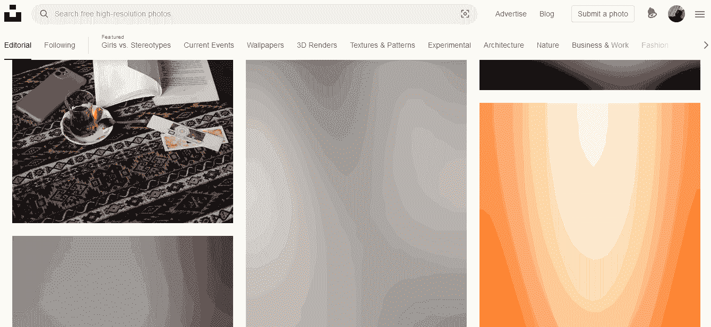
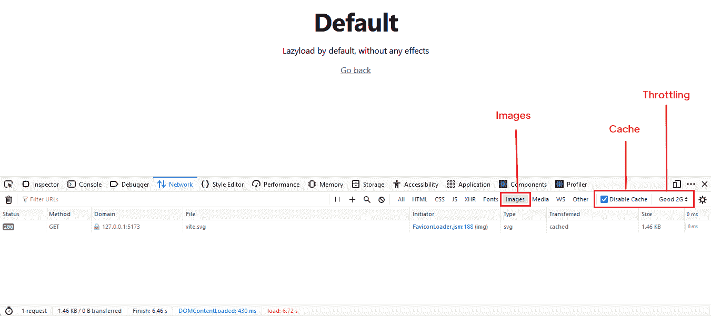
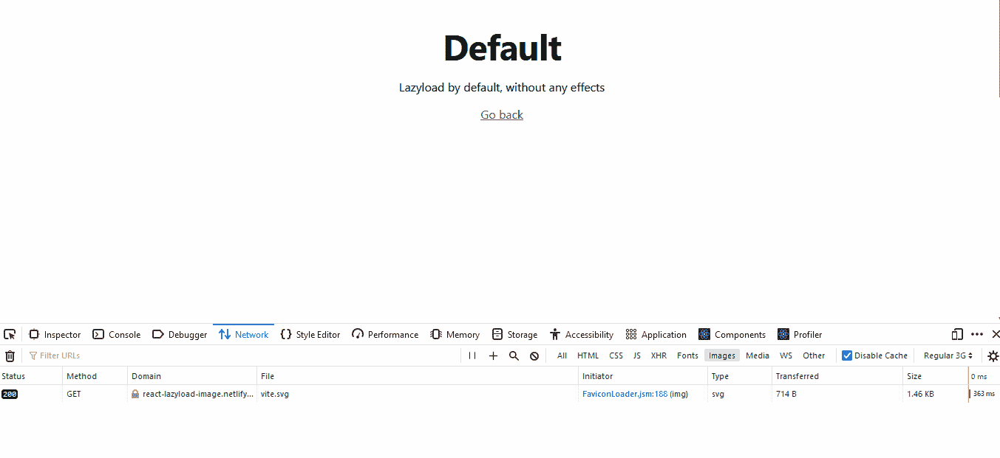
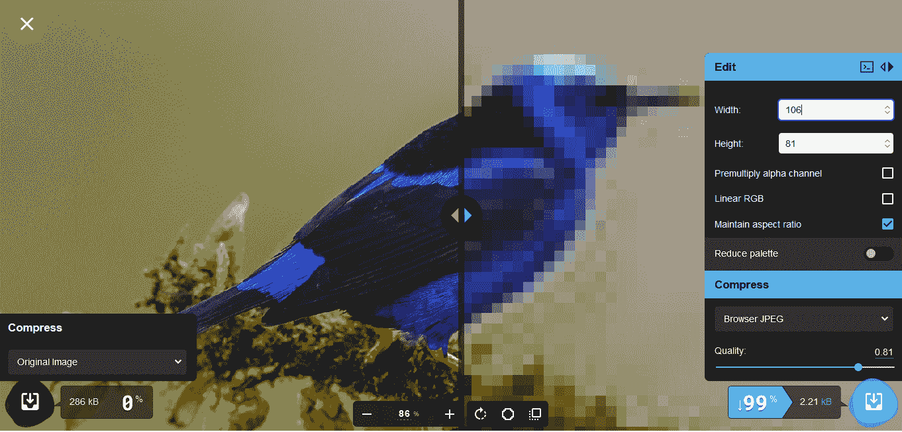
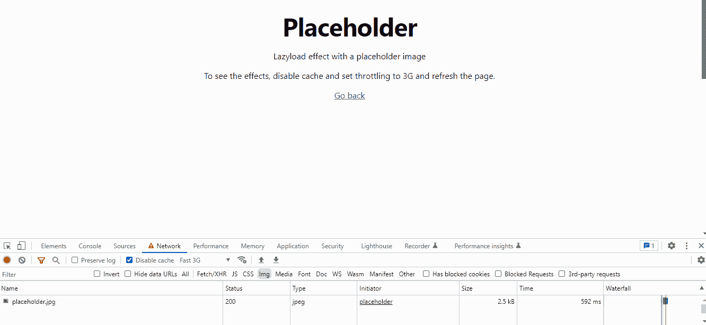
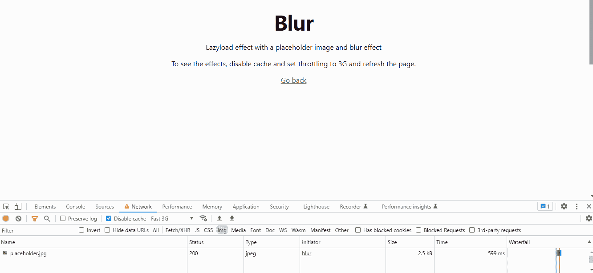

# 如何在 React 中延迟加载图像

> 原文：<https://www.freecodecamp.org/news/how-to-lazy-load-images-in-react/>

优化你在网站上使用的资源——比如延迟加载图片——是提高网站性能最有效的方法之一。

这样做有助于你确保你的网站速度快，有很好的搜索引擎优化，并且有助于提升用户体验。

在本文中，您将了解如何在 React 应用程序中延迟加载图像。我们将讨论这样做的好处，以及如何在您的代码中实现它。

但是在我们开始之前，什么是惰性加载，它是如何工作的？

## 什么是懒装？

> 惰性加载是一种策略，它基于用户的活动和导航模式延迟某些资产(例如，图像)的加载，直到用户需要它们。通常，这些资产只有在滚动到视图中时才会被加载。[(来源:MDN Docs)](https://developer.mozilla.org/en-US/docs/Glossary/Lazy_load)

当我们滚动图像列表时，你可以在 [Unsplash](http://unsplash.com) 上看到一个很好的例子。最初，我们看到一个模糊的低质量图像占位符 [LQIP](https://web.dev/image-component/) ，当我们在视图中滚动时，整个图像被完全加载到页面上。



这一过程背后的想法是推迟在视口之外加载图像，以减少带宽使用，改善用户体验，并加快页面加载。

今天惰性加载一个`image/iframe`就像在 img/iframe 元素中添加属性`loading=" lazy"` 一样简单，就像这样:

```

<iframe src="iframe" loading="lazy"></iframe> 
```

它不需要任何进一步的配置就可以工作。

可悲的是，根据 caniuse.com[的说法，这种惰性加载图像的方式并不是在所有浏览器中都得到广泛支持。同样，对于像 Firefox 这样的浏览器，`loading= "lazy"`属性在`iframe`元素中不起作用。在这些情况下，您需要将它与其他库或工具结合使用。](https://caniuse.com/?search=lazyloading)

## 惰性加载入门

本文将利用一个名为 [React Lazy Load Image 组件](https://www.npmjs.com/package/react-lazy-load-image-component)的 JavaScript 库。
这个流行的库提供了图像渲染功能和效果，您可以在自己的 React 应用程序中快速轻松地实现这些功能和效果。

这个演示的代码可以在 [GitHub 这里](https://github.com/evavic44/react-lazyload)找到。

### 步骤 1–安装 React 延迟加载映像组件

我们需要做的第一件事是使用 NPM 安装 React 惰性加载映像组件库:

```
// Yarn
$ yarn add react-lazy-load-image-component
or
// NPM
$ npm i --save react-lazy-load-image-component 
```

### 步骤 2–导入组件

我们将只导入我们的映像和惰性加载组件。但是如果你愿意，你可以使用外部 URL。在我的例子中，我将它作为一个组件从 images 目录中导入。

```
import Image from "../images/bird.jpg";
import { LazyLoadImage } from "react-lazy-load-image-component"; 
```

### 步骤 3–声明图像

要开始使用它，不要用一个`img`标签来声明你的图像，而是用`LazyLoadImage`来替换它，并像平常一样用一个`src`属性来声明图像。

代码看起来是这样的:

```
import React from "react";
import Image from "../images/bird.jpg";
import { LazyLoadImage } from "react-lazy-load-image-component";

export default function App() {
  return (
    <div>
      <LazyLoadImage src={Image}
        width={600} height={400}
        alt="Image Alt"
      />
     </div>
  );
} 
```

此外，我们明确定义了图像的宽度和高度。这有助于避免类似[累积布局偏移(CLS)](https://web.dev/cls/) 的问题。

要查看组件的效果，在 Windows 和 Linux 上使用`Ctrl + Shift + J`，在 Mac 上使用`Cmd + Opt + J`，在开发工具中打开网络标签。然后将限制设置为较低的网络(3G)，禁用缓存，并刷新页面。



结果如下:



默认情况下，您可以看到图像没有加载到屏幕上，因为它在视口中不可见。一旦我们开始滚动并且图像在视图中，延迟加载就被禁用，现在我们可以看到图像了。

[现场演示](https://react-lazyload.vercel.app/default)

### 步骤 4–添加占位符图像

或者，我们可以先预览一个低分辨率的图像，同时等待主图像加载。这有助于填充图像区域，让用户知道图片正在加载。我们将这种占位符图像称为低质量图像占位符(LQIP)。

这样做不仅看起来不错，还能让用户对实际图像有所了解。

为了获得更小的图像尺寸，我喜欢使用 [squoosh.app](https://squoosh.app/) 。导入图像，尝试分辨率和质量，直到您对大小感到满意。

您可以使用的一些其他图像工具包括:

*   [Photoshop](https://www.adobe.com/products/photoshop.html)
*   [响应断点](https://responsivebreakpoints.com)



最初，我们的图像是`288KB`，但是我们已经成功地将它压缩成了低分辨率版本的`2.41KB`。要使用占位符图像，使用图像的值给图像添加一个`PlaceholderSrc`属性。

```
import Image from "../images/bird.jpg";
import PlaceholderImage from "../images/placeholder.jpg";

<LazyLoadImage src={Image}
    width={600} height={400}
    PlaceholderSrc={PlaceholderImage}
    alt="Image Alt"
/> 
```



您可以看到它最初是如何加载占位符图像的，在它完成加载后，它被主图像所取代。

[现场演示](https://react-lazyload.vercel.app/placeholder)

### 步骤 5-添加图像模糊

LazyLoadImage 还提供了一个插件，可以在图像加载前使图像模糊，并在图像完全加载后移除模糊。

将此与占位符图像结合将改善整体外观并提供更好的输出。

为了使用模糊效果，我们需要导入控制它的 CSS 文件:

```
import Image from "../images/bird.jpg";
import PlaceholderImage from "../images/placeholder.jpg";
import { LazyLoadImage } from 'react-lazy-load-image-component';
import 'react-lazy-load-image-component/src/effects/blur.css';

<LazyLoadImage src={Image}
    width={600} height={400}
    PlaceholderSrc={PlaceholderImage}
    effect="blur"
/> 
```



[现场演示](https://react-lazyload.vercel.app/blur)

## 你为什么要偷懒加载你的图片？

您可能想知道为什么要在 web 应用程序中费力加载离屏图像。值得吗，为什么要在意这篇文章分享的点？

以下是一些原因:

### 1.延迟加载节省了数据和带宽

由于不在视窗中的图像不会被立即下载，延迟加载可以节省额外的带宽使用。这对性能有好处，尤其是对移动用户。

### 2.延迟加载降低了 CDN 的成本

像 [Cloudinary](https://cloudinary.com) 或 [Imagekit](https://www.freecodecamp.org/news/how-to-lazy-load-images-in-react/imagekit.io) 这样的媒体内容服务提供媒体存储的付费计划。延迟加载映像确保只加载从 CDN 请求的映像，从而降低服务器成本。

### 3.延迟加载提高了搜索引擎优化

页面速度是影响 SEO 的一个关键因素(并使搜索引擎更有可能推荐你的页面)。因为你的页面加载时间很短，搜索引擎会喜欢你的网站。

## 结论

优化图片是一个很好的技能，我相信每个 web 开发人员都应该培养。它为用户创造了更好的体验，尤其是那些在移动设备上的用户。

下面是 GitHub 上这篇文章的[代码文件。](https://github.com/Evavic44/react-lazyload)

本文到此为止。如果你读到这里，我相信你会喜欢我的其他内容。查看我的博客或者关注我的推特 [@victorekea](https://twitter.com/victorekea) 了解更多信息。

## 资源

*   [反应迟缓加载图像组件](https://www.npmjs.com/package/react-lazy-load-image-component)
*   [演示](https://react-lazyload.vercel.app)