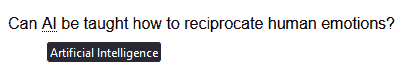
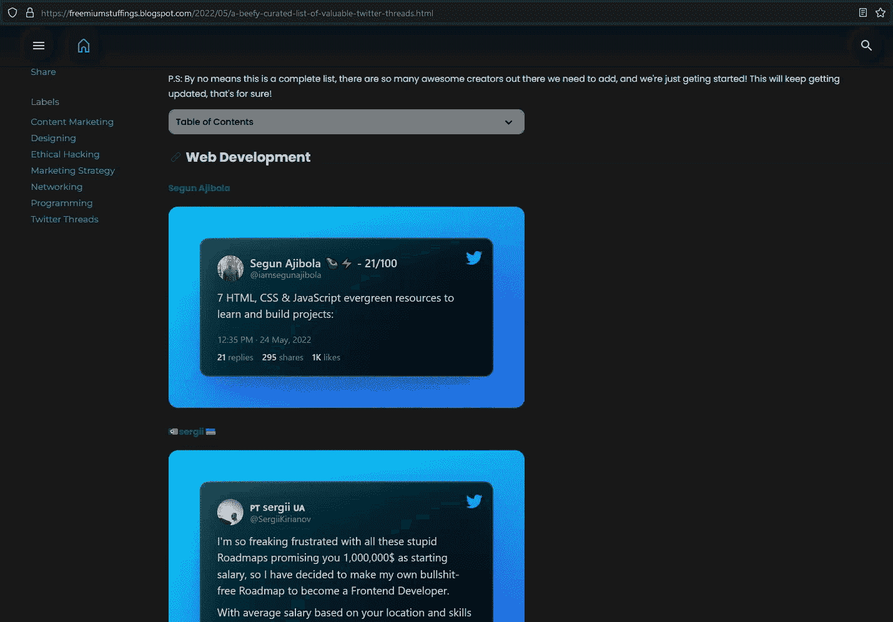
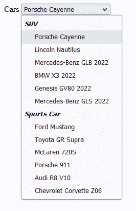
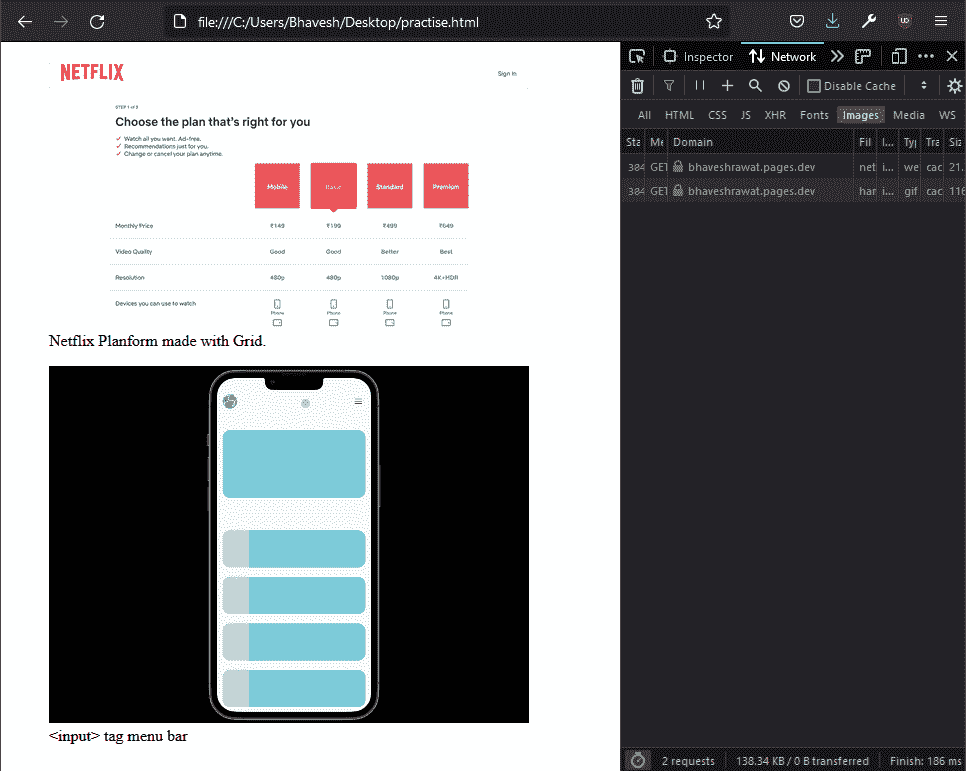
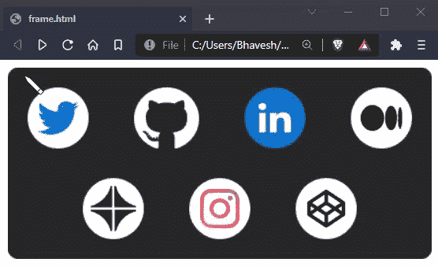
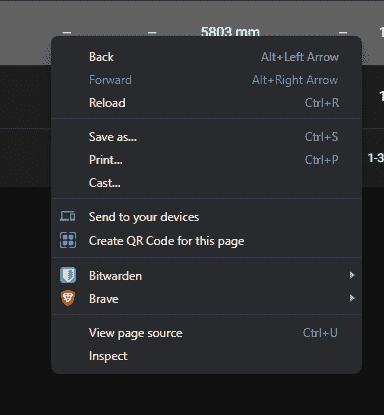
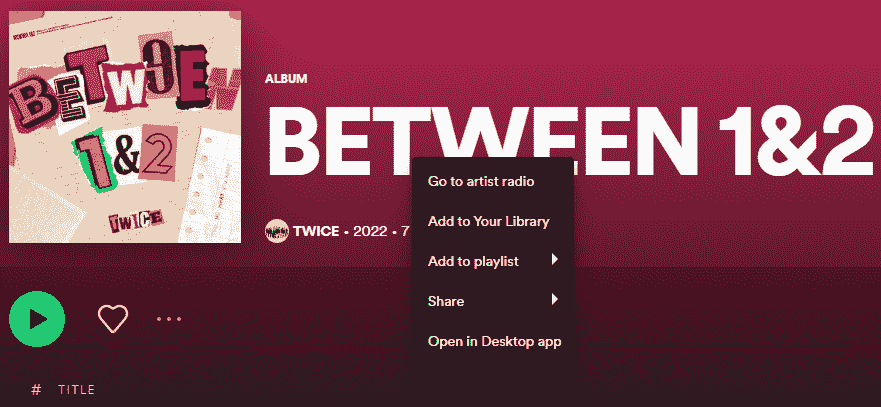

# 你可能不知道的有用的 HTML5 标签

> 原文：<https://www.freecodecamp.org/news/html5-tags-you-might-not-know/>

HTML 5 区别于其前辈的关键因素之一是语义标签的引入。

语义标签为网页增加了真正的意义，使人类和搜索引擎更容易区分网站的不同部分。

在一定程度上，它也影响网页的 SEO。

因此，为了获得好处，你应该知道可以用来增强你的网站的 HTML5 标签。

有一些非常有用但鲜为人知的 HTML5 标签也可以派上用场。它们赋予你的网页语义，带来更多的可访问性，让你的生活更轻松。

这里是我列出的 5 个有用的 HTML 标签，你可能想试试。

## `<abbr>`标签

当您想要显示您在博客中使用的缩写的完整形式时，可以使用此标签。

例如，如果你正在写一篇关于智能家居产品的文章，其中也有一些你想讨论的人工智能功能。现在，可能会有一些不熟悉人工智能的普通读者。使用这个`abbr`标签和‘title’属性将向读者显示一个工具提示，内容写在缩写的 title 标签中。当用户将鼠标悬停在缩写上时，它可以帮助他们了解“AI”的意思。

想想看，如果你想在你的博客中加入这种功能，这会为你省下多少麻烦。你所要做的不是摆弄 CSS，而是插入这个标签。

### 标签如何工作

考虑到你正在写博客，并且可以访问 HTML 视图。您必须用标题属性将缩写词用`<abbr>`包装起来，标题属性将包含缩写词的定义或完整形式。如果操作正确，当用户将鼠标悬停在缩写上时，工具提示就会出现，显示“title”属性包含的内容。

```
<p style="font-family: sans-serif;"> Can <abbr title="Artificial Intelligence">AI</abbr> be taught how to reciprocate human emotions?
</p>
```



## `<details>`标签

您可以使用这个标签来创建一个交互式容器框，当用户单击它时，它可以扩展和收缩，同时包含所有的内容。展开时显示内容，缩小时关闭。

每当我想到“常见问题”或“目录”之类的东西时，我就用这个。这为您提供了手风琴的原生支持，而无需任何 JS。

我最近在我的一个网站上工作时用过它。我用它创建了“目录”部分。(您可以在下面看到它)

### 标签如何工作

首先，我们声明包装了`<summary>`标签的`<details>`标签，以及您希望用户在需要时看到的常用内容。它可以是任何东西——表格、表格、段落或图像。

```
<details>
	<summary>Table of Contents</summary>
    <ul>
    	<li>
        	<a href="#web-dev">Web Development</a>
        </li>
        <ul>
            <li><a href="#web-dev-html">HTML</a></li>
            <li><a href="#web-dev-css">CSS</a></li>
        </ul>
       </ul>
 </details>
```

现在，我前面提到了`<summary>`标签:这个标签与`<details>`标签一起使用，指定内容的标题。



Image Credit: Screen Grab of [Freemium Stuff](https://freemiumstuffings.blogspot.com/2022/05/a-beefy-curated-list-of-valuable-twitter-threads.html)

**提示**:假设你正在用这个标签制作一个 FAQ 部分，你想让容器在页面加载时打开，比如“最常问的问题”。你可以通过给这个特定的 accordion 赋予一个“open”属性来实现。像这样:

```
<details open>
	<summary>How do I get my product registered?</summary>
    <p>You can get your product...</p>
</details>
```

## `<optgroup>`标签

这个标记将允许您在您构建的表单中对下拉列表的选项进行分类。

当你想要一个下拉列表供用户选择时，使用`<select>`标签。但是，对于用户来说，浏览整个列表以找到正确的选项通常会变得非常冗长和乏味。

将选项分组真的很有帮助，你的用户会喜欢这一点，因为他们不需要检查每一个选项。相反，他们可以直接导航到他们需要的类别。这有助于更好的用户体验。

### 标签如何工作

就在布局所有选项之前，声明`<optgroup>`标签并将所有相似的选项包装在其中，就像下面的例子一样。您可以根据需要为多个组执行此操作。

```
<label for="cars">Cars</label>
    <select name="Cars" id="cars">
        <optgroup label="SUV">
            <option value="">Porsche Cayenne</option>
            <option value="">Lincoln Nautilus</option>
            <option value="">Mercedes-Benz GLB 2022</option>
            <option value="">BMW X3 2022</option>
            <option value="">Genesis GV80 2022</option> 
            <option value="">Mercedes-Benz GLS 2022</option>
        </optgroup>
        <optgroup label="Sports Car">
            <option value="">Ford Mustang</option>
            <option value="">Toyota GR Supra</option>
            <option value="">McLaren 7205</option>
            <option value="">Porsche 911</option>
            <option value="">Audi R8 V10</option>
            <option value="">Chevrolet Corvette Z06</option>
        </optgroup>
    </select>
```



Image Credit: Author

## `<base>`标签

这个标签可以让你改变 HTML 文件中所有相对 URL 的基本 URL。您应该在`<head>`标签中包含。它让您既可以方便地使用相对 URL，又可以灵活地更改基本 URL。

### 标签如何工作

用户只需要在 head 标记中声明这个标记，现在文档中所有的相对 URL 都将以新的 URL 为基础。

```
<head>
	<base href="https://bhaveshrawat.pages.dev/assets/">
</head>
<body>
    <figure style="max-width: 480px;">
        
        <figcaption>Netflix Planform made with Grid. </figcaption>
    </figure>
    <figure style="max-width: 480px;">
        	
        <figcaption>&lt;input&gt; tag menu bar</figcaption>
    </figure>
</body>
```



### 带有`<base>`标签的捕捉

不过，使用这个标签有一个问题。它不能很好地处理页内锚标签，比如`<a href="#home">`。从导航的角度来看，这些类型的链接非常有用。所以，除非你用 JS 来弥补页内锚标签，否则这个标签可能并不理想。

## `<map>`标签

如果您曾经想将一个图像与多个链接挂钩，并根据图像映射它们，这个标签将让您做到这一点。

这个标签允许您指定图像上的区域，它可以是矩形、圆形或多边形(基本上是任何不规则的形状)，并将它们映射到不同的链接。

### 标签如何工作

首先，我们指定一个带有“usemap”属性的``标签，它与`<map>`标签的 name 属性具有相同的值。它必须是相同的，因为它将负责将地图坐标链接到图像。

`<map>`标记将在其后用“name”属性声明，该属性保存与“usemap”属性相同的值。

`<map>`标签还用‘shape’、‘coords’、‘alt’和‘href’属性包装了`<area>`标签。shape 属性指定映射区域的形状，coords 定义映射区域的坐标，用于映射，alt 用于替换文本，href 保存各个区域的链接。

```

    <map name="map">
        <area shape="circle" coords="51,51,31" alt="Twitter" href="https://twitter.com/" />
        <area shape="circle" coords="161,52, 33" alt="Github" href="https://github.com/" />
        <area shape="circle" coords="271,51,31" alt="LinkedIn" href="https://linkedin.com/" />
        <area shape="circle" coords="379,51,31" alt="Medium" href="https://medium.com/" />
        <area shape="circle" coords="187, 143, 31" alt="Contra" href="https://contra.com/" />
        <area shape="circle" coords="215, 143, 31" alt="Instagram" href="https://www.instagram.com/" />
        <area shape="circle" coords="323,143,31" alt="Codepen" href="https://codepen.io" />
    </map>
```



### 还有一点...

这不是一个标签，而是一个属性，可以帮助您为应用程序构建自定义的上下文菜单。我说的是‘oncontextmenu’属性。

上下文菜单基本上是一个菜单栏，当用户在浏览器上单击鼠标右键时出现，并提供“检查”、“查看页面源代码”等选项。



在构建 web 应用程序时，你可能想为你的用户提供一个定制的上下文菜单，里面有很多特殊的选项和功能，就像 Spotify 一样。



Image Credit: Screen Grab from Spotify

### 属性如何工作

默认情况下，该属性的值为 true。这允许您访问右键单击时出现的上下文菜单。但是，当给定一个 false 值时，上下文菜单将不会出现。

因此，您禁用了本机上下文菜单，因为您的用户不需要它。此外，它不会干扰你的网络应用程序的功能。

你不希望你的自定义菜单被原生上下文菜单重叠/干扰，对吗？所以，这个练习可以把你从这个可怕的经历中拯救出来。

```
<body oncontextmenu="return false"></body>
```

注意:该属性适用于所有 HTML 元素。这意味着，如果您不希望用户只在某一部分拥有上下文菜单功能，您也可以这样做。只需在父元素上使用属性，就像这样

```
<body>
    <section oncontextmenu="return false"></section>
</body>
```

## 签署

所以，这些就是我想和大家分享的 HTML 标签！我希望这篇文章值得你花时间，并且你能从中学到一些东西。

如果这些标签引起了你的兴趣，你可以在 MDN 上了解更多。

祝你今天开心！玩的开心！

如果你正在学习 Git 或者正在进入它，我想推荐一本我在学习 Git 时写的电子书。它有 PDF 和 E-PUB 两种格式，你可以在 [Gumroad](https://bhaveshrawat.gumroad.com/l/lets-git-it-beginners-guide-to-git-bash-commands) 上免费获得。希望你喜欢这本电子书。