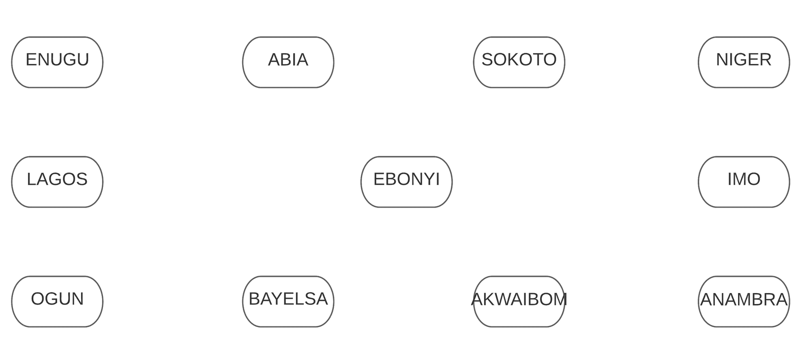
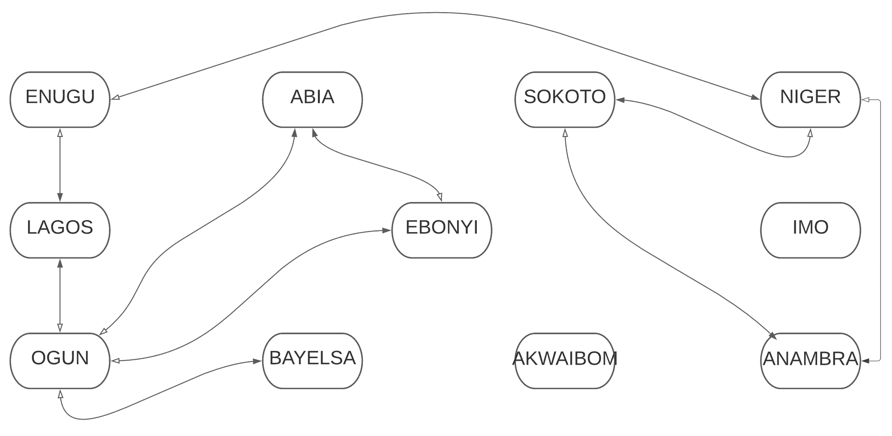
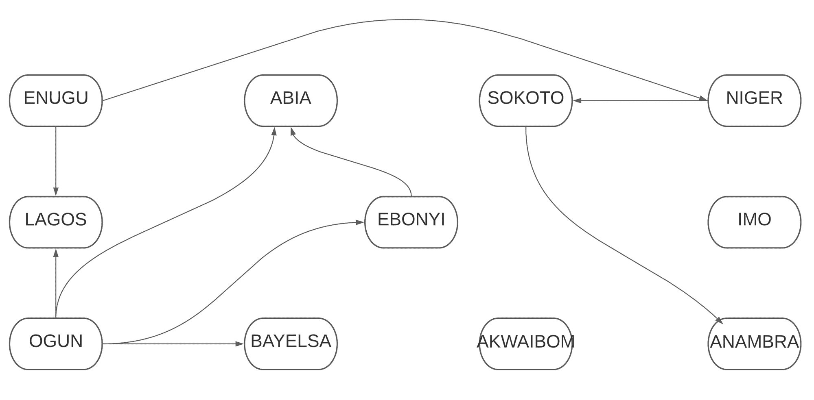

# 如何使用 JavaScript 的 Map()方法解决广度优先和深度优先的搜索问题

> 原文：<https://www.freecodecamp.org/news/how-to-use-javascript-map-method-to-make-a-breath-first-and-depth-first-search/>

JavaScript [`map()`方法](https://www.freecodecamp.org/news/array-map-tutorial/)是一个带有键和值对的[对象](https://developer.mozilla.org/en-US/docs/Web/JavaScript/Reference/Global_Objects/Object)。对象的键和值使用冒号(:)连接，而映射的键和值使用箭头(= >)连接。

以下是 JavaScript 中的一个对象示例:

```
{ a: [ 1, 2, 3 ], b: 2, c: 3 }
```

A JavaScript Object

这里有一个 JavaScript 地图的例子:

```
{ 'a' => [ 1, 2, 3 ], 'b' => 2, 'c' => 3 }
```

A JavaScript Map

`map()`方法是解决算法和数据结构问题的好工具，比如图形、最短距离和最佳路线。许多运输公司已经使用这种方法来构建他们的应用程序。我们将在本教程中做类似的事情。

我在本教程的各个部分的末尾添加了视频，供那些可能喜欢可视化教程的人使用。

## 本文的目标

本教程旨在教你如何使用`map()`方法，以及如何在解决呼吸优先搜索和深度优先搜索问题时使用它。

到最后，你将学会`map()`方法的基础，你将会看到解决算法和数据结构问题的另一个视角，比如图、广度优先搜索(BFS)和深度优先搜索(DFS)。

## 先决条件

本教程假设您已经掌握了基本的 Javascript 概念，如字符串、数组、对象和集合。阅读算法和数据结构也是有帮助的。

[https://www.youtube.com/embed/LuVfrai8gpI?list=PLOvIwkWvHysOUVGqOwb_4j5mq8ir0fZ1O](https://www.youtube.com/embed/LuVfrai8gpI?list=PLOvIwkWvHysOUVGqOwb_4j5mq8ir0fZ1O)

[https://www.youtube.com/embed/2SKmhCr9Hp4?list=PLOvIwkWvHysOUVGqOwb_4j5mq8ir0fZ1O](https://www.youtube.com/embed/2SKmhCr9Hp4?list=PLOvIwkWvHysOUVGqOwb_4j5mq8ir0fZ1O)

[https://www.youtube.com/embed/VyUntT1sK20?list=PLOvIwkWvHysOUVGqOwb_4j5mq8ir0fZ1O](https://www.youtube.com/embed/VyUntT1sK20?list=PLOvIwkWvHysOUVGqOwb_4j5mq8ir0fZ1O)

让我们上路吧！

## 问题是

尼日利亚有 36 个州。游客可以通过公路、航空和水路从一个州到另一个州。我们想要做的是以编程方式:

1.  在图表中显示每个状态以及与其连接的其他状态。
2.  检查您是否可以连接两(2)个状态。

因此，尼日利亚三十六(36)个州中有十一(11)个州是我们的合作对象:

```
ENUGU, ABIA, SOKOTO, NIGER, LAGOS, OGUN, BAYELSA, AKWAIBOM, ANAMBRA, IMO, EBONYI
```

这些是路线:

*   埃努古到拉各斯
*   埃努古到尼日尔
*   尼日尔到索科托
*   尼日尔到阿南布拉
*   索科托到阿南布拉
*   奥贡到拉各斯
*   奥贡到 ABIA
*   奥贡到埃邦伊
*   奥贡到巴耶尔萨
*   埃布尼到 ABIA

让我们用这些数据来解决问题吧！

## 如何解决问题

在上一节中，我们看到了这个问题。现在我们来解决这个问题。在本教程中，我将使用 [Replit](https://replit.com/) 。

Replit 为您提供了一个装备良好的 IDE 来快速编写和测试程序，就像我们将要编写的程序一样。

### 如何设置地图

我们要解决的第一个问题是以编程方式显示每个状态以及与之相连的其他状态。

首先定义十一(11)个州及其路线。输入以下代码:

```
 const states = 'ENUGU ABIA SOKOTO NIGER LAGOS OGUN BAYELSA AKWAIBOM ANAMBRA IMO EBONYI'.split(' ');

const routes = [
  ['ENUGU', 'LAGOS'],
  ['ENUGU', 'NIGER'],
  ['NIGER', 'SOKOTO'],
  ['NIGER', 'ANAMBRA'],
  ['SOKOTO', 'ANAMBRA'],
  ['OGUN', 'LAGOS'],
  ['OGUN', 'ABIA'],
  ['OGUN', 'EBONYI'],
  ['OGUN', 'BAYELSA'],
  ['EBONYI', 'ABIA'],
]; 
```

创建一个名为`connections`的新`map()`或图形:

```
const connections = new Map();
```

接下来，键入以下代码:

```
states.forEach((state) => {
  connections.set(state, []);
});
```

这段代码遍历所有的**州。**它获取每个状态，并用空数组的默认值(`[]`)将其设置为`connections`图中的一个键。

如果您将`connections`登录到控制台，您将得到以下结果:

```
Map(11) {
  'ENUGU' => [],
  'ABIA' => [],
  'SOKOTO' => [],
  'NIGER' => [],
  'LAGOS' => [],
  'OGUN' => [],
  'BAYELSA' => [],
  'AKWAIBOM' => [],
  'ANAMBRA' => [],
  'IMO' => [],
  'EBONYI' => []
}
```

现在，将上面的输出中的图形描绘成如下图所示:



Graphical Representation of The Given States

在下面输入代码:

```
routes.forEach(route => {
  const departure = [...route][0];
  const destination = [...route][1];

  connections.get(departure).push(destination);
  connections.get(destination).push(departure);
});
```

这段代码将状态添加到上一步中键的空数组值中。它遍历 routes 数组并提取每条路由。

出发状态被设置为路线数组中的第一项，而目的地状态是第二项。

然后，它将目的地状态添加到出发状态的数组值中。最后，出发状态包含在目的状态的数组值中。

此时，如果您将`connections`登录到控制台，您将得到以下结果:

```
Map(11) {
  'ENUGU' => [ 'LAGOS', 'NIGER' ],
  'ABIA' => [ 'OGUN', 'EBONYI' ],
  'SOKOTO' => [ 'NIGER', 'ANAMBRA' ],
  'NIGER' => [ 'ENUGU', 'SOKOTO', 'ANAMBRA' ],
  'LAGOS' => [ 'ENUGU', 'OGUN' ],
  'OGUN' => [ 'LAGOS', 'ABIA', 'EBONYI', 'BAYELSA' ],
  'BAYELSA' => [ 'OGUN' ],
  'AKWAIBOM' => [],
  'ANAMBRA' => [ 'NIGER', 'SOKOTO' ],
  'IMO' => [],
  'EBONYI' => [ 'OGUN', 'ABIA' ]
}
```

这种类型的图形是无向的。无向图是一种可以从节点移动到边以及从边移动回节点的图。在我们的例子中，节点是出发状态，而边是目的状态。

以下是上述输出的图示:



An Undirected Graph Representing The Routes

带有黑色填充的箭头指向目标状态，而带有白色填充的箭头指向出发状态。

要使此图有方向，您可以使用以下代码:

```
routes.forEach(route => {
  connections.get([...route][0]).push([...route][1]);
});
```

下面是输出结果:

```
Map(11) {
  'ENUGU' => [ 'LAGOS', 'NIGER' ],
  'ABIA' => [],
  'SOKOTO' => [ 'ANAMBRA' ],
  'NIGER' => [ 'SOKOTO', 'ANAMBRA' ],
  'LAGOS' => [],
  'OGUN' => [ 'LAGOS', 'ABIA', 'EBONYI', 'BAYELSA' ],
  'BAYELSA' => [],
  'AKWAIBOM' => [],
  'ANAMBRA' => [],
  'IMO' => [],
  'EBONYI' => [ 'ABIA' ]
}
```

以下是上述输出的图示:



A Directed Graph Representing The Routes

如果您觉得难以理解，请研究输出，并将它们与给定的路线进行比较。随着您的练习，代码会变得更容易。

我们已经能够展示这些状态是如何以编程方式连接的。查看目前为止的代码:

```
 const states = 'ENUGU ABIA SOKOTO NIGER LAGOS OGUN BAYELSA AKWAIBOM ANAMBRA IMO EBONYI'.split(' ');

const routes = [
  ['ENUGU', 'LAGOS'],
  ['ENUGU', 'NIGER'],
  ['NIGER', 'SOKOTO'],
  ['NIGER', 'ANAMBRA'],
  ['SOKOTO', 'ANAMBRA'],
  ['OGUN', 'LAGOS'],
  ['OGUN', 'ABIA'],
  ['OGUN', 'EBONYI'],
  ['OGUN', 'BAYELSA'],
  ['EBONYI', 'ABIA'],
];

const connections = new Map();

states.forEach((state) => {
  connections.set(state, []);
});

console.log(connections)

routes.forEach(route => {
  const departure = [...route][0];
  const destination = [...route][1];

  connections.get(departure).push(destination);
  connections.get(destination).push(departure);
});

console.log(connections) 
```

我们将进入问题的下一部分(检查你是否能连接两(2)个状态。).我们将用两种方法来做这件事。首先，我们将探索广度优先搜索算法，然后我们将使用深度优先搜索方式。

[https://www.youtube.com/embed/OV-FDBlhdBE?list=PLOvIwkWvHysOUVGqOwb_4j5mq8ir0fZ1O](https://www.youtube.com/embed/OV-FDBlhdBE?list=PLOvIwkWvHysOUVGqOwb_4j5mq8ir0fZ1O)

### 如何使用广度优先搜索

[BFS](https://www.freecodecamp.org/news/breadth-first-search-in-javascript-e655cd824fa4/) 是一种算法，用于在移动到孙节点之前，通过探索父节点的直接子节点(边)来检查树或图。它以这种方式继续下去，直到树或图的结束。

例如，在我们的例子中，假设我们想要检查埃努古和 ABIA 之间是否有可能的联系。

BFS 将从埃努古开始，检查埃努古的所有直达路线(拉各斯和尼日尔)。由于 ABIA 没有直接连接到埃努古，算法将继续检查附属于拉格斯的州。

接下来，该算法将检查与尼日尔关联的州。这个过程将继续下去，直到它找到 ABIA 或遇到一个死胡同。这终止了程序。

BFS 使用的是队列数据结构。这意味着项目将从数组的一端进入，从另一端移除。在我们的例子中，队列将包含所有还没有访问过的州。随着我们继续构建该程序，您将会看到它的实际应用。

让我们通过创建一个名为`bfs`的函数来开始构建 BFS:

```
function bfs(departureState, destinationState) {

}
```

该函数采用两(2)个参数`departureState`和`destinationState`。

在函数内部，定义一个`queue`并在其中添加`departureState`:

```
 const queue = [departureState];
```

我们将`departureState`添加到`queue`数组中，因为它保存了所有尚未被访问的节点。

接下来，定义一个名为`visited`的新的空`[Set()](https://developer.mozilla.org/en-US/docs/Web/JavaScript/Reference/Global_Objects/Set/Set)`:

```
 const visited = new Set();
```

正如名字所示，`visited`变量将跟踪所有访问过的州。

现在，我们通过从`departureState`开始浏览图表来开始适当的搜索。在下面输入代码:

```
while (queue.length > 0) {

}
```

只要`queue`不为空，该循环就会运行。这意味着只要还有尚未访问的国家。

在访问`queue`之前，将`departureState`从`queue`中移除，以防止代码陷入无限循环。使用下面的代码:

```
 const state = queue.shift();
```

上面的代码将每个`state`从`queue`数组的前面或顶部移除，因为队列采用先进先出原则。默认情况下，数组从后面或底部插入项目。

检索连接到该节点(`state`)的边(`destinations`):

```
 const destinations = connections.get(state);
```

现在我们已经访问了当前节点(`state`)的子节点(`destinations`)，让我们检查它们中是否有任何一个是`destinationState`。

使用以下代码循环通过`destinations`:

```
for (const destination of destinations) {

}
```

在该循环的每一点，检查`destination`是否为`destinationState`。如果是`true`，向控制台记录一条消息:

```
 if (destination === destinationState) {
          console.log("Found => " + destination);
      }
```

之后，如果`destination`不在`visited`中，则将`destination`添加到`visited`和`queue`数组中:

```
 if (!visited.has(destination)) {
        visited.add(destination);
        queue.push(destination);
      }
```

当所有状态都在`visited`数组中时，程序终止，因为没有状态添加到`queue`中。

`bfs`函数现在看起来像这样:

```
function bfs(departureState, destinationState) {
  const queue = [departureState];
  const visited = new Set();

  while (queue.length > 0) {
    const state = queue.shift();
    const destinations = connections.get(state);

    for (const destination of destinations) {
      if (destination === destinationState) {
          console.log("Found => " + destination);
      }

      if (!visited.has(destination)) {
        visited.add(destination);
        queue.push(destination);
      }
    }
  }
} 
```

要检查两(2)个州之间是否有联系，比如说埃努古和索科托，像这样调用`bfs`函数:

```
bfs("ENUGU", "SOKOTO")
```

以下是输出:

```
Map(11) {
  'ENUGU' => [],
  'ABIA' => [],
  'SOKOTO' => [],
  'NIGER' => [],
  'LAGOS' => [],
  'OGUN' => [],
  'BAYELSA' => [],
  'AKWAIBOM' => [],
  'ANAMBRA' => [],
  'IMO' => [],
  'EBONYI' => []
}
Map(11) {
  'ENUGU' => [ 'LAGOS', 'NIGER' ],
  'ABIA' => [ 'OGUN', 'EBONYI' ],
  'SOKOTO' => [ 'NIGER', 'ANAMBRA' ],
  'NIGER' => [ 'ENUGU', 'SOKOTO', 'ANAMBRA' ],
  'LAGOS' => [ 'ENUGU', 'OGUN' ],
  'OGUN' => [ 'LAGOS', 'ABIA', 'EBONYI', 'BAYELSA' ],
  'BAYELSA' => [ 'OGUN' ],
  'AKWAIBOM' => [],
  'ANAMBRA' => [ 'NIGER', 'SOKOTO' ],
  'IMO' => [],
  'EBONYI' => [ 'OGUN', 'ABIA' ]
}
Found => SOKOTO
Found => SOKOTO
```

如果我们到目前为止所做的还不清楚，我建议你在不同的点分解代码，这样你就可以看到程序是如何流动的。

[https://www.youtube.com/embed/N8a8XXIihTQ?list=PLOvIwkWvHysOUVGqOwb_4j5mq8ir0fZ1O](https://www.youtube.com/embed/N8a8XXIihTQ?list=PLOvIwkWvHysOUVGqOwb_4j5mq8ir0fZ1O)

[https://www.youtube.com/embed/MCfnFLMpq9E?list=PLOvIwkWvHysOUVGqOwb_4j5mq8ir0fZ1O](https://www.youtube.com/embed/MCfnFLMpq9E?list=PLOvIwkWvHysOUVGqOwb_4j5mq8ir0fZ1O)

### 如何使用深度优先搜索

[DFS](https://www.freecodecamp.org/news/dfs-for-your-next-tech-giant-interview/) 算法一次取一个节点的一个子节点。它一次继续向下搜索该节点的一个子节点，直到它到达一个死胡同，然后返回并尝试另一个子节点。

在我们的例子中，假设我们想要检查埃努古和 ABIA 之间是否有可能的联系。

DFS 将从埃努古开始，检查与其连接的第一个州(拉各斯)。由于拉各斯不是 ABIA，搜索将检查下一个与拉各斯相关的第一个州。它将继续下去，直到找到 ABIA 或遇到一个死胡同。然后它将返回检查另一个节点。

DFS 使用堆栈来跟踪要访问的项目(在我们的例子中是状态)。当堆栈变空时，进程结束。我们将使用递归来编写 DFS 算法的代码。我们开始吧！

首先创建一个名为`dfs`的函数。它需要三(3)个参数(`departureState`、`destinationState`和`visited`):

```
 function dfs(departureState, destinationState, visited = new Set()) {

}
```

`visited`数组将保存已访问的状态，以避免无限循环。所以在`dfs`函数中要做的第一件事就是将`departureState`添加到`visited`数组中。输入此代码:

```
 visited.add(departureState);
```

接下来，获取`departureState`的`destinations`:

```
 const destinations = connections.get(departureState);
```

现在我们已经有了`departureState`的`destinations`，我们想绕过它们。在下面键入代码:

```
 for (let destination of destinations) {

  }
```

在循环内部，检查当前的`destination`是否为`destinationState`。如果是`true`，在控制台显示一条消息。使用下面的代码:

```
 if (destination === destinationState) {
      console.log("Found => " + destination);
    }
```

接下来，如果当前的`destination`还没有被访问，再次调用`dfs`函数(递归)——但是这一次，使用`destination`作为`departureState`:

```
 if (!visited.has(destination)) {
      dfs(destination, destinationState, visited)
    }
```

`destinationState`保持不变，而`visited` `Set()`不再为空。此时，循环中那些还不在已访问数组中的目的地进入堆栈。

下面是`dfs`函数的样子:

```
 function dfs(departureState, destinationState, visited = new Set()) {

  visited.add(departureState);

  const destinations = connections.get(departureState);

  for (let destination of destinations) {
    if (destination === destinationState) {
      console.log("Found => " + destination);
    }

    if (!visited.has(destination)) {
      dfs(destination, destinationState, visited)
    }
  }
}
```

要检查两(2)个州之间是否有联系，比如说埃努古和索科托，像这样调用`dfs`函数:

```
dfs("ENUGU", "SOKOTO")
```

请参见下面的输出:

```
Map(11) {
  'ENUGU' => [],
  'ABIA' => [],
  'SOKOTO' => [],
  'NIGER' => [],
  'LAGOS' => [],
  'OGUN' => [],
  'BAYELSA' => [],
  'AKWAIBOM' => [],
  'ANAMBRA' => [],
  'IMO' => [],
  'EBONYI' => []
}
Map(11) {
  'ENUGU' => [ 'LAGOS', 'NIGER' ],
  'ABIA' => [ 'OGUN', 'EBONYI' ],
  'SOKOTO' => [ 'NIGER', 'ANAMBRA' ],
  'NIGER' => [ 'ENUGU', 'SOKOTO', 'ANAMBRA' ],
  'LAGOS' => [ 'ENUGU', 'OGUN' ],
  'OGUN' => [ 'LAGOS', 'ABIA', 'EBONYI', 'BAYELSA' ],
  'BAYELSA' => [ 'OGUN' ],
  'AKWAIBOM' => [],
  'ANAMBRA' => [ 'NIGER', 'SOKOTO' ],
  'IMO' => [],
  'EBONYI' => [ 'OGUN', 'ABIA' ]
}
Found => SOKOTO
Found => SOKOTO
```

虽然上面的输出与我们运行 bfs 函数时得到的输出相同，但是得到这个结果的过程是不同的。尝试在不同的点分解代码，以查看程序的流程。

[https://www.youtube.com/embed/yl8GjfOSNq0?list=PLOvIwkWvHysOUVGqOwb_4j5mq8ir0fZ1O](https://www.youtube.com/embed/yl8GjfOSNq0?list=PLOvIwkWvHysOUVGqOwb_4j5mq8ir0fZ1O)

## 结论

数据结构和算法已经成为软件工程面试的重要部分。`map()`方法是 JavaScript 中一个强大的工具，它使得解决我们在本教程中看到的复杂任务变得更加容易。

我们首先使用`map()`方法创建一个图表。然后，我们使用 BFS 和 DFS 算法搜索各州之间的联系。

你可以在这里找到我的代码

如果你是算法和数据结构的新手，你可能会觉得有点不知所措。但是经过反复练习，你会习惯的。所以，如果你发现一开始很难理解正在发生的事情，休息一下，然后带着更清晰的头脑再回来。