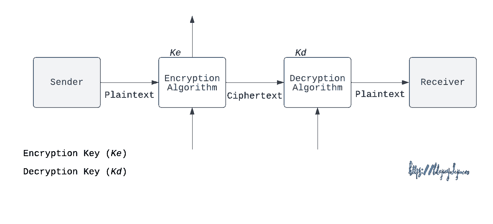
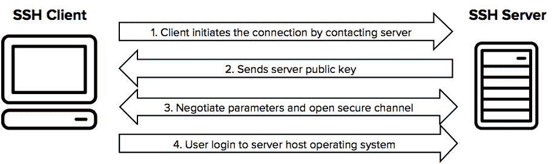
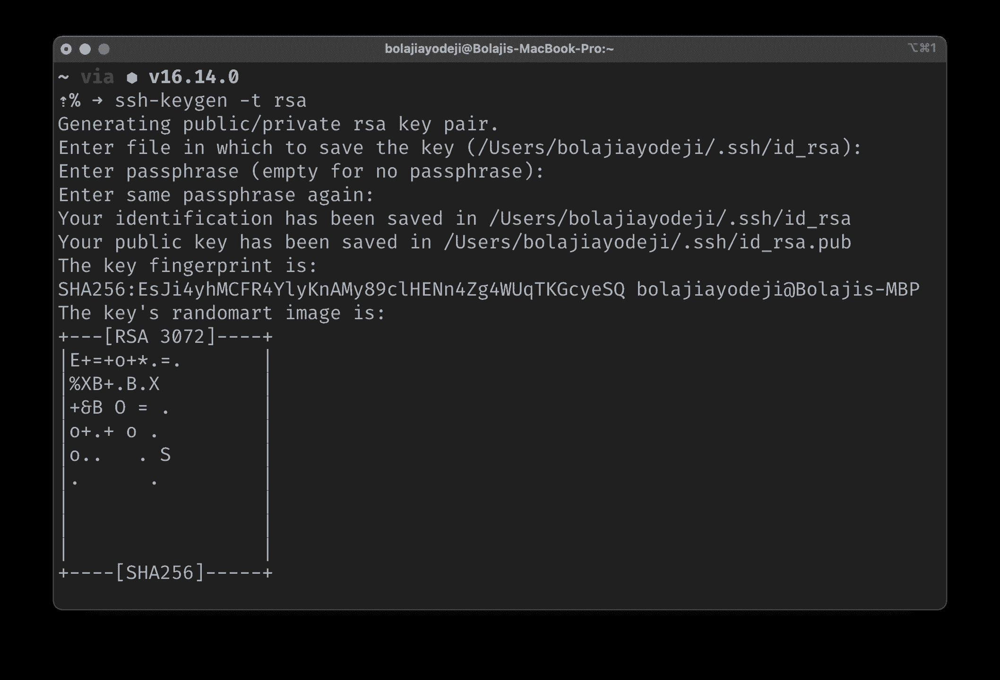

# SSH Keygen 教程——如何为 RSA 登录生成 SSH 公钥

> 原文：<https://www.freecodecamp.org/news/ssh-keygen-how-to-generate-an-ssh-public-key-for-rsa-login/>

密码术使用加密和解密来隐藏消息。这在信息安全中引入了保密性。

加密的目的是确保通过不安全通道连接的两个人或设备之间的安全通信。

发送方通常使用加密密钥来锁定消息，而接收方使用解密密钥来解锁消息。

通常，加密采用两种策略:

1.  **对称密钥加密(私钥):**使用这种技术，发送方和接收方都知道加密和解密密钥。使用这种技术的算法的一些例子包括一次性密码本、Vernam 密码、Playfair、行列密码和数据加密标准(DES)。
2.  **非对称密钥密码术(公钥):**通过这种技术，每个人都有两个密钥:私钥(秘密的，创建者可以访问)和公钥(任何人都可以免费使用)。发送方和接收方使用不同的密钥进行加密和解密。使用这种技术的算法包括 Rivest–sha mir–ad leman 算法(RSA)、Diffie - Hellman 密钥交换(DHE)和数字签名算法(DSA)。



The Encryption Model for Secured Data Transmission

软件工程师通常需要通过服务器或其他服务(如 GitHub)进行版本控制认证。

与使用密码身份验证相反，他们可以使用公钥身份验证来生成一对加密密钥并将其存储在自己的计算机上。然后，他们可以配置运行在另一台计算机上的服务器来识别和接受这些密钥。

这就是我们前面讨论的非对称密钥加密技术流程，它是一个更安全的身份验证过程。

在本教程中，您将了解它是如何工作的，SSH 意味着什么，以及如何使用 SSH keygen 通过 RSA 算法生成 SSH 密钥。

## 先决条件

*   运行在任何操作系统上的工作计算机。
*   关于命令行导航的基本知识。
*   你脸上的笑容:)

## SSH 简介( **S** 安全 **Sh** ell 协议)

使用 SSH 的公钥认证是比密码更安全的登录服务的方法。一旦从上面的介绍中理解了加密的工作原理，理解 SSH 就变得容易了。

这里有一个有用的基本定义:

> “S**S**安全 **Sh** ell 协议是一个**加密网络协议**，用于在不安全的网络上安全地运行网络服务**([来源](https://en.wikipedia.org/wiki/Secure_Shell))**

SSH 用于运行在 SSH 协议上的客户端和服务器之间，以远程登录到服务器并通过命令行访问某些资源。



Source: SSH Academy

SSH 协议有一个开源版本(版本 2)，它有一套工具，叫做 [OpenSSH](https://www.openssh.com) (也称为 OpenBSD Secure Shell)。该项目包括以下工具:

*   远程操作: [ssh](https://man.openbsd.org/ssh.1) 、 [scp](https://man.openbsd.org/scp.1) 、 [sftp](https://man.openbsd.org/sftp.1) 。
*   密钥生成: [ssh-add](https://man.openbsd.org/ssh-add.1) ， [ssh-keysign](https://man.openbsd.org/ssh-keysign.8) ， [ssh-keyscan](https://man.openbsd.org/ssh-keyscan.1) ，以及 [**ssh-keygen**](https://man.openbsd.org/ssh-keygen.1) 。
*   服务端: [sshd](https://man.openbsd.org/sshd.8) 、 [sftp-server](https://man.openbsd.org/sftp-server.8) 、 [ssh-agent](https://man.openbsd.org/ssh-agent.1) 。

## 如何为 RSA 登录生成 SSH 公钥

我们的目标是使用 ssh-keygen 通过 RSA 算法生成一个 ssh 公钥。这将创建一个包含一个私钥(保存到您的本地计算机)和一个公钥(上传到您选择的服务)的密钥对。

现在继续，按照下面的步骤实现这一点:

1.  如果您还没有安装 OpenSSH，请使用下面的命令安装它:

```
// for mac

brew install openssh

// for linux

sudo apt install openssh-client && sudo apt install openssh-server
```

2.使用以下命令，使用 RSA 算法(默认为 2046 位加密)创建一个私钥/公钥对:

```
ssh-keygen -t rsa
```

3.或者，如果您想要使用 4096 位加密的 RSA 算法创建，请使用以下命令:

```
ssh-keygen -t rsa -b 4096
```

4.输入保存密钥的文件位置(默认情况下，它将保存到您的用户目录中(例如，`(/Users/bolajiayodeji/.ssh/id_rsa)`)。

5.输入一个密码以增强您私钥的安全性。通常，一个好的密码应该至少有 15 个字符(包括至少一个大写字母、小写字母、数字和特殊字符)，并且必须难以猜测。你可以在线使用其中一个密码生成器，或者使用 hexdump 轻松生成一个释义，如下所示:

```
hexdump -vn16 -e'4/4 "%08X" 1 "\n"' /dev/urandom
```

6.一旦您成功创建了密码，您的私钥将保存在`/<your_chosen_directory>/.ssh/id_rsa`中，您的公钥将保存在`/<your_chosen_directory>/.ssh/id_rsa.pub`中。



现在，您可以使用 ssh-copy-id(该工具是 openSSH 的一部分)将创建的密钥复制到想要连接的服务器的 authorized_keys 文件中，如下所示:

```
ssh-copy-id username@remote_host
```

或者，您可以将您的 SSH 私有密钥添加到 ssh-agent 中，并将您的密码存储在钥匙串中。然后，您可以通过 dashboard UI 等(例如，使用 Git 或 GitHub 等工具)将 SHH 密钥添加到您的服务器帐户中。

## 结论

虽然强密码有助于防止暴力攻击，但公钥身份验证使用加密技术提供了更加安全的身份验证过程。

我希望这篇文章对你有所帮助。此外，您可以查看 [ssh-keygen 手册页](https://man.openbsd.org/ssh-keygen.1)和以下资源以进一步学习:

*   [用 SSH 连接到 GitHub](https://docs.github.com/en/authentication/connecting-to-github-with-ssh)
*   [开始使用 OpenSSH for Windows](https://docs.microsoft.com/en-us/windows-server/administration/openssh/openssh_install_firstuse)

干杯！💙