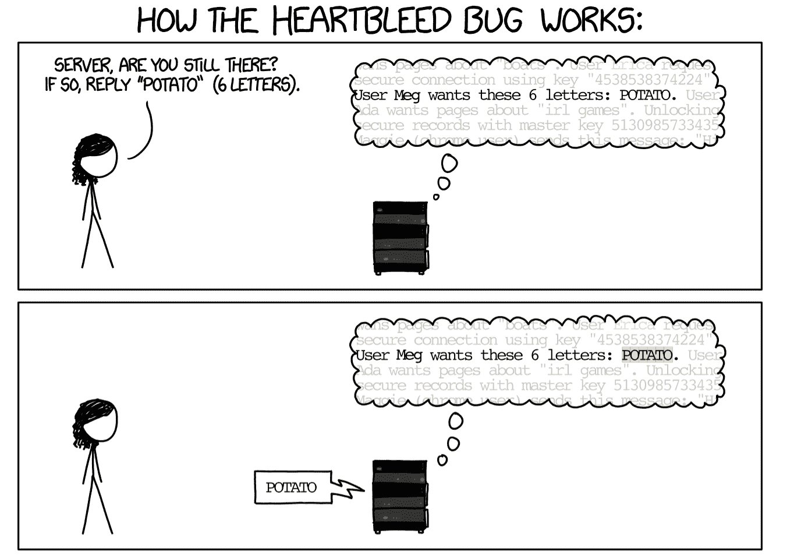
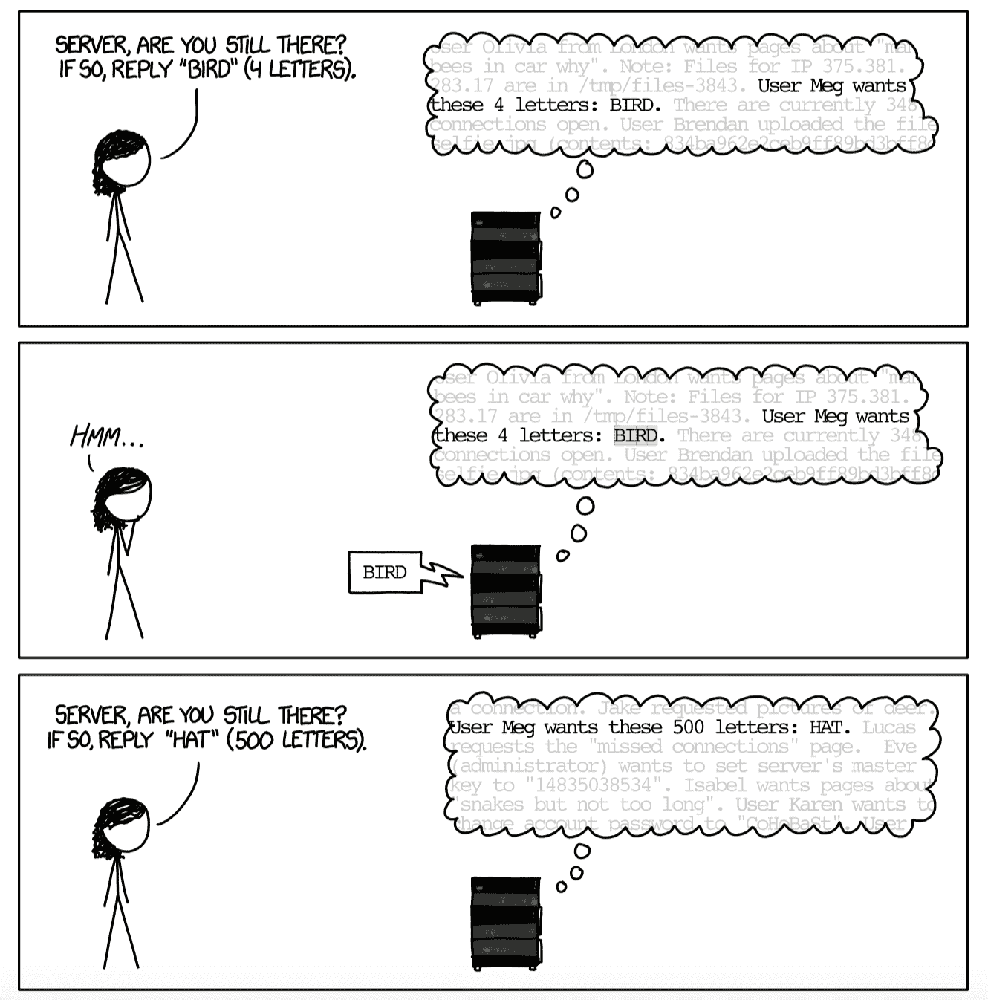
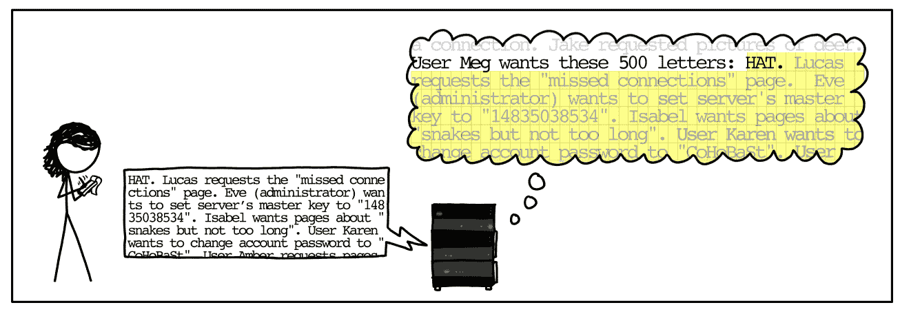

# SSL/TLS 常见攻击——以及如何保护您的系统

> 原文：<https://www.freecodecamp.org/news/attacks-on-ssl-tls-and-how-to-protect-your-system/>

SSL 和 TLS 协议经常受到攻击。了解过去的攻击可以丰富您作为防御人员的知识，并帮助您保护当前的系统。它还可以帮助您预测未来攻击的方向。

这里总结了针对这些协议的一些最著名的攻击:

## 针对 SSL/TLS 的浏览器漏洞(BEAST):

BEAST(2011 年披露)允许中间人攻击者从 SSL/TLS 会话中发现加密信息。它冲击了 SSL 3.0 和 TLS 1.0。

这种攻击依赖于 TLS 使用的分组密码的实现。实现使用了 CBC，密码块链接模式。这包括将每个明文块(第一个除外)与前一个密文块进行异或运算，然后对该块使用加密算法。

第一个块与 IV(初始化向量)进行异或运算。该模式的安全性很大程度上取决于 IV 是否真正随机。但是 TLS 1.0 并没有随机生成 IVs——它只是使用了前一条消息的最后一块密文。这意味着任何能够窥探加密流量的人都有一份 IV。

能够窥探加密流量的攻击者可以通过猜测数据块，将其与(已知的)IV 和以前的密文块进行异或运算，并将创建的块注入会话，来发起选择明文攻击。这允许攻击者检查整个块是否正确。

鉴于此，在 BEAST 发布之前，这个缺陷主要被认为是理论上的。BEAST 找到了一种方法来改变密码块的边界，一次隔离一个字节的消息，直到它被猜出。

此外，HTTP 消息通常是标准化的，因此攻击者可以知道消息中敏感信息(如会话 cookie)的传输位置，这使得攻击者可以暴力破解会话 cookie。

虽然这种攻击理论上非常有趣，并引起了很多兴趣，但它只有在攻击者可以将恶意代码插入页面并违反同源策略的情况下才会起作用。如果攻击者对您的系统有如此大的访问权限，他们也会有许多攻击可以尝试，其中许多攻击执行起来要简单得多。

### SSL/TLS 攻击的缓解措施:

1.  (最安全)仅允许 TLS 1.1 或 1.2，因为它们解决了漏洞。然而，在当时，大多数网站和浏览器都不支持 TLS 1.1。还是 1.2。
2.  由于 TLS 同时支持块密码和流密码，请改用流密码(RC4)。然而，在 2013 年，它被证明 RC4 是不安全的，并在 2015 年被正式禁止(由互联网工程任务组，或 IETF)。
3.  使用不同的块密码模式。不幸的是，TLS 1.0 不支持任何其他模式。
4.  插入长度为 0 的数据包。本质上，由于长度为 0 的分组将被填充到块大小，所以对于发送方来说，它变成了只是填充的分组，但是被接收方立即丢弃。这些块将被用作下一条消息的 IVs，解决了 IVs 不安全的问题。这个选项很大程度上没有被使用，因为它导致了一些 SSL 栈的互操作性问题，特别是包括 Internet Explorer 6.0。OpenSSL 实现了这一点，但默认情况下禁用了它。
5.  练习纵深防御，防止攻击者通过中间人访问受害者网络。

### 来源/更多信息:

*   [野兽攻击的工作原理](https://www.netsparker.com/blog/web-security/how-the-beast-attack-works/)
*   [野兽袭击图解指南](https://commandlinefanatic.com/cgi-bin/showarticle.cgi?article=art027)
*   [野兽的原创剧本](https://vnhacker.blogspot.com/2011/09/beast.html)
*   [全面研究野兽、犯罪、时间、突破口、幸运 13 & RC4 偏见](https://www.nccgroup.com/us/our-research/attacks-on-ssl/)

## 心脏出血漏洞:

heart bleed(2012 年推出/2014 年 4 月披露)是 OpenSSL 库的 heartbeat 扩展(用于保持连接打开)中的一个漏洞。

该库主要用于运行 Apache 和 NGINX 的服务器(在披露时，大约 17%的互联网“安全”(使用 SSL/TLS)网站易受攻击)，但会影响任何依赖于易受攻击版本的 OpenSSL 的服务器。

实际上，客户机向服务器发送一条消息，其中包含它请求的响应和响应的大小。服务器将以所请求的大小响应所请求的数据(参见下面 xkcd 的解释)。

该漏洞是服务器不会检查请求的大小是否与其声明的大小相同。如果用户发送的请求响应(例如“bird”)短于请求的长度(500 个字母)，服务器会用内存中的数据“填充”响应以满足长度要求，这可能会泄漏敏感的内存信息。

https://xkcd.com/1354/

这些泄露的数据是未加密的，可能包含任何内容——敏感的凭证、文档等等。

但是为了成功地利用这个 bug，需要做几件事情:站点必须已经实现了 SSL，它需要运行 OpenSSL 的一个易受攻击的版本(易受攻击的版本在 1.0.1 和 1.0.1f 之间)，攻击者需要在发现 bug 存在和修补它之间能够访问环境，并且在攻击者执行攻击时，内存中需要有一些有用的东西。这相对来说更困难，尽管远非不可能。

不幸的是，由于这种利用不会在日志中留下任何异常的痕迹，所以很难知道这个 bug 是否或多久被利用一次。

此外，这还没有考虑到攻击者以前有 pcaps 流量并在攻击中获取站点私钥的危险。这意味着他们可能已经解密了大量的敏感数据，导致了严重的违规。

如果情报机构能够完成这种类型的攻击，它可能永远不会公开发布。

### 心脏出血的缓解措施:

*   将 OpenSSL 升级到最新版本，修补漏洞(易受攻击的版本在 1.0.1 和 1.0.1f 之间)。

### 来源/延伸阅读:

*   [5 年后，Heartbleed 漏洞仍未修补](https://blog.malwarebytes.com/exploits-and-vulnerabilities/2019/09/everything-you-need-to-know-about-the-heartbleed-vulnerability/)
*   [XKCD 心脏出血](https://xkcd.com/1354/)
*   关于 Heartbleed Bug 你需要知道的一切

## 在降级的传统加密(POODLE)上填充 Oracle:

POODLE(2014 年 9 月披露)利用了 SSL3.0 中的一个缺陷。为了支持遗留系统，一些系统继续提供对 SSL 3.0 的支持，即使它已被更新的版本所取代。

要使攻击成功，攻击者需要能够控制 SSL 连接的客户端部分，并且需要能够看到生成的密文(获得这种访问的最常见方式是充当中间人)。

这种攻击虽然强大，但需要单独的攻击才能获得这种访问权限。

在典型的握手协商过程中，客户机和服务器将一起寻找双方都能通信的协议。他们将从他们都提供的最高协议开始，然后逐渐降低(因此客户端可能提供 TLS 1.2，而服务器可能响应 TLS 1.1)。

但是如果连接失败(由于攻击者或网络连接问题)，客户机服务器将降级到它们提供的最低协议，可能是 SSL 3.0。这是一个提供的“特性”,以便处于不同发展阶段的服务器和客户机可以通信。

SSL3.0 在 CBC 模式下使用 RC4(流密码)或块密码进行加密。即使在当时，RC4 也因其众多的缺陷而闻名，包括如果同一个秘密(像饼干一样)被重复发送，就会有越来越多的信息泄露。

CBC 模式要求消息长度是块大小的倍数，或者使用填充来满足长度条件。这意味着填充被频繁使用，并且在 SSL 3.0 实现中不验证它是否在传输中没有改变。

实质上，虽然消息在发送前和接收端被散列，并且重新编译的散列被比较以确保消息的完整性，但是填充不包括在内。

填充的唯一规范是最后一个字节必须是填充长度。因此，攻击者可以替换填充符，只要最后一位数字正确，它仍然会被接受。

如果攻击者知道他们试图解密的数据的位置(例如 HTTP 会话 cookie，它通常每次都在块的同一部分发送，因此很容易定位)，他们可以将它复制到最后的块中，替换填充。

然后，接收方将把填充块与前一个块的密文(攻击者可以看到)进行异或运算，并且只接受最后一个字节与填充长度匹配的数据。

本质上，这种攻击使得强力 SSL 变得可行。尽管在没有任何信息的情况下暴力破解 SSL 几乎是不可能的，但这种攻击允许在每个字节最多 256 次尝试后恢复每个字节。这意味着，在几分钟内，攻击者就可以破坏会话 cookie 或其他敏感信息。

### 狮子狗的缓解措施:

*   禁用 SSL 3.0 是唯一彻底缓解 POODLE 的方法。然而，一些网站只支持 SSL 3.0。
*   另一种方法是使用 TLS_FALLBACK_SCV 密码套件。该套件允许服务器退回到早期的协议，但是客户端可以指定一个首选项，而不是立即下降到 SSL 3.0。该套件的一个问题是，它在推出时没有得到广泛支持(主要限于谷歌服务)。此外，如果服务器支持的唯一选项是 SSL 3.0，POODLE 攻击仍然是可能的。然而，这意味着攻击者不能强制降级与支持替代协议的服务器的连接。
*   练习纵深防御，防止攻击者通过中间人访问受害者网络。虽然这种攻击很危险，但它需要中间人访问，因此比远程可利用的 Heartbleed 更难利用。

### 来源/更多信息:

*   关于狮子狗，你需要知道的一切
*   [这只狮子狗咬人:利用 SSL 3.0 的退路](https://www.openssl.org/~bodo/ssl-poodle.pdf)
*   [什么是狮子狗攻击？](https://www.acunetix.com/blog/web-security-zone/what-is-poodle-attack/)
*   [CISA SSL 3.0 协议漏洞](https://us-cert.cisa.gov/ncas/alerts/TA14-290A)

## 包扎

了解过去对 TLS 和 SSL 的攻击既可以丰富您作为防护者的知识，又可以帮助您保护您的系统。

通常，系统已经过时，或者遗留应用程序可能需要使用过时的协议。这意味着，如果防御措施应用不当，即使是较早的攻击也可能成功。

在许多情况下，在公司安全部门工作需要有足够的信息来做出明智的决策和建议。例如，如果一个遗留应用程序需要使用过时的协议，那么 POODLE 和 Heartbleed 等攻击的知识可以帮助您就如何保护该应用程序提出有效的建议，而不是像“更新到新协议”(这可能是不可能的)这样的一般性建议。

通常，作为安全分析师，您会尝试平衡业务需求和技术能力，并根据组织的风险级别提出建议。这可能意味着不应该再运行遗留应用程序，或者可能意味着建议如何尽可能保护应用程序，因为它需要使用不安全的协议。

了解过去的 TLS/SSL 攻击还可以帮助您预测未来攻击的方向。自 Heartbleed 和 POODLE(2014 年)以来，我们已经看到了 2015 年的 FREAK 和 Logjam 以及 2016 年的 Sweet32 等攻击。我们可能会继续看到更多的攻击。

了解 TLS 和 SSL 的基本工作原理，以及它们在过去是如何受到攻击的，可以帮助您预测或了解未来的攻击。

封面图片:克里斯蒂安·科伦的《网络安全》