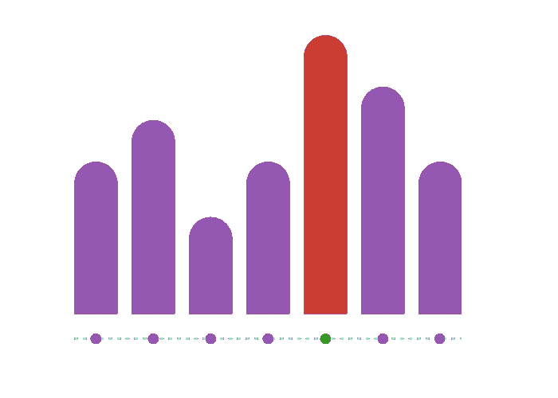
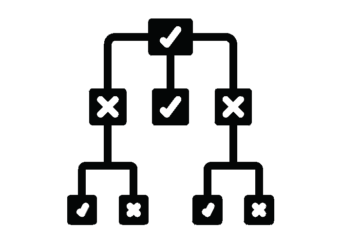

# 如何在 Julia 中使用线性模型和决策树

> 原文：<https://www.freecodecamp.org/news/linear-models-vs-decision-trees-in-julia/>

作为一名机器学习工程师或数据科学家，你可以做出的最关键的决定之一是使用什么类型的模型来解决特定的问题。

真的需要用深度学习对这个具体问题建模吗？像随机森林模型或决策树这样的东西会更有效吗？

虽然有时最好的办法是亲自尝试，但在具体评估线性模型和决策树时，您应该了解一些背景。

**🚨TL；DR**–当数据本身具有线性关系时，线性模型是好的。另一方面，决策树是有帮助的，因为它们可以用一种可解释的方式建模更复杂的非线性关系的分类或回归问题。

让我们深入探究一下为什么会出现这种情况。

## 什么是线性模型？🤔

术语线性模型有许多不同的含义，因为它被用于多个领域，包括在我们的情况下，机器学习(ML)。

在 ML 的世界中，线性模型指的是一类特定的模型，其目标是映射输入值和一些结果之间的关系，通常存在线性关系(稍后将详细介绍)。

这方面的一个经典例子是根据不同的属性(ML 中通常称为“特征”)预测房子的价格，如平方英尺、卧室数量、建造年份等。

最常用的线性模型是线性回归(LR ),在这种情况下，模型实质上变成了一条最适合数据的直线，您可以绘制如下图。

在 LR 中，主要目标是预测一些数值，这不同于分类模型的目标。在分类中，我们希望预测一些输入数据所映射到的类别，这往往是一个更直接的建模问题。


Example of linear regression. Image by Author

就像在其他形式的 ML 中一样，我们通过向线性模型提供用于设置模型权重的训练输入和输出数据来训练线性模型。由于这种方法需要使用标记数据，所以这是一个监督学习问题。

那么，我什么时候应该使用单反相机呢？一般的经验法则是，LR 模型只在我们对某种类型的关系建模时才起作用，这种关系本身是线性的。

## 理解线性关系

所以下一个逻辑问题是，“我如何知道我正在处理的数据是否有线性关系”。

在我们回答这个问题之前，值得指出的是，在任何特定的 ML 问题中，对您正在处理的数据的深入了解可能会使您最成功地解决这个问题。

在“现实世界”中，工程师和科学家花费近 80%的时间处理数据，只有 20%的时间实际解决问题(这本身就是一个问题，但这是目前的现实)。

好的，回到数据中的线性关系，以及我们如何知道我们的数据集是否存在线性关系。测试这一点最直接的方法是简单地绘制数据并查看它。

如果你看到一个类似上面描述的图，你就万事俱备了，因为关系看起来是线性的。

如果你看到如下图，你可能无法使用 LR。



Non-linear data. Image by Author

接下来，我们来看一下 Julia 中的一个线性回归模型。如果你不熟悉茱莉亚，你可能想看看我在 freeCodeCamp 上的“ **[学习茱莉亚初学者](https://www.freecodecamp.org/news/learn-julia-programming-language/)”**。

## 线性回归在起作用📣

让我们以我之前提到的基本住房为例。你可以从[这个链接](https://raw.githubusercontent.com/julia4ta/tutorials/master/Series%2005/Files/housingdata.csv)下载数据。我们可以创建一个新的 Julia 文件并添加以下导入:

```
using GLM, Plots, TypedTables, CSV
```

这里的关键包是 [GLM.jl](https://github.com/JuliaStats/GLM.jl) ，它代表 Julia 中的广义线性模型。它将帮助我们制作最初的 LR 模型！Plots.jl、TypedTables.jl 和 CSV.jl 都在帮助我们处理这个示例时起到了支持作用。

下一步是使用 CSV.jl 加载数据集，然后设置我们的 X 和 Y 值:

```
housing_data = CSV.File("housingdata.csv")

X = housing_data.size

Y = housing_data.price

# Setup a Typed Table
t = Table(X = X, Y = Y)
```

接下来，我们将绘制数据，以确保看起来存在线性关系:

```
# Use Plots package to generate scatter plot of data
gr(size = (600, 600))

# Create scatter plot
p_scatter = scatter(X, Y,
    xlims = (0, 5000),
    ylims = (0, 800000),
    xlabel = "Size in square feet",
    ylabel = "Price of the house",
    title = "Housing Prices example freeCodeCamp",
    legend = false,
    color = :red
)
```

这将生成如下图:


Image by Author

我们可以看到，在这种情况下，这种关系似乎是线性的，这意味着我们可以继续构建一个基本模型。

GLM 提供了两种拟合模型的基本方法，你可以在文档中读到。对于我们的示例，我们将使用第一个选项，如下所示:

```
lm(formula, data)
```

其中公式的含义如下:

> `formula`:一个 [StatsModels.jl `Formula`对象](https://juliastats.org/StatsModels.jl/stable/formula/)引用`data`中的列；例如，如果列名是`:Y`、`:X1`和`:X2`，那么有效的公式是`@formula(Y ~ X1 + X2)`

因此，在我们的例子中，因为我们只有 1 列(房子的大小)，我们的公式将如下所示:

```
ols = lm(@formula(Y ~ X), t)
```

我们再次传入变量`t`,这是我们想要拟合模型的数据。

之后，我们可以尝试将新的拟合模型绘制到初始图上，看看它看起来是什么样子，以及它是否正确地模拟了数据。

```
plot!(X, predict(ols), color = :green, linewidth = 3)
```


Image by Author

我们可以从上面的图像中看到，我们正确地将模型与数据相匹配，这意味着我们做到了！我们已经成功地在 Julia 中创建了线性回归模型。

让我们再做一个快速测试，看看我们是否可以将该模型用于一栋只有 750 平方英尺的房子的一些新数据:

```
small_house = Table(X = [750])

predict(ols, small_house)
```

该模型预测房子的价格`172164.45`,当我们观察上面的图表时，这看起来是正确的(尽管大多数数据是针对超过 1000 平方英尺的房子)。

## 总结线性回归🎀

我们刚刚在 Julia 中完成了线性模型的旋风之旅。我们讨论了为什么你可能想要使用它们，约束(关系必须是线性的)，如何检查关系是否是线性的，以及如何在 Julia 中拟合一个 LR。

我希望这有助于你在什么时候想使用这些模型中的一个，以及在实践中如何使用 Julia。

如果你想了解更多关于 Julia 中 LR 型号的信息，请查看这个视频教程:

[https://www.youtube.com/embed/n03pSsA7NtQ?feature=oembed](https://www.youtube.com/embed/n03pSsA7NtQ?feature=oembed)

Julia for talented amateurs!

## 是时候讨论决策树了🌴

我们现在知道了线性模型的主要约束:关系必须是线性的。但是决策树呢？它们的主要使用情形是什么，有哪些限制？

其核心是，DTs 允许我们对不同潜在事件或情况的结果进行建模。例如，您可以为掷硬币或其他事件的结果创建一个 DT。基本结构如下图所示:



Decision tree. Image by Author

这里我们可以看到，我们从一些初始条件开始，根据这种情况的结果，我们进入任何三个可能的节点。外部节点有另一个与其相关联的嵌套条件，但是内部节点是最终状态。

关于 DTs 最好的事情之一是，对于我们的住房数据示例，我们可以构建一棵树，它可能会说:“如果平方英尺在 1000-2000 英尺之间，那么价值是 400，000 美元”。这是一种过于简化的方法，但是您可以使用 DTs 对回归示例以及分类问题进行建模。

这种 if/then 结构如此重要的原因是树本身实际上变得对人非常可读。这与深度学习领域的 ML 模型形成对比，例如，在深度学习领域，ML 模型是我们通常无法理解的黑盒。DTs 的可解释性是人们在实践中使用它们的核心原因之一。

## 决策树与线性回归

关于 DTs，需要指出的另一个重要问题是，DTs 通常用于建模非线性关系，这也是它与线性模型的关键区别。

当处理有很多变量的问题时，决策树也非常有助于快速识别哪些是重要变量。

现在我们已经知道了决策树的基础知识(如果你还想了解更多关于更具体的树的术语，请查看本文),让我们深入一些代码示例并建立一个树。

## 决策树在起作用🌲🪓

对于这个例子，我们将使用[虹膜数据集](https://archive.ics.uci.edu/ml/datasets/iris)和 [DecisionTree.jl 包](https://github.com/JuliaAI/DecisionTree.jl)。我们首先加载数据集，如下所示:

```
using DecisionTree

features, labels = load_data("iris")
```

默认情况下，`load_data`函数创建`features`和`labels`变量为`any`类型，这在计算上非常昂贵。我们可以通过将类型分别显式转换为 float 和 string 来减轻这一负担:

```
features = float.(features)
labels   = string.(labels)
```

接下来，我们可以调用`build_tree`函数并传入我们的标签和特性:

```
model = build_tree(labels, features)
```

现在我们有了自己的树，我们需要修剪它来得到一些结果。

```
model = prune_tree(model, 0.9)

# print of the tree with a depth of 6 nodes (optional)
print_tree(model, 6)
```

当我们修剪树时，我们可以将纯度级别设置为 90%,这意味着我们合并纯度为 90%的叶子。

DTs 中的纯度是指每个决策中都有一些数据落入错误的位置。例如，我们可能只有 70%的数据属于某一类，这将使我们得到 70%的纯度。

上面的`print_tree`函数很好地展示了我们到目前为止所做的工作:

```
Feature 4 < 0.8 ?
├─ Iris-setosa : 50/50
└─ Feature 4 < 1.75 ?
    ├─ Feature 3 < 4.95 ?
        ├─ Iris-versicolor : 47/48
        └─ Feature 4 < 1.55 ?
            ├─ Iris-virginica : 3/3
            └─ Feature 3 < 5.45 ?
                ├─ Iris-versicolor : 2/2
                └─ Iris-virginica : 1/1
    └─ Feature 3 < 4.85 ?
        ├─ Feature 1 < 5.95 ?
            ├─ Iris-versicolor : 1/1
            └─ Iris-virginica : 2/2
        └─ Iris-virginica : 43/43
```

这个可视化向我们展示了树正在做什么，以及它是如何制作这些分类桶的。还有更多的可视化工具，如 D3Trees.jl，这将使它更具交互性。

现在我们有了模型，我们可以在单个数据点上测试它:

```
julia> apply_tree(model, [5.9,3.0,5.1,1.9])
"Iris-virginica"
```

或者，我们可以对所有数据进行预测，并查看混淆矩阵:

```
preds = apply_tree(model, features)

DecisionTree.confusion_matrix(labels, preds)

Classes:  ["Iris-setosa", "Iris-versicolor", "Iris-virginica"]
Matrix:   3×3 Matrix{Int64}:
 50   0   0
  0  50   0
  0   1  49

Accuracy: 0.9933333333333333
Kappa:    0.9899999999999998
3×3 Matrix{Int64}:
 50   0   0
  0  50   0
  0   1  49
```

如你所见，鉴于有限的数据集和较短的训练时间，该模型的准确性实际上相当好。

这个例子应该足以让你开始你的 DT 之旅，但是如果你需要更多的帮助，看看这个很棒的视频:

[https://www.youtube.com/embed/XTApO31m3Xs?feature=oembed](https://www.youtube.com/embed/XTApO31m3Xs?feature=oembed)

Julia for talented amateurs

## 包扎👋

这篇文章快速介绍了决策树和线性模型之间的一些差异，以及如何在 Julia 中对它们进行编程。

我希望你带着信心离开这里，并在自己的工作流程中应用这些工具！

如果你喜欢这篇文章，请考虑分享它，并随时欢迎你在推特上联系我:[https://twitter.com/OfficialLoganK](https://twitter.com/OfficialLoganK)

编程快乐！