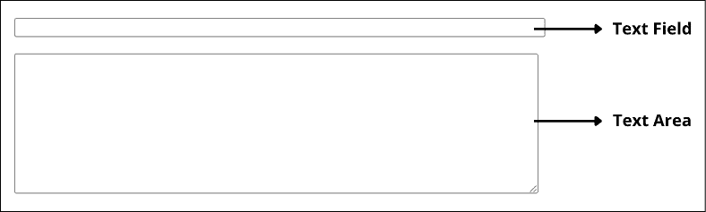

# 如何在你的网站上添加一个文本框输入类型标签

> 原文：<https://www.freecodecamp.org/news/html-textarea-how-to-add-text-box-to-your-website/>

文本框是网站的一部分，用户可以在其中输入文本。当您单击或点击文本框或文本框内部时，会出现一个闪烁的光标，表示您已准备好开始键入。如果你使用平板电脑或智能手机，屏幕上就会出现一个键盘。

文本框分为两种类型:文本字段和文本区域。这两个文本框有不同的用途，可以帮助用户理解应该在文本框中输入什么。

文本栏是一个小的、通常为矩形的框，您可以在其中输入单行文本，如名称、数字或任何其他简短的文本类型。

文本区域是一个较大的框，您可以在其中输入多行文本，如描述、段落等。

当您点击文本字段中的 enter 按钮时，光标将移动到下一个字段或提交表单。另一方面，在文本区域，光标将移动到新的一行，创建一个换行符。



## 如何在网站上添加文本字段

每当你想让用户在网页中输入内容时，你可以使用`<input>`标签。然后，为了确保这是一个文本字段，您可以添加`text`的类型属性:

```
<form>
  <input type='text' />
</form> 
```

这将在我们的网页上输出一个单行文本字段，它可以接受所有形式的文本值。我们还可以添加一个标签或其他属性，如`placeholder`属性，让用户知道在文本字段中输入什么。

```
<form>
  <input type='text' placeholder='Enter your name...' />
</form>

Or

<form>
  <label>Name:</label> </br>
  <input type='text' />
</form> 
```

我们可以在文本字段上定义更多的属性，比如`maxlength`和`minlength`，以帮助定义一个字段可以接受的最大或最小文本量。

```
<form>
  <input type='text' maxlength="100" minlength="10" placeholder='Enter your name' />
</form> 
```

我们还可以将默认值传递给带有 value 属性的文本字段:

```
<form>
  <input type='text' value='John Doe' placeholder='Enter your name...' />
</form> 
```


## 如何在你的网站上添加一个文本区

文本区域由一个`<textarea>`标签定义。您可以使用它来收集无限的多行文本，如评论或评论。

您可以通过`cols`和`rows`属性(或者使用 CSS)来指定文本区域的大小。

```
<form>
  <textarea rows="5" cols="33"></textarea>
</form> 
```

textarea 字段不使用 value 属性传入默认值，但是您可以在开始和结束标记之间放置默认内容。

```
<form>
  <textarea rows="5" cols="33">
    This is the default comment...  
  </textarea>
</form> 
```


像输入标签一样，我们可以将`maxlength`、`minlength`和`placeholder`属性添加到文本区域字段中。

```
<form>
  <textarea placeholder='Enter comment...' maxlength='1000' minlength='100'>
    This is the default comment...  
  </textarea>
</form> 
```

## 结论

在这篇文章中，你已经学会了如何根据你想要添加的`text`的`type`，使用`<textarea/>`和`<input/>`标签在你的网站上添加一个文本框。

您可以在以下资源中了解有关 HTML 标记的更多信息:

*   面向初学者的 HTML-freeCodeCamp
*   什么是 HTML 标签，你如何使用它们？
*   [HTML 备忘单–HTML 元素列表参考](https://www.freecodecamp.org/news/html-cheat-sheet-html-elements-list-reference/)

祝编码愉快！