# 如何使用 JUnit 5 和 TestContainers 与 SpringBoot 执行集成测试

> 原文：<https://www.freecodecamp.org/news/integration-testing-using-junit-5-testcontainers-with-springboot-example/>

TestContainers 是一个帮助您运行特定于模块的 Docker 容器以简化集成测试的库。

这些 Docker 容器是轻量级的，一旦测试完成，容器就会被销毁。

在本文中，我们将了解什么是 TestContainers，以及它如何帮助您编写更可靠的测试。

我们还将了解帮助您编写测试的库的重要组件(注释和方法)。

最后，我们还将学习使用 TestContainers 库及其组件在 SpringBoot 中编写适当的集成测试。

## 使用 H2 内存数据库进行测试的局限性

今天，集成测试最常见的方法是使用 H2 内存数据库。但是这种方法有一定的局限性。

首先，假设我们在生产中使用 8.0 版本的 MySQL，但是我们的集成测试使用 H2。我们永远无法对运行在生产环境中的数据库版本执行测试。

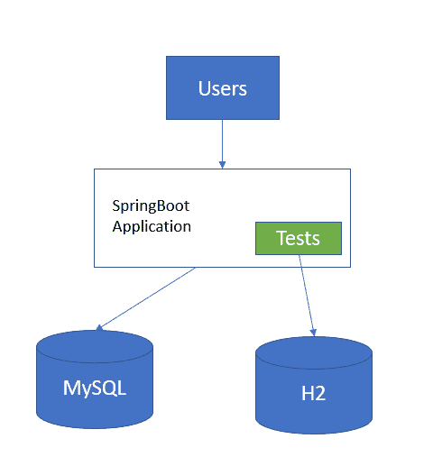

SpringBoot app with MySQL DB and H2

‌Secondly，测试用例不太可靠，因为在生产中，我们使用完全不同的数据库，测试指向 H2。应用程序在生产中可能会遇到问题，但是集成测试可能会成功。

我试图在本地访问我的 RESTful 服务，遇到了这个错误:

**原因:org . PostgreSQL . util . psql exception:FATAL:数据库“example_db”不存在**。

这是因为权限问题，但是在本地的测试工作正常。

最后，正如这里记录的，H2 只在一定程度上与其他数据库兼容。H2 教几乎没有不兼容的地方。例如，如果您需要在 SpringBoot 应用程序中使用“nativeQueries ”,那么使用 H2 可能会导致问题。

## 进入 TestContainers 库

通过使用测试容器，我们可以克服 H2 的局限性。

*   集成测试将指向与生产中相同的数据库版本。因此，我们可以将 TestContainer 数据库映像绑定到生产环境中运行的同一个版本。
*   集成测试更加可靠，因为应用程序和测试都使用相同的数据库类型和版本，在测试用例中不会有任何兼容性问题。

## 什么是 TestContainers？

TestContainers 库是 Docker 上的一个包装 API。当我们编写代码在后台创建一个容器时，它可能会被翻译成一些 Docker 命令，用于 example‌:

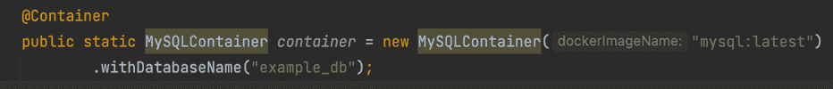

MySQLContainer Creation

这段代码可以翻译成类似如下的内容:

```
docker run -d --env MYSQL_DATABASE=example_db --env MYSQL_USER=test --env MYSQL_PASSWORD=test ‘mysql:latest’ 
```

TestContainers 有一个名为“withCommand”的方法。您使用它来设置应该在 Docker 容器中运行的命令，该命令确认 TestContainers 是 Docker 上的包装 API。

TestContainers 下载 MySQL、Postgres、Kafka、Redis 图像并在容器中运行。MySQLContainer 将在一个容器中运行一个 MySQL 数据库，测试用例可以在本地机器上连接到它。一旦执行结束，数据库就会消失——它只是从机器上删除它。在测试用例中，我们可以启动尽可能多的容器图像。

TestContainers 支持 JUnit 4、JUnit 5 和 Spock。如果您访问 TestContainers.org 网站，只需访问解释如何使用它的快速入门部分:


TestContainers.org how to start with Test Framework

TestContainers 几乎支持从 MySQL 和 Postgres 到 CockroachDB 的所有数据库。你可以在 TestContainers.org 网站的 section:‌模块下找到更多相关信息

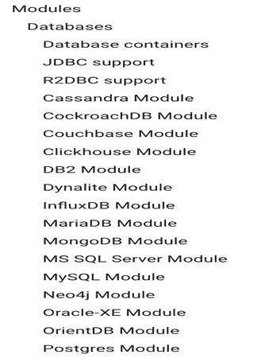

TestContainers support for Database Modules

‌TestContainers 也支持云模块，比如 GCloud 模块和 Azure 模块。如果您的应用程序运行在 Google Cloud 上，那么 TestContainers 支持 Cloud Spanner、Firestore、Datastore 等等。‌

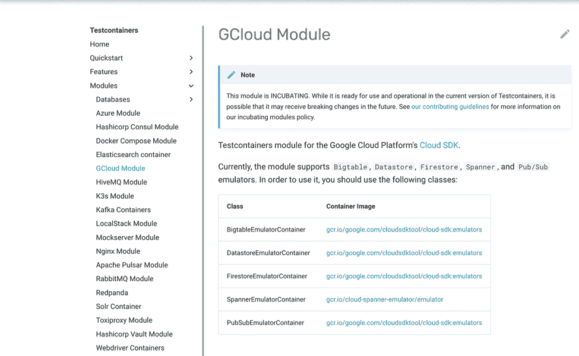

TestContainers support for GCloud Module

到目前为止，在本文中，我们只讨论了数据库，但是 TestContainers 支持各种其他组件，比如 Kafka、SOLR、Redis 等等。

## 如何使用 TestContainers 库

在本文中，我们将探索使用 JUnit 5 的 TestContainers。为了实现 TestContainers，我们需要理解一些重要的 TestContainers 注释、方法和我们需要在项目中实现的库。


TestContainers libraries

### TestContainers 中的注释

为了让 TestContainers 工作，我们的测试中需要两个重要的注释:@TestContainers 和@Container。

@TestContainer 是 JUnit-Jupiter 扩展，它自动启动和停止测试中使用的容器。该注释查找标有@Container 的字段，并调用特定的容器生命周期方法。这里，将调用 MySQLContainer 生命周期方法。‌


MySQLContainer

MySQLContainer 被声明为 static，因为如果我们将 Container 声明为 static，那么就会启动一个容器，它将在所有测试方法之间共享。

如果它是一个实例变量，那么为每个测试方法创建一个新的容器。

## TestContainers 库方法

TestContainers 库中有一些您将在测试中使用的重要方法。在使用图书馆之前知道它们是有益的。

*   **withInitScript** :使用‘withInitScript’我们可以执行。SQL 来定义模式、表，并将数据添加到数据库中。简而言之，此方法用于运行。SQL 来填充数据库。
*   **withReuse** (true):使用“withReuse”方法我们可以实现容器的重用。此方法与启用“. testcontainers.properties”文件中的“test containers . reuse . enable:true”属性配合使用效果很好。
*   **start** :我们用它来启动容器。
*   **withClasspathResourceMapping**:这将类路径上的资源(文件或目录)映射到容器内部的路径。只有当您在 Docker 容器之外运行测试时，这才会起作用。
*   **withCommand** :设置 Docker 容器内部应该运行的命令。
*   **withExposedPorts** :用于设置容器监听的端口。
*   **withFileSystemBind** :用于将文件/目录从本地文件系统映射到容器中。

## TestContainers 用例

在我们现在要看的例子中，应用程序将只与数据库通信，并使用 TestContainers 为它编写集成测试。然后我们将通过在两者之间实现 Redis 来扩展用例。

如果数据存在于 Redis 缓存中，它将被返回，否则它将进入数据库进行保存和基于键的检索。

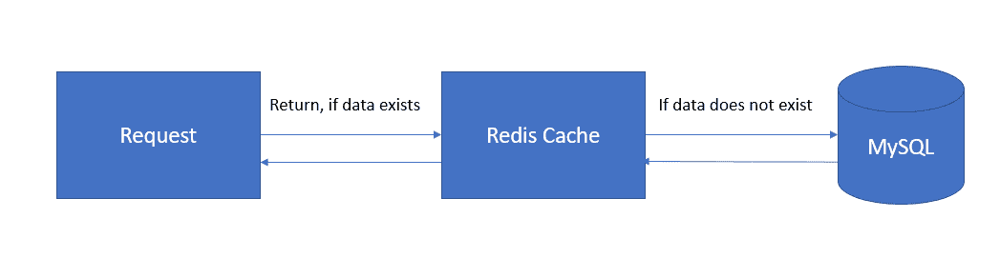

Use-Case 

服务很简单。它有两个端点——第一个是创建用户，第二个是通过电子邮件找到用户。如果找到用户，则返回该用户，否则返回 404。服务类别代码看起来有点像 this:‌

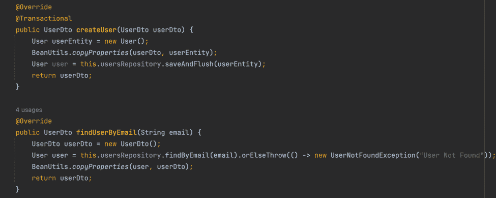

Service Component

我们将为这门课编写测试。你可以在这里找到整个代码库[:‌](https://github.com/sameershukla/testcontainers_demo )

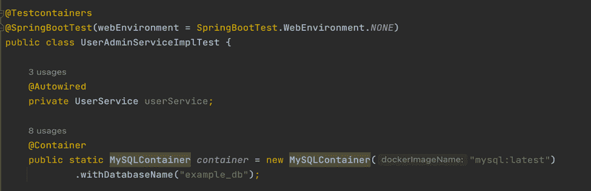

Test Class

测试类用@TestContainers 注释标记，该注释启动/停止容器。我们使用@Container 注释来调用特定容器的生命周期方法。

此外，“MySQLContainer”被声明为静态的，因为随后会启动一个容器。然后它被所有的测试方法共享(我们已经讨论了这些注释的重要性)。

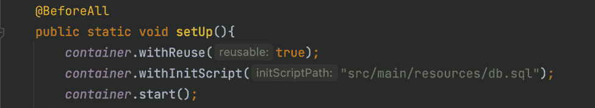

BeforeAll

接下来，我们需要编写一个用@BeforeAll 标记的 setup 方法，其中我们启用了“withReuse”方法。这有助于我们重用现有的容器。我们使用“withInitScript”方法来执行“.sql”文件，然后启动容器。‌

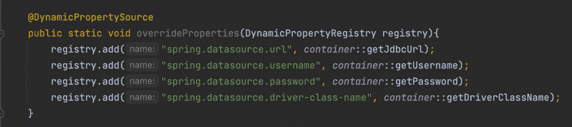

Overwriting Properties

‌@DynamicPropertySource 帮助我们覆盖属性文件中声明的属性。我们编写这个方法来允许 TestContainers 自己创建 URL、用户名和密码——否则我们可能会面临错误。

例如，在删除用户名和密码时，我们可能会遇到“拒绝访问”的错误，这可能会让我们感到困惑。所以最好允许 TestContainer 自己动态分配这些属性。

就这样，我们准备好运行测试用例了:

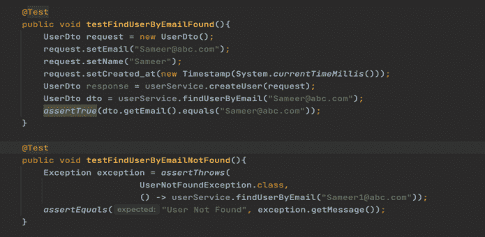

Test Cases

执行@AfterAll 来停止容器，否则如果您不显式停止它，它可能会继续在您的本地机器上运行。‌

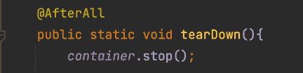

## 如何使用 GenericContainer

‌‌GenericContainer 是最灵活的集装箱。它使得在 GenericContainer 中运行任何容器图像变得容易。

现在我们已经有了 Redis，我们在测试用例中需要做的就是用 Redis 映像构建一个通用容器。

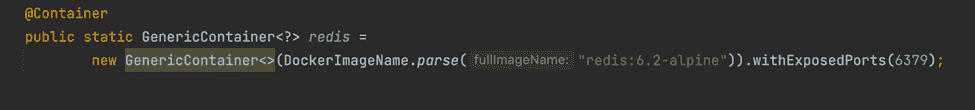

GenericContainer for Redis

然后我们在@BeforeAll 中启动通用 Redis 容器，并使用@ AfterAll tear 方法停止它。

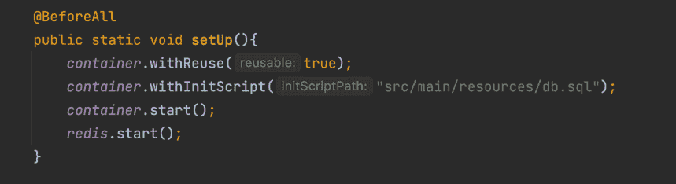

Starting Containers

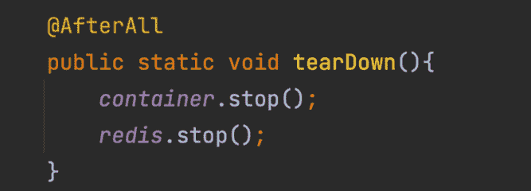

Stopping Containers

## 包扎

在我们的应用程序中使用 TestContainers 来编写更好的测试非常容易。学习曲线不太陡，它支持来自各种数据库的各种不同的模块，如 Kafka、Redis 等。

使用 TestContainers 编写测试使我们的测试更加可靠。唯一不利的一面是，与 H2 相比，测试速度较慢。这是因为 H2 在内存中，TestContainers 需要时间来下载映像、运行容器和执行我们在本文中讨论的整个设置。